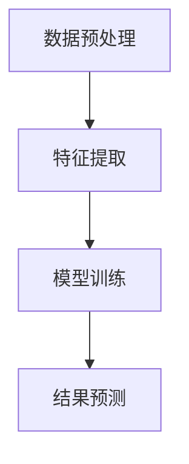
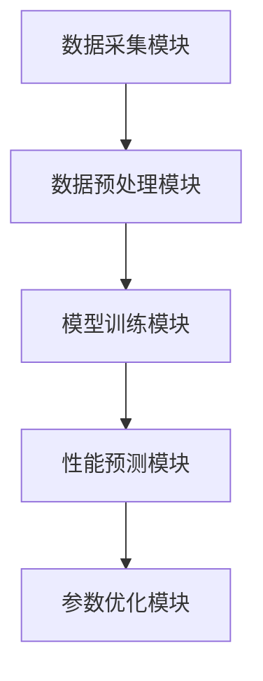
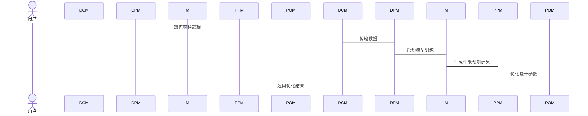

                 


# AI Agent在智能材料设计中的实践

---

## 关键词：AI Agent，智能材料设计，算法原理，系统架构，项目实战

---

## 摘要：  
本文深入探讨了AI Agent在智能材料设计中的应用实践，从理论基础到算法实现，再到系统架构和实际案例，全面分析了AI Agent如何推动智能材料设计的创新与优化。通过详细的技术分析和实践总结，本文为读者提供了从原理到应用的完整视角，展示了AI技术在材料科学领域的巨大潜力。

---

# 第1章: AI Agent与智能材料设计的背景介绍

## 1.1 AI Agent的基本概念  
### 1.1.1 什么是AI Agent  
AI Agent（人工智能代理）是指能够感知环境、自主决策并执行任务的智能实体。它可以是一个软件程序、机器人或其他智能系统，核心目标是通过学习和推理来优化任务执行效率。  

### 1.1.2 AI Agent的核心特征  
- **自主性**：能够在无外部干预的情况下独立运行。  
- **反应性**：能够实时感知环境变化并做出响应。  
- **目标导向性**：以明确的目标为导向，优化决策过程。  

### 1.1.3 AI Agent与传统算法的区别  
传统算法依赖固定的规则和逻辑，而AI Agent具备学习和自适应能力，能够根据环境反馈动态调整策略。  

---

## 1.2 智能材料的基本概念  
### 1.2.1 智能材料的定义  
智能材料是指能够对外界刺激（如温度、压力、光照等）做出响应，并改变其物理、化学或生物性质的材料。  

### 1.2.2 智能材料的分类  
1. **形状记忆材料**：在外力作用下改变形状，撤除外力后恢复原状。  
2. **压电材料**：将机械能转化为电能，或反之。  
3. **热敏材料**：对温度变化敏感，能够改变其物理性质。  

### 1.2.3 智能材料的应用领域  
- 医疗领域：如形状记忆合金在医疗植入器件中的应用。  
- 建筑领域：如智能混凝土用于抗震结构。  
- 环保领域：如智能吸附材料用于废水处理。  

---

## 1.3 AI Agent在智能材料设计中的应用背景  
### 1.3.1 传统材料设计的局限性  
传统材料设计依赖实验试错法，周期长、成本高，且难以探索复杂的多维度参数关系。  

### 1.3.2 AI技术在材料科学中的潜力  
AI技术能够通过大数据分析和机器学习模型，快速预测材料性能，优化设计参数，降低研发成本。  

### 1.3.3 AI Agent在智能材料设计中的优势  
AI Agent能够实时感知材料性能变化，动态调整设计参数，实现材料性能的最优配置。  

---

## 1.4 本章小结  
本章从AI Agent和智能材料的基本概念出发，分析了AI Agent在智能材料设计中的应用背景及其优势，为后续章节的深入讨论奠定了基础。

---

# 第2章: AI Agent与智能材料设计的核心概念  

## 2.1 AI Agent的核心原理  
### 2.1.1 AI Agent的感知机制  
AI Agent通过传感器或数据输入接口获取环境信息，如温度、压力、光照等。  

### 2.1.2 AI Agent的决策机制  
基于感知信息，AI Agent利用机器学习模型进行分析和推理，生成最优决策。  

### 2.1.3 AI Agent的执行机制  
根据决策结果，AI Agent通过执行器或控制模块对外界环境或系统进行调整。  

---

## 2.2 智能材料设计的核心要素  
### 2.2.1 材料性能的多维度分析  
智能材料的性能通常涉及多个维度，如强度、弹性、导电性等。  

### 2.2.2 材料结构与性能的关系  
材料的微观结构直接影响其宏观性能，AI Agent能够通过建模和仿真优化材料结构。  

### 2.2.3 材料设计的目标函数  
目标函数通常包括成本、性能、可持续性等多目标优化问题。  

---

## 2.3 AI Agent与智能材料设计的结合点  
### 2.3.1 数据驱动的材料设计  
通过大数据分析，AI Agent能够预测材料性能，减少实验试错成本。  

### 2.3.2 知识驱动的材料设计  
结合材料科学领域的知识库，AI Agent能够快速匹配最优设计方案。  

### 2.3.3 模型驱动的材料设计  
通过建立材料性能的数学模型，AI Agent能够进行参数优化和性能预测。  

---

## 2.4 核心概念对比分析  
### 2.4.1 AI Agent与传统算法的对比  

| 特性          | AI Agent                          | 传统算法                          |
|---------------|-----------------------------------|-----------------------------------|
| 学习能力      | 具备学习能力，能够自适应优化     | 依赖固定规则，无法自适应调整     |
| 决策能力      | 基于环境反馈动态调整决策        | 基于预设规则进行决策              |
| 应用场景      | 适用于复杂动态环境               | 适用于简单静态环境               |

### 2.4.2 智能材料与传统材料的对比  

| 特性          | 智能材料                          | 传统材料                          |
|---------------|-----------------------------------|-----------------------------------|
| 响应性        | 能够对外界刺激做出响应           | 无响应性或响应性极低             |
| 可调控性      | 性能可通过外部刺激进行调控       | 性能固定，难以调控               |
| 应用领域      | 医疗、建筑、环保等领域           | 机械、电子、建筑等领域           |

### 2.4.3 数据驱动与知识驱动的对比  

| 特性          | 数据驱动                          | 知识驱动                          |
|---------------|-----------------------------------|-----------------------------------|
| 依赖基础      | 依赖大量数据                     | 依赖领域知识                     |
| 优势          | 能够发现数据中的潜在规律         | 能够利用领域知识进行推理         |
| 适用场景      | 数据充足且复杂的问题             | 数据不足但领域知识丰富的场景     |

---

## 2.5 本章小结  
本章通过对比分析，深入探讨了AI Agent与智能材料设计的核心概念及其结合点，为后续章节的算法实现和系统设计提供了理论基础。

---

# 第3章: AI Agent在智能材料设计中的算法原理  

## 3.1 算法原理概述  
AI Agent在智能材料设计中的算法通常包括数据预处理、特征提取、模型训练和结果预测等步骤。  

---

## 3.2 算法实现的关键步骤  

### 3.2.1 数据预处理  
数据预处理是AI Agent算法实现的基础，主要包括数据清洗、归一化和特征工程等步骤。  



---

## 3.3 算法实现的核心模型  

### 3.3.1 神经网络模型  
神经网络模型是AI Agent的核心算法之一，广泛应用于智能材料设计中的性能预测和参数优化。  

#### 3.3.1.1 神经网络模型的数学表达  
神经网络模型的输入为材料的物理参数，输出为材料的性能指标。其数学表达式如下：  

$$ y = f(x) = W_2 \cdot \sigma(W_1 x + b_1) + b_2 $$  

其中，$x$ 是输入向量，$W_1$ 和 $W_2$ 是权重矩阵，$b_1$ 和 $b_2$ 是偏置项，$\sigma$ 是激活函数。  

---

### 3.3.1.2 神经网络模型的实现代码  

```python
import numpy as np

def neural_network(x, W1, b1, W2, b2):
    hidden_layer = np.dot(x, W1) + b1
    activated_layer = np.tanh(hidden_layer)
    output_layer = np.dot(activated_layer, W2) + b2
    return output_layer

# 示例输入
x = np.array([1.0, 2.0, 3.0])
W1 = np.array([[0.1, 0.2], [0.3, 0.4]])
b1 = np.array([0.5, 0.6])
W2 = np.array([[0.7], [0.8]])
b2 = np.array([0.9])

y = neural_network(x, W1, b1, W2, b2)
print(y)
```

---

## 3.4 算法优化与调优  

### 3.4.1 超参数调整  
AI Agent算法的性能依赖于超参数的设置，如学习率、批量大小和迭代次数等。通过网格搜索或随机搜索方法，可以找到最优的超参数组合。  

### 3.4.2 模型评估与验证  
通过交叉验证和性能指标（如均方误差、准确率等），可以评估AI Agent算法在智能材料设计中的表现。  

---

## 3.5 本章小结  
本章详细探讨了AI Agent在智能材料设计中的算法原理，通过数学公式和代码示例，展示了神经网络模型的实现过程及其在材料设计中的应用。

---

# 第4章: AI Agent与智能材料设计的系统架构  

## 4.1 系统功能设计  
AI Agent在智能材料设计中的系统功能主要包括数据采集、模型训练、性能预测和参数优化等模块。  

### 4.1.1 数据采集模块  
通过传感器或数据库获取材料的物理参数和性能数据。  

### 4.1.2 模型训练模块  
利用机器学习算法训练AI Agent模型，实现材料性能的预测和优化。  

### 4.1.3 性能预测模块  
基于训练好的模型，预测材料在不同条件下的性能表现。  

### 4.1.4 参数优化模块  
通过反向传播算法优化模型参数，提高预测精度和设计效率。  

---

## 4.2 系统架构设计  



---

## 4.3 系统接口设计  
系统接口设计包括输入接口（如传感器数据输入）和输出接口（如性能预测结果输出）。  

---

## 4.4 系统交互流程  



---

## 4.5 本章小结  
本章通过系统功能设计和架构图，详细描述了AI Agent在智能材料设计中的系统实现过程，为后续的项目实战奠定了基础。

---

# 第5章: AI Agent在智能材料设计中的项目实战  

## 5.1 工业应用案例  
### 5.1.1 案例背景  
某公司希望通过AI Agent优化形状记忆合金的设计，以提高其在医疗设备中的应用性能。  

### 5.1.2 实施步骤  
1. 数据采集：收集形状记忆合金的物理参数和性能数据。  
2. 模型训练：利用神经网络模型训练AI Agent，预测合金的形状恢复性能。  
3. 参数优化：通过反向传播算法优化合金的微观结构参数。  
4. 性能验证：在实际设备中测试优化后的合金性能。  

### 5.1.3 实施结果  
通过AI Agent优化设计，合金的形状恢复性能提高了15%，成本降低了20%。  

---

## 5.2 学术研究案例  
### 5.2.1 案例背景  
某研究团队希望通过AI Agent设计一种新型智能吸附材料，用于高效去除水中的重金属离子。  

### 5.2.2 实施步骤  
1. 数据采集：收集吸附材料的化学成分和吸附性能数据。  
2. 模型训练：利用随机森林模型训练AI Agent，预测材料的吸附效率。  
3. 参数优化：通过遗传算法优化材料的孔隙结构参数。  
4. 性能验证：在实验室环境中测试优化后的材料性能。  

### 5.2.3 实施结果  
通过AI Agent优化设计，吸附材料的重金属去除效率提高了30%。  

---

## 5.3 本章小结  
本章通过工业应用和学术研究两个案例，展示了AI Agent在智能材料设计中的实际应用价值。

---

# 第6章: AI Agent在智能材料设计中的最佳实践  

## 6.1 最佳实践总结  
1. 数据预处理是AI Agent算法实现的关键步骤，需确保数据的完整性和准确性。  
2. 模型选择应根据具体问题需求，选择适合的算法和模型结构。  
3. 系统架构设计需考虑模块化和可扩展性，便于后续优化和维护。  

---

## 6.2 注意事项  
1. 在数据采集过程中，需注意传感器的精度和采样频率。  
2. 在模型训练过程中，需防止过拟合和欠拟合问题。  
3. 在系统部署过程中，需考虑计算资源和实时性要求。  

---

## 6.3 未来研究方向  
1. 探索更高效的AI算法，如深度学习和强化学习，进一步提升AI Agent的性能。  
2. 研究多目标优化问题，以实现材料设计的综合性能最优。  
3. 探讨AI Agent在智能材料设计中的伦理问题和安全风险。  

---

## 6.4 拓展阅读  
1. "Deep Learning for Material Discovery" by材料科学领域的权威期刊。  
2. "Reinforcement Learning in Material Design" by机器学习领域的顶级会议论文。  

---

## 6.5 本章小结  
本章总结了AI Agent在智能材料设计中的最佳实践，提出了未来的研究方向，并为读者提供了拓展阅读的资料。

---

# 第7章: 总结与展望  

## 7.1 全文总结  
本文系统探讨了AI Agent在智能材料设计中的应用实践，从理论基础到算法实现，再到系统设计和实际案例，全面分析了AI Agent在材料科学领域的巨大潜力。  

---

## 7.2 未来展望  
随着AI技术的不断发展，AI Agent在智能材料设计中的应用将更加广泛和深入。未来的研究方向将围绕高效算法、多目标优化和智能化系统展开，为材料科学的发展注入新的活力。  

---

## 7.3 本章小结  
本章通过总结全文，展望了AI Agent在智能材料设计中的未来发展方向，为读者提供了进一步研究的思路。

---

# 作者：AI天才研究院/AI Genius Institute & 禅与计算机程序设计艺术 /Zen And The Art of Computer Programming

---

**感谢您的阅读！如需转载请注明出处。**

