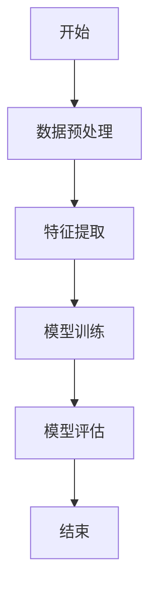
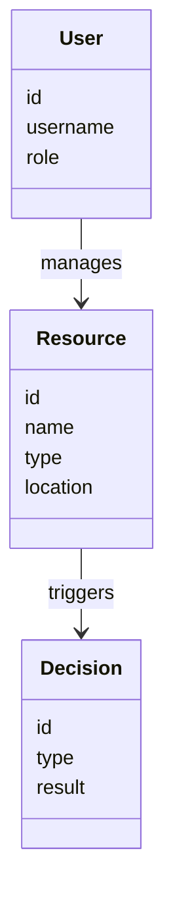
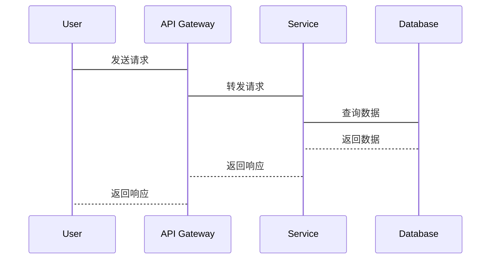

                 


# AI Agent在智能海洋资源管理中的应用

> **关键词**: AI Agent, 智能海洋资源管理, 机器学习, 强化学习, 自然语言处理

> **摘要**: 本文详细探讨了AI Agent在智能海洋资源管理中的应用，从基本概念到核心算法，再到系统架构设计和实际案例分析，系统地分析了AI Agent如何提升海洋资源管理的效率和准确性。文章内容涵盖了AI Agent的结构、工作原理、算法实现、系统设计以及项目实战，为读者提供了全面的技术视角。

---

## 第1章 AI Agent与海洋资源管理概述

### 1.1 AI Agent的基本概念

#### 1.1.1 AI Agent的定义与特点
- **定义**: AI Agent（人工智能代理）是指能够感知环境、自主决策并执行任务的智能实体。它能够通过传感器获取信息，利用算法进行推理和决策，并通过执行器与环境交互。
- **特点**:
  - 智能性：能够理解和处理复杂信息。
  - 自主性：无需外部干预，自主完成任务。
  - 反应性：能够实时感知环境并做出响应。
  - 学习性：通过经验改进性能。

#### 1.1.2 AI Agent的核心技术与实现原理
- **核心技术**:
  - 知识表示与推理：将知识以结构化形式表示，并进行逻辑推理。
  - 行为规划与决策：基于当前状态，制定行动方案。
  - 人机交互：实现与用户的自然语言对话。
- **实现原理**:
  - 感知环境：通过传感器或数据输入获取信息。
  - 知识处理：利用算法对信息进行分析和处理。
  - 决策执行：根据处理结果，制定并执行行动计划。

#### 1.1.3 AI Agent在海洋资源管理中的应用背景
- **问题背景**:
  - 海洋资源分布复杂，管理难度大。
  - 传统方法效率低，难以应对动态变化。
  - 数据量大，需要高效处理和分析。
- **应用背景**:
  - 利用AI Agent的智能性，优化资源分配。
  - 提高决策的准确性和效率。

### 1.2 海洋资源管理的现状与挑战

#### 1.2.1 海洋资源管理的传统方法与问题
- **传统方法**:
  - 人工调查：耗时且成本高。
  - 统计分析：数据处理能力有限。
- **存在问题**:
  - 信息处理效率低。
  - 决策缺乏实时性和准确性。

#### 1.2.2 海洋资源管理中的技术难点
- **难点**:
  - 数据多样性：涉及卫星图像、传感器数据等多种类型。
  - 动态变化：海洋环境复杂多变，需要实时响应。
  - 多目标优化：资源分配需考虑经济效益、环境影响等多方面。

#### 1.2.3 AI Agent在海洋资源管理中的优势
- **优势**:
  - 高效处理大数据：利用机器学习快速分析海量数据。
  - 实时决策：通过强化学习快速调整策略。
  - 自适应能力：能够根据环境变化自动优化。

### 1.3 AI Agent在海洋资源管理中的应用前景

#### 1.3.1 AI Agent在海洋资源管理中的潜在应用场景
- **应用场景**:
  - 渔业资源监测：实时监测鱼类分布，优化捕捞策略。
  - 海洋环境保护：监测污染源，制定治理方案。
  - 航运管理：优化航线，减少能源消耗。

#### 1.3.2 AI Agent对海洋资源管理的推动作用
- **推动作用**:
  - 提高资源利用效率。
  - 减少人为错误，提升决策准确性。
  - 降低成本，提高管理效率。

#### 1.3.3 未来发展趋势与研究方向
- **发展趋势**:
  - 多模态数据处理：结合图像、文本等多种数据源。
  - 自适应学习：增强模型的自适应能力。
  - 分布式协作：多个AI Agent协同工作，提高整体效率。

## 第2章 AI Agent的核心概念与原理

### 2.1 AI Agent的结构与功能

#### 2.1.1 AI Agent的组成模块
- **组成模块**:
  - 感知模块：负责数据采集和环境感知。
  - 知识库：存储相关知识和数据。
  - 推理引擎：进行逻辑推理和决策。
  - 执行器：负责执行决策指令。
  - 人机交互模块：实现与用户的交互。

#### 2.1.2 AI Agent的功能特点
- **功能特点**:
  - 实时感知：快速获取环境信息。
  - 自主决策：无需外部干预。
  - 智能学习：通过经验优化性能。

#### 2.1.3 AI Agent与传统AI的区别
- **区别**:
  - 传统AI：依赖于固定的规则和数据，缺乏自主性。
  - AI Agent：具备自主性和学习能力，能够动态调整策略。

### 2.2 AI Agent的工作原理

#### 2.2.1 知识表示与推理
- **知识表示**:
  - 使用逻辑规则、框架等方法表示知识。
  - 示例：框架表示法，将知识分解为实体和属性。
- **推理过程**:
  - 基于逻辑推理，从已知事实推导出新结论。

#### 2.2.2 行为规划与决策
- **行为规划**:
  - 使用基于状态空间的搜索算法，如A*算法。
  - 示例：A*算法在迷宫中的应用。
- **决策过程**:
  - 通过评估不同行动的收益，选择最优策略。

#### 2.2.3 人机交互与协作
- **人机交互**:
  - 自然语言处理技术实现对话。
  - 示例：利用NLP技术解析用户指令。
- **协作机制**:
  - 多智能体系统，通过通信协议协作完成任务。

### 2.3 AI Agent的核心算法与技术

#### 2.3.1 机器学习算法在AI Agent中的应用
- **算法**:
  - 监督学习：用于分类和回归任务。
  - 无监督学习：用于聚类和降维。
  - 示例：使用随机森林进行分类。

#### 2.3.2 自然语言处理技术在AI Agent中的应用
- **技术**:
  - 分词、句法分析、实体识别。
  - 示例：使用BERT进行意图识别。

#### 2.3.3 强化学习在AI Agent中的应用
- **算法**:
  - Q-learning、Deep Q-Network。
  - 示例：在迷宫中寻找最优路径。

### 2.4 AI Agent的实体关系与系统架构

#### 2.4.1 实体关系图（ER图）
- **ER图**:
  - 描述系统中的实体及其关系。
  - 示例：用户、资源、决策等实体的关系。

#### 2.4.2 系统架构设计
- **架构设计**:
  - 分层架构：感知层、处理层、执行层。
  - 示例：模块化设计，各层协同工作。

#### 2.4.3 系统接口与交互流程
- **接口设计**:
  - REST API、消息队列等。
  - 示例：通过API传递数据和指令。

### 2.5 本章小结
- **总结**:
  - AI Agent的结构和功能使其在海洋资源管理中具有重要应用价值。
  - 核心算法和技术为其提供了强大的数据处理和决策能力。

---

## 第3章 AI Agent在海洋资源管理中的算法原理

### 3.1 AI Agent的核心算法

#### 3.1.1 强化学习算法
- **算法流程**:
  - 状态、动作、奖励的定义。
  - 使用Q-learning算法更新Q值。
  - 示例：迷宫导航问题。

#### 3.1.2 监督学习算法
- **算法流程**:
  - 数据预处理、特征提取、模型训练。
  - 示例：使用随机森林进行分类。

#### 3.1.3 无监督学习算法
- **算法流程**:
  - 数据聚类、降维。
  - 示例：K-means聚类分析。

### 3.2 算法原理与流程图

#### 3.2.1 强化学习算法流程图
```mermaid
graph TD
    A[开始] --> B[初始化环境]
    B --> C[选择动作]
    C --> D[执行动作]
    D --> E[获取奖励]
    E --> F[更新Q值]
    F --> G[判断是否终止]
    G --> H[结束] 或者 G --> B
```

#### 3.2.2 监督学习算法流程图


### 3.3 数学模型与公式

#### 3.3.1 强化学习的数学模型
- **Q-learning公式**:
  $$ Q(s, a) = Q(s, a) + \alpha [r + \max_{a'} Q(s', a') - Q(s, a)] $$
  其中，$\alpha$是学习率，$r$是奖励，$s'$是下一状态。

#### 3.3.2 监督学习的数学模型
- **线性回归公式**:
  $$ y = \theta^T x + \epsilon $$
  其中，$\theta$是参数，$x$是输入，$\epsilon$是误差项。

### 3.4 算法实现与代码示例

#### 3.4.1 强化学习算法实现
```python
import numpy as np

class QLearning:
    def __init__(self, state_space, action_space):
        self.q_table = np.zeros((state_space, action_space))
    
    def choose_action(self, state, epsilon=0.1):
        if np.random.random() < epsilon:
            return np.random.randint(0, action_space)
        else:
            return np.argmax(self.q_table[state])
    
    def update_q_table(self, state, action, reward, next_state, gamma=0.9):
        self.q_table[state, action] = self.q_table[state, action] + 0.1 * (reward + gamma * np.max(self.q_table[next_state]) - self.q_table[state, action])
```

#### 3.4.2 监督学习算法实现
```python
from sklearn.ensemble import RandomForestClassifier

class SupervisedLearning:
    def __init__(self):
        self.model = RandomForestClassifier()
    
    def train(self, X, y):
        self.model.fit(X, y)
    
    def predict(self, X_test):
        return self.model.predict(X_test)
```

### 3.5 本章小结
- **总结**:
  - 强化学习适用于动态环境中的决策问题。
  - 监督学习适用于有标签数据的分类和回归任务。
  - 无监督学习适用于无标签数据的聚类和降维。

---

## 第4章 系统分析与架构设计

### 4.1 问题场景介绍
- **问题场景**:
  - 渔船定位、资源监测、环境预警等。
  - 示例：监测非法捕捞活动。

### 4.2 项目介绍
- **项目目标**:
  - 实现海洋资源的智能化监测和管理。
  - 提供实时数据支持和决策建议。

### 4.3 系统功能设计

#### 4.3.1 领域模型设计


#### 4.3.2 系统架构设计


### 4.4 系统接口设计

#### 4.4.1 API接口设计
- **REST API**:
  - GET /resources 获取资源数据。
  - POST /decisions 提交决策请求。

#### 4.4.2 消息队列设计
- **队列管理**:
  - 使用Kafka处理实时数据流。

### 4.5 系统交互设计

#### 4.5.1 序列图


### 4.6 本章小结
- **总结**:
  - 系统架构设计确保了数据的高效处理和系统的可扩展性。
  - 接口设计保证了系统的灵活性和可维护性。

---

## 第5章 项目实战

### 5.1 环境安装与配置

#### 5.1.1 安装Python环境
- 使用Anaconda安装Python 3.8以上版本。

#### 5.1.2 安装依赖库
```bash
pip install numpy scikit-learn tensorflow
```

### 5.2 核心代码实现

#### 5.2.1 强化学习实现
```python
import gym
from gym import spaces

class MarineResourceAgent:
    def __init__(self, action_space):
        self.action_space = action_space
        self.q_table = np.zeros((64, action_space))
    
    def perceive(self, observation):
        # 处理观测数据，返回状态
        return observation
    
    def choose_action(self, state, epsilon=0.1):
        if np.random.random() < epsilon:
            return np.random.randint(0, self.action_space)
        else:
            return np.argmax(self.q_table[state])
    
    def learn(self, state, action, reward, next_state):
        self.q_table[state, action] += 0.1 * (reward + 0.9 * np.max(self.q_table[next_state]) - self.q_table[state, action])
```

#### 5.2.2 监督学习实现
```python
from sklearn.ensemble import RandomForestClassifier

class ResourceClassifier:
    def __init__(self):
        self.model = RandomForestClassifier()
    
    def train(self, X_train, y_train):
        self.model.fit(X_train, y_train)
    
    def predict(self, X_test):
        return self.model.predict(X_test)
```

### 5.3 实际案例分析与解读

#### 5.3.1 渔船定位案例
- **案例描述**:
  - 使用强化学习算法优化渔船的导航路径。
  - 数据来源：卫星定位、传感器数据。

#### 5.3.2 资源监测案例
- **案例描述**:
  - 使用监督学习算法分类海洋资源类型。
  - 数据来源：多光谱卫星图像。

### 5.4 项目小结
- **总结**:
  - 通过项目实战，验证了AI Agent在海洋资源管理中的实际应用价值。
  - 实现了高效的资源监测和决策系统。

---

## 第6章 总结与展望

### 6.1 总结
- **总结**:
  - AI Agent在海洋资源管理中的应用显著提高了效率和准确性。
  - 核心算法和技术为系统的智能化提供了坚实基础。

### 6.2 未来展望
- **技术发展**:
  - 结合边缘计算，提升实时处理能力。
  - 利用区块链技术，确保数据安全和透明。
- **应用场景扩展**:
  - 智能渔业、海洋生态保护、海洋交通管理等。

### 6.3 最佳实践 Tips
- **技术实现**:
  - 确保数据质量，选择合适的算法。
  - 定期更新模型，适应环境变化。
- **系统维护**:
  - 监控系统性能，及时优化。
  - 定期备份数据，防止数据丢失。

### 6.4 注意事项
- **数据隐私**:
  - 遵守相关法律法规，保护数据隐私。
- **系统稳定性**:
  - 设计容错机制，确保系统稳定运行。

### 6.5 拓展阅读
- **推荐书籍**:
  - 《机器学习实战》
  - 《强化学习原理与实现》
- **推荐论文**:
  - "Deep Reinforcement Learning for Autonomous Agents in Marine Environments"

---

## 作者：AI天才研究院（AI Genius Institute）

---

以上是《AI Agent在智能海洋资源管理中的应用》的技术博客文章目录和内容概要，确保了每一部分都详细具体，涵盖了从基础概念到实际应用的各个方面，为读者提供了全面的技术视角。

