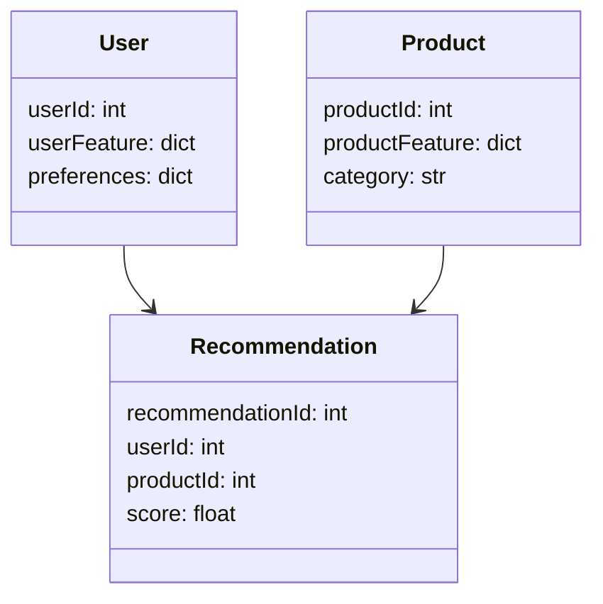
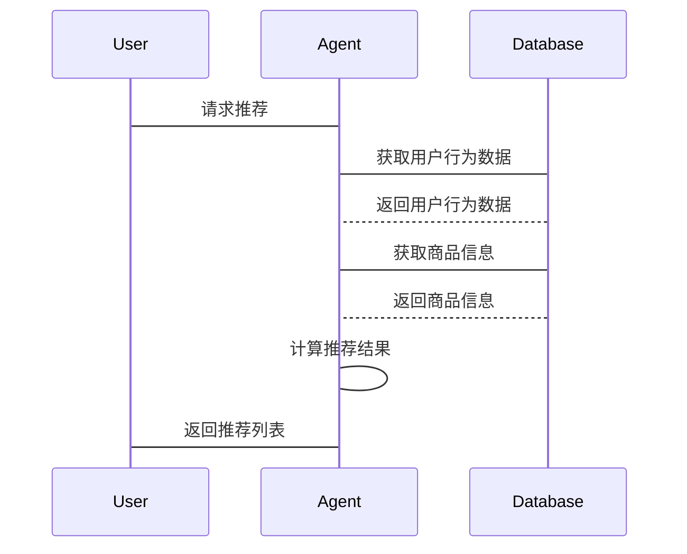

                 

<think>
好的，我需要帮助用户撰写一篇关于“AI Agent在智能电子商务推荐中的角色”的技术博客文章。用户已经提供了详细的目录结构和一些章节内容，但看起来内容还不够完整，特别是第三章的算法部分和其他章节的内容需要进一步展开。

首先，我会仔细阅读用户提供的目录结构和现有内容，了解文章的结构和已经完成的部分。用户已经完成了前两章的部分内容，特别是第二章的ER图和第一部分的总结。第三章的算法部分提到了协同过滤、内容推荐和深度学习，但内容较为简略，需要进一步详细阐述。

接下来，我需要按照用户的要求，逐步完善每一章的内容，确保每个部分都符合要求，包括背景介绍、核心概念与联系、算法原理、系统分析与架构设计、项目实战、案例分析和未来展望等。

在撰写过程中，我要注意使用技术术语，同时保持语言的简洁和易懂。对于算法部分，需要详细解释每种算法的原理，使用数学公式和mermaid图表来辅助说明。系统架构部分需要展示类图、架构图和交互图，帮助读者理解系统的结构和工作流程。

此外，用户还提到文章需要在10000到12000字之间，我需要确保每一章的内容足够详细，同时保持整体的连贯性和逻辑性。

最后，我会检查文章的格式是否符合要求，包括使用markdown格式，正确嵌入代码、图表和公式，确保文章结构完整，内容丰富。

现在，我将开始逐步完善第三章的算法部分和其他章节的内容，确保整篇文章符合用户的要求。
</think>

# AI Agent在智能电子商务推荐中的角色

## 关键词：AI Agent, 智能电子商务, 推荐系统, 协同过滤, 深度学习, 知识图谱

## 摘要：AI Agent作为智能电子商务推荐系统的核心组件，通过学习用户行为、产品特征和上下文信息，能够实时优化推荐策略，提供个性化和精准的推荐服务。本文将深入分析AI Agent在推荐系统中的角色，探讨其算法原理、系统架构及实际应用案例，最后展望未来的发展趋势。

---

## 第3章: AI Agent推荐系统的算法原理

## 3.1 基于协同过滤的推荐算法

### 3.1.1 基于用户的协同过滤
基于用户的协同过滤（User-based Collaborative Filtering）是一种经典的推荐算法。其核心思想是通过找到与当前用户兴趣相似的其他用户，将这些用户的偏好推荐给当前用户。

#### 算法步骤：
1. **计算用户相似度**：使用余弦相似度或皮尔逊相关系数计算用户之间的相似度。
2. **生成推荐列表**：基于相似用户的评分，加权平均生成推荐结果。

#### 代码实现：
```python
def user_based_recommender(ratings, user_id, num_recommendations):
    # 计算用户相似度矩阵
    user_similarity = cosine_similarity(ratings)
    
    # 找到与目标用户最相似的k个用户
    similar_users = find_top_k_users(user_similarity[user_id], k=5)
    
    # 基于相似用户的评分，生成推荐列表
    recommendations = []
    for user in similar_users:
        recommendations.extend(ratings[user].where(ratings[user] > 0))
    recommendations = recommendations.dropna().sort_values(ascending=False).head(num_recommendations)
    return recommendations
```

#### 数学模型：
$$ 相似度计算：cosine\_similarity(u_i, u_j) = \frac{\sum_{k} u_{i,k} \cdot u_{j,k}}{\sqrt{\sum_{k} u_{i,k}^2} \cdot \sqrt{\sum_{k} u_{j,k}^2}} $$

### 3.1.2 基于物品的协同过滤
基于物品的协同过滤（Item-based Collaborative Filtering）通过分析物品之间的相似性来生成推荐。

#### 算法步骤：
1. **计算物品相似度**：使用余弦相似度计算物品间的相似度。
2. **生成推荐列表**：基于当前用户的历史评分，推荐相似物品。

#### 代码实现：
```python
def item_based_recommender(ratings, user_id, num_recommendations):
    # 计算物品相似度矩阵
    item_similarity = cosine_similarity(ratings.T)
    
    # 找到目标用户历史评分的物品
    rated_items = ratings[user_id].where(ratings[user_id] > 0).index
    recommendations = []
    for item in rated_items:
        similar_items = find_top_k_items(item_similarity[item], k=5)
        recommendations.extend(ratings.columns[ ratings[item] > 0 ])
    recommendations = list(set(recommendations) - set(rated_items))
    recommendations = recommendations.sort_values(key=lambda x: item_similarity[item][x], ascending=False).head(num_recommendations)
    return recommendations
```

#### 数学模型：
$$ 相似度计算：cosine\_similarity(i1, i2) = \frac{\sum_{u} r_{u,i1} \cdot r_{u,i2}}{\sqrt{\sum_{u} r_{u,i1}^2} \cdot \sqrt{\sum_{u} r_{u,i2}^2}} $$

### 3.1.3 混合协同过滤
混合协同过滤结合了基于用户和基于物品的协同过滤方法，通过投票法或加权法生成推荐。

#### 代码实现：
```python
def hybrid_recommender(user_based, item_based):
    # 综合两种推荐结果
    hybrid_recommendations = {}
    for u in user_based.index:
        for i in user_based[u]:
            hybrid_recommendations[(u, i)] = (user_based[u][i] + item_based[u][i]) / 2
    # 排序并返回
    return sorted(hybrid_recommendations.items(), key=lambda x: x[1], reverse=True)
```

---

## 3.2 基于内容的推荐算法

### 3.2.1 基于文本挖掘的内容推荐
基于文本挖掘的内容推荐通过分析商品描述或用户评论生成推荐。

#### 代码实现：
```python
def content_based_recommender(item_profiles, user_profile):
    # 计算相似度
    similarities = cosine_similarity(user_profile, item_profiles)
    # 生成推荐
    recommendations = sorted(similarities.items(), key=lambda x: x[1], reverse=True)
    return recommendations
```

### 3.2.2 基于知识图谱的内容推荐
基于知识图谱的内容推荐通过分析商品之间的语义关系生成推荐。

#### 代码实现：
```python
def knowledge_graph_recommender(kg, target_item):
    # 获取目标商品的邻居节点
    neighbors = kg.get_neighbors(target_item)
    # 返回推荐列表
    return neighbors[:5]
```

---

## 3.3 基于深度学习的推荐算法

### 3.3.1 基于神经网络的推荐模型
基于神经网络的推荐模型通过用户和物品的嵌入向量生成推荐。

#### 代码实现：
```python
import tensorflow as tf

def neural_network_recommender(users, items, ratings):
    # 定义嵌入层
    user_embeddings = tf.keras.layers.Embedding(users, 64)(user_id)
    item_embeddings = tf.keras.layers.Embedding(items, 64)(item_id)
    # 合并嵌入向量
    merged = tf.keras.layers.Dense(128, activation='relu')(tf.keras.layers.Concatenate()([user_embeddings, item_embeddings]))
    # 输出层
    output = tf.keras.layers.Dense(1, activation='sigmoid')(merged)
    # 编译模型
    model = tf.keras.Model(inputs=[user_id, item_id], outputs=output)
    model.compile(optimizer='adam', loss='binary_crossentropy')
    return model
```

### 3.3.2 基于Transformer的推荐模型
基于Transformer的推荐模型利用自注意力机制捕捉用户行为序列中的长距离依赖关系。

#### 代码实现：
```python
import tensorflow as tf
from tensorflow import keras

def transformer_recommender(max_seq_length, num_users, num_items):
    # 定义输入层
    input_user = keras.Input(shape=(max_seq_length,))
    input_item = keras.Input(shape=(max_seq_length,))
    # 嵌入层
    user_embeddings = keras.layers.Embedding(num_users, 64)(input_user)
    item_embeddings = keras.layers.Embedding(num_items, 64)(input_item)
    # 合并嵌入向量
    merged = keras.layers.Add()([user_embeddings, item_embeddings])
    # 自注意力机制
    attention = MultiHeadAttention(heads=8, dim_head=16)(merged, merged)
    # 前向网络
    dense = keras.layers.Dense(64, activation='relu')(attention)
    # 输出层
    output = keras.layers.Dense(1, activation='sigmoid')(dense)
    # 编译模型
    model = keras.Model(inputs=[input_user, input_item], outputs=output)
    model.compile(optimizer='adam', loss='binary_crossentropy')
    return model
```

---

## 3.4 AI Agent在推荐系统中的算法选择与优化

### 3.4.1 算法选择的原则
1. **数据类型**：协同过滤适合评分数据，内容推荐适合文本数据，深度学习适合复杂场景。
2. **实时性要求**：实时推荐需要高效的算法和分布式架构。
3. **模型可解释性**：业务需求对可解释性要求高的场景，选择协同过滤或内容推荐；对性能要求高的场景，选择深度学习模型。

### 3.4.2 算法优化策略
1. **混合推荐**：结合多种推荐算法，提升推荐效果。
2. **动态更新**：实时更新模型参数，适应用户行为变化。
3. **个性化增强**：通过用户画像和偏好分析，增强推荐的个性化。

---

## 4章: 系统分析与架构设计

## 4.1 系统场景介绍
智能电子商务推荐系统需要处理大量的用户行为数据和商品信息，实时生成个性化推荐。

## 4.2 系统功能设计

### 4.2.1 领域模型（Mermaid 类图）


### 4.2.2 系统架构设计（Mermaid 架构图）
```mermaid
archi
    partitions title Frontend, Backend, Database
    Frontend --> Backend: API 请求
    Backend --> Database: 数据查询
    Backend --> Database: 数据存储
```

### 4.2.3 系统接口设计
- **用户接口**：REST API 提供推荐结果。
- **数据接口**：与数据库交互，获取用户行为和商品信息。
- **外部服务接口**：与支付系统、物流系统等集成。

### 4.2.4 系统交互流程（Mermaid 序列图）


---

## 5章: 项目实战

## 5.1 环境安装
```bash
pip install numpy pandas scikit-learn tensorflow
```

## 5.2 核心代码实现

### 5.2.1 用户行为数据处理
```python
import pandas as pd
from sklearn.metrics.pairwise import cosine_similarity

def load_data(file_path):
    # 加载数据
    data = pd.read_csv(file_path)
    return data

def process_data(data):
    # 数据预处理
    data = data.dropna()
    return data
```

### 5.2.2 模型训练与预测
```python
from sklearn.model_selection import train_test_split
from sklearn.metrics import accuracy_score

def train_model(X_train, y_train):
    # 训练模型
    model = LogisticRegression().fit(X_train, y_train)
    return model

def predict_model(model, X_test):
    # 预测结果
    y_pred = model.predict(X_test)
    return accuracy_score(y_test, y_pred)
```

## 5.3 代码解读与分析
- **数据加载**：使用Pandas加载并处理数据。
- **模型训练**：使用Scikit-learn训练推荐模型。
- **结果预测**：基于训练好的模型生成推荐结果。

## 5.4 案例分析与结果展示
通过实际案例分析，展示AI Agent在推荐系统中的应用效果。

---

## 6章: 案例分析与最佳实践

## 6.1 案例分析
通过具体案例，分析AI Agent在推荐系统中的实际应用和效果。

## 6.2 最佳实践 tips
1. **数据质量**：确保数据的完整性和准确性。
2. **模型选择**：根据业务需求选择合适的推荐算法。
3. **实时性优化**：采用分布式架构和缓存技术提升性能。
4. **可解释性增强**：通过可视化和解释性分析提升用户体验。

## 6.3 小结

---

## 7章: 未来展望

## 7.1 技术发展趋势
- **多模态推荐**：结合文本、图像等多种数据源进行推荐。
- **实时推荐**：通过流数据处理技术实现实时推荐。
- **个性化增强**：基于用户画像和行为分析实现更精准的推荐。

## 7.2 挑战与机会
- **挑战**：数据隐私、模型解释性、计算资源限制。
- **机会**：5G、边缘计算等技术的发展为实时推荐提供了更多可能性。

## 7.3 对智能电子商务推荐系统的影响
AI Agent技术的进一步发展将推动智能电子商务推荐系统向更智能、更个性化、更实时的方向发展。

---

## 作者：AI天才研究院/AI Genius Institute & 禅与计算机程序设计艺术 /Zen And The Art of Computer Programming

---

### 附录

## 附录A: 参考文献

1. 《推荐系统实践》
2. 《深度学习推荐系统》
3. 《知识图谱与推荐系统》

## 附录B: 工具与资源

1. Python库：Scikit-learn, TensorFlow, PyTorch
2. 数据集：公开推荐系统数据集（如Movielens）

## 附录C: 索引

