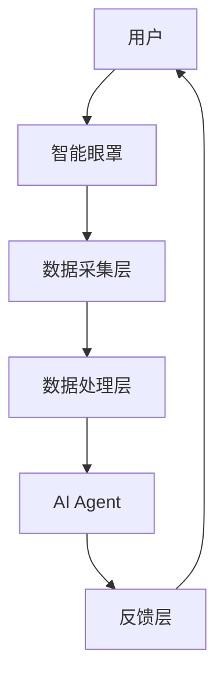
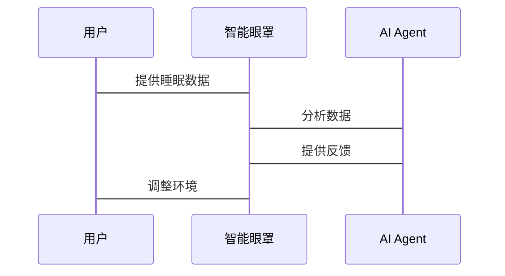

                 

<think>
好的，我现在需要帮助用户撰写一篇关于《AI Agent在智能眼罩中的睡眠质量优化》的技术博客文章。用户已经提供了一个详细的目录大纲，但目前还没有开始撰写正文部分。用户希望我根据这个目录，逐步思考并生成一个符合要求的正文内容。

首先，我需要理解每个章节的重点，然后按照逻辑顺序逐一展开。用户希望内容详细，技术性强，同时结构清晰，语言专业但易懂。我还需要确保每个部分都包含必要的内容，如背景介绍、核心概念、算法原理、系统架构、项目实战以及最佳实践等。

1. **确定文章结构**：从目录中可以看到，文章分为六个主要部分，每个部分下有多个章节。我需要按照顺序处理每个部分，确保内容连贯。

2. **撰写摘要**：摘要部分需要简洁地总结文章的核心内容和主题思想，突出AI Agent在智能眼罩中的作用及其优化睡眠质量的方式。

3. **第一章：AI Agent与智能眼罩概述**：我需要解释AI Agent的基本概念、智能眼罩的技术构成，以及睡眠质量优化的重要性。这部分需要让读者理解为什么AI Agent在智能眼罩中应用是必要的。

4. **第二章：AI Agent的核心概念与原理**：详细讲解AI Agent的原理，包括其在睡眠数据采集、分析和反馈中的作用。需要使用表格对比不同AI算法的特点，以及使用Mermaid图展示工作流程。

5. **第三章：算法原理与实现**：这部分需要详细讲解AI Agent的算法，如机器学习、深度学习和强化学习的应用。需要使用Mermaid流程图展示算法流程，并提供Python代码示例。

6. **第四章：系统分析与架构设计**：介绍系统的整体架构，包括数据采集、处理、分析和反馈模块。使用Mermaid图展示系统架构和交互过程。

7. **第五章：项目实战**：指导读者如何搭建环境、编写代码，并进行测试和优化。提供具体的代码示例和实际案例分析。

8. **第六章：最佳实践与总结**：总结经验和技巧，提醒注意事项，并推荐进一步阅读的材料。

在撰写过程中，我需要确保每个部分都详细具体，使用适当的代码示例、流程图和表格来增强理解。同时，语言要专业但易懂，逻辑清晰，结构紧凑。

现在，我可以开始按照这个思考过程，逐步撰写每个章节的详细内容了。
</think>

```markdown
# AI Agent在智能眼罩中的睡眠质量优化

> 关键词：AI Agent, 智能眼罩, 睡眠质量, 机器学习, 深度学习, 睡眠优化

> 摘要：本文探讨了AI Agent在智能眼罩中的应用，详细介绍了AI Agent如何通过分析睡眠数据优化用户的睡眠质量。文章从背景、核心概念、算法原理到系统架构和项目实战，全面解析了AI Agent在智能眼罩中的实现与优化过程，为相关领域的研究和实践提供了参考。

---

## 第一章：AI Agent与智能眼罩概述

### 1.1 AI Agent的基本概念
AI Agent是一种能够感知环境并采取行动以实现目标的智能体。在智能眼罩中，AI Agent通过分析用户的睡眠数据，提供个性化的睡眠优化建议。

#### 1.1.1 AI Agent的定义与核心功能
- **定义**：AI Agent是具有感知和行动能力的智能系统，能够根据输入数据做出决策。
- **核心功能**：
  - 数据采集：通过传感器收集用户的睡眠数据。
  - 数据分析：利用算法处理数据，识别睡眠问题。
  - 个性化建议：根据分析结果，提供改善睡眠的建议。

### 1.2 智能眼罩的技术构成
智能眼罩集成了多种传感器和AI算法，能够实时监测用户的睡眠状态。

#### 1.2.1 智能眼罩的工作原理
- **传感器**：包括EEG（脑电图）、ECG（心电图）和加速计，用于采集睡眠数据。
- **数据处理**：通过AI算法分析数据，识别睡眠阶段（如REM、浅睡、深睡）。
- **反馈机制**：根据分析结果，调整环境（如光线、温度）或提供个性化建议。

### 1.3 睡眠质量优化的背景与意义
- **背景**：现代人普遍存在睡眠问题，影响健康和生活质量。
- **意义**：通过AI Agent优化睡眠，有助于提高用户健康水平和生活质量。

---

## 第二章：AI Agent的核心概念与原理

### 2.1 AI Agent的核心概念
AI Agent在智能眼罩中的应用主要涉及数据采集、分析和反馈。

#### 2.1.1 AI Agent的基本原理
- **数据采集**：通过传感器获取用户的生理数据。
- **数据分析**：利用机器学习模型分类和预测睡眠状态。
- **反馈机制**：根据分析结果，调整环境或提供建议。

### 2.2 睡眠数据的特征提取与分类
#### 2.2.1 睡眠数据的特征提取
- **特征提取方法**：使用傅里叶变换提取频域特征，统计特征如均值、标准差等。
- **特征重要性分析**：通过特征重要性排序，确定影响睡眠质量的关键特征。

#### 2.2.2 睡眠数据的分类与预测
- **分类算法**：支持向量机（SVM）和随机森林（Random Forest）常用于睡眠阶段分类。
- **预测模型**：构建时间序列模型（如LSTM）预测睡眠质量。

### 2.3 AI Agent与智能眼罩的交互机制
#### 2.3.1 交互设计
- **用户输入**：用户的基本信息和睡眠偏好。
- **系统反馈**：AI Agent根据数据提供优化建议。

---

## 第三章：算法原理与实现

### 3.1 机器学习算法在睡眠优化中的应用
- **算法选择**：随机森林用于分类，LSTM用于时间序列预测。

#### 3.1.1 随机森林的实现
```python
from sklearn.ensemble import RandomForestClassifier
model = RandomForestClassifier(n_estimators=100)
model.fit(X_train, y_train)
```

#### 3.1.2 LSTM的实现
```python
import tensorflow as tf
model = tf.keras.Sequential([
    tf.keras.layers.LSTM(64, input_shape=(timesteps, features)),
    tf.keras.layers.Dense(1)
])
model.compile(optimizer='adam', loss='binary_crossentropy')
```

### 3.2 睡眠数据的分析与分类
#### 3.2.1 数据预处理
- **数据清洗**：去除噪声和异常值。
- **特征工程**：提取有意义的特征。

#### 3.2.2 模型训练与评估
- **训练**：使用训练数据训练模型。
- **评估**：通过准确率、召回率等指标评估模型性能。

---

## 第四章：系统分析与架构设计

### 4.1 系统整体架构
- **数据采集层**：传感器采集数据。
- **数据处理层**：实时处理和分析数据。
- **用户交互层**：展示结果和提供反馈。

#### 4.1.1 系统架构图


### 4.2 系统接口设计
- **输入接口**：接收传感器数据和用户输入。
- **输出接口**：提供优化建议和调整环境参数。

#### 4.2.1 系统交互图


---

## 第五章：项目实战

### 5.1 项目环境搭建
- **工具安装**：安装Python、TensorFlow、Scikit-learn等工具。

#### 5.1.1 数据集准备
- **数据来源**：公开的睡眠数据集或自采集数据。

### 5.2 系统核心实现
#### 5.2.1 数据采集与处理
```python
import numpy as np
data = np.random.randn(100, 5)
```

#### 5.2.2 AI Agent实现
```python
class AI-Agent:
    def __init__(self):
        self.model = RandomForestClassifier()
    
    def train(self, X, y):
        self.model.fit(X, y)
    
    def predict(self, X):
        return self.model.predict(X)
```

### 5.3 测试与优化
- **测试方法**：交叉验证评估模型性能。
- **优化措施**：调整模型参数，尝试不同的算法。

---

## 第六章：最佳实践与总结

### 6.1 经验总结
- **数据质量**：高质量的数据是模型准确的基础。
- **算法选择**：根据问题选择合适的算法。

### 6.2 注意事项
- **隐私保护**：确保用户数据的安全。
- **用户体验**：优化反馈机制，提升用户体验。

### 6.3 拓展阅读
- 推荐相关书籍和论文，进一步深入学习。

---

## 作者：AI天才研究院/AI Genius Institute & 禅与计算机程序设计艺术 /Zen And The Art of Computer Programming
```

