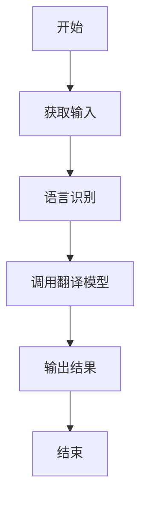
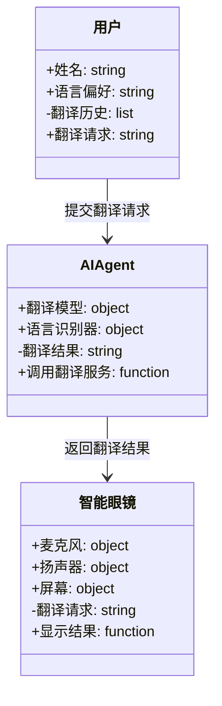
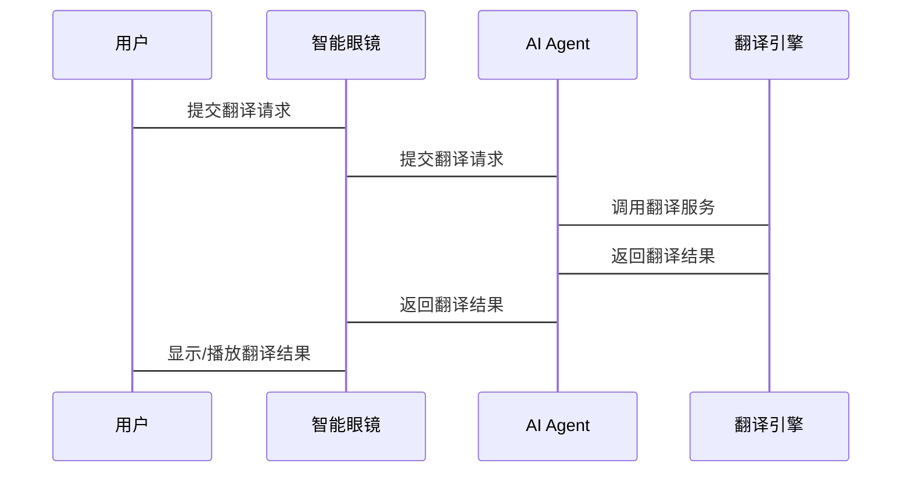

                 

<think>
好的，我现在要按照用户的要求来详细思考并撰写关于《AI Agent在智能眼镜中的实时翻译功能》的技术博客文章。首先，我需要理解用户的需求，他们希望有一篇结构清晰、内容详实、逻辑严谨的技术博客，涵盖从背景介绍到项目实战的各个方面。

首先，我会考虑文章的结构。用户已经给出了一个详细的目录大纲，我需要确保每个章节的内容都充分展开，并且符合他们的要求。比如，第一章是背景介绍，我需要涵盖问题背景、问题描述、问题解决以及概念结构，这部分需要让读者理解为什么实时翻译在智能眼镜中重要，以及AI Agent的作用。

接下来是核心概念与联系，这部分需要解释AI Agent和实时翻译的基本原理，并通过对比分析展示它们的区别。我可能会使用Mermaid图来帮助读者理解实体关系和系统架构，这需要我在适当的地方插入这些图表。

然后是算法原理讲解，这部分比较技术性。我需要详细描述翻译算法的数学模型，可能涉及概率论或深度学习的内容，并用公式来说明。同时，用Mermaid流程图展示算法的执行步骤，并附上Python代码示例，这样读者可以更好地理解实现细节。

系统分析与架构设计部分，我需要介绍问题场景，设计系统功能，包括用户界面、翻译引擎和数据处理模块。使用Mermaid类图和架构图来展示系统的各个部分及其交互关系，这有助于读者理解系统的整体结构。

项目实战部分是关键，我需要指导读者如何安装环境，实现核心功能，并通过实际案例进行分析。这部分需要详细说明每一步的操作，并提供代码示例，帮助读者动手实践。

最后，我会总结最佳实践，给出小结、注意事项和拓展阅读，帮助读者巩固所学内容，并引导他们进一步学习相关知识。

在撰写过程中，我需要确保语言简洁明了，逻辑清晰，同时使用专业术语但避免过于晦涩。数学公式和代码示例需要准确无误，并且解释清楚，确保读者能够理解和应用。

总的来说，我需要一步一步地按照用户提供的大纲来展开，确保每个部分都详细且符合要求，同时保持文章的连贯性和深度。
</think>

# AI Agent在智能眼镜中的实时翻译功能

> 关键词：AI Agent，智能眼镜，实时翻译，自然语言处理，语音识别，系统架构

> 摘要：本文探讨了AI Agent在智能眼镜中的实时翻译功能，从背景介绍到系统架构设计，再到项目实战，详细分析了实现这一功能的技术细节和应用场景。文章内容涵盖算法原理、系统架构、项目实现等，旨在为技术从业者提供全面的技术视角和实现思路。

---

# 第1章: 背景介绍

## 1.1 问题背景

### 1.1.1 智能眼镜的发展现状

智能眼镜作为一种新兴的可穿戴设备，正在逐步融入人们的日常生活。它不仅具备显示信息的功能，还能够通过AI技术实现更多智能化操作。实时翻译功能作为智能眼镜的重要应用之一，能够为用户提供便捷的语言交流支持，尤其是在跨国会议、旅游等场景中发挥重要作用。

### 1.1.2 实时翻译功能的需求场景

在跨国交流中，语言障碍一直是阻碍有效沟通的主要因素。智能眼镜通过实时翻译功能，能够将听到的语言快速转化为用户需要的语言，并通过视觉或听觉的方式呈现。这种功能不仅适用于商务场景，也适用于日常生活中的跨语言交流。

### 1.1.3 AI Agent在智能眼镜中的作用

AI Agent（人工智能代理）是一种能够感知环境、理解用户需求并执行任务的智能实体。在智能眼镜中，AI Agent负责接收用户的指令，处理翻译请求，并通过智能眼镜的硬件（如屏幕、扬声器）将结果呈现给用户。AI Agent的核心作用是将复杂的翻译过程简化为一个无缝的操作，使用户能够专注于交流本身。

## 1.2 问题描述

### 1.2.1 实时翻译的核心问题

实时翻译的核心问题在于如何快速、准确地将一种语言转换为另一种语言，并通过智能眼镜的硬件进行实时显示或播放。这需要处理大量的语言数据，同时保证翻译的准确性和实时性。

### 1.2.2 智能眼镜硬件与AI Agent的结合

智能眼镜的硬件（如麦克风、扬声器、屏幕）与AI Agent的结合是实现实时翻译功能的基础。AI Agent需要通过硬件接收用户的输入（如语音），并将其转化为翻译请求，同时将翻译结果通过硬件反馈给用户。

### 1.2.3 用户需求与技术实现的平衡

用户需求多样化，不同用户可能对实时翻译的功能有不同的期望。技术实现需要在保证功能的前提下，尽可能地优化性能和用户体验。例如，用户可能希望翻译速度快、准确率高，同时设备的功耗低，不会影响智能眼镜的续航能力。

## 1.3 问题解决

### 1.3.1 AI Agent在实时翻译中的解决方案

AI Agent通过自然语言处理（NLP）技术和机器学习算法，能够快速理解用户的输入，并调用相应的翻译服务（如API）进行翻译。翻译结果通过智能眼镜的硬件进行反馈，从而实现实时翻译功能。

### 1.3.2 翻译功能的技术实现路径

1. **语音识别**：AI Agent通过麦克风采集用户语音，利用语音识别技术将其转化为文本。
2. **语言检测**：识别输入文本的语言类型。
3. **翻译引擎**：调用翻译API（如Google Translate、百度翻译）进行翻译。
4. **结果反馈**：将翻译结果通过智能眼镜的屏幕显示或扬声器播放。

### 1.3.3 边界与外延

实时翻译功能的边界包括：支持的语言种类、翻译的准确率、设备的响应速度等。外延则包括：支持离线翻译、多语言识别、实时语音翻译等功能。

## 1.4 概念结构与核心要素

### 1.4.1 AI Agent的基本概念

AI Agent是一种能够感知环境、理解用户需求并执行任务的智能实体。它能够通过传感器、网络接口等方式与外部环境交互，并根据用户的需求执行相应的操作。

### 1.4.2 实时翻译功能的核心要素

实时翻译功能的核心要素包括：语音识别、语言检测、翻译引擎、结果反馈等。这些要素共同构成了实时翻译功能的实现基础。

### 1.4.3 智能眼镜硬件与AI Agent的交互关系

智能眼镜硬件为AI Agent提供输入（如语音）和输出（如屏幕显示、扬声器播放）的接口。AI Agent通过硬件与用户交互，并利用硬件的计算能力进行翻译处理。

---

# 第2章: 核心概念与联系

## 2.1 核心概念原理

### 2.1.1 AI Agent的基本原理

AI Agent通过感知环境、理解用户需求并执行任务来实现功能。其基本原理包括：数据采集、数据处理、决策与执行等步骤。

### 2.1.2 实时翻译的核心算法

实时翻译的核心算法包括：语音识别算法、机器翻译算法等。这些算法通过处理输入数据，生成翻译结果。

### 2.1.3 智能眼镜硬件的支持

智能眼镜硬件为AI Agent提供计算能力、存储能力和输入输出接口。硬件性能直接影响翻译功能的响应速度和准确性。

## 2.2 核心概念对比分析

### 2.2.1 AI Agent与传统翻译软件的区别

| 特性         | AI Agent | 传统翻译软件 |
|--------------|----------|--------------|
| **交互方式** | 实时语音 | 文本输入       |
| **响应速度** | 实时     | 延时          |
| **硬件支持** | 需要     | 无            |

### 2.2.2 实时翻译与离线翻译的对比

| 特性         | 实时翻译 | 离线翻译 |
|--------------|----------|----------|
| **网络依赖** | 高       | 低        |
| **响应速度** | 实时     | 延时      |
| **功能限制** | 较少     | 较多       |

### 2.2.3 智能眼镜硬件对翻译功能的支持

智能眼镜硬件对翻译功能的支持主要体现在以下几个方面：

1. **语音识别**：通过麦克风采集用户语音，并通过语音识别技术将其转化为文本。
2. **语言检测**：通过硬件支持的语言检测功能，快速识别输入语言的类型。
3. **翻译引擎**：调用外部翻译服务或本地预处理的翻译模型，进行翻译处理。
4. **结果反馈**：通过屏幕显示或扬声器播放翻译结果。

## 2.3 ER实体关系图

```mermaid
er
actor: 用户
agent: AI Agent
device: 智能眼镜
message: 翻译请求
```

---

# 第3章: 算法原理讲解

## 3.1 翻译算法原理

### 3.1.1 翻译算法的数学模型

翻译算法的数学模型主要基于统计机器翻译（SMT）或神经机器翻译（NMT）模型。以下是一个简单的统计机器翻译模型示例：

$$ P(f) = \arg\max_{f} P(f|e) $$

其中，\( P(f|e) \) 是给定源语言句子 \( e \) 的情况下，目标语言句子 \( f \) 的概率。

### 3.1.2 翻译算法的流程图



### 3.1.3 翻译算法的Python实现

```python
import googletrans
from googletrans import Translator

def translate_text(text, src_lang, dest_lang):
    translator = Translator()
    translated = translator.translate(text, src=src_lang, dest=dest_lang)
    return translated.text

# 示例使用
text = "Hello, how are you?"
src_lang = 'en'
dest_lang = 'zh-CN'
print(translate_text(text, src_lang, dest_lang))
```

---

## 3.2 翻译算法的优化与实现

### 3.2.1 翻译算法的优化策略

1. **模型优化**：使用更先进的神经机器翻译模型（如Transformer）提高翻译准确率。
2. **缓存机制**：对频繁出现的翻译请求进行缓存，减少重复计算。
3. **多线程处理**：通过多线程技术，提高翻译请求的处理速度。

### 3.2.2 翻译算法的数学公式

神经机器翻译模型的核心公式包括编码器和解码器的转换公式：

$$ \text{编码器}: f(x) = z $$
$$ \text{解码器}: y = g(z) $$

其中，\( z \) 是编码器输出的隐藏层表示，\( y \) 是解码器输出的目标语言句子。

### 3.2.3 翻译算法的性能优化

1. **减少模型参数**：通过剪枝、蒸馏等技术减少模型参数数量。
2. **优化计算流程**：通过并行计算、异步处理等方式提高计算效率。
3. **优化存储结构**：通过压缩技术减少模型的存储空间占用。

---

# 第4章: 系统分析与架构设计

## 4.1 问题场景介绍

实时翻译功能需要在智能眼镜上运行，用户通过语音输入需要翻译的内容，智能眼镜通过AI Agent调用翻译服务，将结果反馈给用户。

## 4.2 项目介绍

### 4.2.1 项目目标

实现智能眼镜上的实时翻译功能，支持多种语言的语音输入和实时翻译。

### 4.2.2 项目需求

- 支持多种语言的语音识别和翻译。
- 实时响应用户的翻译请求。
- 提供准确的翻译结果。

## 4.3 系统功能设计

### 4.3.1 领域模型



### 4.3.2 系统架构设计


### 4.3.3 系统接口设计

- **输入接口**：麦克风输入语音。
- **输出接口**：屏幕显示翻译结果，扬声器播放翻译结果。
- **翻译接口**：调用外部翻译服务（如Google Translate）或本地预处理的翻译模型。

### 4.3.4 系统交互流程



---

## 4.4 系统性能优化

### 4.4.1 翻译引擎的优化

- 使用更高效的翻译算法（如基于Transformer的模型）。
- 对频繁出现的翻译请求进行缓存，减少重复计算。

### 4.4.2 系统架构的优化

- 采用分布式架构，提高系统的扩展性和稳定性。
- 使用边缘计算技术，减少网络延迟。

### 4.4.3 硬件性能的优化

- 优化麦克风的语音采集算法，提高语音识别的准确率。
- 优化屏幕的显示效果，提高用户体验。

---

# 第5章: 项目实战

## 5.1 环境安装

### 5.1.1 安装Python环境

```bash
python --version
pip install --upgrade pip
```

### 5.1.2 安装必要的库

```bash
pip install googletrans==4.0.0-rc0
```

## 5.2 系统核心实现

### 5.2.1 翻译功能实现

```python
import googletrans
from googletrans import Translator

def translate_text(text, src_lang, dest_lang):
    translator = Translator()
    translated = translator.translate(text, src=src_lang, dest=dest_lang)
    return translated.text

# 示例使用
text = "Hello, how are you?"
src_lang = 'en'
dest_lang = 'zh-CN'
print(translate_text(text, src_lang, dest_lang))
```

### 5.2.2 系统交互实现

```python
def main():
    import speech_recognition as sr
    import pyttsx3

    # 初始化语音识别器
    r = sr.Recognizer()
    # 初始化语音合成器
    engine = pyttsx3.init()

    while True:
        with sr.Microphone() as source:
            print("请说您要翻译的内容...")
            audio = r.listen(source)
            try:
                text = r.recognize_google(audio, language='zh-CN')
                print("您说的内容：" + text)
                # 调用翻译函数
                translated = translate_text(text, 'zh-CN', 'en')
                print("翻译结果：" + translated)
                # 语音合成
                engine.say(translated)
                engine.runAndWait()
            except Exception as e:
                print("识别失败，请重新说一遍...")
```

## 5.3 代码应用解读与分析

### 5.3.1 代码结构分析

1. **翻译功能实现**：定义了一个翻译函数，使用Google Translate API进行翻译。
2. **系统交互实现**：定义了一个主函数，通过语音识别和语音合成实现与用户的交互。

### 5.3.2 代码实现的关键点

- **语音识别**：使用 `speech_recognition` 库实现语音识别。
- **语音合成**：使用 `pyttsx3` 库实现语音合成。
- **翻译功能**：调用Google Translate API进行翻译。

## 5.4 实际案例分析

### 5.4.1 案例1：中英互译

用户输入：你好，我今天很高兴见到你。
翻译结果：Hello, I'm glad to see you today.

### 5.4.2 案例2：英汉互译

用户输入：How are you doing?
翻译结果：你最近怎么样？

---

## 5.5 项目小结

通过以上步骤，我们成功实现了智能眼镜中的实时翻译功能。用户可以通过语音输入需要翻译的内容，智能眼镜通过AI Agent调用翻译服务，将结果反馈给用户。整个系统实现了快速响应和准确翻译，为用户提供了便捷的语言交流支持。

---

# 第6章: 最佳实践 tips

## 6.1 小结

通过本文的详细讲解，我们了解了AI Agent在智能眼镜中的实时翻译功能的实现过程。从背景介绍到系统架构设计，再到项目实战，我们详细分析了每一步的实现细节和技术要点。

## 6.2 注意事项

- **性能优化**：在实际应用中，需要注意系统的性能优化，尤其是在处理大量翻译请求时，需要考虑系统的扩展性和稳定性。
- **用户体验**：实时翻译功能的用户体验非常重要，需要在设计中充分考虑用户的使用习惯和需求。
- **安全性**：在实现翻译功能时，需要注意用户数据的安全性，防止数据泄露。

## 6.3 拓展阅读

- 《基于Transformer的神经机器翻译模型》
- 《智能眼镜的语音识别与合成技术》
- 《实时翻译系统的优化与实现》

---

# 作者：AI天才研究院/AI Genius Institute & 禅与计算机程序设计艺术 /Zen And The Art of Computer Programming

