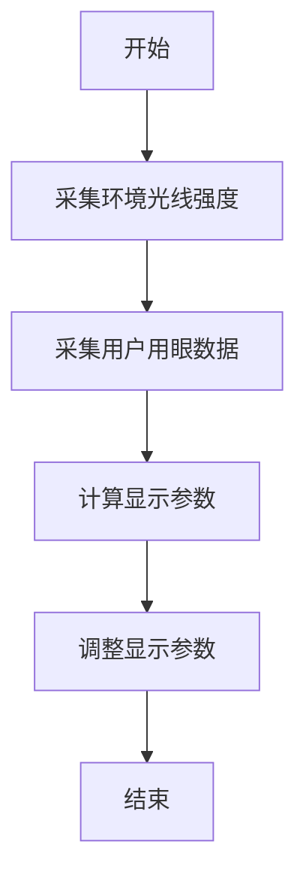
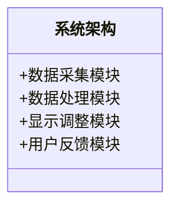
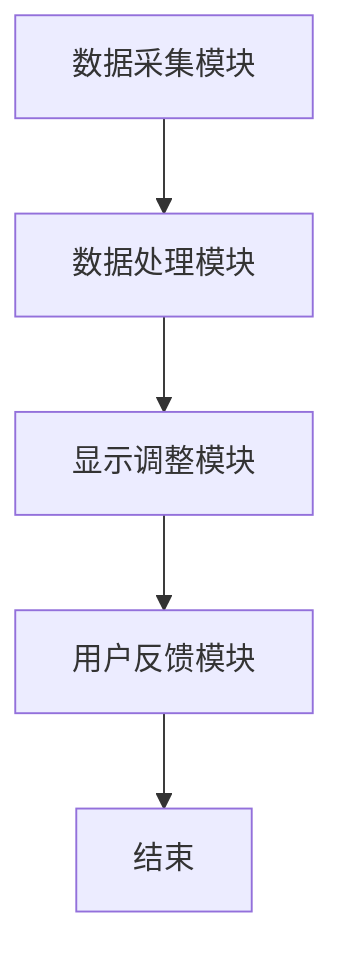
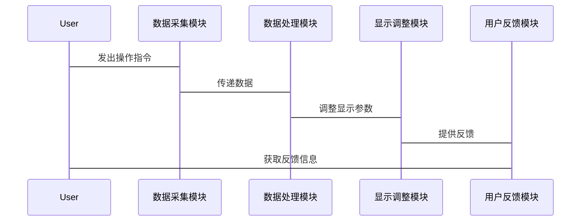

                 


# AI Agent在智能眼镜中的视力保护功能

## 关键词：AI Agent, 智能眼镜, 视力保护, 算法, 系统设计, 项目实战

## 摘要：本文详细探讨了AI Agent在智能眼镜中的视力保护功能。从背景与概念、技术原理、系统设计到项目实战和优化与扩展，全面分析了AI Agent如何通过智能算法和系统设计实现视力保护功能。通过具体案例分析和代码实现，深入解读了AI Agent在智能眼镜中的应用及其对用户视力保护的实际意义。

---

# 第一部分: AI Agent在智能眼镜中的视力保护功能概述

## 第1章: 背景与概念

### 1.1 视力保护的重要性
现代人由于长时间使用电子设备，视力问题日益严重。智能眼镜作为一种结合了计算能力和便携性的设备，可以在用户不改变生活习惯的情况下，通过AI Agent实时监测和调整，帮助用户保护视力。

#### 1.1.1 现代人视力问题的现状
- 长时间使用电子设备导致视疲劳、近视等问题。
- 传统眼镜无法主动调整以适应不同使用场景。

#### 1.1.2 智能眼镜在视力保护中的作用
- 实时监测用户的用眼状态。
- 自动调整显示参数，如亮度、对比度等。
- 提供健康建议和提醒。

#### 1.1.3 AI Agent在智能眼镜中的应用前景
- AI Agent能够通过机器学习算法优化视力保护功能。
- 未来将实现更智能化、个性化的视力健康管理。

### 1.2 AI Agent的基本概念
AI Agent是一种智能代理，能够感知环境、自主决策并执行任务。

#### 1.2.1 什么是AI Agent
- AI Agent是具有智能的实体，能够与环境交互。
- 具备感知、决策、执行和学习能力。

#### 1.2.2 AI Agent的核心功能与特点
- **感知**：通过传感器获取环境数据。
- **决策**：基于数据进行分析和决策。
- **执行**：根据决策执行操作。
- **学习**：通过反馈优化自身行为。

#### 1.2.3 AI Agent与传统算法的对比
| 对比点        | AI Agent                          | 传统算法                          |
|---------------|-----------------------------------|-----------------------------------|
| 自适应能力    | 强，能够学习和优化                | 弱，依赖预设规则和参数            |
| 复杂性        | 高，涉及多个模块协同工作          | 低，通常针对单一任务设计          |
| 应用场景      | 适用于复杂、动态的环境            | 适用于简单、静态的环境            |

### 1.3 智能眼镜的结构与功能
智能眼镜是一种结合了计算机视觉和人工智能技术的可穿戴设备。

#### 1.3.1 智能眼镜的基本组成
- 显示屏：用于显示信息。
- 传感器：包括光线传感器、眼动追踪传感器等。
- 处理器：用于运行AI Agent算法。
- 电池：提供电力支持。

#### 1.3.2 智能眼镜的主要功能模块
| 功能模块       | 描述                                   |
|----------------|--------------------------------------|
| 数据采集模块   | 采集用户的使用数据，如光线强度、眼动数据等。 |
| 数据处理模块   | 对采集到的数据进行分析和处理。       |
| 显示调整模块   | 根据分析结果调整显示屏参数，如亮度、对比度等。 |
| 用户反馈模块   | 提供健康建议和提醒。                 |

#### 1.3.3 智能眼镜的用户交互方式
- **语音交互**：用户可以通过语音命令与智能眼镜互动。
- **手势交互**：通过手势操作控制设备。
- **眼球追踪**：通过眼球运动实现界面交互。

### 1.4 本章小结
本章介绍了AI Agent的基本概念及其在智能眼镜中的应用，重点分析了智能眼镜的结构和功能模块。接下来将从技术原理的角度，详细探讨AI Agent在视力保护中的具体实现。

---

# 第二部分: AI Agent的技术原理

## 第2章: AI Agent的核心算法原理

### 2.1 视力保护算法的基本原理
AI Agent通过分析用户的用眼数据，优化显示参数，从而达到保护视力的目的。

#### 2.1.1 视力保护的数学模型
视力保护的核心是优化显示参数，使得眼睛在不同光照条件下都能保持舒适的状态。

##### 公式推导
假设显示亮度 \( B \) 与环境光线强度 \( L \) 的关系可以表示为：
$$ B = k \cdot L + c $$
其中，\( k \) 是比例系数，\( c \) 是常数项。

通过机器学习算法，可以训练出最优的 \( k \) 和 \( c \)，使得用户在不同光照条件下都能获得最佳的显示效果。

#### 2.1.2 视力保护算法的流程图


#### 2.1.3 视力保护算法的实现步骤
1. 采集环境光线强度和用户用眼数据。
2. 计算显示参数，如亮度、对比度等。
3. 调整显示参数，优化用户视觉体验。

### 2.2 AI Agent的算法实现
AI Agent的核心是机器学习算法，用于实时优化显示参数。

#### 2.2.1 基于机器学习的视力保护算法
- 使用回归算法预测最佳显示参数。
- 通过神经网络优化显示参数。

#### 2.2.2 算法的数学模型与公式
以下是回归算法的数学模型：
$$ y = \beta_0 + \beta_1 x + \epsilon $$
其中，\( y \) 是目标变量（显示参数），\( x \) 是自变量（环境光线强度），\( \beta_0 \) 和 \( \beta_1 \) 是回归系数。

#### 2.2.3 算法的优化与改进
- 引入反馈机制，实时调整显示参数。
- 使用深度学习算法提高预测精度。

#### 2.2.4 算法实现的代码示例
```python
import numpy as np
from sklearn.linear_model import LinearRegression

# 采集数据
X = np.array([[1], [2], [3], [4], [5]])  # 环境光线强度
y = np.array([2, 3, 5, 7, 10])          # 目标显示参数

# 训练模型
model = LinearRegression()
model.fit(X, y)

# 预测显示参数
predicted = model.predict(X)
print(predicted)
```

### 2.3 本章小结
本章详细介绍了AI Agent的核心算法原理，包括数学模型和算法实现。接下来将从系统设计的角度，探讨智能眼镜的实现细节。

---

# 第三部分: 智能眼镜的系统设计

## 第3章: 系统架构与功能设计

### 3.1 系统架构设计
智能眼镜的系统架构包括数据采集、数据处理、显示调整和用户反馈四个模块。

#### 3.1.1 系统模块划分
- 数据采集模块：采集环境光线强度和用户用眼数据。
- 数据处理模块：分析数据，计算显示参数。
- 显示调整模块：调整显示屏参数。
- 用户反馈模块：提供健康建议和提醒。

#### 3.1.2 系统架构的类图


#### 3.1.3 系统架构的流程图


### 3.2 功能设计与实现
智能眼镜的功能设计需要考虑用户体验和功能实现。

#### 3.2.1 用户界面设计
- 提供简洁直观的用户界面。
- 支持多种交互方式，如语音、手势和眼球追踪。

#### 3.2.2 功能模块的实现
- 数据采集模块：使用光线传感器和眼动追踪传感器。
- 数据处理模块：基于机器学习算法优化显示参数。
- 显示调整模块：实时调整亮度、对比度等参数。
- 用户反馈模块：提供健康建议和提醒。

#### 3.2.3 功能模块的交互流程


### 3.3 接口设计与实现
系统设计需要考虑接口的标准化和易用性。

#### 3.3.1 系统接口的设计
- 数据接口：用于数据采集和传输。
- 显示接口：用于调整显示屏参数。
- 用户反馈接口：用于提供健康建议和提醒。

#### 3.3.2 接口实现的代码示例
```python
# 数据接口
class LightSensor:
    def get_light_intensity(self):
        # 返回环境光线强度
        pass

# 显示接口
class Display:
    def set_brightness(self, value):
        # 设置亮度
        pass

# 用户反馈接口
class UserFeedback:
    def provide_recommendation(self, recommendation):
        # 提供健康建议
        pass
```

### 3.4 本章小结
本章详细探讨了智能眼镜的系统架构和功能设计，重点分析了各模块的交互流程。接下来将从项目实战的角度，展示如何实现这些功能。

---

# 第四部分: 项目实战与优化

## 第4章: 项目实战

### 4.1 项目环境的搭建
项目实战需要搭建完整的开发环境。

#### 4.1.1 开发工具的安装与配置
- 安装Python和必要的库（如numpy、scikit-learn）。
- 安装智能眼镜开发工具包。

#### 4.1.2 项目代码的下载与安装
- 下载项目代码。
- 安装依赖项。

#### 4.1.3 环境的测试与验证
- 测试光线传感器和显示接口。
- 验证机器学习算法的准确性。

### 4.2 核心功能的实现
项目实战的核心是实现AI Agent的视力保护功能。

#### 4.2.1 用户界面设计与实现
- 设计简洁直观的用户界面。
- 实现语音、手势和眼球追踪交互方式。

#### 4.2.2 数据采集与处理
- 使用光线传感器采集环境光线强度。
- 使用眼动追踪传感器采集用户用眼数据。

#### 4.2.3 显示参数的调整
- 基于机器学习算法优化显示参数。
- 实时调整亮度、对比度等参数。

#### 4.2.4 用户反馈与提醒
- 提供健康建议和提醒。
- 支持用户自定义反馈方式。

### 4.3 项目实现的代码示例
以下是一个完整的项目实现示例：

#### 4.3.1 项目代码
```python
import numpy as np
from sklearn.linear_model import LinearRegression

class LightSensor:
    def get_light_intensity(self):
        # 模拟环境光线强度
        return np.random.randint(1, 100)

class Display:
    def set_brightness(self, value):
        # 设置亮度
        print(f"设置亮度为：{value}")

class AI-Agent:
    def __init__(self):
        self.model = LinearRegression()

    def train_model(self, X, y):
        self.model.fit(X, y)

    def predict_brightness(self, light_intensity):
        # 预测亮度
        return self.model.predict(light_intensity)

# 主程序
if __name__ == "__main__":
    sensor = LightSensor()
    display = Display()
    ai_agent = AI-Agent()

    # 采集数据
    X = np.array([[sensor.get_light_intensity()] for _ in range(10)])
    y = np.array([2, 3, 5, 7, 10, 12, 15, 18, 20, 22])

    ai_agent.train_model(X, y)

    # 预测并调整亮度
    light_intensity = sensor.get_light_intensity()
    predicted_brightness = ai_agent.predict_brightness([[light_intensity]])
    display.set_brightness(predicted_brightness[0])
```

### 4.4 项目实战的小结
本章通过具体的项目实战，展示了AI Agent在智能眼镜中的实现过程。接下来将从优化与扩展的角度，进一步提升系统的性能和用户体验。

---

# 第五部分: 优化与扩展

## 第5章: 优化与扩展

### 5.1 算法优化
算法优化是提升系统性能的关键。

#### 5.1.1 算法优化策略
- 引入反馈机制，实时调整显示参数。
- 使用更复杂的机器学习算法（如深度学习）。

#### 5.1.2 优化后的算法实现
```python
from sklearn.ensemble import RandomForestRegressor

class AI-Agent:
    def __init__(self):
        self.model = RandomForestRegressor()

    def train_model(self, X, y):
        self.model.fit(X, y)

    def predict_brightness(self, light_intensity):
        return self.model.predict(light_intensity)
```

### 5.2 系统扩展
系统扩展可以增加更多的功能和应用场景。

#### 5.2.1 新功能的添加
- 健康监测：监测用户的眼部健康状况。
- 多设备联动：与其他智能设备联动，提供更全面的健康服务。

#### 5.2.2 新功能的实现
```python
class HealthMonitor:
    def monitor_eye_health(self):
        # 监测眼部健康状况
        pass

class SmartGlasses:
    def __init__(self):
        self.ai_agent = AI-Agent()
        self.health_monitor = HealthMonitor()

    def adjust_display(self):
        light_intensity = self.ai_agent.predict_brightness()
        self.display.set_brightness(light_intensity)
        self.health_monitor.monitor_eye_health()
```

### 5.3 本章小结
本章通过优化算法和扩展系统功能，进一步提升了智能眼镜的性能和用户体验。接下来将总结全文，并展望未来的发展方向。

---

# 第六部分: 总结与展望

## 第6章: 总结与展望

### 6.1 总结
本文详细探讨了AI Agent在智能眼镜中的视力保护功能，从技术原理到系统设计，再到项目实战和优化，全面分析了AI Agent的应用和实现。

### 6.2 未来展望
- 更多智能化功能的开发。
- 更广泛的应用场景。
- 更高的用户体验和满意度。

---

# 作者：AI天才研究院/AI Genius Institute & 禅与计算机程序设计艺术 /Zen And The Art of Computer Programming

