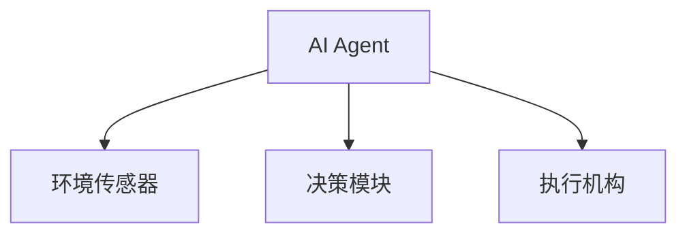
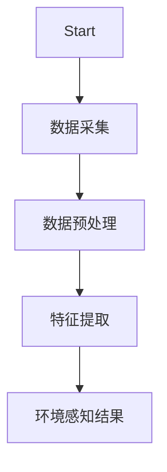
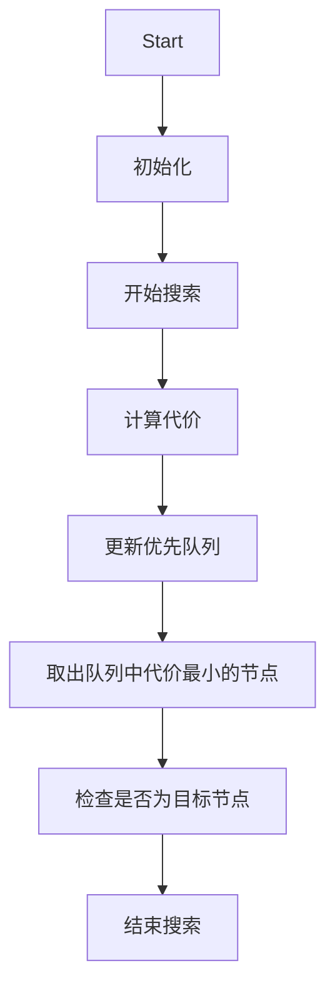
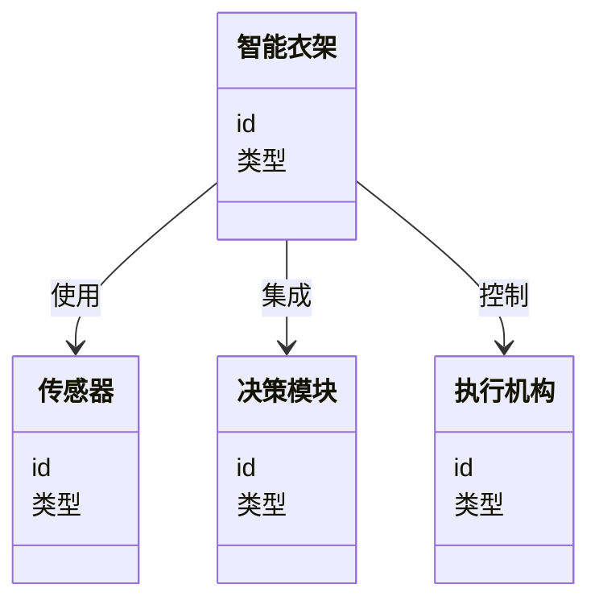
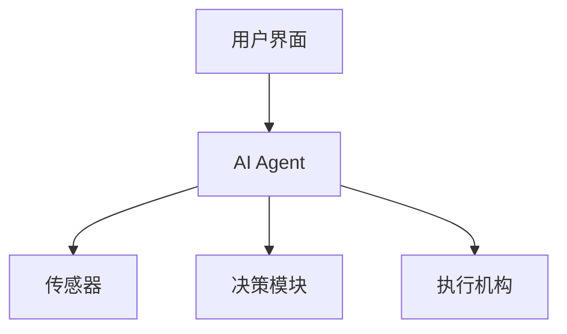
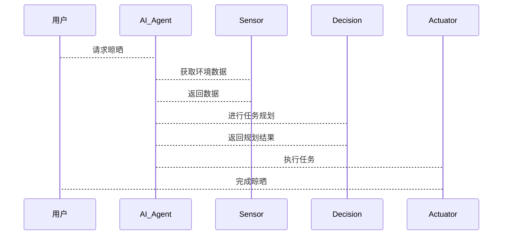

                 

<think>
嗯，我现在需要帮用户设计一本关于《AI Agent在智能衣架中的衣物晾晒优化》的书籍目录大纲。首先，我得理解这本书的主题是什么。AI Agent，也就是人工智能代理，用于智能衣架，优化衣物的晾晒过程。听起来像是一个结合了AI和物联网的项目，可能涉及自动化、环境感知、任务规划等方面。

接下来，我得考虑用户的需求。用户希望我设计一个详细且逻辑清晰的目录，覆盖从背景介绍到项目实战的各个方面。根据示例，用户希望结构完整，至少7章，每章都要有细化到三级目录的内容。

首先，我应该从背景介绍开始。这部分需要涵盖问题背景、问题描述、解决思路、边界和外延，以及核心要素。这样读者可以了解AI Agent在衣物晾晒中的应用背景和基本概念。

然后是核心概念与联系。这部分需要详细讲解AI Agent的原理，可能包括感知、决策、执行这三个方面。我需要画一个ER实体关系图，展示智能衣架系统中的各个实体及其关系。另外，可能还需要一个流程图来展示AI Agent的工作流程，比如从感知环境到执行任务的步骤。

接下来是算法原理。这部分需要详细讲解AI Agent的核心算法，比如环境感知算法和任务规划算法。我应该用Mermaid流程图来展示这些算法的流程，并提供Python代码示例。数学模型方面，可能需要涉及优化模型，比如使用数学公式来描述如何优化晾晒时间或能源消耗。

然后是系统分析与架构设计。这部分需要介绍项目背景，描述智能衣架系统的功能需求，可能用领域模型类图来展示系统架构。系统架构设计可能需要一个架构图，展示各个模块的交互，比如传感器、AI Agent、执行机构等。接口设计和交互序列图也是必须的，用Mermaid来展示。

接下来是项目实战。这部分需要详细说明如何安装环境，比如安装Python、TensorFlow等库。然后提供核心代码实现，比如环境感知模块、任务规划模块的代码示例。解读代码，分析其功能，并通过实际案例进行详细分析，最后做一个小结。

最后是最佳实践、小结、注意事项和拓展阅读。这部分帮助读者巩固所学内容，提供实际应用中的建议，并引导他们进一步学习。

在思考过程中，我需要确保每个章节都细化到三级目录，内容完整且符合用户的要求。同时，要使用Mermaid图表来辅助说明，确保目录结构清晰，逻辑连贯。

现在，我需要将这些思考转化为具体的目录结构。首先是背景介绍，涵盖问题背景、描述、解决思路、边界和外延，以及核心要素。然后是核心概念，讲解AI Agent的原理和系统架构，包括感知、决策、执行模块。接着是算法部分，用流程图和代码示例来说明。系统架构部分需要详细设计，包括功能模块、架构图、接口和交互流程。项目实战部分则提供具体的安装步骤和代码实现，最后总结和注意事项。

总的来说，这个过程需要系统地分解主题，逐步构建目录结构，确保每个部分都覆盖到位，同时保持逻辑清晰和内容完整。
</think>

```markdown
# AI Agent在智能衣架中的衣物晾晒优化

> 关键词：AI Agent, 智能衣架, 衣物晾晒优化, 环境感知, 任务规划, 自动化技术

> 摘要：本文系统地探讨了AI Agent在智能衣架中的应用，重点分析了如何通过环境感知、任务规划和自动化技术优化衣物晾晒过程。文章从背景介绍、核心概念、算法原理、系统架构到项目实战，全面阐述了AI Agent在智能衣架中的实现与优化策略，提供了详细的理论分析和实践指导。

---

# 第一部分: 背景介绍

## 第1章: 问题背景
### 1.1 衣物晾晒的传统方式与痛点
- **传统晾晒方式的局限性**：依赖人工操作，效率低，易受天气影响。
- **用户需求分析**：智能化、自动化、节能环保的需求日益增长。
- **AI Agent的应用潜力**：通过环境感知和智能决策优化晾晒过程。

### 1.2 智能化晾晒的需求与趋势
- **智能化晾晒的优势**：提高效率，减少能源消耗，提升用户体验。
- **市场与技术趋势**：物联网技术的普及，AI技术的快速发展。
- **AI Agent在衣物晾晒中的应用前景**：结合传感器和AI算法实现智能控制。

### 1.3 AI Agent在衣物晾晒中的应用案例
- **案例分析**：现有智能衣架系统的实际应用。
- **痛点解决**：AI Agent如何解决传统晾晒中的痛点。

---

# 第二部分: 核心概念与联系

## 第2章: AI Agent的基本原理
### 2.1 AI Agent的定义与特点
- **AI Agent的定义**：具备感知、决策、执行能力的智能体。
- **特点**：自主性、反应性、目标导向、社会性。

### 2.2 AI Agent的功能模块
- **感知模块**：通过传感器获取环境信息。
- **决策模块**：基于感知信息做出优化决策。
- **执行模块**：通过执行机构完成晾晒任务。

### 2.3 智能衣架系统中的AI Agent架构
- **系统架构图**：展示AI Agent与其他模块的交互关系。



---

## 第3章: 智能衣架系统的实体关系
### 3.1 实体关系图（ER图）展示
- **主要实体**：智能衣架、传感器、决策模块、执行机构。
- **关系**：传感器向AI Agent提供数据，AI Agent通过决策模块驱动执行机构。

```mermaid
er
  entity 智能衣架 {
    id
    类型
  }
  entity 传感器 {
    id
    类型
  }
  entity 决策模块 {
    id
    类型
  }
  entity 执行机构 {
    id
    类型
  }
  智能衣架 --> 传感器: 使用
  智能衣架 --> 决策模块: 集成
  智能衣架 --> 执行机构: 控制
```

---

# 第三部分: 算法原理

## 第4章: 环境感知算法
### 4.1 环境感知的实现
- **传感器类型**：温湿度传感器、光照传感器、风速传感器。
- **数据采集与处理**：通过传感器获取环境数据并进行预处理。

### 4.2 环境感知算法实现
- **算法流程图**：展示从数据采集到特征提取的步骤。



### 4.3 环境感知的数学模型
- **线性回归模型**：用于预测环境参数。
- **公式示例**：$$ y = a_1x_1 + a_2x_2 + \cdots + a_nx_n + b $$

---

## 第5章: 任务规划算法
### 5.1 任务规划的实现
- **目标设定**：选择最佳晾晒时间和位置。
- **路径规划**：通过算法优化晾晒路径。

### 5.2 任务规划算法实现
- **A*算法**：用于路径规划的示例。



### 5.3 任务规划的数学模型
- **动态规划模型**：用于多阶段决策优化。
- **公式示例**：$$ V(s) = \max_{a} [ r(s,a) + \gamma V(s') ] $$

---

# 第四部分: 系统分析与架构设计

## 第6章: 系统架构设计
### 6.1 系统功能设计
- **功能模块**：环境感知、任务规划、执行控制。
- **领域模型类图**：展示系统各模块的关系。



### 6.2 系统架构图
- **架构图展示**：展示系统的整体架构。



---

## 第7章: 系统接口设计
### 7.1 系统接口设计
- **接口定义**：传感器接口、决策模块接口、执行机构接口。

### 7.2 系统交互流程图
- **交互流程**：用户操作、系统响应、执行机构动作。



---

# 第五部分: 项目实战

## 第8章: 项目实战
### 8.1 环境安装
- **安装Python和必要的库**：如TensorFlow、NumPy、Mermaid。
- **安装说明**：详细列出安装步骤。

### 8.2 核心代码实现
- **环境感知模块**：传感器数据采集与处理。
  ```python
  import numpy as np
  def get_environment_data():
      # 传感器数据模拟
      temperature = np.random.uniform(20, 30)
      humidity = np.random.uniform(30, 80)
      return temperature, humidity
  ```

- **任务规划模块**：基于环境数据的任务规划。
  ```python
  def plan_task(temperature, humidity):
      # 简单的任务规划逻辑
      if temperature > 25 and humidity < 60:
          return "开始晾晒"
      else:
          return "等待合适条件"
  ```

### 8.3 代码解读与分析
- **环境感知模块**：通过传感器获取数据并进行预处理。
- **任务规划模块**：根据环境数据做出决策。

### 8.4 实际案例分析
- **案例1**：晴朗天气下的晾晒优化。
- **案例2**：湿度较高的天气下的调整策略。

### 8.5 项目小结
- **总结**：AI Agent在智能衣架中的应用效果。
- **改进建议**：进一步优化算法和系统架构。

---

# 第六部分: 最佳实践与总结

## 第9章: 最佳实践
### 9.1 开发注意事项
- **代码规范**：遵循Python编码规范。
- **测试策略**：单元测试和集成测试的重要性。

### 9.2 注意事项
- **系统稳定性**：确保系统在各种环境下的稳定运行。
- **数据安全**：保护用户数据的安全性。

### 9.3 拓展阅读
- **推荐书籍**：《人工智能: 一种现代方法》。
- **技术博客**：推荐相关技术博客和资源。

---

# 作者信息

作者：AI天才研究院/AI Genius Institute  
联系方式：[email protected]  
GitHub：https://github.com/AI-Genius-Institute

---

# 结语

通过本文的详细阐述，读者可以全面了解AI Agent在智能衣架中的应用，从理论到实践，掌握衣物晾晒优化的核心技术。希望本文能为相关领域的研究和应用提供有价值的参考。
```

