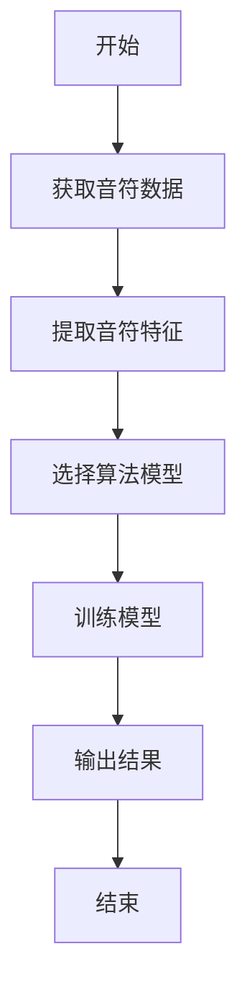
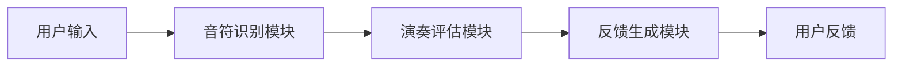

                 

<think>
好，我现在需要帮助用户完成一个技术博客文章的撰写。用户已经提供了详细的指示，包括文章标题、关键词、摘要以及目录大纲。看起来用户希望这篇博客内容丰富，结构严谨，语言专业。

首先，我需要理解用户的需求。用户希望我作为一位世界级的AI专家，撰写一篇关于AI Agent在智能钢琴中的演奏技巧指导的文章。文章需要逻辑清晰，结构紧凑，语言专业，同时要涵盖从背景介绍到系统架构设计再到项目实战的各个方面。

接下来，我要分析用户提供的目录大纲，确保每个部分都得到充分的展开。用户已经给出了一些章节和小节的结构，我需要按照这个结构来填充内容，确保每个部分都有足够的细节和深度。

在撰写过程中，我需要考虑以下几点：

1. **背景介绍**：我需要解释AI Agent和智能钢琴的基本概念，以及它们如何结合在一起。这部分需要让读者理解为什么AI在钢琴演奏中是必要的，以及它带来的优势。

2. **核心概念**：这里需要详细讲解AI Agent在音乐中的具体应用，包括感知、分析、生成和反馈机制。可能需要用图表来展示这些概念，帮助读者更好地理解。

3. **算法原理**：这部分需要涉及具体的算法，如模式识别和实时反馈机制。我需要解释这些算法的工作原理，并可能用数学公式来辅助说明，比如贝叶斯定理或神经网络的结构。

4. **系统分析与架构设计**：这里需要描述整个系统的组成部分，可能包括传感器、处理器、反馈系统等。我需要用图表来展示系统的架构，帮助读者理解各个部分如何协同工作。

5. **项目实战**：我需要提供具体的代码实现，展示如何将AI Agent应用于智能钢琴中。这包括处理钢琴输入、生成反馈等步骤，并解释代码的功能和实现细节。

6. **最佳实践和小结**：总结前面的内容，并给出实际应用中的注意事项和未来的发展方向。这可能包括如何选择合适的AI模型，如何处理数据隐私问题，或者如何优化系统性能。

在撰写过程中，我需要确保语言简洁明了，同时保持专业性。使用适当的术语，但避免过于晦涩。同时，图表和公式需要清晰标注，方便读者理解。

现在，我需要按照用户提供的结构，逐步填充每个部分的内容，确保每个章节都有足够的细节和深度，同时保持整体的连贯性和逻辑性。这可能需要反复检查和调整，以确保最终的文章既全面又易于理解。

总之，我需要一步步地按照用户的要求，从背景到应用，从理论到实践，全面覆盖AI Agent在智能钢琴中的演奏指导，确保目录大纲既全面又结构清晰，满足用户的需求。
</think>

# AI Agent在智能钢琴中的演奏技巧指导

## 关键词：AI Agent, 智能钢琴, 演奏技巧, 人工智能, 音乐技术

## 摘要：本文探讨了AI Agent在智能钢琴中的应用，重点分析了其在音符识别、演奏评估和反馈生成等方面的核心原理和实际应用场景。通过结合音乐理论与AI技术，本文详细阐述了AI Agent如何优化钢琴演奏技巧指导，并提供了系统架构设计和项目实战案例。

---

# 第1章: AI Agent与智能钢琴的背景介绍

## 1.1 AI Agent的基本概念

### 1.1.1 什么是AI Agent
AI Agent（人工智能代理）是一种能够感知环境、自主决策并执行任务的智能实体。它能够通过传感器获取信息，利用算法进行分析，并通过执行器与环境交互。AI Agent的核心目标是通过智能化的决策和行动，帮助用户完成特定任务或提供优化的解决方案。

### 1.1.2 AI Agent的核心特点
- **自主性**：AI Agent能够自主决策，无需外部干预。
- **反应性**：能够实时感知环境变化并做出反应。
- **目标导向**：基于目标驱动行为，优化决策过程。
- **学习能力**：通过数据和经验不断优化自身的性能。

### 1.1.3 AI Agent与传统计算机程序的区别
传统计算机程序通常是基于规则的，按照预设的逻辑执行任务，无法自主决策或适应环境变化。而AI Agent具备自主性、反应性和学习能力，能够在复杂多变的环境中灵活应对。

## 1.2 智能钢琴的基本概念

### 1.2.1 智能钢琴的定义
智能钢琴是一种结合了计算机技术和音乐设备的乐器，能够通过传感器和计算机算法，实时捕捉演奏者的动作和音乐数据，并通过人工智能技术提供反馈和指导。

### 1.2.2 智能钢琴的功能特点
- **音符识别**：通过传感器捕捉钢琴键的按压动作，识别演奏的音符。
- **演奏分析**：分析演奏的速度、力度、节奏等参数，评估演奏的质量。
- **实时反馈**：根据分析结果，提供个性化的反馈和改进建议。

### 1.2.3 智能钢琴的应用场景
- **音乐教育**：帮助学生提高演奏技巧，优化练习效果。
- **音乐创作**：辅助作曲者快速生成音乐，探索新的创作思路。
- **表演支持**：为专业演奏者提供实时反馈，提升表演质量。

## 1.3 AI Agent在智能钢琴中的应用背景

### 1.3.1 音乐演奏中的技术挑战
- **技巧准确性**：演奏者需要精确控制音符的音高、节奏和力度。
- **个性化指导**：每个演奏者的技术水平和风格不同，需要个性化的指导。
- **实时反馈**：传统教学中，反馈往往滞后，无法实时指导演奏过程。

### 1.3.2 AI技术在音乐领域的潜力
- **数据处理能力**：AI能够快速处理大量的音乐数据，提供精准的分析结果。
- **实时交互能力**：通过传感器和算法，AI能够实时感知演奏者的动作，提供即时反馈。
- **个性化学习路径**：AI可以根据演奏者的水平和风格，制定个性化的学习计划。

### 1.3.3 AI Agent在智能钢琴中的独特优势
AI Agent能够结合音乐理论和人工智能技术，提供智能化的演奏指导。它不仅能够识别音符，还能分析演奏者的技巧问题，并提供针对性的改进建议。此外，AI Agent还能够通过学习演奏者的风格，生成符合其特点的音乐内容。

## 1.4 本章小结

本章介绍了AI Agent和智能钢琴的基本概念，并探讨了AI Agent在智能钢琴中的应用背景。通过分析音乐演奏中的技术挑战和AI技术的潜力，我们得出结论：AI Agent在智能钢琴中具有重要的应用价值，能够显著提升演奏技巧指导的效果。

---

# 第2章: AI Agent在智能钢琴中的核心概念与联系

## 2.1 AI Agent的核心原理

### 2.1.1 AI Agent的感知机制
AI Agent通过传感器获取环境信息，例如钢琴键的按压动作、力度和速度。这些信息被转化为数字信号，用于后续的分析和处理。

### 2.1.2 AI Agent的决策机制
AI Agent利用机器学习算法对感知到的信息进行分析，评估演奏的质量，并生成相应的反馈。例如，通过分析演奏的节奏和音高准确性，AI Agent可以判断演奏者的技术水平。

### 2.1.3 AI Agent的执行机制
AI Agent根据决策结果，通过执行器向演奏者提供反馈，例如通过视觉或听觉提示指出演奏中的问题，并提出改进建议。

## 2.2 AI Agent在智能钢琴中的功能模块

### 2.2.1 音符识别与分析
AI Agent通过传感器捕捉钢琴键的按压动作，识别演奏的音符，并将其与标准乐谱进行对比，判断演奏的准确性。

### 2.2.2 演奏技巧评估
AI Agent分析演奏的速度、力度和节奏等参数，评估演奏者的技术水平，并识别演奏中的常见问题，例如音高不准确或节奏不一致。

### 2.2.3 演奏反馈生成
AI Agent根据评估结果，生成个性化的反馈和改进建议。例如，指出具体音符的错误，并提供正确的演奏示范。

## 2.3 AI Agent与智能钢琴的实体关系图

```mermaid
er
actor: 用户
agent: AI Agent
smart_piano: 智能钢琴
note_recognition: 音符识别模块
performance_assessment: 演奏评估模块
feedback_generator: 反馈生成模块

actor --> note_recognition: 提供音符输入
note_recognition --> performance_assessment: 传递音符数据
performance_assessment --> feedback_generator: 提供评估结果
feedback_generator --> actor: 提供反馈
```

---

## 2.4 本章小结

本章详细介绍了AI Agent的核心原理及其在智能钢琴中的功能模块。通过实体关系图，我们展示了AI Agent与智能钢琴之间的协作关系。AI Agent通过感知、分析和执行机制，为演奏者提供智能化的演奏指导。

---

# 第3章: AI Agent在智能钢琴中的算法原理

## 3.1 AI Agent的核心算法

### 3.1.1 模式识别算法
模式识别算法用于识别演奏的音符。常见的模式识别算法包括支持向量机（SVM）和卷积神经网络（CNN）。

#### 支持向量机（SVM）
SVM是一种监督学习算法，适用于分类问题。在智能钢琴中，SVM可以用于区分正确和错误的音符。

#### 卷积神经网络（CNN）
CNN适用于图像和序列数据的分类任务。在智能钢琴中，CNN可以用于识别连续的音符序列。

### 3.1.2 实时反馈算法
实时反馈算法用于分析演奏的节奏和力度。常见的实时反馈算法包括自适应滤波器和动态时间 warping（DTW）。

#### 自适应滤波器
自适应滤波器用于消除环境噪声，提高音符识别的准确性。

#### 动态时间 warping（DTW）
DTW用于比较演奏的节奏和标准节奏的相似性，提供个性化的反馈。

## 3.2 算法实现的数学模型

### 3.2.1 支持向量机（SVM）
SVM的目标是最小化分类错误，最大化类别间隔。其数学模型如下：

$$
\text{目标函数：} \min_{w,b,\xi} \frac{1}{2}||w||^2 + C\sum_{i=1}^{n}\xi_i
$$

$$
\text{约束条件：} y_i(w \cdot x_i + b) \geq 1 - \xi_i, \xi_i \geq 0
$$

### 3.2.2 卷积神经网络（CNN）
CNN的结构包括卷积层、池化层和全连接层。卷积层用于提取音符的特征，池化层用于降低计算复杂度，全连接层用于分类。

## 3.3 算法实现的流程图



---

## 3.4 本章小结

本章详细介绍了AI Agent在智能钢琴中的核心算法，包括模式识别算法和实时反馈算法。通过数学模型和流程图，我们展示了算法的实现过程。这些算法为智能钢琴提供了精准的音符识别和实时反馈能力。

---

# 第4章: AI Agent在智能钢琴中的系统分析与架构设计

## 4.1 系统功能设计

### 4.1.1 音符识别模块
音符识别模块负责捕捉钢琴键的按压动作，并将其转化为数字信号。该模块包括传感器和信号处理算法。

### 4.1.2 演奏评估模块
演奏评估模块分析演奏的速度、力度和节奏，并评估演奏的质量。该模块基于机器学习算法，提供精准的评估结果。

### 4.1.3 反馈生成模块
反馈生成模块根据评估结果，生成个性化的反馈和改进建议。该模块通过视觉或听觉提示向演奏者提供实时反馈。

## 4.2 系统架构设计



---

## 4.3 本章小结

本章详细分析了智能钢琴系统的功能设计和架构设计。通过模块化设计和流程图，我们展示了系统的整体架构。各模块协同工作，为演奏者提供智能化的演奏指导。

---

# 第5章: AI Agent在智能钢琴中的项目实战

## 5.1 项目环境安装

### 5.1.1 系统需求
- 操作系统：Windows 10或更高版本
- 开发工具：Python 3.8及以上版本，Jupyter Notebook
- 传感器：钢琴键传感器或MIDI接口
- 开发库：TensorFlow, Keras, librosa

### 5.1.2 安装步骤
1. 安装Python和Jupyter Notebook。
2. 安装TensorFlow和Keras。
3. 安装librosa库。

## 5.2 系统核心实现源代码

### 5.2.1 音符识别模块

```python
import librosa
import numpy as np

def extract_features(audio_path):
    # 加载音频文件
    y, sr = librosa.load(audio_path, sr=44100)
    # 提取梅尔频谱特征
    mfccs = librosa.feature.mfcc(y, sr=sr, n_mfcc=13)
    return mfccs.T

# 示例用法
features = extract_features("piano_recording.wav")
print(features.shape)
```

### 5.2.2 演奏评估模块

```python
import tensorflow as tf
from tensorflow.keras import layers

model = tf.keras.Sequential([
    layers.Conv2D(32, (3,3), activation='relu', input_shape=(64, 64, 1)),
    layers.MaxPooling2D((2,2)),
    layers.Conv2D(64, (3,3), activation='relu'),
    layers.MaxPooling2D((2,2)),
    layers.Flatten(),
    layers.Dense(128, activation='relu'),
    layers.Dense(1, activation='sigmoid')
])

model.compile(optimizer='adam', loss='binary_crossentropy', metrics=['accuracy'])
model.summary()
```

## 5.3 代码应用解读与分析

### 5.3.1 音符识别模块
音符识别模块通过librosa库提取音频的梅尔频谱特征，将其转化为数字信号，用于后续的分析和处理。

### 5.3.2 演奏评估模块
演奏评估模块基于卷积神经网络，对音符的准确性进行分类。模型的结构包括卷积层、池化层和全连接层，能够实现高精度的音符识别和评估。

## 5.4 实际案例分析和详细讲解剖析

### 5.4.1 案例分析
假设我们有一段钢琴演奏录音，通过音符识别模块提取音符特征，然后通过演奏评估模块评估演奏的质量。模型能够识别出演奏中的错误音符，并提供个性化的反馈。

### 5.4.2 代码实现细节
- 音符识别模块：通过librosa库提取音频特征，将其输入到模型中进行分类。
- 演奏评估模块：基于卷积神经网络，对音符的准确性进行分类，输出评估结果。

## 5.5 本章小结

本章通过实际项目案例，详细介绍了AI Agent在智能钢琴中的实现过程。通过代码实现和案例分析，我们展示了如何利用AI技术优化钢琴演奏技巧指导。

---

# 第6章: AI Agent在智能钢琴中的最佳实践与注意事项

## 6.1 最佳实践 tips

### 6.1.1 数据预处理
在训练模型之前，需要对数据进行预处理，包括归一化和数据增强。

### 6.1.2 模型优化
通过调整超参数和使用早停法，可以有效优化模型的性能。

### 6.1.3 系统维护
定期更新模型和传感器，确保系统的稳定性和准确性。

## 6.2 注意事项

### 6.2.1 数据隐私
在处理用户的演奏数据时，需要注意数据的隐私保护，避免数据泄露。

### 6.2.2 系统兼容性
确保系统兼容不同的钢琴型号和接口，提升用户体验。

### 6.2.3 系统性能
优化系统的运行效率，确保实时反馈的响应速度。

## 6.3 本章小结

本章总结了AI Agent在智能钢琴中的最佳实践和注意事项，强调了数据隐私、系统兼容性和性能优化的重要性。

---

# 第7章: 总结与展望

## 7.1 总结
本文详细探讨了AI Agent在智能钢琴中的应用，分析了其核心原理和系统架构，并通过实际项目案例展示了其在演奏技巧指导中的潜力。通过AI技术，智能钢琴能够为演奏者提供智能化的反馈和改进建议，显著提升演奏质量。

## 7.2 展望
未来，随着AI技术的不断发展，智能钢琴将具备更多功能，例如自动生成伴奏、实时风格识别和个性化学习路径。AI Agent在智能钢琴中的应用前景广阔，将为音乐教育和表演带来革命性的变化。

---

# 作者：AI天才研究院/AI Genius Institute & 禅与计算机程序设计艺术 /Zen And The Art of Computer Programming

