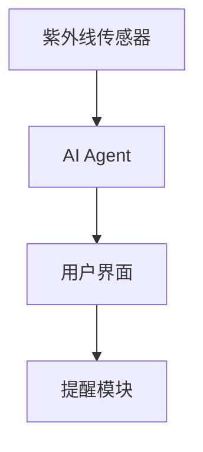

                 


# AI Agent在智能项链中的紫外线防护提醒

**关键词：** AI Agent, 紫外线防护, 智能项链, 算法, 系统架构, 项目实战

**摘要：**  
随着紫外线辐射对人类健康的威胁日益增加，紫外线防护已成为公共卫生领域的重要议题。本文探讨AI Agent在智能项链中的应用，详细介绍紫外线防护提醒系统的背景、核心算法、系统架构及项目实战。文章通过逐步分析紫外线监测技术、AI Agent算法原理、系统设计和实际案例，展示如何利用AI技术提升紫外线防护效率和用户体验。

---

## 第1章: AI Agent与紫外线防护的背景介绍

### 1.1 紫外线防护的重要性

#### 1.1.1 紫外线的危害与防护需求
紫外线（UV）是一种不可见的电磁辐射，按波长分为UV-A、UV-B和UV-C三类。其中，UV-B是导致皮肤癌的主要原因，UV-A则可能导致皮肤老化。由于臭氧层的破坏，紫外线辐射强度逐年增加，导致皮肤癌发病率上升。因此，紫外线防护已成为全球关注的健康问题。

#### 1.1.2 智能设备在紫外线防护中的作用
传统的紫外线防护措施依赖于防晒霜、帽子和遮阳伞，但这些方法存在被动性和局限性。智能设备通过实时监测紫外线强度，为用户提供主动的防护提醒，帮助用户及时采取防护措施。

#### 1.1.3 AI Agent在紫外线防护中的应用潜力
AI Agent（智能代理）是一种能够感知环境、自主决策并执行任务的智能系统。将其应用于紫外线防护，AI Agent可以实时分析紫外线数据，预测紫外线强度变化，并根据用户需求提供个性化提醒。

### 1.2 AI Agent的基本概念

#### 1.2.1 什么是AI Agent
AI Agent是一种软件或硬件系统，能够感知环境、理解需求、做出决策并执行任务。AI Agent可以是基于规则的（Rule-based）或基于机器学习的（ML-based）。

#### 1.2.2 AI Agent的核心特征
1. **自主性**：AI Agent能够自主决策，无需人工干预。
2. **反应性**：能够实时感知环境变化并做出反应。
3. **学习能力**：通过数据不断优化决策模型。

#### 1.2.3 AI Agent在智能设备中的应用场景
除了紫外线防护，AI Agent还可应用于健康监测、智能家居、自动驾驶等领域。本文主要探讨其在紫外线防护中的应用。

---

## 第2章: AI Agent与紫外线监测的结合

### 2.1 紫外线监测技术

#### 2.1.1 紫外线监测的基本原理
紫外线传感器通过光电效应测量紫外线辐射强度。传感器将紫外线强度转换为电信号，供AI Agent处理。

#### 2.1.2 紫外线传感器的类型与特点
1. **光敏电阻传感器**：价格低廉，但灵敏度较低。
2. **光电二极管传感器**：灵敏度高，适合高精度测量。
3. **硅二极管传感器**：具有高灵敏度和稳定性。

#### 2.1.3 紫外线指数的计算方法
紫外线指数（UV Index）是衡量紫外线辐射强度的指标，范围从0到11+。计算公式为：
$$ UV = \frac{S}{T} \times \cos(\theta) $$
其中，$S$是传感器测量的强度，$T$是标准传感器灵敏度，$\theta$是传感器与太阳入射角的夹角。

### 2.2 AI Agent在紫外线监测中的应用

#### 2.2.1 AI Agent如何处理紫外线数据
AI Agent接收紫外线传感器的数据，结合地理位置、天气预报等信息，预测紫外线强度变化。

#### 2.2.2 AI Agent在紫外线防护中的决策逻辑
1. **实时监测**：AI Agent持续监测紫外线强度。
2. **预测模型**：基于历史数据，预测未来紫外线强度。
3. **提醒策略**：当紫外线强度超过阈值时，向用户发送提醒。

#### 2.2.3 紫外线防护提醒的触发机制
AI Agent根据紫外线强度、用户活动时间和地理位置，动态调整提醒阈值。例如：
- 当紫外线指数超过3时，AI Agent向用户发送提醒。

---

## 第3章: 紫外线监测的数学模型

### 3.1 紫外线指数计算公式
紫外线指数是衡量紫外线辐射强度的指标，公式为：
$$ UV = \frac{S}{T} \times \cos(\theta) $$
其中，$S$是传感器测量的强度，$T$是标准传感器灵敏度，$\theta$是传感器与太阳入射角的夹角。

### 3.2 紫外线防护阈值的确定
紫外线防护阈值是AI Agent触发提醒的临界值。假设用户皮肤敏感，阈值设为3，公式为：
$$ Threshold = k \times UV_{max} $$
其中，$k$是比例常数，$UV_{max}$是最大紫外线指数。

---

## 第4章: AI Agent的算法原理

### 4.1 AI Agent的核心算法

#### 4.1.1 基于规则的AI Agent
基于规则的AI Agent通过预设规则做出决策。例如：
- 如果紫外线指数 > 3，则发送提醒。

#### 4.1.2 基于机器学习的AI Agent
基于机器学习的AI Agent通过训练数据优化决策模型。例如：
- 使用随机森林算法预测紫外线强度。

#### 4.1.3 基于深度学习的AI Agent
基于深度学习的AI Agent通过神经网络模型进行复杂决策。例如：
- 使用LSTM网络预测紫外线强度变化趋势。

### 4.2 紫外线防护提醒的算法实现

#### 4.2.1 数据输入与处理
AI Agent接收紫外线传感器、地理位置和天气预报数据。

#### 4.2.2 算法决策过程
AI Agent结合历史数据和实时数据，预测紫外线强度并决定是否触发提醒。

#### 4.2.3 输出提醒信号
AI Agent通过蓝牙或APP向用户发送提醒。

---

## 第5章: 系统架构设计

### 5.1 系统功能模块划分

#### 5.1.1 紫外线传感器模块
负责采集紫外线辐射强度数据。

#### 5.1.2 AI Agent处理模块
负责数据分析、预测和决策。

#### 5.1.3 用户交互界面模块
负责显示紫外线指数和发送提醒。

### 5.2 系统架构图


---

## 第6章: 项目实战

### 6.1 环境安装与配置

#### 6.1.1 开发环境的选择
推荐使用Python和TensorFlow框架。

#### 6.1.2 传感器驱动的安装
安装紫外线传感器驱动程序。

#### 6.1.3 AI Agent框架的搭建
使用Keras或TensorFlow搭建AI Agent模型。

### 6.2 核心代码实现

#### 6.2.1 紫外线数据采集代码
```python
import numpy as np
import pandas as pd

# 读取紫外线数据
data = pd.read_csv('uv_data.csv')
```

#### 6.2.2 AI Agent算法
```python
from tensorflow.keras.models import Sequential
from tensorflow.keras.layers import Dense

# 构建AI Agent模型
model = Sequential()
model.add(Dense(64, activation='relu', input_dim=3))
model.add(Dense(1, activation='sigmoid'))
model.compile(optimizer='adam', loss='binary_crossentropy', metrics=['accuracy'])
```

### 6.3 案例分析与解读
假设用户在户外活动，AI Agent实时监测紫外线强度。当紫外线指数超过3时，AI Agent通过APP提醒用户采取防护措施。

---

## 第7章: 总结与展望

### 7.1 项目总结
本文详细介绍了AI Agent在智能项链中的紫外线防护提醒系统的背景、算法、系统架构和项目实现。通过实际案例展示了AI技术在紫外线防护中的潜力。

### 7.2 注意事项
- 紫外线传感器应定期校准。
- AI Agent模型需要不断更新以适应环境变化。

### 7.3 拓展阅读
推荐阅读《人工智能入门》和《深度学习实战》等书籍，以深入理解AI技术的应用。

---

**作者：AI天才研究院/AI Genius Institute & 禅与计算机程序设计艺术 /Zen And The Art of Computer Programming**

