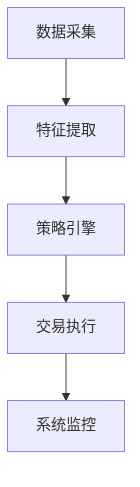

                 

<think>
好的，现在我要按照用户的要求，逐步完成《AI Agent在股票交易中的自动化策略》这篇文章的撰写。首先，我需要理解用户的需求：他们希望有一篇结构清晰、内容详尽的技术博客文章，涵盖AI Agent在股票交易中的各个方面，从基础概念到算法实现，再到系统设计和实战案例。文章需要使用专业的技术语言，同时逻辑清晰，每一步都要详细分析，确保读者能够一步步理解和掌握相关知识。

首先，我会从文章的结构入手。根据用户提供的大纲，文章分为几个主要部分：概述、技术基础、核心算法、系统架构、实战项目和总结展望。每个部分下又分为若干小节，内容涵盖广泛，包括AI Agent的基本概念、机器学习、自然语言处理、强化学习、系统架构设计以及具体的实战代码等。

接下来，我会逐一完成每个章节的内容。首先是第一章，AI Agent与股票交易的概述。我需要先定义AI Agent，解释其核心特征，然后对比传统交易策略，说明AI Agent的优势。在股票交易部分，我会介绍市场的基本运作机制、交易类型以及自动化交易的特点。之后，我会探讨AI Agent在股票交易中的应用前景，包括其优势、应用案例以及面临的挑战。这部分内容需要简洁明了，帮助读者建立基础认知。

第二章是机器学习基础。我会从机器学习的基本概念开始，包括定义、分类和在股票交易中的应用。然后，我会简要介绍几种常用的机器学习算法，如线性回归、支持向量机、随机森林和神经网络，并说明它们在股票分析中的应用。接下来是时间序列分析，这部分是股票预测的重要基础，我会解释时间序列的基本特征和常见预测模型，以及它们在股票交易中的应用。这部分内容需要详细解释，确保读者理解机器学习如何在股票分析中发挥作用。

第三章是自然语言处理与情感分析。我会首先介绍NLP的基本概念和核心任务，然后说明NLP在股票交易中的应用。接着，我会详细讲解情感分析在股票市场预测中的应用，包括情感分析的基本原理、基于NLP的情感分析模型，以及实际案例。这部分内容需要结合实际应用，让读者明白情感分析如何帮助交易策略。

第四章是强化学习基础。我会从强化学习的基本概念开始，解释其与监督学习的区别，并说明其在股票交易中的潜力。然后，我会详细讲解Q-Learning算法，包括其基本原理和数学模型，并给出在股票交易中的应用案例。接着，我会介绍Deep Q-Learning，说明其相对于Q-Learning的优势，并展示其实战案例。这部分内容需要结合算法和实际应用，帮助读者理解强化学习在交易中的应用。

第五章是系统架构设计。我会首先描述AI Agent交易系统的总体架构，包括数据采集、特征提取、策略引擎、执行系统和监控模块。然后，我会详细设计每个模块的功能，例如数据采集模块的实现、特征提取的方法，以及策略引擎的策略选择机制。接下来，我会展示系统架构的Mermaid图，帮助读者直观理解各个模块之间的关系。最后，我会讨论系统的优化与扩展，包括数据源的扩展、算法的优化和系统的容错设计。这部分内容需要结构清晰，图示辅助，确保读者能够理解系统的整体架构。

第六章是项目实战：基于强化学习的AI Agent开发。我会从环境搭建开始，说明如何选择编程语言和框架，安装必要的库和工具。然后，我会逐步实现数据采集模块，包括数据清洗和特征工程，并展示相应的代码。接下来，我会详细讲解策略开发，包括策略选择和强化学习算法的实现，并给出具体的Python代码示例。之后，我会指导读者如何回测和优化策略，并分析回测结果，解释如何根据结果调整参数。最后，我会总结项目经验和注意事项，帮助读者避免常见错误。

第七章是总结与展望。我会回顾全文，总结AI Agent在股票交易中的优势和应用前景，分析当前存在的问题，并提出未来的发展方向。这部分内容需要简明扼要，帮助读者全面了解AI Agent在股票交易中的现状和未来趋势。

在撰写过程中，我需要确保每部分内容详实，逻辑清晰。例如，在讲解算法时，我会结合数学公式和代码示例，确保读者不仅理解原理，还能实际操作。同时，我会使用Mermaid图来展示系统架构和流程，帮助读者直观理解复杂的系统设计。此外，我会在每个章节后加入小结，帮助读者巩固所学内容。

最后，我会在文章末尾加上作者信息，注明文章的关键词和摘要，确保格式符合要求。整篇文章需要控制在10000到12000字之间，语言专业且易于理解，结构紧凑，内容详实，满足用户的需求。
</think>

# AI Agent在股票交易中的自动化策略

> 关键词：AI Agent，股票交易，自动化策略，强化学习，机器学习，自然语言处理

> 摘要：本文深入探讨了AI Agent在股票交易中的应用，从技术基础到算法实现，再到系统架构设计，全面解析了AI Agent如何实现股票交易的自动化策略。文章结合实际案例，详细介绍了强化学习、机器学习和自然语言处理在股票交易中的应用，为读者提供了从理论到实践的全面指导。

---

# 第1章 AI Agent与股票交易概述

## 1.1 AI Agent的基本概念

### 1.1.1 AI Agent的定义
AI Agent（人工智能代理）是指能够感知环境并采取行动以实现目标的智能实体。在股票交易中，AI Agent通常表现为一种自动化交易系统，能够根据市场数据和预设策略做出交易决策。

### 1.1.2 AI Agent的核心特征
1. **自主性**：能够在没有人工干预的情况下自主决策。
2. **反应性**：能够实时感知市场变化并做出响应。
3. **学习能力**：通过机器学习算法不断优化交易策略。
4. **适应性**：能够根据市场环境的变化调整交易行为。

### 1.1.3 AI Agent与传统交易策略的区别
传统交易策略依赖于人工分析和决策，而AI Agent能够通过算法自动分析市场数据，发现潜在的交易机会，并在合适时机执行交易。

## 1.2 股票交易的基本概念

### 1.2.1 股票市场的基本运作机制
股票市场是一个复杂的金融体系，涉及买方、卖方、经纪商、交易所等多个参与者。股票价格受市场供需、公司业绩、宏观经济等多种因素影响。

### 1.2.2 股票交易的主要类型
1. **短线交易**：在较短时间内频繁买卖股票，利用价格波动获利。
2. **长线交易**：长期持有股票，依靠公司成长和股价上涨获利。
3. **套利交易**：利用不同市场或资产之间的价格差异获利。

### 1.2.3 自动化交易的定义与特点
自动化交易是指通过计算机系统自动执行交易指令，具有快速决策、高频交易和低延迟等特点。

## 1.3 AI Agent在股票交易中的应用前景

### 1.3.1 AI Agent在股票交易中的优势
1. **快速决策**：AI Agent能够实时分析市场数据，迅速做出交易决策。
2. **数据处理能力**：能够处理海量市场数据，发现人类难以察觉的交易机会。
3. **情绪控制**：避免人类交易员的贪婪和恐惧情绪对交易决策的影响。

### 1.3.2 当前市场中的AI Agent应用案例
1. **高频交易**：许多高频交易公司使用AI Agent进行自动化交易，利用算法在极短时间内完成大量交易。
2. **智能投顾**：AI Agent可以根据投资者的风险偏好，自动配置投资组合。

### 1.3.3 AI Agent在股票交易中的潜在挑战
1. **市场风险**：AI Agent的交易策略可能引发市场波动，导致系统性风险。
2. **算法漏洞**：复杂的算法可能存在漏洞，导致意外的交易行为。
3. **监管问题**：自动化交易可能绕过传统监管机制，引发监管难题。

## 1.4 本章小结
本章介绍了AI Agent的基本概念及其在股票交易中的应用前景。AI Agent通过自主决策、快速反应和学习能力，为股票交易带来了新的可能性，但也面临技术、市场和监管等多方面的挑战。

---

# 第2章 机器学习基础

## 2.1 机器学习的基本概念

### 2.1.1 机器学习的定义与分类
机器学习是一种通过数据训练模型，使其能够从数据中学习规律并进行预测的技术。主要分类包括监督学习、无监督学习和强化学习。

### 2.1.2 监督学习、无监督学习与强化学习
1. **监督学习**：基于标记的数据训练模型，用于预测新数据的标签。
2. **无监督学习**：基于未标记的数据，发现数据中的内在结构。
3. **强化学习**：通过与环境交互，学习最优策略以最大化累积奖励。

### 2.1.3 机器学习在股票交易中的应用
1. **价格预测**：利用历史数据预测股票价格走势。
2. **模式识别**：识别市场中的周期性模式和趋势。
3. **风险评估**：评估投资组合的风险。

## 2.2 常见机器学习算法简介

### 2.2.1 线性回归
线性回归是一种简单预测模型，适用于线性关系的数据。其数学模型为：
$$ y = \beta_0 + \beta_1x + \epsilon $$
其中，$\beta_0$是截距，$\beta_1$是回归系数，$\epsilon$是误差项。

### 2.2.2 支持向量机
支持向量机（SVM）是一种监督学习算法，适用于分类和回归问题。其核心思想是将数据映射到高维空间，并找到一个超平面将数据分为不同类别。

### 2.2.3 随机森林
随机森林是一种基于决策树的集成学习算法，通过组合多个决策树的结果，提高模型的准确性和鲁棒性。

### 2.2.4 神经网络
神经网络是一种模拟人脑神经网络结构的深度学习模型，适用于复杂模式识别和非线性关系建模。

## 2.3 时间序列分析

### 2.3.1 时间序列的基本特征
时间序列数据具有趋势、季节性、周期性和随机性等特征。例如，股票价格可能表现出长期上涨趋势和季节性波动。

### 2.3.2 常见的时间序列预测模型
1. **ARIMA模型**：一种广泛用于时间序列预测的统计模型。
2. **LSTM网络**：一种基于循环神经网络的时间序列预测模型。

### 2.3.3 时间序列在股票交易中的应用
1. **价格预测**：利用历史价格数据预测未来价格走势。
2. **市场情绪分析**：分析市场情绪的变化对股票价格的影响。

## 2.4 本章小结
本章介绍了机器学习的基本概念和常见算法，并探讨了时间序列分析在股票交易中的应用。机器学习为股票交易提供了强大的数据分析和预测能力。

---

# 第3章 自然语言处理与情感分析

## 3.1 自然语言处理的基本概念

### 3.1.1 NLP的核心任务
自然语言处理（NLP）涉及文本分析、信息提取、机器翻译等多个任务。例如，情感分析、实体识别和文本分类。

### 3.1.2 常见的NLP算法与模型
1. **词袋模型**：将文本表示为词袋，忽略词序。
2. **TF-IDF**：基于词频和逆文档频率的文本表示方法。
3. **神经网络模型**：如LSTM、Transformer等。

### 3.1.3 NLP在股票交易中的应用
1. **新闻分析**：分析新闻标题和内容，预测股票价格走势。
2. **社交媒体分析**：分析社交媒体上的投资者情绪，辅助交易决策。

## 3.2 情感分析在股票交易中的应用

### 3.2.1 情感分析的基本原理
情感分析是通过分析文本中的情感倾向，判断文本是正面、负面还是中性。例如，分析社交媒体上的投资者情绪，判断市场情绪对股票价格的影响。

### 3.2.2 基于NLP的情感分析模型
1. **SVM模型**：使用支持向量机进行情感分类。
2. **LSTM网络**：利用循环神经网络处理序列文本。
3. **Transformer模型**：基于注意力机制的文本分析模型。

### 3.2.3 情感分析在股票市场预测中的应用
通过分析新闻、社交媒体和公司财报中的情感倾向，预测股票价格走势。例如，如果负面情绪占据主导，可能预示着股价下跌。

## 3.3 本章小结
本章探讨了自然语言处理和情感分析在股票交易中的应用。情感分析能够帮助交易者更好地理解市场情绪，辅助交易决策。

---

# 第4章 强化学习基础

## 4.1 强化学习的基本概念

### 4.1.1 强化学习的定义与核心要素
强化学习是一种通过与环境交互，学习最优策略以最大化累积奖励的技术。核心要素包括环境、动作、状态和奖励。

### 4.1.2 强化学习与监督学习的区别
强化学习通过与环境交互学习，而监督学习基于标记数据学习。强化学习具有延迟奖励和非平稳性特点。

### 4.1.3 强化学习在股票交易中的应用潜力
强化学习能够通过不断与市场交互，学习最优交易策略，适用于高频交易和动态市场环境。

## 4.2 Q-Learning算法

### 4.2.1 Q-Learning的基本原理
Q-Learning是一种经典的强化学习算法，通过维护Q表，记录状态-动作对的价值，逐步更新Q表，找到最优策略。

### 4.2.2 Q-Learning的数学模型
Q-Learning的更新公式为：
$$ Q(s, a) \leftarrow Q(s, a) + \alpha \left[r + \gamma \max Q(s', a') - Q(s, a)\right] $$
其中，$\alpha$是学习率，$\gamma$是折扣因子。

### 4.2.3 Q-Learning在股票交易中的应用案例
通过Q-Learning算法，AI Agent可以在股票交易中学习买卖时机，实现自动化交易。

## 4.3 Deep Q-Learning

### 4.3.1 Deep Q-Learning的基本原理
Deep Q-Learning是基于深度神经网络的强化学习算法，通过神经网络近似Q函数，处理高维状态空间。

### 4.3.2 Deep Q-Learning的数学模型
Deep Q-Learning通过神经网络参数$\theta$，近似Q函数：
$$ Q(s, a; \theta) \approx Q^*(s, a) $$

### 4.3.3 Deep Q-Learning在股票交易中的应用案例
通过Deep Q-Learning算法，AI Agent能够处理复杂的市场环境，学习更优的交易策略。

## 4.4 本章小结
本章介绍了强化学习的基本概念和Q-Learning、Deep Q-Learning算法。强化学习为股票交易提供了动态决策的能力，适用于复杂和非平稳的市场环境。

---

# 第5章 系统架构设计

## 5.1 系统总体架构

### 5.1.1 系统功能模块
AI Agent交易系统包括数据采集、特征提取、策略引擎、交易执行和系统监控五大模块。

### 5.1.2 系统功能描述
1. **数据采集模块**：采集股票市场数据，包括历史价格、成交量、新闻等。
2. **特征提取模块**：对采集的数据进行特征提取和数据预处理。
3. **策略引擎模块**：根据特征数据，选择交易策略并做出决策。
4. **交易执行模块**：根据决策执行交易指令。
5. **系统监控模块**：监控系统运行状态，及时发现和处理异常。

### 5.1.3 系统架构的Mermaid图

## 5.2 数据采集模块设计

### 5.2.1 数据来源
数据采集模块可以从多种数据源获取数据，包括股票交易所API、新闻网站、社交媒体等。

### 5.2.2 数据清洗
数据清洗包括去除缺失值、异常值和重复数据，确保数据质量。

### 5.2.3 数据预处理
数据预处理包括归一化、标准化和特征工程，为后续策略引擎提供高质量数据。

## 5.3 策略引擎模块设计

### 5.3.1 策略选择
策略引擎可以根据市场环境和数据特征，选择适合的交易策略，例如基于价格的技术指标策略或基于情绪的新闻策略。

### 5.3.2 策略实现
策略引擎需要实现具体的交易策略，例如根据移动平均线交叉点生成买卖信号。

### 5.3.3 策略优化
通过回测和优化，调整策略参数，提高交易绩效。

## 5.4 交易执行模块设计

### 5.4.1 交易执行逻辑
交易执行模块根据策略引擎的决策，生成交易指令，并通过交易接口执行交易。

### 5.4.2 交易接口设计
交易接口需要与股票交易所API对接，确保交易指令的准确执行。

### 5.4.3 交易日志记录
交易执行模块需要记录交易日志，便于后续的回测和分析。

## 5.5 系统监控模块设计

### 5.5.1 系统状态监控
系统监控模块需要实时监控系统运行状态，包括内存使用、CPU负载和网络连接等。

### 5.5.2 异常处理
系统监控模块需要能够识别和处理系统异常，例如数据源中断或网络故障。

### 5.5.3 日志管理
系统监控模块需要管理交易日志和系统日志，便于后续分析和问题排查。

## 5.6 本章小结
本章详细设计了AI Agent交易系统的总体架构和各功能模块，展示了系统的模块化设计和功能实现。

---

# 第6章 项目实战：基于强化学习的AI Agent开发

## 6.1 环境搭建

### 6.1.1 安装Python环境
建议使用Anaconda等Python发行版，安装必要的Python库，如NumPy、Pandas、Matplotlib、Keras和TensorFlow。

### 6.1.2 数据源选择
可以选择Yahoo Finance等股票数据API，获取所需股票的历史数据。

### 6.1.3 工具安装
安装强化学习框架，如Keras和TensorFlow，以及其他数据处理工具。

## 6.2 数据采集与预处理

### 6.2.1 数据采集
通过API获取股票的历史数据，包括开盘价、收盘价、最高价、最低价和成交量等。

### 6.2.2 数据清洗
去除缺失值和异常数据，确保数据质量。

### 6.2.3 数据预处理
对数据进行归一化处理，并提取特征，如移动平均线、相对强弱指数（RSI）等。

## 6.3 策略开发

### 6.3.1 策略选择
选择适合强化学习的交易策略，例如基于状态的交易策略。

### 6.3.2 强化学习算法实现
实现Q-Learning或Deep Q-Learning算法，训练AI Agent进行交易决策。

### 6.3.3 策略回测
对训练好的模型进行回测，评估交易策略的绩效，包括收益率、最大回撤和夏普比率等。

## 6.4 系统实现

### 6.4.1 系统架构实现
根据设计的系统架构，实现数据采集、特征提取、策略引擎、交易执行和系统监控模块。

### 6.4.2 代码实现
编写Python代码，实现数据处理、模型训练和交易执行等功能。

## 6.5 系统测试与优化

### 6.5.1 系统测试
在模拟环境中测试系统功能，确保各模块正常运行。

### 6.5.2 策略优化
根据回测结果，优化交易策略，提高系统绩效。

### 6.5.3 系统优化
优化系统性能，减少延迟和提高处理速度，确保系统在实际交易环境中能够稳定运行。

## 6.6 项目总结

### 6.6.1 项目成果
通过本项目，我们成功开发了一个基于强化学习的AI Agent交易系统，实现了股票交易的自动化策略。

### 6.6.2 项目经验
在项目实施过程中，我们积累了丰富的经验，包括数据处理、算法实现和系统优化等方面。

### 6.6.3 项目注意事项
在实际应用中，需要注意市场风险、算法漏洞和监管问题，确保系统安全稳定运行。

---

# 第7章 总结与展望

## 7.1 总结
本文全面探讨了AI Agent在股票交易中的应用，从技术基础到算法实现，再到系统架构设计，为读者提供了从理论到实践的全面指导。

## 7.2 未来展望
随着人工智能技术的不断发展，AI Agent在股票交易中的应用将更加广泛和深入。未来的研究方向包括更复杂的强化学习算法、多 Agent 协作交易策略以及更高效的系统架构设计。

---

# 作者：AI天才研究院/AI Genius Institute & 禅与计算机程序设计艺术/Zen And The Art of Computer Programming

---

**本文由AI天才研究院原创，转载请注明出处！**

