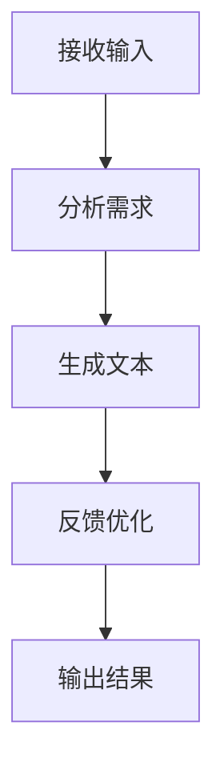
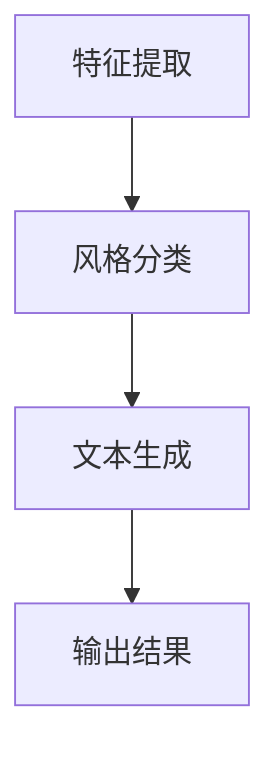
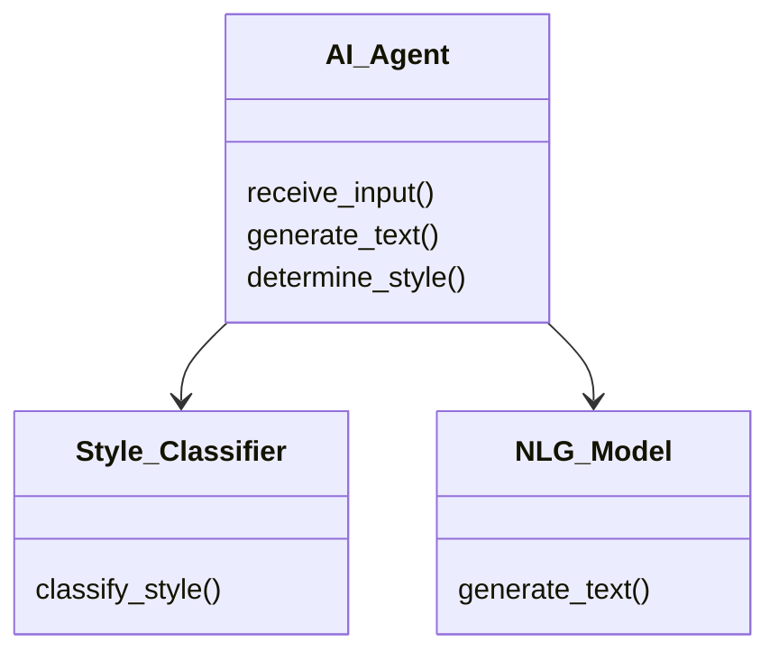
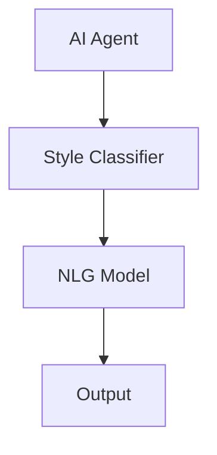
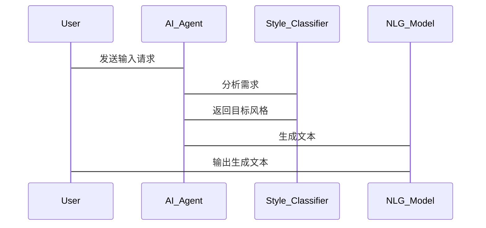

                 


# AI Agent在自然语言生成中的风格转换与控制

> 关键词：AI Agent，自然语言生成，风格转换，风格控制，文本生成

> 摘要：本文深入探讨了AI Agent在自然语言生成中的风格转换与控制方法。从基本概念到算法原理，再到系统架构和实际应用，全面分析了如何利用AI Agent实现灵活的文本风格调整，满足不同场景的需求。

---

## 第1章: AI Agent与自然语言生成概述

### 1.1 问题背景

自然语言生成（Natural Language Generation, NLG）是人工智能领域的重要研究方向，旨在让计算机生成符合人类语言习惯的文本。随着深度学习技术的发展，NLG在对话系统、机器翻译、内容生成等领域得到了广泛应用。

#### 1.1.1 自然语言生成的定义与特点

自然语言生成是指将结构化数据或信息转换为自然语言文本的过程。其特点包括：

- **灵活性**：能够根据输入数据生成多种不同的表达方式。
- **可定制性**：支持针对不同场景和用户需求调整生成内容的风格。
- **上下文依赖性**：生成的文本需要考虑上下文信息，以确保语义连贯。

#### 1.1.2 风格转换与控制的必要性

在实际应用中，生成文本的风格需要根据具体场景进行调整。例如：

- **正式与非正式风格**：在商业邮件中使用正式语言，在社交媒体上使用非正式语言。
- **情感倾向**：生成积极、中性或消极的情感倾向的文本。
- **领域专业性**：在医疗、法律等领域，生成的文本需要符合专业术语和风格。

AI Agent通过分析用户需求和上下文信息，能够动态调整生成文本的风格，从而提高生成内容的适用性和用户体验。

#### 1.1.3 AI Agent在自然语言生成中的作用

AI Agent作为智能体，能够通过以下方式实现对自然语言生成的风格控制：

- **接收输入**：获取用户的请求或输入数据。
- **分析需求**：理解用户的需求和偏好，确定生成文本的目标风格。
- **生成文本**：调用自然语言生成模型，生成符合目标风格的文本。
- **反馈优化**：根据用户反馈或系统评估结果，优化生成过程，提高生成质量。

### 1.2 核心概念与问题描述

#### 1.2.1 AI Agent的定义与属性

AI Agent是一种智能体，具备以下属性：

- **主动性**：能够主动采取行动，而不是被动响应。
- **反应性**：能够感知环境并做出实时反应。
- **学习能力**：能够通过数据和经验不断优化自身行为。

#### 1.2.2 自然语言生成的风格维度

风格维度是描述文本风格的关键指标，常见的风格维度包括：

- **正式程度**：文本的正式程度，从非常正式到非正式。
- **情感倾向**：文本的情感色彩，从积极到消极。
- **复杂度**：文本的语法结构复杂程度。
- **领域专业性**：文本的专业领域相关性。

#### 1.2.3 风格转换与控制的边界与外延

风格转换与控制的边界在于如何在生成文本时，既保持内容的准确性，又符合目标风格的要求。外延则包括对生成文本的后续优化和调整。

### 1.3 问题解决与技术路线

#### 1.3.1 风格转换与控制的主要方法

目前，风格转换与控制的主要方法包括：

- **基于规则的方法**：通过预定义的规则对生成文本进行调整。
- **基于深度学习的方法**：利用神经网络模型学习风格特征，并生成符合目标风格的文本。

#### 1.3.2 AI Agent在其中的角色定位

AI Agent在风格转换与控制中扮演的角色包括：

- **协调者**：协调生成模型和用户需求。
- **决策者**：根据用户需求和上下文信息，决定生成文本的风格。
- **优化者**：通过反馈优化生成过程，提高生成质量。

#### 1.3.3 技术路线与实现框架

技术路线包括：

1. **需求分析**：分析用户需求和生成目标。
2. **风格确定**：确定生成文本的目标风格。
3. **文本生成**：调用生成模型生成文本。
4. **风格验证**：验证生成文本是否符合目标风格。
5. **优化调整**：根据验证结果优化生成过程。

---

## 第2章: AI Agent与风格转换的核心原理

### 2.1 AI Agent的基本原理

#### 2.1.1 AI Agent的定义与分类

AI Agent可以根据智能水平分为：

- **反应式AI Agent**：根据当前输入做出实时反应。
- **认知式AI Agent**：具备一定的推理和决策能力。

#### 2.1.2 AI Agent的决策机制

AI Agent的决策机制包括：

- **感知**：获取输入数据和环境信息。
- **推理**：分析数据，理解用户需求。
- **决策**：根据推理结果做出生成风格的选择。
- **执行**：调用生成模型生成文本。

#### 2.1.3 AI Agent与自然语言生成的关系

AI Agent通过接收输入、分析需求、生成文本和优化调整，实现对自然语言生成过程的控制。

### 2.2 自然语言生成的风格维度

#### 2.2.1 风格维度的分类

风格维度的分类如下：

- **正式程度**：分为正式、半正式和非正式。
- **情感倾向**：分为积极、中性和消极。
- **复杂度**：分为简单、中等和复杂。
- **领域专业性**：分为通用、专业领域和特定领域。

#### 2.2.2 风格维度的量化与评估

风格维度的量化可以通过以下指标实现：

- **TF-IDF**：用于评估文本的专业性。
- **情感分析**：用于评估文本的情感倾向。
- **句法复杂度**：用于评估文本的复杂程度。

#### 2.2.3 不同风格维度的特征对比

通过对比不同风格维度的特征，可以更好地理解它们的差异和应用。

### 2.3 风格转换与控制的实现机制

#### 2.3.1 风格转换的数学模型

风格转换的数学模型可以通过以下步骤实现：

1. **特征提取**：提取输入文本的特征。
2. **风格分类**：根据特征确定目标风格。
3. **文本生成**：生成符合目标风格的文本。

#### 2.3.2 风格控制的策略与方法

风格控制的策略包括：

- **基于规则的控制**：通过预定义的规则调整生成文本。
- **基于模型的控制**：通过训练模型学习风格特征，并生成符合目标风格的文本。

#### 2.3.3 AI Agent在风格转换中的具体作用

AI Agent在风格转换中的具体作用包括：

- **接收输入**：获取用户的输入请求。
- **分析需求**：理解用户的需求和偏好。
- **生成文本**：调用生成模型生成文本。
- **反馈优化**：根据用户反馈优化生成过程。

---

## 第3章: 基于AI Agent的风格转换算法

### 3.1 基于AI Agent的风格转换算法概述

#### 3.1.1 算法原理

基于AI Agent的风格转换算法的原理包括：

- **接收输入**：获取用户的输入请求。
- **分析需求**：理解用户的需求和偏好。
- **生成文本**：调用生成模型生成文本。
- **反馈优化**：根据用户反馈优化生成过程。

#### 3.1.2 算法流程图

以下是基于AI Agent的风格转换算法的流程图：



#### 3.1.3 算法实现代码

以下是一个简单的基于AI Agent的风格转换算法的Python代码示例：

```python
class AI_Agent:
    def __init__(self):
        self.style = None

    def receive_input(self, input_text):
        # 分析输入，确定目标风格
        self.style = self.determine_style(input_text)
        return self.style

    def determine_style(self, input_text):
        # 简单的风格分类，可以根据实际需求扩展
        if "正式" in input_text:
            return "正式"
        elif "非正式" in input_text:
            return "非正式"
        else:
            return "中性"

    def generate_text(self, content, style):
        # 生成符合目标风格的文本
        # 这里可以调用具体的自然语言生成模型
        pass

# 示例用法
agent = AI_Agent()
input_text = "生成一个正式的邮件"
style = agent.receive_input(input_text)
text = agent.generate_text("感谢您的支持", style)
print(text)
```

### 3.2 基于深度学习的风格转换算法

#### 3.2.1 算法原理

基于深度学习的风格转换算法的原理包括：

- **特征提取**：提取输入文本的特征。
- **风格分类**：根据特征确定目标风格。
- **文本生成**：生成符合目标风格的文本。

#### 3.2.2 算法流程图

以下是基于深度学习的风格转换算法的流程图：



#### 3.2.3 算法实现代码

以下是一个基于深度学习的风格转换算法的Python代码示例：

```python
import tensorflow as tf

class Style_Transformer:
    def __init__(self):
        self.model = self.build_model()

    def build_model(self):
        model = tf.keras.Sequential([
            tf.keras.layers.Embedding(input_dim=10000, output_dim=128),
            tf.keras.layers.SimpleRNN(units=128),
            tf.keras.layers.Dense(3, activation='softmax')
        ])
        model.compile(optimizer='adam', loss='sparse_categorical_crossentropy', metrics=['accuracy'])
        return model

    def train(self, x_train, y_train, epochs=10):
        self.model.fit(x_train, y_train, epochs=epochs, batch_size=32)

    def predict(self, x_test):
        return self.model.predict(x_test)

# 示例用法
transformer = Style_Transformer()
transformer.train(x_train, y_train)
predictions = transformer.predict(x_test)
print(predictions)
```

---

## 第4章: 系统分析与架构设计

### 4.1 问题场景介绍

#### 4.1.1 需求背景

在实际应用中，生成文本的风格需要根据具体场景进行调整。例如，在商业场景中，生成正式的邮件；在社交媒体中，生成非正式的帖子。

#### 4.1.2 项目介绍

本项目旨在开发一个基于AI Agent的自然语言生成系统，能够根据用户需求生成符合目标风格的文本。

### 4.2 系统功能设计

#### 4.2.1 领域模型

以下是系统领域的类图：



#### 4.2.2 系统架构设计

以下是系统架构图：



#### 4.2.3 系统接口设计

系统接口设计包括：

- **输入接口**：接收用户的输入请求。
- **输出接口**：输出生成的文本。
- **控制接口**：控制生成模型的参数。

#### 4.2.4 系统交互流程

以下是系统交互流程的序列图：



---

## 第5章: 项目实战

### 5.1 环境安装

#### 5.1.1 安装Python

安装Python 3.8或更高版本。

#### 5.1.2 安装依赖库

安装以下依赖库：

- `tensorflow`
- `transformers`
- `numpy`

### 5.2 系统核心实现

#### 5.2.1 AI Agent实现

以下是AI Agent的Python实现代码：

```python
class AI_Agent:
    def __init__(self):
        self.style_classifier = Style_Classifier()
        self.nlg_model = NLG_Model()

    def receive_input(self, input_text):
        style = self.style_classifier.classify_style(input_text)
        return style

    def generate_text(self, content, style):
        return self.nlg_model.generate_text(content, style)
```

#### 5.2.2 Style Classifier实现

以下是Style Classifier的Python实现代码：

```python
class Style_Classifier:
    def classify_style(self, input_text):
        # 简单的风格分类，可以根据实际需求扩展
        if "正式" in input_text:
            return "正式"
        elif "非正式" in input_text:
            return "非正式"
        else:
            return "中性"
```

#### 5.2.3 NLG Model实现

以下是NLG Model的Python实现代码：

```python
class NLG_Model:
    def generate_text(self, content, style):
        # 简单的文本生成，可以根据实际需求扩展
        if style == "正式":
            return f"正式文本：{content}"
        elif style == "非正式":
            return f"非正式文本：{content}"
        else:
            return f"中性文本：{content}"
```

### 5.3 代码应用解读与分析

#### 5.3.1 AI Agent的使用场景

AI Agent可以用于多种场景，例如：

- **商业应用**：生成正式的商业邮件、合同等。
- **社交媒体**：生成非正式的社交媒体帖子。
- **教育领域**：生成适合学生阅读的教育内容。

#### 5.3.2 代码优化建议

代码优化建议包括：

- **性能优化**：优化模型的训练和推理速度。
- **功能扩展**：增加更多的风格维度，例如情感倾向和复杂度。

### 5.4 实际案例分析

#### 5.4.1 案例背景

某公司希望生成正式的商业邮件。

#### 5.4.2 数据准备

准备以下数据：

- **输入文本**：用户请求生成正式的商业邮件。
- **目标风格**：正式。

#### 5.4.3 代码实现与分析

以下是实现代码：

```python
agent = AI_Agent()
input_text = "生成正式的商业邮件"
style = agent.receive_input(input_text)
content = "感谢您的合作"
generated_text = agent.generate_text(content, style)
print(generated_text)
```

#### 5.4.4 结果展示与分析

生成的文本为：

```
正式文本：感谢您的合作
```

#### 5.4.5 案例总结

通过AI Agent，用户可以轻松生成符合目标风格的文本，提高工作效率。

---

## 第6章: 最佳实践与小结

### 6.1 最佳实践

#### 6.1.1 AI Agent的设计原则

AI Agent的设计原则包括：

- **简单性**：设计简单易用的接口。
- **可扩展性**：支持多种风格维度和生成模型。
- **可解释性**：生成过程和结果需要可解释。

#### 6.1.2 代码实现中的注意事项

代码实现中的注意事项包括：

- **性能优化**：优化模型的训练和推理速度。
- **功能扩展**：支持更多的风格维度和生成模型。
- **错误处理**：增加错误处理机制，确保系统健壮性。

### 6.2 小结

本文深入探讨了AI Agent在自然语言生成中的风格转换与控制方法。从基本概念到算法原理，再到系统架构和实际应用，全面分析了如何利用AI Agent实现灵活的文本风格调整，满足不同场景的需求。

### 6.3 未来研究方向

未来的研究方向包括：

- **多风格联合生成**：研究如何同时控制多个风格维度。
- **动态风格调整**：研究如何根据实时反馈动态调整生成风格。
- **跨模态风格转换**：研究如何将风格信息应用于其他模态，例如图像和语音。

---

## 作者

作者：AI天才研究院/AI Genius Institute & 禅与计算机程序设计艺术 /Zen And The Art of Computer Programming

