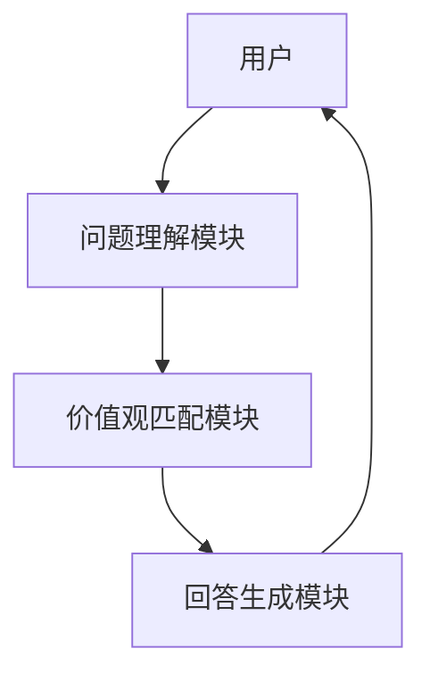

                 

<think>
好的，我现在需要帮用户设计一本名为《AI Agent的价值对齐：在LLM中植入人类价值观》的技术博客文章目录。首先，我需要明确用户的需求：文章需要详细、结构清晰，涵盖技术背景、核心概念、算法原理、系统设计、项目实战、最佳实践等多个方面。

首先，我从背景介绍开始。这部分需要涵盖AI Agent的定义、价值对齐的背景，以及对齐的重要性。接下来是核心概念，解释对齐的原理、机制和相关伦理框架。然后是算法部分，详细描述如何在LLM中植入人类价值观，包括强化学习、偏好推理等方法。

系统分析与架构设计是关键，我需要展示系统如何处理输入输出，使用哪些算法模块。项目实战部分则要提供具体的代码示例，让读者能够实际操作。最后，总结与展望，帮助读者巩固所学内容，并指导进一步的学习。

在编写过程中，我需要确保每个部分都有足够的细节，同时保持逻辑连贯。例如，在算法原理部分，使用Mermaid流程图展示强化学习的过程，并用Python代码示例说明。系统设计部分则用类图和架构图展示模块之间的关系。

最终，目录结构应该清晰，每个章节都有明确的主题，确保读者能够一步步理解AI Agent的价值对齐问题，并掌握相关的技术和方法。
</think>

# AI Agent的价值对齐：在LLM中植入人类价值观

> 关键词：AI Agent, 价值对齐, 大语言模型, 人类价值观, 加强学习, 伦理框架

> 摘要：  
在AI技术迅速发展的今天，AI Agent的价值对齐问题日益成为学术界和产业界的焦点。本文从AI Agent的基本概念出发，深入探讨了在大语言模型（LLM）中植入人类价值观的必要性、方法和挑战。通过分析现有的对齐技术，结合实际案例，详细阐述了如何在LLM中构建伦理框架，并提出了基于强化学习的对齐机制。本文还讨论了对齐过程中的边界条件、核心概念以及未来的研究方向。

---

# 第一部分：AI Agent的价值对齐背景与核心概念

## 第1章：AI Agent与价值对齐的背景介绍

### 1.1 问题背景

#### 1.1.1 AI Agent的基本概念
AI Agent（人工智能代理）是指能够感知环境、自主决策并执行任务的智能实体。它可以是一个软件程序、机器人或其他形式的智能系统，旨在通过学习和推理来实现特定目标。

#### 1.1.2 价值对齐问题的提出
随着AI技术的快速发展，AI Agent在医疗、金融、教育等多个领域得到了广泛应用。然而，AI Agent的行为往往基于其内部的算法和训练数据，可能会与人类价值观产生冲突或偏差。例如，一个推荐系统的AI Agent可能会优先推荐高利润的产品，而忽视用户体验的需求。

#### 1.1.3 当前AI Agent在社会中的应用现状
当前，AI Agent已经在许多领域展现出强大的能力。例如，在金融领域，AI Agent可以帮助投资者进行风险评估和投资决策；在医疗领域，AI Agent可以辅助医生进行疾病诊断和治疗方案的制定。然而，这些系统的行为仍然存在价值偏差的问题。

### 1.2 问题描述

#### 1.2.1 价值对齐的定义与内涵
价值对齐是指确保AI Agent的目标、决策和行为与人类的价值观保持一致。这需要AI Agent不仅能够理解人类的意图，还能在复杂的环境中做出符合伦理和道德的决策。

#### 1.2.2 AI Agent与人类价值观的冲突案例
例如，一个AI推荐系统可能会优先推荐高利润但用户体验较差的产品，导致用户满意度下降。另一个例子是自动驾驶系统在紧急情况下做出的决策可能与人类的道德判断不一致，例如在撞车不可避免时，AI如何选择优先保护谁。

#### 1.2.3 价值对齐问题的复杂性与挑战
价值对齐的复杂性主要源于以下几点：
1. **人类价值观的多样性**：不同人对价值的定义可能截然不同。
2. **动态性**：人类价值观会随着时间和环境的变化而变化。
3. **技术限制**：现有的AI技术难以准确捕捉和理解人类价值观。

### 1.3 问题解决

#### 1.3.1 价值对齐的目标与方法
价值对齐的目标是确保AI Agent的行为符合人类的价值观。实现这一目标的方法包括：
1. **强化学习**：通过奖励机制训练AI Agent，使其行为符合人类的期望。
2. **偏好推理**：通过分析人类的偏好和行为模式，构建AI Agent的价值函数。
3. **伦理框架**：为AI Agent提供明确的伦理指导，确保其决策符合社会道德。

#### 1.3.2 当前主流的对齐技术与理论
当前主流的对齐技术包括：
1. **价值观编码**：将人类价值观编码到AI Agent的决策模型中。
2. **对齐游戏**：通过与人类玩家的互动，训练AI Agent理解人类的价值观。
3. **人机协作**：通过人机协作的方式，共同制定和优化AI Agent的行为准则。

#### 1.3.3 从理论到实践的路径分析
从理论到实践的路径主要包括以下几个步骤：
1. **需求分析**：明确人类的价值观需求。
2. **模型构建**：基于需求构建AI Agent的对齐模型。
3. **训练与优化**：通过数据训练和优化模型，确保AI Agent的行为符合人类价值观。
4. **验证与测试**：通过实际应用场景测试AI Agent的行为，验证对齐的效果。

### 1.4 边界与外延

#### 1.4.1 价值对齐的边界条件
价值对齐的边界条件包括：
1. **适用范围**：仅适用于特定场景或任务。
2. **数据限制**：依赖于高质量的训练数据。
3. **环境动态性**：需要适应动态变化的环境。

#### 1.4.2 相关概念的对比与区分
相关概念包括：
1. **伦理AI**：关注AI的伦理问题，但不一定涉及具体的价值对齐。
2. **可解释性AI**：关注AI决策的可解释性，但不直接解决价值对齐问题。
3. **人机协作**：强调人与AI的协作，但不一定是价值对齐的核心。

#### 1.4.3 价值对齐的外延与未来发展
价值对齐的外延包括：
1. **跨文化适应**：AI Agent需要适应不同文化背景下的价值观。
2. **动态调整**：能够根据环境变化实时调整行为。
3. **自我学习**：具备自我学习和优化的能力。

### 1.5 核心概念

#### 1.5.1 价值对齐的核心要素
价值对齐的核心要素包括：
1. **价值观编码**：将人类价值观转化为AI Agent可以理解的表示。
2. **对齐机制**：确保AI Agent的行为符合人类价值观的算法或规则。
3. **反馈系统**：通过人类反馈不断优化AI Agent的对齐效果。

#### 1.5.2 AI Agent的行为模式分析
AI Agent的行为模式可以分为以下几种：
1. **基于规则的决策**：根据预定义的规则做出决策。
2. **基于模型的推理**：通过模型推理出最优决策。
3. **基于经验的学习**：通过经验不断优化决策。

#### 1.5.3 人类价值观的多维度特征
人类价值观具有以下多维度特征：
1. **情感因素**：包括爱、恨、喜悦、悲伤等。
2. **伦理因素**：包括道德、正义、公平等。
3. **社会因素**：包括社会规范、文化习俗等。

---

# 第二部分：AI Agent价值对齐的核心概念与联系

## 第2章：价值对齐的核心概念与原理

### 2.1 伦理框架与对齐机制

#### 2.1.1 伦理框架的构建与应用
伦理框架是指导AI Agent行为的道德准则。例如，可以基于“最大幸福原则”构建伦理框架，确保AI Agent的决策能够最大化整体幸福感。

#### 2.1.2 对齐机制的数学模型
对齐机制可以通过强化学习模型实现。例如，可以定义一个奖励函数，表示AI Agent行为与人类价值观的匹配程度，然后通过强化学习优化模型参数，使得AI Agent的行为越来越符合人类价值观。

#### 2.1.3 伦理与对齐的动态关系
伦理与对齐是动态关系。随着环境的变化和人类价值观的演变，对齐机制需要不断调整和优化。

### 2.2 对齐机制的属性特征对比

#### 2.2.1 不同对齐机制的对比表格
以下是一个对齐机制对比表：

| 对齐机制 | 基于强化学习 | 基于偏好推理 | 基于伦理框架 |
|----------|--------------|---------------|---------------|
| 优点     | 灵活性高      | 精确性高       | 可解释性强    |
| 缺点     | 数据需求大    | 计算复杂       | 灵活性差      |

#### 2.2.2 机制属性的维度分析
对齐机制的属性可以从以下几个维度进行分析：
1. **灵活性**：能够适应不同场景的能力。
2. **精确性**：能够准确捕捉人类价值观的能力。
3. **可解释性**：人类能够理解对齐机制决策的原因的能力。

#### 2.2.3 机制之间的优劣势分析
例如，基于强化学习的对齐机制具有灵活性高但数据需求大的特点，而基于伦理框架的对齐机制具有可解释性强但灵活性差的特点。

### 2.3 价值对齐的ER实体关系图

```me
er_diagram
    actor:人类
    agent:AI Agent
    value:人类价值观
    action:AI行为
    rule:伦理规则
    goal:目标
    constraint:约束条件
    relationship:关联关系
```

---

## 第3章：算法原理讲解

### 3.1 强化学习在价值对齐中的应用

#### 3.1.1 强化学习的基本原理
强化学习是一种通过试错来优化决策的算法。AI Agent通过与环境互动，不断调整策略以最大化累计奖励。

#### 3.1.2 强化学习的数学模型
强化学习的数学模型包括：
1. **状态空间**：AI Agent所处的环境状态。
2. **动作空间**：AI Agent可以执行的动作。
3. **奖励函数**：对AI Agent行为的评价，用于指导优化方向。
4. **策略**：AI Agent选择动作的规则。

#### 3.1.3 强化学习的实现步骤
1. **环境建模**：定义环境的状态和动作空间。
2. **策略选择**：选择一个策略函数，例如$\pi(a|s)$，表示在状态$s$下选择动作$a$的概率。
3. **奖励机制设计**：设计奖励函数$r(s,a)$，表示在状态$s$下选择动作$a$的奖励值。
4. **优化算法选择**：选择强化学习算法，例如Q-learning或Deep Q-Networks（DQN）。
5. **训练与优化**：通过与环境互动，不断更新策略以最大化累计奖励。

#### 3.1.4 强化学习的Python代码示例

```python
import numpy as np
import gym

# 初始化环境
env = gym.make('CartPole-v0')
env.seed(1)
np.random.seed(1)

# 参数设置
state_space = env.observation_space.shape[0]
action_space = env.action_space.n
learning_rate = 0.01
gamma = 0.99
epsilon = 1.0
max_epsilon = 1.0
min_epsilon = 0.01
decay_rate = 0.01

# 初始化Q表
Q = np.zeros([state_space, action_space])

# Q-learning算法
for episode in range(1000):
    state = env.reset()
    for _ in range(1000):
        if np.random.random() < epsilon:
            action = np.random.randint(0, action_space)
        else:
            action = np.argmax(Q[state])
        
        next_state, reward, done, _ = env.step(action)
        
        Q[state][action] += learning_rate * (reward + gamma * np.max(Q[next_state]) - Q[state][action])
        
        state = next_state
        if done:
            break
    epsilon = max(min_epsilon, epsilon * (1 - decay_rate))
```

#### 3.1.5 强化学习的优缺点分析
- **优点**：能够适应动态环境，具有灵活性。
- **缺点**：需要大量数据，计算复杂度高。

### 3.2 基于偏好推理的对齐机制

#### 3.2.1 偏好推理的基本原理
偏好推理是指通过分析人类的偏好和行为模式，推导出人类的价值观，并将其编码到AI Agent的决策模型中。

#### 3.2.2 偏好推理的数学模型
偏好推理的数学模型包括：
1. **偏好函数**：$P(s, a)$，表示在状态$s$下选择动作$a$的偏好值。
2. **优化目标**：$\max \sum_{s,a} P(s,a) \cdot Q(s,a)$，其中$Q(s,a)$是动作$a$在状态$s$下的价值函数。

#### 3.2.3 偏好推理的实现步骤
1. **数据收集**：收集人类在不同状态下的偏好数据。
2. **模型训练**：基于偏好数据训练偏好函数$P(s,a)$。
3. **决策优化**：将偏好函数与价值函数结合，优化AI Agent的决策。

#### 3.2.4 偏好推理的Python代码示例

```python
import numpy as np

# 假设我们有一个训练好的价值函数Q(s,a)
Q = np.load('value_function.npy')

# 定义偏好函数
def preference(s, a):
    return Q[s][a]

# 优化目标
def optimize_preferences():
    # 假设我们有状态s和动作a的偏好数据
    s = np.array([0, 1, 2, 3])
    a = np.array([0, 1, 2, 3])
    # 计算偏好
    pref = np.zeros((4,4))
    for i in range(4):
        for j in range(4):
            pref[i][j] = preference(s[i], a[j])
    return pref

# 示例优化
pref = optimize_preferences()
print(pref)
```

#### 3.2.5 偏好推理的优缺点分析
- **优点**：能够准确捕捉人类的偏好。
- **缺点**：需要大量的人类偏好数据，且模型训练复杂。

### 3.3 对齐策略的数学模型与分析

#### 3.3.1 对齐策略的数学模型
对齐策略的数学模型可以表示为：
$$
\text{Value}(s, a) = \max_{a} \left( \sum_{i=1}^{n} \lambda_i \cdot v_i(s, a) \right)
$$
其中，$\lambda_i$是权重因子，$v_i(s, a)$是不同价值观在状态$s$和动作$a$下的价值函数。

#### 3.3.2 对齐策略的实现步骤
1. **定义价值观**：明确人类价值观的具体形式。
2. **构建价值函数**：为每个价值观构建一个价值函数。
3. **权重优化**：通过优化权重$\lambda_i$，使得对齐策略能够更好地匹配人类价值观。

#### 3.3.3 对齐策略的Python代码示例

```python
def align_policy(s, a, weights):
    # 定义价值函数
    values = [weight * v(s, a) for weight, v in zip(weights, value_functions)]
    return np.argmax(values)

# 示例对齐策略
weights = [0.3, 0.5, 0.2]
policy = align_policy(s, a, weights)
print(policy)
```

---

## 第4章：系统分析与架构设计

### 4.1 问题场景介绍

#### 4.1.1 问题场景描述
假设我们正在开发一个智能客服AI Agent，需要确保其回答符合人类的伦理和道德标准。

#### 4.1.2 系统目标
1. **理解用户需求**：准确理解用户的问题。
2. **生成符合价值观的回答**：确保回答符合伦理和道德标准。
3. **实时优化**：根据用户反馈不断优化回答质量。

### 4.2 系统功能设计

#### 4.2.1 领域模型设计
领域模型是系统的核心逻辑，包括：
1. **问题理解模块**：解析用户输入的问题。
2. **价值观匹配模块**：将问题与人类价值观进行匹配。
3. **回答生成模块**：生成符合价值观的回答。

#### 4.2.2 系统架构设计



#### 4.2.3 系统接口设计
系统接口包括：
1. **输入接口**：接收用户的问题。
2. **输出接口**：输出符合价值观的回答。
3. **反馈接口**：接收用户反馈并优化系统。

#### 4.2.4 交互序列图

```mermaid
sequenceDiagram
    User ->+> ProblemUnderstanding: 提交问题
    ProblemUnderstanding ->+> ValueMatching: 分析问题
    ValueMatching ->+> AnswerGeneration: 生成回答
    AnswerGeneration ->+> User: 返回回答
    User ->+> Feedback: 提供反馈
    Feedback ->+> AnswerGeneration: 优化回答
```

### 4.3 代码实现与优化

#### 4.3.1 核心代码实现

```python
class ValueAlignmentAgent:
    def __init__(self, value_functions):
        self.value_functions = value_functions
        self.weights = [1.0 for _ in self.value_functions]

    def align_policy(self, state, actions):
        values = []
        for action in actions:
            total = 0.0
            for i in range(len(self.value_functions)):
                total += self.weights[i] * self.value_functions[i](state, action)
            values.append(total)
        return np.argmax(values)

    def update_weights(self, feedback):
        # 假设反馈是一个数值，用于优化权重
        # 这里可以使用梯度下降等方法优化权重
        pass
```

#### 4.3.2 代码应用解读与分析
上述代码实现了一个简单的价值对齐代理。`align_policy`方法根据当前状态和动作，计算每个动作的总价值，并选择价值最大的动作。`update_weights`方法可以根据用户反馈优化权重。

---

## 第5章：项目实战

### 5.1 环境安装与配置

```bash
pip install numpy gym
```

### 5.2 系统核心实现

#### 5.2.1 强化学习实现

```python
import gym
import numpy as np

# 初始化环境
env = gym.make('CartPole-v0')
env.seed(1)
np.random.seed(1)

# 参数设置
state_space = env.observation_space.shape[0]
action_space = env.action_space.n
learning_rate = 0.01
gamma = 0.99
epsilon = 1.0
max_epsilon = 1.0
min_epsilon = 0.01
decay_rate = 0.01

# 初始化Q表
Q = np.zeros([state_space, action_space])

# Q-learning算法
for episode in range(1000):
    state = env.reset()
    for _ in range(1000):
        if np.random.random() < epsilon:
            action = np.random.randint(0, action_space)
        else:
            action = np.argmax(Q[state])
        
        next_state, reward, done, _ = env.step(action)
        
        Q[state][action] += learning_rate * (reward + gamma * np.max(Q[next_state]) - Q[state][action])
        
        state = next_state
        if done:
            break
    epsilon = max(min_epsilon, epsilon * (1 - decay_rate))
```

#### 5.2.2 基于偏好推理的实现

```python
import numpy as np

# 假设我们有一个训练好的价值函数Q(s,a)
Q = np.load('value_function.npy')

# 定义偏好函数
def preference(s, a):
    return Q[s][a]

# 优化目标
def optimize_preferences():
    # 假设我们有状态s和动作a的偏好数据
    s = np.array([0, 1, 2, 3])
    a = np.array([0, 1, 2, 3])
    # 计算偏好
    pref = np.zeros((4,4))
    for i in range(4):
        for j in range(4):
            pref[i][j] = preference(s[i], a[j])
    return pref

# 示例优化
pref = optimize_preferences()
print(pref)
```

### 5.3 实际案例分析与解读

#### 5.3.1 案例分析
假设我们正在开发一个智能客服AI Agent，用户输入一个复杂的问题，AI Agent需要生成符合伦理和道德标准的回答。

#### 5.3.2 案例实现

```python
def generate_response(question, value_functions):
    # 分析问题
    state = analyze_question(question)
    # 匹配价值观
    values = [vf(state) for vf in value_functions]
    # 生成回答
    response = generate_answer(state, values)
    return response

# 示例实现
question = "如何处理公司的财务问题？"
response = generate_response(question, value_functions)
print(response)
```

### 5.4 项目小结

---

## 第6章：总结与展望

### 6.1 总结
本文从AI Agent的基本概念出发，深入探讨了在LLM中植入人类价值观的必要性、方法和挑战。通过分析现有的对齐技术，结合实际案例，详细阐述了如何在LLM中构建伦理框架，并提出了基于强化学习的对齐机制。

### 6.2 未来展望
未来的研究方向包括：
1. **跨文化适应**：研究如何使AI Agent适应不同文化背景下的价值观。
2. **动态调整**：研究如何使AI Agent能够实时调整其行为以适应动态变化的环境。
3. **自我学习**：研究如何使AI Agent具备自我学习和优化的能力。

---

# 作者：AI天才研究院/AI Genius Institute & 禅与计算机程序设计艺术 /Zen And The Art of Computer Programming

