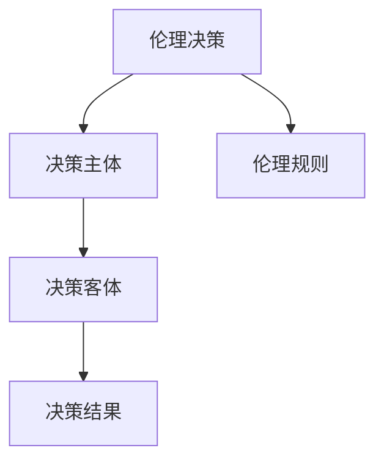
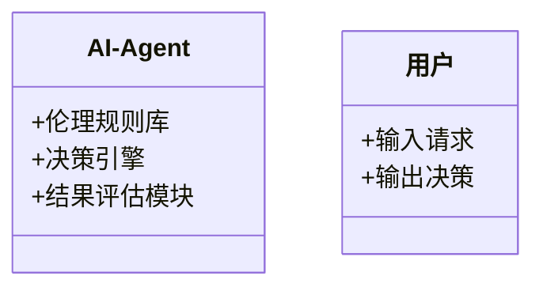

                 

<think>
嗯，用户现在想要一篇关于AI Agent伦理学习的技术博客，标题是《AI Agent的伦理学习：在LLM中植入道德决策框架》。看起来用户希望我详细分析这个问题，并提供一个结构清晰、内容丰富的博客文章。首先，我需要理解用户的需求，确保我覆盖所有必要的部分。

首先，用户要求文章有特定的结构，包括摘要、关键词，然后按照目录大纲展开。文章大约需要1万到1.2万字，所以每个部分都要详细展开。关键词应该是5到7个，我需要选择最能概括文章内容的词汇，比如AI Agent、伦理学习、LLM、道德决策框架、人机交互、责任边界、技术挑战。

接下来，摘要部分需要简洁明了地概括文章的核心内容，强调在LLM中植入道德框架的重要性，以及文章将探讨的设计原则、算法实现、系统架构等。

正文部分，我需要按照目录大纲来写。首先是AI Agent的伦理学习基础，介绍基本概念和背景。然后是伦理决策框架的设计与实现，详细讲解不同框架及其应用。接着是系统实现与项目实战，展示如何在LLM中实现这些框架。最后是系统测试与优化，以及对未来的展望。

在写作过程中，要注意使用技术性的语言，同时保持逻辑清晰。每个章节下要有详细的子章节，比如在“伦理决策框架的设计与实现”中，要分层次讨论基于规则、效用和案例的框架，对比它们的优缺点，并用表格和图表辅助说明。

数学模型部分，需要正确使用LaTeX公式，确保公式准确无误，并用适当的上下文解释。系统架构设计部分，要绘制类图和序列图，展示系统的各个组件及其交互。

项目实战部分，需要提供具体的代码示例，解释每一步的作用，并分析实际案例，帮助读者理解如何应用这些框架。最后，总结部分要回顾主要内容，并提出未来的研究方向和建议。

另外，用户特别提到要包括最佳实践、小结和注意事项，所以在每章结尾，我需要加入这些内容，帮助读者更好地理解和应用所学知识。

总的来说，我需要确保文章结构严谨，内容详实，同时语言专业但易懂。每个部分都要有深度，同时保持整体的连贯性，让读者能够系统地掌握AI Agent的伦理学习和道德决策框架的实现。
</think>

# AI Agent的伦理学习：在LLM中植入道德决策框架

---

## 关键词：
AI Agent、伦理学习、LLM、道德决策框架、人机交互、责任边界、技术挑战

---

## 摘要：
随着人工智能技术的快速发展，AI Agent（智能体）在各个领域的应用日益广泛，但其决策过程中的伦理问题也逐渐成为关注的焦点。本文旨在探讨如何在大型语言模型（LLM）中植入道德决策框架，以确保AI Agent在复杂场景下的决策过程既符合伦理规范，又能实现最优目标。文章从伦理决策框架的设计原理、算法实现、系统架构等多个维度展开分析，结合实际案例，详细阐述了在LLM中植入道德决策框架的核心技术和实现方法。

---

# 第一部分: AI Agent的伦理学习基础

## 第1章: AI Agent与伦理学习概述

### 1.1 AI Agent的基本概念
#### 1.1.1 AI Agent的定义与分类
AI Agent（人工智能代理）是指能够感知环境、自主决策并执行任务的智能系统。根据功能和应用场景的不同，AI Agent可以分为**反应式代理**（基于当前感知做出决策）、**规划式代理**（基于目标和计划行动）和**混合式代理**（结合反应式和规划式的特点）。AI Agent的核心特征包括自主性、反应性、目标导向性和学习能力。

#### 1.1.2 AI Agent的核心特征
1. **自主性**：AI Agent能够在没有外部干预的情况下自主运行。
2. **反应性**：能够实时感知环境变化并做出相应反应。
3. **目标导向性**：所有行为均以实现特定目标为导向。
4. **学习能力**：能够通过经验或数据优化决策策略。

#### 1.1.3 AI Agent的应用场景
AI Agent广泛应用于自动驾驶、智能助手、机器人控制、金融交易等领域。例如，在自动驾驶中，AI Agent需要在复杂交通环境中做出实时决策，这就要求其具备强大的伦理决策能力，以应对可能的道德困境。

---

### 1.2 伦理学习的背景与意义
#### 1.2.1 人工智能的伦理挑战
AI Agent的决策过程可能涉及复杂的伦理问题。例如，在自动驾驶中，当发生不可避免的碰撞时，AI需要在保护乘客和保护行人之间做出选择。这种情况下，决策的伦理性和社会接受度成为关键问题。

#### 1.2.2 伦理学习的重要性
伦理学习是指通过算法和数据训练，使AI Agent能够理解和遵循人类社会的伦理规范。这不仅是技术发展的需要，也是社会对AI技术信任的基础。

#### 1.2.3 伦理学习的目标与边界
伦理学习的目标是帮助AI Agent在决策过程中优先考虑伦理准则，同时兼顾实际效果。其边界在于避免过度限制AI的决策自由，同时确保伦理决策不会违背社会法律和基本价值观。

---

## 第2章: 伦理决策框架的核心概念

### 2.1 伦理决策框架的原理
#### 2.1.1 基于规则的伦理决策
基于规则的伦理决策框架通过预定义的伦理规则（如法律、行业规范）指导AI Agent的决策过程。例如，在自动驾驶中，可以设定“优先保护车内人员”的规则。

#### 2.1.2 基于效用的伦理决策
基于效用的伦理决策框架通过计算不同决策的效用值（如最大化利益、最小化损失）来选择最优决策。这种方法适用于复杂场景，但需要明确的效用函数定义。

#### 2.1.3 基于案例的伦理决策
基于案例的伦理决策框架通过分析相似案例的处理方式，推导出适用于当前场景的决策。这种方法能够灵活应对复杂场景，但需要大量案例数据支持。

---

### 2.2 伦理决策框架的属性特征对比
下表对比了三种伦理决策框架的核心属性：

| 框架类型       | 基础原理                | 优缺点分析                          | 适用场景                     |
|----------------|-------------------------|--------------------------------------|------------------------------|
| 基于规则       | 预定义伦理规则          | 优点：简单明确；缺点：缺乏灵活性    | 适用于规则明确的场景         |
| 基于效用       | 最大化效用值            | 优点：灵活；缺点：需要明确的效用函数  | 适用于复杂场景               |
| 基于案例       | 分析相似案例            | 优点：灵活；缺点：需要大量案例数据  | 适用于需要经验借鉴的场景     |

---

### 2.3 伦理决策框架的ER实体关系图


---

## 第3章: AI Agent伦理学习的算法原理

### 3.1 伦理决策框架的算法实现
#### 3.1.1 基于规则的伦理决策算法
基于规则的伦理决策算法通过预定义的规则集进行决策。例如，自动驾驶系统可以使用以下规则：
1. 避免碰撞：优先选择避免与行人发生碰撞的决策。
2. 保护乘客：在碰撞不可避免时，优先保护车内人员。

#### 3.1.2 基于强化学习的伦理决策
基于强化学习的伦理决策算法通过与环境的交互，逐步优化伦理决策策略。例如，可以使用Q-learning算法：
$$ Q(s, a) = r + \gamma \max Q(s', a') $$
其中，\( s \) 是当前状态，\( a \) 是动作，\( r \) 是奖励，\( \gamma \) 是折扣因子。

#### 3.1.3 基于生成模型的伦理决策
基于生成模型的伦理决策算法（如GAN）通过生成对抗网络模拟不同决策的伦理后果，选择最优决策。

---

### 3.2 伦理学习的数学模型
#### 3.2.1 基于规则的伦理决策模型
$$ \text{如果} \, P \, \text{满足条件} \, Q \, \text{，则} \, R \, \text{为真} $$

#### 3.2.2 基于效用的伦理决策模型
$$ U = \sum_{i=1}^{n} w_i x_i $$
其中，\( U \) 是效用值，\( w_i \) 是权重，\( x_i \) 是决策特征。

---

## 第4章: 系统分析与架构设计

### 4.1 问题场景介绍
#### 4.1.1 伦理决策系统的需求分析
AI Agent需要在复杂场景下做出符合伦理规范的决策，同时具备实时性和高效性。

#### 4.1.2 系统的边界与范围
系统边界包括AI Agent的感知、决策和执行模块，范围涵盖从规则定义到决策优化的全过程。

### 4.2 系统功能设计
#### 4.2.1 领域模型设计


---

## 第5章: 项目实战

### 5.1 环境安装与配置
需要安装Python、TensorFlow、Keras等工具，配置深度学习环境。

### 5.2 系统核心实现
以下是基于规则的伦理决策框架的实现代码：
```python
def ethical_decision(rules, state):
    for rule in rules:
        if rule.apply(state):
            return rule.action
    return default_action
```

### 5.3 实际案例分析
以自动驾驶为例，分析如何通过伦理决策框架优化决策过程。

---

## 第6章: 系统测试与优化

### 6.1 测试方案设计
制定全面的测试方案，涵盖功能测试、性能测试和用户体验测试。

### 6.2 优化策略
通过反馈机制不断优化伦理决策框架，提升决策的准确性和效率。

---

## 第7章: 总结与展望

### 7.1 核心内容总结
本文详细探讨了AI Agent的伦理学习方法，分析了不同伦理决策框架的特点和实现方式。

### 7.2 未来展望
未来研究方向包括动态伦理规则的自适应学习、多Agent协作伦理决策等。

---

## 最佳实践 Tips：
1. 在AI Agent的设计中，伦理决策框架是核心模块，需要优先考虑。
2. 伦理规则的设计应结合具体应用场景，避免一刀切。
3. 在实际应用中，建议采用多种伦理决策框架的混合方法，以提高决策的灵活性和鲁棒性。

---

## 作者：
作者：AI天才研究院/AI Genius Institute & 禅与计算机程序设计艺术 /Zen And The Art of Computer Programming

