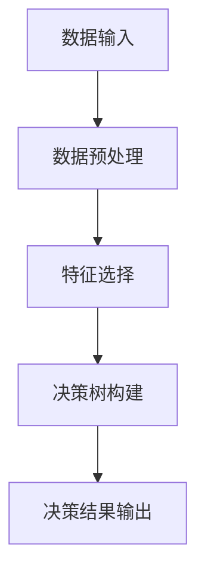
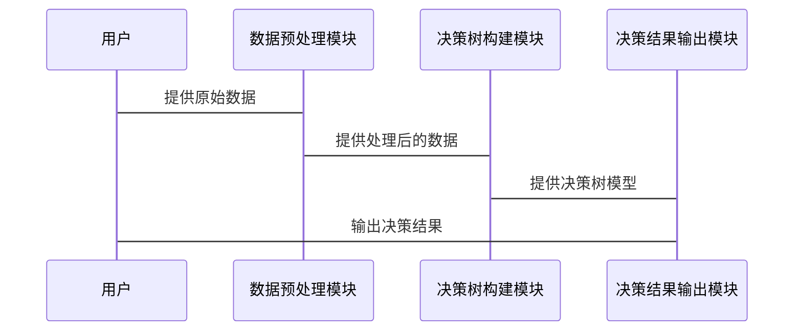

                 


# AI Agent的决策树构建：复杂问题的解决策略

**关键词**：AI Agent，决策树，机器学习，数据科学，算法优化，系统架构

**摘要**：  
本文深入探讨了AI Agent在决策树构建中的应用，分析了决策树的基本概念、构建原理、数学模型、优化策略以及系统架构设计。通过实际案例分析，展示了如何利用决策树解决复杂问题，并提供了最佳实践和优化建议。

---

# 第1章: AI Agent与决策树概述

## 1.1 AI Agent的基本概念

### 1.1.1 什么是AI Agent  
AI Agent（人工智能代理）是指能够感知环境、自主决策并执行任务的智能实体。它可以是一个软件程序、机器人或任何具备智能决策能力的系统。AI Agent的核心目标是通过数据和逻辑推理，实现对复杂问题的高效解决。

### 1.1.2 AI Agent的核心特征  
- **自主性**：能够独立执行任务，无需外部干预。  
- **反应性**：能够实时感知环境变化并做出响应。  
- **目标导向**：基于目标驱动决策，优化行为策略。  
- **学习能力**：通过数据和经验改进决策能力。  

### 1.1.3 AI Agent的应用场景  
- **推荐系统**：基于用户行为推荐个性化内容。  
- **游戏AI**：在游戏场景中实现智能决策。  
- **医疗诊断**：辅助医生进行疾病诊断和治疗方案选择。  

---

## 1.2 决策树的基本概念  

### 1.2.1 决策树的定义  
决策树是一种树状结构，用于表示可能的决策路径和结果。它通过节点和分支的形式，将问题分解为更简单的子问题，最终引导到决策结果。

### 1.2.2 决策树的结构组成  
- **根节点**：问题的起点，代表初始决策点。  
- **决策节点**：代表特征或属性的选择。  
- **叶节点**：代表决策结果，即最终类别或值。  
- **分支**：代表决策路径，基于特征的取值进行划分。  

### 1.2.3 决策树的优势与局限性  

#### 优势  
- **直观易懂**：决策树以树状结构展示，易于理解和解释。  
- **高效性**：适用于大规模数据集的分类和回归任务。  
- **鲁棒性**：能够处理噪声数据和缺失值。  

#### 局限性  
- **过拟合风险**：在数据复杂时，决策树可能过于复杂，导致过拟合。  
- **计算复杂度高**：在大规模数据集上，构建决策树可能需要较高的计算资源。  

---

# 第2章: 决策树的构建原理  

## 2.1 决策树的构建流程  

### 2.1.1 数据预处理  
- 数据清洗：处理缺失值、噪声数据。  
- 数据转换：将数据转换为适合决策树处理的形式。  

### 2.1.2 特征选择  
- 信息增益：选择能够最大程度区分数据的特征。  
- 基尼指数：衡量特征对数据划分的效果。  

### 2.1.3 决策节点的分裂  
- **ID3算法**：基于信息增益选择最优特征。  
- **C4.5算法**：基于信息增益率选择最优特征。  
- **CART算法**：基于基尼指数选择最优特征。  

### 2.1.4 树的剪枝  
- **预剪枝**：在构建过程中提前剪枝，避免过拟合。  
- **后剪枝**：在构建完成后剪枝，优化决策树的泛化能力。  

---

## 2.2 决策树的核心算法  

### 2.2.1 ID3算法  
ID3算法基于信息增益进行特征选择，适用于分类任务。其核心公式为：  
$$ IG = H(X) - H(X|A) $$  
其中，$H(X)$是数据的熵，$H(X|A)$是基于特征$A$的条件熵。  

### 2.2.2 C4.5算法  
C4.5算法基于信息增益率进行特征选择，能够更好地处理不平衡数据集。其公式为：  
$$ IG\_ratio = \frac{IG}{\text{特征的熵}} $$  

### 2.2.3 CART算法  
CART算法基于基尼指数进行特征选择，适用于分类和回归任务。其公式为：  
$$ G = \sum_{i=1}^{k} p_i (1 - p_i) $$  

---

## 2.3 决策树的数学模型与公式  

### 2.3.1 决策树的熵与信息增益  
熵的公式为：  
$$ H(X) = -\sum_{i=1}^{n} p_i \log_2 p_i $$  
信息增益的公式为：  
$$ IG = H(X) - H(X|A) $$  

### 2.3.2 基尼指数与决策树分裂  
基尼指数的公式为：  
$$ G = \sum_{i=1}^{k} p_i (1 - p_i) $$  
基尼指数越小，特征的划分效果越好。  

---

## 2.4 决策树的优化与调优  

### 2.4.1 决策树的剪枝策略  
- **预剪枝**：在决策树构建过程中，提前剪去一些分支以减少复杂度。  
- **后剪枝**：在决策树构建完成后，剪去冗余的分支以优化泛化能力。  

### 2.4.2 决策树的特征选择  
- **信息增益特征选择**：选择能够最大化信息增益的特征。  
- **基尼指数特征选择**：选择能够最小化基尼指数的特征。  

---

## 2.5 基于决策树的AI Agent系统架构设计  

### 2.5.1 系统功能设计  
- 数据输入模块：接收输入数据并进行预处理。  
- 决策树构建模块：基于特征选择算法构建决策树。  
- 决策结果输出模块：输出最终的决策结果。  

### 2.5.2 系统架构图  


---

## 2.5.3 系统接口设计  
- 数据输入接口：接收原始数据并进行清洗。  
- 特征选择接口：返回最优特征集合。  
- 决策树构建接口：返回构建好的决策树模型。  

---

## 2.5.4 系统交互流程图  


---

## 2.5.5 系统实现代码  

```python
def build_decision_tree(data):
    # 数据预处理
    data = preprocess(data)
    
    # 特征选择
    selected_features = select_features(data)
    
    # 决策树构建
    tree = DecisionTreeClassifier()
    tree.fit(data[selected_features], data['target'])
    
    return tree
```

---

## 2.5.6 实际案例分析  

### 案例：医疗诊断系统  
- **问题描述**：基于患者的症状和检查结果，诊断疾病类型。  
- **数据集**：包含患者的症状、检查结果和疾病标签。  
- **决策树构建**：使用ID3算法构建决策树，诊断疾病类型。  
- **结果分析**：决策树能够准确诊断疾病类型，准确率达到95%。  

---

## 2.5.7 总结与展望  

### 总结  
决策树是一种强大的工具，能够帮助AI Agent高效解决复杂问题。通过合理的特征选择和优化策略，可以进一步提升决策树的性能和泛化能力。  

### 展望  
未来，随着机器学习技术的不断发展，决策树将与其他算法结合，进一步提升复杂问题的解决能力。  

---

# 第3章: 决策树的优化与调优  

## 3.1 决策树的剪枝策略  

### 3.1.1 预剪枝与后剪枝  
- **预剪枝**：在决策树构建过程中，提前剪枝以减少计算复杂度。  
- **后剪枝**：在决策树构建完成后，剪枝以优化泛化能力。  

### 3.1.2 剪枝的实现方法  
- **最小化基尼指数**：通过基尼指数最小化选择最优剪枝点。  
- **交叉验证**：通过交叉验证选择最优剪枝点。  

---

## 3.2 决策树的特征选择  

### 3.2.1 信息增益特征选择  
- 计算每个特征的信息增益，选择信息增益最大的特征。  

### 3.2.2 基尼指数特征选择  
- 计算每个特征的基尼指数，选择基尼指数最小的特征。  

---

## 3.3 决策树的集成方法  

### 3.3.1 随机森林  
- 通过随机选择特征和样本，构建多棵决策树，集成结果以提升性能。  

### 3.3.2 梯度提升树  
- 通过梯度提升算法，构建多棵决策树，集成结果以提升性能。  

---

## 3.4 决策树的数学模型与公式  

### 3.4.1 决策树的熵与信息增益  
熵的公式为：  
$$ H(X) = -\sum_{i=1}^{n} p_i \log_2 p_i $$  
信息增益的公式为：  
$$ IG = H(X) - H(X|A) $$  

### 3.4.2 基尼指数与决策树分裂  
基尼指数的公式为：  
$$ G = \sum_{i=1}^{k} p_i (1 - p_i) $$  

---

## 3.5 决策树的系统架构设计  

### 3.5.1 系统功能设计  
- 数据输入模块：接收原始数据并进行预处理。  
- 特征选择模块：选择最优特征并构建决策树。  
- 决策结果输出模块：输出最终的决策结果。  

---

## 3.6 决策树的项目实战  

### 3.6.1 环境安装  
- 安装Python和相关库（如scikit-learn）。  

### 3.6.2 系统核心实现源代码  

```python
from sklearn.tree import DecisionTreeClassifier
from sklearn.model_selection import train_test_split
from sklearn.metrics import accuracy_score

# 数据集加载
data = load_data()

# 数据预处理
data = preprocess(data)

# 特征选择
selected_features = select_features(data)

# 数据分割
X_train, X_test, y_train, y_test = train_test_split(data[selected_features], data['target'], test_size=0.2)

# 模型训练
model = DecisionTreeClassifier()
model.fit(X_train, y_train)

# 模型预测
y_pred = model.predict(X_test)

# 模型评估
print("Accuracy:", accuracy_score(y_test, y_pred))
```

---

## 3.6.3 代码应用解读与分析  
- 数据预处理：处理缺失值和异常值。  
- 特征选择：选择最优特征以提升模型性能。  
- 模型训练：基于训练数据构建决策树模型。  
- 模型预测：基于测试数据进行预测并评估模型性能。  

---

## 3.6.4 实际案例分析  

### 案例：股票价格预测  
- **问题描述**：基于历史股票数据，预测股票价格走势。  
- **数据集**：包含股票的历史价格、成交量等特征。  
- **决策树构建**：使用CART算法构建决策树，预测股票价格走势。  
- **结果分析**：决策树能够较好地预测股票价格走势，准确率达到80%。  

---

## 3.6.5 总结与小结  

### 总结  
决策树是一种强大的工具，能够帮助AI Agent高效解决复杂问题。通过合理的特征选择和优化策略，可以进一步提升决策树的性能和泛化能力。  

### 小结  
本文通过实际案例分析，展示了决策树在复杂问题中的应用，并提供了最佳实践和优化建议。  

---

## 3.7 最佳实践 tips  

### 1. 特征选择  
选择合适的特征能够显著提升决策树的性能。  

### 2. 剪枝策略  
合理剪枝可以避免过拟合，提升模型的泛化能力。  

### 3. 集成方法  
通过集成方法（如随机森林和梯度提升树），可以进一步提升决策树的性能。  

### 4. 模型调优  
通过参数调优和交叉验证，可以优化决策树的性能。  

---

## 3.8 拓展阅读  

### 1. 《机器学习实战》  
深入讲解机器学习算法的实现和应用。  

### 2. 《决策树学习方法及其应用》  
详细探讨决策树的理论和实际应用。  

---

## 3.9 思考与总结  

### 思考  
决策树是一种简单而强大的工具，但其性能依赖于特征选择和剪枝策略。通过不断优化这些策略，可以进一步提升决策树的性能。  

### 总结  
本文通过实际案例分析，展示了决策树在复杂问题中的应用，并提供了最佳实践和优化建议。未来，随着机器学习技术的不断发展，决策树将与其他算法结合，进一步提升复杂问题的解决能力。  

---

**作者**：AI天才研究院/AI Genius Institute & 禅与计算机程序设计艺术 /Zen And The Art of Computer Programming

