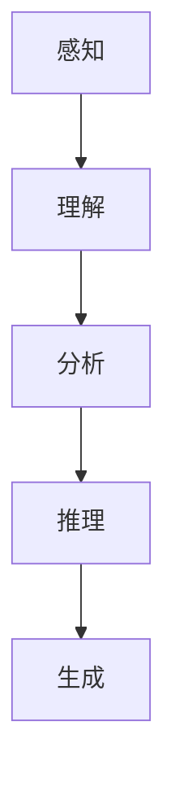
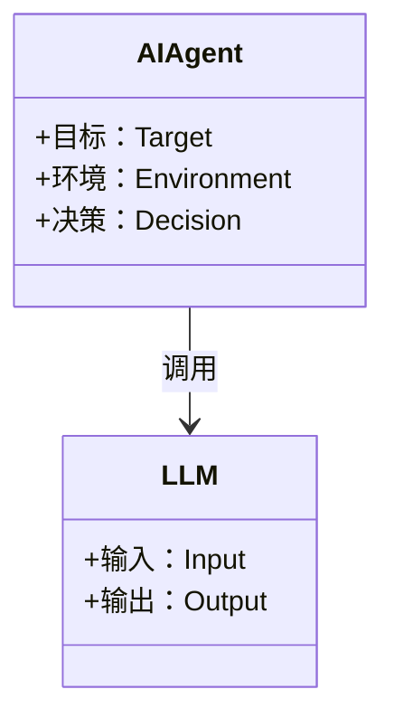
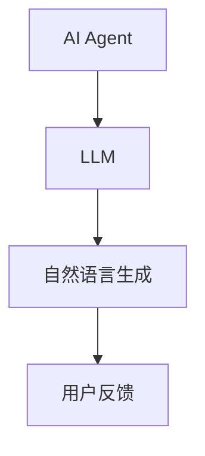
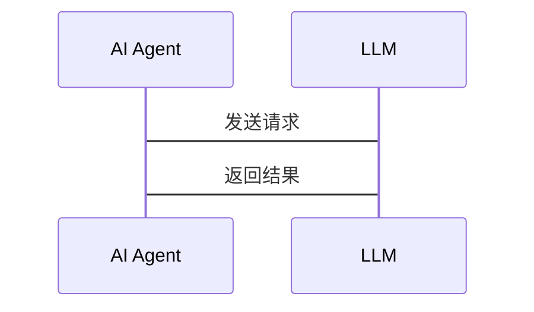

                 


# AI Agent的创新思维：激发LLM的发散性思考

> **关键词**：AI Agent，创新思维，LLM，大语言模型，发散性思考，自然语言处理，人工智能  
> **摘要**：本文探讨AI Agent如何通过创新思维激发大语言模型（LLM）的发散性思考，分析其核心概念、算法原理、系统架构，并通过实战案例和最佳实践，全面解析AI Agent的创新应用。

---

## 第一章：AI Agent的基本概念与背景

### 1.1 AI Agent的定义与特点

#### 1.1.1 AI Agent的定义
AI Agent（人工智能代理）是一种能够感知环境、自主决策并执行任务的智能实体。它通过与环境交互，利用感知信息完成目标。

#### 1.1.2 AI Agent的核心特点
- **自主性**：无需外部干预，自主完成任务。
- **反应性**：实时感知环境变化并做出反应。
- **目标导向性**：基于目标进行决策和行动。
- **学习能力**：通过经验优化行为。

#### 1.1.3 AI Agent与传统AI的区别
| 属性       | 传统AI                  | AI Agent                  |
|------------|-------------------------|---------------------------|
| 行为方式     | 静态计算，无自主行为     | 动态交互，自主决策         |
| 应用场景     | 专家系统、模式识别       | 机器人、自动驾驶、智能助手 |

### 1.2 AI Agent的发展历程

#### 1.2.1 AI Agent的起源
AI Agent的概念源于20世纪60年代的专家系统研究。

#### 1.2.2 AI Agent的演进与变革
从简单的行为反应式Agent到复杂的认知式Agent，AI Agent不断进化。

#### 1.2.3 当前AI Agent的技术现状
现代AI Agent结合了深度学习和强化学习，具备更强的自主性和学习能力。

---

## 第二章：大语言模型（LLM）与AI Agent的关系

### 2.1 大语言模型（LLM）的基本概念

#### 2.1.1 LLM的定义
LLM是基于深度学习的自然语言处理模型，能够理解和生成人类语言。

#### 2.1.2 LLM的核心技术
- **神经网络**：模型基于神经网络架构。
- **大规模训练**：通过海量数据训练，具备强大的语言理解能力。

#### 2.1.3 LLM的优势与局限性
- **优势**：强大的语言生成和理解能力。
- **局限性**：缺乏真实世界知识，需要外部数据支持。

### 2.2 AI Agent与LLM的结合

#### 2.2.1 AI Agent如何利用LLM
AI Agent通过调用LLM进行自然语言理解与生成，提升任务执行能力。

#### 2.2.2 LLM在AI Agent中的角色
- **语言理解**：帮助AI Agent理解用户需求。
- **语言生成**：生成自然语言回复，提升用户体验。

#### 2.2.3 AI Agent与LLM的协同工作
AI Agent作为决策者，LLM作为语言处理工具，二者协同完成复杂任务。

---

## 第三章：AI Agent的创新思维模型

### 3.1 创新思维模型的构建

#### 3.1.1 创新思维的基本框架
创新思维模型包括感知、理解、分析、推理和生成五个步骤。

#### 3.1.2 AI Agent的创新思维流程
1. 感知环境
2. 理解需求
3. 分析问题
4. 推理解决方案
5. 生成创新方案

#### 3.1.3 创新思维模型的数学表示
创新思维的推理过程可以用图论模型表示：
$$
\text{创新思维} = \text{感知} \oplus \text{理解} \oplus \text{分析} \oplus \text{推理} \oplus \text{生成}
$$

### 3.2 创新思维模型的实现

#### 3.2.1 基于LLM的创新思维实现
AI Agent通过调用LLM进行创新思维，生成多样化的解决方案。

#### 3.2.2 AI Agent的创新思维算法
AI Agent的创新思维算法如下：



#### 3.2.3 创新思维模型的优化与改进
通过强化学习优化创新思维模型，提升生成方案的多样性和创新性。

---

## 第四章：AI Agent的创新思维应用

### 4.1 创新思维在AI Agent中的应用领域

#### 4.1.1 自然语言处理
AI Agent通过LLM进行文本生成和理解，提升自然语言处理能力。

#### 4.1.2 问题解决与优化
AI Agent利用创新思维解决复杂问题，优化决策过程。

### 4.2 创新思维的实际案例分析

#### 4.2.1 案例一：智能助手的创新对话生成
AI Agent通过创新思维生成多样化的对话回复，提升用户体验。

#### 4.2.2 案例二：自动化系统的创新解决方案
AI Agent利用创新思维优化系统运行效率，提出创新解决方案。

---

## 第五章：系统分析与架构设计

### 5.1 问题场景介绍

#### 5.1.1 问题背景
设计一个基于AI Agent的创新思维系统，利用LLM提升系统性能。

#### 5.1.2 系统目标
实现AI Agent与LLM的协同工作，提升系统的创新能力和效率。

### 5.2 系统功能设计

#### 5.2.1 领域模型


#### 5.2.2 系统架构


### 5.3 系统接口设计

#### 5.3.1 系统接口
- **输入接口**：接收用户指令和环境数据。
- **输出接口**：生成自然语言回复和决策结果。

#### 5.3.2 交互序列图


---

## 第六章：项目实战

### 6.1 环境安装

#### 6.1.1 安装Python
```bash
python --version
pip install --upgrade pip
```

#### 6.1.2 安装必要的库
```bash
pip install transformers
pip install torch
```

### 6.2 系统核心实现

#### 6.2.1 AI Agent的核心代码
```python
class AI_Agent:
    def __init__(self, model_name):
        self.model = AutoModelForCausalCompletion.from_pretrained(model_name)
        self.tokenizer = AutoTokenizer.from_pretrained(model_name)
```

#### 6.2.2 LLM的调用代码
```python
def generate_response(prompt):
    inputs = self.tokenizer(prompt, return_tensors="np")
    outputs = self.model.generate(inputs.input_ids, max_length=50)
    return self.tokenizer.decode(outputs[0], skip_special_tokens=True)
```

### 6.3 代码应用解读

#### 6.3.1 代码功能分析
AI Agent通过调用LLM生成创新性回复，实现创新思维。

#### 6.3.2 案例分析
AI Agent在自然语言处理任务中，通过创新思维生成多样化的回复，提升用户体验。

### 6.4 项目小结
通过实战项目，验证了AI Agent与LLM协同工作的有效性，展示了创新思维的实际应用价值。

---

## 第七章：最佳实践

### 7.1 创新思维的技巧

#### 7.1.1 小结
AI Agent的创新思维需要结合实际场景，灵活运用。

#### 7.1.2 注意事项
- 确保AI Agent与LLM的有效协同。
- 定期优化创新思维模型，提升性能。

#### 7.1.3 拓展阅读
推荐阅读《Large Language Models in AI》和《Artificial Intelligence: A Modern Approach》。

---

## 作者信息

作者：AI天才研究院/AI Genius Institute & 禅与计算机程序设计艺术 /Zen And The Art of Computer Programming

