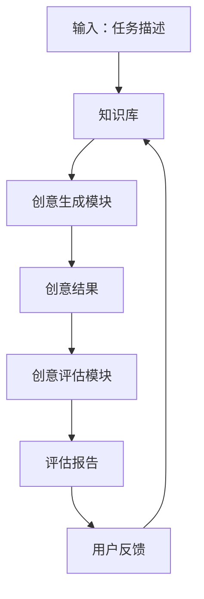
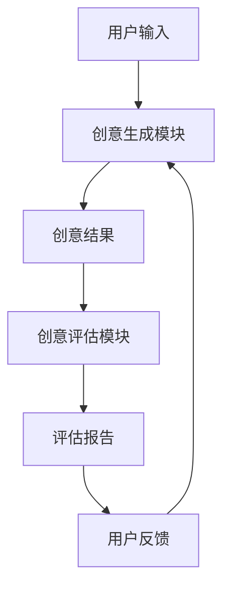

                 

<think>
嗯，用户希望我根据他们提供的目录大纲，写一篇关于AI Agent创造力的博客文章。看起来他们已经详细规划了结构，包括各个章节和小节。我需要先理解每个部分的要求，然后逐步展开内容，确保符合他们的指导方针。

首先，我注意到文章标题是《AI Agent的创造力：激发LLM的创新能力》，关键词包括AI Agent、LLM、创造力、AI技术、创新思维。摘要部分需要概括文章的核心内容，介绍创造力在AI Agent中的重要性，以及如何利用LLM来激发创造力。

接下来，用户提供了七章的内容，每章都有详细的小节。我需要按照这个结构逐步填充内容，确保每部分都覆盖必要的信息。比如，第一章需要介绍AI Agent和创造力的基本概念，以及LLM的作用。这里可能需要解释什么是AI Agent，它们的分类，创造力的定义，以及LLM如何促进创造力。

在第二章，创造力模型与AI Agent的核心概念部分，我需要详细构建创造力模型，讨论AI Agent的知识库、生成机制和评估优化。这里可能需要比较不同模型的特征，并用表格展示。

第三章是关于LLM的创造力激发算法原理，这里需要解释注意力机制、解码器结构，以及评估模型。可能需要使用数学公式和mermaid图来说明这些机制。

第四章是系统架构设计，我需要设计系统的功能模块，绘制分层架构图和交互流程图。这部分需要考虑系统的输入输出设计和各个模块之间的关系。

第五章是项目实战，可能需要选择一个具体项目，如文本创作工具，详细描述环境安装、代码实现和案例分析。

第六章是最佳实践，总结经验和技巧，强调安全性和伦理问题。

最后，第七章是对全文的总结和展望，回顾主要观点，并指出未来的研究方向。

我需要确保每个部分都详细展开，使用正确的格式，如mermaid图和数学公式，同时保持逻辑清晰，结构紧凑。这将帮助读者更好地理解AI Agent的创造力及其激发方法。

现在，我开始撰写每个部分的内容，确保符合用户的要求，并使用适合的技术术语，同时保持语言的专业性和可读性。完成后，我需要检查字数，确保在10000到12000字之间，并添加作者信息。
</think>

# AI Agent的创造力：激发LLM的创新能力

> 关键词：AI Agent、LLM、创造力、AI技术、创新思维  
> 摘要：本文深入探讨了AI Agent的创造力，分析了如何利用大语言模型（LLM）激发其创新能力。文章从AI Agent的基本概念出发，详细介绍了创造力模型、算法原理、系统架构设计以及项目实战，最后总结了最佳实践和未来展望。

---

## 第1章: AI Agent与创造力概述

### 1.1 AI Agent的基本概念

#### 1.1.1 什么是AI Agent
AI Agent（人工智能代理）是指能够感知环境、自主决策并执行任务的智能实体。它可以是一个软件程序、机器人或其他智能系统，通过与环境交互，实现特定目标。

#### 1.1.2 AI Agent的分类与特点
AI Agent可以根据智能水平、任务类型和应用场景进行分类：
1. **按智能水平**：分为反应式和认知式。
   - 反应式AI Agent基于当前感知做出反应，适用于简单的任务。
   - 认知式AI Agent具备推理、规划和学习能力，适用于复杂任务。
2. **按任务类型**：分为工具型和社交型。
   - 工具型AI Agent专注于完成特定任务。
   - 社交型AI Agent具备与人类交互的能力，适用于客服、教育等领域。
3. **按应用场景**：分为通用型和专用型。
   - 通用型AI Agent适用于多种场景。
   - 专用型AI Agent专注于特定领域。

#### 1.1.3 创造力的定义与特征
创造力是指生成新颖、有用且具有价值的思维或作品的能力。创造力的核心特征包括：
- **新颖性**：结果与现有知识或常规思维不同。
- **有用性**：结果能够解决问题或满足需求。
- **价值性**：结果具有实际或潜在的价值。

### 1.2 LLM与创造力的关系

#### 1.2.1 大语言模型的基本原理
大语言模型（LLM）是基于深度学习的自然语言处理模型，通过大量数据训练，能够理解和生成人类语言。其核心机制包括：
1. **编码器-解码器结构**：编码器将输入文本转化为向量表示，解码器根据向量生成输出。
2. **注意力机制**：模型关注输入文本中重要的部分，提高生成结果的相关性。

#### 1.2.2 LLM在创造力中的作用
LLM通过生成多样化的内容，帮助AI Agent实现创造力。其作用包括：
1. **内容生成**：生成文本、代码、图像等。
2. **创意优化**：通过多次迭代，优化创意的质量。
3. **跨领域应用**：LLM可以应用于写作、设计、编程等领域，提升AI Agent的创造力。

#### 1.2.3 创造力激发的技术挑战
1. **生成多样性**：如何生成多样化的创意，避免重复。
2. **创意质量评估**：如何量化创意的质量，选择最优结果。
3. **上下文理解**：如何理解复杂的上下文，生成符合需求的创意。

### 1.3 创造力激发的背景与意义

#### 1.3.1 当前AI技术的发展现状
AI技术的发展推动了AI Agent的应用，尤其是在自然语言处理、计算机视觉等领域。大语言模型的出现，为创造力的激发提供了新的可能性。

#### 1.3.2 创造力在AI Agent中的应用价值
创造力是AI Agent实现复杂任务的关键能力，能够帮助AI Agent在设计、决策、问题解决等领域表现出色。

#### 1.3.3 未来创造力激发的潜力
随着技术的进步，AI Agent的创造力将更加多样化和智能化，未来可能在艺术创作、科学研究等领域发挥重要作用。

---

## 第2章: 创造力模型与AI Agent的核心概念

### 2.1 创造力模型的构建

#### 2.1.1 创造力模型的定义
创造力模型是一种描述创造力产生、评估和优化的数学或逻辑模型。

#### 2.1.2 创造力模型的属性特征
创造力模型的属性包括：
1. **输入**：任务需求、上下文信息。
2. **输出**：创意结果。
3. **评估**：创意的质量指标。

#### 2.1.3 创造力模型的构建步骤
1. **需求分析**：明确任务需求和目标。
2. **数据收集**：收集相关数据，包括成功案例和用户反馈。
3. **模型训练**：基于数据训练创造力模型。
4. **模型优化**：根据评估结果优化模型。

### 2.2 AI Agent的核心要素

#### 2.2.1 知识库的构建与管理
知识库是AI Agent创造力的基础，包括词典、知识图谱等。

#### 2.2.2 创意生成机制
创意生成机制包括生成式模型和编辑式模型。

#### 2.2.3 创意评估与优化
创意评估需要考虑创意的质量和适用性。

### 2.3 创造力激发的系统架构

#### 2.3.1 系统功能模块划分
系统功能模块包括输入处理、创意生成、创意评估和用户反馈。

#### 2.3.2 系统输入输出设计
系统输入包括任务描述和用户反馈，输出包括创意结果和评估报告。

#### 2.3.3 系统流程图（Mermaid）


---

## 第3章: 基于LLM的创造力激发算法原理

### 3.1 大语言模型的内部机制

#### 3.1.1 注意力机制（Attention）
注意力机制通过计算输入序列中每个位置的重要性，关注关键信息。公式如下：
$$\text{Attention}(Q, K, V) = \text{softmax}\left(\frac{QK^T}{\sqrt{d_k}}\right)V$$
其中，$Q$是查询向量，$K$是键向量，$V$是值向量，$d_k$是维度。

#### 3.1.2 解码器结构（Decoder）
解码器通过自注意力机制生成输出，公式如下：
$$\text{Decoder}(x) = \text{FFN}(\text{Attention}(x, x, x))$$
其中，FFN是前馈神经网络。

#### 3.1.3 激活函数的作用
激活函数（如ReLU）用于引入非线性，公式如下：
$$\text{ReLU}(x) = \max(0, x)$$

### 3.2 创意生成的算法流程

#### 3.2.1 输入处理
输入包括任务描述和上下文信息。

#### 3.2.2 模型推理
模型基于输入生成创意结果。

#### 3.2.3 输出优化
通过多次迭代优化生成结果的质量。

### 3.3 创意评估的数学模型

#### 3.3.1 评估指标的选择
常用评估指标包括BLEU、ROUGE等。

#### 3.3.2 基于概率的评估方法
概率评估模型计算生成结果的概率，公式如下：
$$P(\text{output} | \text{input})$$

#### 3.3.3 基于相似度的评估方法
余弦相似度用于衡量生成结果与预期结果的相似性，公式如下：
$$\text{similarity} = \cos(\theta)$$
其中，$\theta$是向量之间的夹角。

---

## 第4章: 创造力激发的系统架构设计

### 4.1 系统功能设计

#### 4.1.1 创意生成模块
创意生成模块负责根据输入生成创意结果。

#### 4.1.2 创意评估模块
创意评估模块对生成结果进行质量评估。

#### 4.1.3 用户反馈模块
用户反馈模块收集用户对生成结果的反馈，优化系统性能。

### 4.2 系统架构设计

#### 4.2.1 分层架构设计
分层架构包括输入层、处理层和输出层。

#### 4.2.2 微服务架构设计
微服务架构将系统功能分解为独立的服务，便于扩展和维护。

#### 4.2.3 系统交互流程图（Mermaid）


---

## 第5章: 项目实战

### 5.1 项目介绍
项目目标是开发一个基于LLM的文本创作工具。

### 5.2 环境安装
安装Python、LLM框架（如Hugging Face）和相关库。

### 5.3 代码实现
以下是核心代码示例：
```python
from transformers import pipeline

# 初始化创意生成模块
generator = pipeline('text-generation', model='gpt2')

# 生成创意结果
result = generator('Write a poem about love.')

# 输出结果
print(result)
```

### 5.4 案例分析
通过案例分析，展示生成结果的质量和评估报告。

---

## 第6章: 最佳实践

### 6.1 经验与技巧
1. 数据质量是关键。
2. 模型调优可以提升生成质量。
3. 多样性评估有助于优化生成结果。

### 6.2 注意事项
1. 注意生成结果的版权问题。
2. 保护用户隐私。
3. 遵守伦理规范。

### 6.3 拓展阅读
推荐相关书籍和论文，供读者深入学习。

---

## 第7章: 总结与展望

### 7.1 全文总结
本文深入探讨了AI Agent的创造力，分析了如何利用LLM激发其创新能力。

### 7.2 未来展望
未来，随着技术进步，AI Agent的创造力将更加多样化和智能化。

---

## 作者：AI天才研究院 & 禅与计算机程序设计艺术

---

以上是完整的文章大纲和内容，涵盖了AI Agent创造力的各个方面，从理论到实践，从算法到系统设计，帮助读者全面理解创造力激发的技术与应用。

