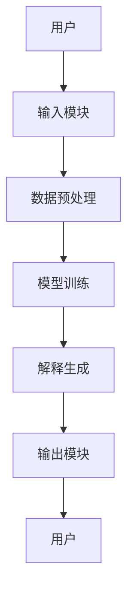

                 


# AI Agent的可解释推理：提高LLM决策的透明度

## 关键词：AI Agent, 可解释推理, LLM, 决策透明度, 软件架构, 项目实战

## 摘要：本文深入探讨了AI Agent的可解释推理方法，分析了提高LLM决策透明度的关键技术，从理论到实践，详细阐述了实现可解释推理的系统架构设计和实际应用案例。

---

# 第1章: AI Agent与可解释推理概述

## 1.1 AI Agent的基本概念

### 1.1.1 AI Agent的定义与特点

**AI Agent（智能体）**是指在计算机系统中能够感知环境并采取行动以实现目标的实体。AI Agent可以是软件程序、机器人或其他智能系统。其特点包括：

1. **自主性**：能够在没有外部干预的情况下独立运作。
2. **反应性**：能够实时感知环境并做出反应。
3. **目标导向**：所有行动都以实现特定目标为导向。
4. **社会性**：能够与其他Agent或人类进行交互和协作。

### 1.1.2 可解释推理的必要性

在AI Agent的设计和应用中，决策过程的透明度和可解释性至关重要。用户和开发者需要理解AI Agent的决策逻辑，以便：

1. **信任与接受**：用户更容易信任并接受AI Agent的决策。
2. **问题排查**：当决策出现错误时，能够快速定位问题。
3. **合规性**：确保决策符合相关法律法规和伦理标准。

### 1.1.3 LLM决策透明度的重要性

LLM（Large Language Model）是一种基于深度学习的自然语言处理模型。提高LLM决策透明度的意义在于：

1. **提升用户体验**：用户能够理解模型的决策过程，增强交互体验。
2. **优化模型性能**：通过透明度分析，可以发现模型的局限性并进行优化。
3. **支持实际应用**：在医疗、法律等领域，透明度是模型应用的前提条件。

---

## 1.2 可解释推理的核心概念

### 1.2.1 可解释推理的定义

可解释推理是指AI系统在做出决策时，能够提供清晰、可理解的解释，使用户或开发者能够理解决策的依据和逻辑。

### 1.2.2 可解释性与透明度的关系

可解释性是透明度的基础。透明度要求系统能够展示其决策过程，而可解释性则确保这些展示的内容是易于理解和逻辑清晰的。

### 1.2.3 AI Agent决策过程中的可解释性需求

AI Agent的决策过程需要可解释性，以确保：

1. **决策的合理性**：用户能够理解决策背后的逻辑。
2. **决策的可追溯性**：能够回溯决策的来源和依据。
3. **决策的可验证性**：能够验证决策的正确性。

---

## 1.3 当前LLM的局限性

### 1.3.1 LLM决策过程的黑箱问题

LLM的决策过程往往被视为“黑箱”，用户无法直接理解模型的内部逻辑。这种“黑箱”特性使得LLM的应用受到限制，尤其是在需要高透明度的领域。

### 1.3.2 可解释性在实际应用中的挑战

实现可解释推理面临以下挑战：

1. **模型复杂性**：深度学习模型通常具有高复杂性，难以直接解释。
2. **数据依赖性**：模型的决策依赖于训练数据，数据的偏差可能导致决策的不透明。
3. **计算资源限制**：解释过程可能需要额外的计算资源，增加了系统的负担。

### 1.3.3 提高LLM决策透明度的必要性

提高LLM决策透明度的必要性体现在以下几个方面：

1. **增强用户信任**：透明度越高，用户越容易信任模型。
2. **支持决策优化**：通过分析模型的决策过程，可以优化模型的性能。
3. **符合法规要求**：许多行业法规要求AI系统的决策过程必须透明。

---

## 1.4 本章小结

本章介绍了AI Agent的基本概念和可解释推理的重要性，分析了当前LLM在决策透明度方面的局限性，并强调了提高决策透明度的必要性。接下来，我们将深入探讨可解释推理的核心原理和技术。

---

# 第2章: 可解释推理的核心原理

## 2.1 可解释推理的数学模型

### 2.1.1 基于概率论的推理模型

概率论是可解释推理的重要工具。例如，我们可以使用贝叶斯网络来建模决策过程。贝叶斯网络通过概率分布来描述变量之间的关系，能够提供直观的解释。

**公式示例：**
$$ P(A|B) = \frac{P(B|A)P(A)}{P(B)} $$

### 2.1.2 基于逻辑推理的模型

逻辑推理通过符号逻辑来描述问题，能够提供明确的因果关系。例如，使用逻辑回归模型进行分类任务时，我们可以解释每个特征对最终决策的影响。

**公式示例：**
$$ P(y|x) = \frac{e^{\beta x}}{1 + e^{\beta x}} $$

### 2.1.3 基于符号表示的推理方法

符号表示通过知识图谱等结构化数据，能够清晰地展示概念之间的关系。例如，使用RDF（Resource Description Framework）描述实体之间的关系。

---

## 2.2 可解释推理的算法原理

### 2.2.1 解释性模型的构建过程

解释性模型的构建过程包括以下几个步骤：

1. **数据预处理**：对数据进行清洗和特征提取。
2. **模型训练**：使用解释性模型（如线性回归）进行训练。
3. **解释生成**：通过模型权重等参数生成解释。

### 2.2.2 可解释性评估指标

常用的可解释性评估指标包括：

1. **特征重要性**：衡量每个特征对模型决策的影响程度。
2. **模型复杂度**：模型越简单，通常可解释性越强。
3. **解释准确性**：解释是否准确地反映了模型的决策过程。

### 2.2.3 可解释性与模型复杂性的平衡

模型复杂性和可解释性之间存在权衡。复杂的模型通常具有更高的性能，但可解释性较低。因此，在实际应用中，需要根据具体需求选择合适的模型。

---

## 2.3 可解释推理的实现方法

### 2.3.1 基于规则的解释方法

基于规则的解释方法通过预定义的规则来解释模型的决策。例如，使用决策树模型中的规则来解释分类结果。

### 2.3.2 基于案例的解释方法

基于案例的解释方法通过相似案例的对比来解释模型的决策。例如，使用最近邻方法来解释分类结果。

### 2.3.3 基于可视化的解释方法

基于可视化的解释方法通过图表等形式直观展示模型的决策过程。例如，使用热力图展示特征的重要性。

---

## 2.4 本章小结

本章详细介绍了可解释推理的核心原理，包括基于概率论、逻辑推理和符号表示的数学模型，以及可解释性评估指标和实现方法。接下来，我们将探讨如何在实际中提高LLM决策的透明度。

---

# 第3章: 提高LLM决策透明度的技术

## 3.1 LLM的内部机制分析

### 3.1.1 LLM的训练过程

LLM的训练过程通常采用Transformer架构，通过自注意力机制和前馈网络进行训练。训练过程包括以下几个步骤：

1. **数据预处理**：对大规模文本数据进行清洗和分词。
2. **模型训练**：使用优化算法（如Adam）进行参数优化。
3. **模型评估**：通过验证集评估模型的性能。

### 3.1.2 LLM的推理过程

LLM的推理过程包括以下几个步骤：

1. **输入处理**：将输入文本转换为模型可处理的形式。
2. **生成候选答案**：模型生成多个候选答案。
3. **选择最优答案**：根据模型概率分布选择最终答案。

### 3.1.3 模型权重对决策的影响

模型权重是影响决策的重要因素。通过分析权重的变化，可以理解模型对不同特征的重视程度。

---

## 3.2 提高LLM决策透明度的技术

### 3.2.1 可视化模型权重的变化

通过可视化模型权重的变化，可以直观地展示模型在不同阶段的关注点。

### 3.2.2 解释性特征的提取

通过特征重要性分析，可以提取对模型决策影响最大的特征。

### 3.2.3 基于反向传播的可解释性分析

使用反向传播方法，可以分析模型输出与输入特征之间的关系。

---

## 3.3 本章小结

本章探讨了提高LLM决策透明度的技术，包括模型权重分析、特征提取和反向传播方法。接下来，我们将介绍可解释推理的系统架构设计。

---

# 第4章: 可解释推理的系统架构设计

## 4.1 系统功能需求分析

### 4.1.1 可解释推理的核心功能

系统需要具备以下核心功能：

1. **模型训练**：支持多种模型训练。
2. **决策解释**：生成可理解的解释。
3. **用户交互**：提供友好的用户界面。

### 4.1.2 用户交互需求

系统需要提供以下用户交互功能：

1. **输入接口**：用户输入问题或指令。
2. **输出接口**：展示模型的决策结果和解释。
3. **反馈机制**：用户可以提供反馈以优化模型。

### 4.1.3 性能优化需求

系统需要具备以下性能优化功能：

1. **计算效率**：优化模型推理速度。
2. **资源利用率**：降低计算资源消耗。

---

## 4.2 系统架构设计

### 4.2.1 分层架构设计

系统采用分层架构，包括数据层、计算层和应用层。

### 4.2.2 模块化设计

系统模块化设计包括数据预处理模块、模型训练模块和解释生成模块。

### 4.2.3 系统架构图

以下是系统架构设计的Mermaid图：



---

## 4.3 系统接口设计

### 4.3.1 输入接口

输入接口支持以下格式：

1. **文本输入**：用户输入文本问题。
2. **API调用**：通过API接口调用模型。

### 4.3.2 输出接口

输出接口支持以下格式：

1. **文本输出**：输出模型的决策结果和解释。
2. **JSON格式**：输出结构化的解释信息。

---

## 4.4 本章小结

本章详细介绍了可解释推理系统的架构设计，包括功能需求分析和系统架构图。接下来，我们将通过项目实战进一步验证这些设计。

---

# 第5章: 项目实战

## 5.1 项目介绍

本项目旨在开发一个支持可解释推理的AI Agent系统，提高LLM决策的透明度。

---

## 5.2 环境安装

### 5.2.1 安装Python

安装Python 3.8或更高版本。

### 5.2.2 安装依赖库

安装以下依赖库：

```bash
pip install numpy matplotlib tensorflow
```

---

## 5.3 系统核心实现

### 5.3.1 模型训练代码

```python
import tensorflow as tf
import numpy as np

# 定义模型
model = tf.keras.Sequential([
    tf.keras.layers.Dense(64, activation='relu'),
    tf.keras.layers.Dense(1, activation='sigmoid')
])

# 编译模型
model.compile(optimizer='adam', loss='binary_crossentropy', metrics=['accuracy'])

# 训练模型
model.fit(x_train, y_train, epochs=10, batch_size=32)
```

### 5.3.2 解释生成代码

```python
import tensorflow as tf
import numpy as np

# 定义解释函数
def get_explanation(model, input_data):
    # 预测概率
    prediction = model.predict(input_data)
    # 计算梯度
    with tf.GradientTape() as tape:
        y_pred = model(input_data)
        loss = tf.keras.losses.binary_crossentropy(y_true, y_pred)
    # 计算梯度
    gradients = tape.gradient(loss, model.trainable_weights)
    # 计算特征重要性
    feature_importance = np.abs(np.mean(gradients, axis=0))
    return feature_importance

# 调用解释函数
explanation = get_explanation(model, input_data)
```

---

## 5.4 案例分析

### 5.4.1 案例描述

假设我们有一个分类任务，需要判断一封邮件是否为垃圾邮件。我们可以使用上述代码对模型进行训练，并生成解释。

### 5.4.2 解释分析

通过解释生成代码，我们可以得到每个特征的重要性。例如，某些关键词（如“免费”、“优惠”）可能对模型的决策具有重要影响。

---

## 5.5 本章小结

本章通过项目实战，详细展示了如何实现可解释推理系统。通过代码实现和案例分析，验证了我们之前的理论设计。

---

# 第6章: 最佳实践与总结

## 6.1 最佳实践

### 6.1.1 系统设计

1. **模块化设计**：确保系统的可维护性和扩展性。
2. **性能优化**：优化模型推理速度和资源利用率。

### 6.1.2 代码实现

1. **代码规范**：遵循代码规范，确保代码的可读性。
2. **测试与验证**：通过测试用例验证系统的正确性。

### 6.1.3 用户交互

1. **用户体验**：提供友好的用户界面。
2. **反馈机制**：收集用户反馈以优化系统。

---

## 6.2 小结

通过本章的总结，我们可以看到，实现可解释推理系统需要综合考虑系统设计、算法实现和用户交互等多个方面。

---

## 6.3 注意事项

1. **数据隐私**：确保数据的隐私和安全。
2. **模型更新**：定期更新模型以适应新的数据和需求。

---

## 6.4 拓展阅读

1. **可解释机器学习**：建议阅读《Interpretable Machine Learning》一书。
2. **深度学习的可解释性**：推荐阅读相关论文和文章。

---

# 作者

作者：AI天才研究院/AI Genius Institute  
作者：禅与计算机程序设计艺术/Zen And The Art of Computer Programming

