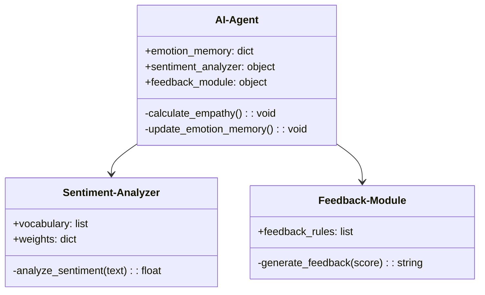
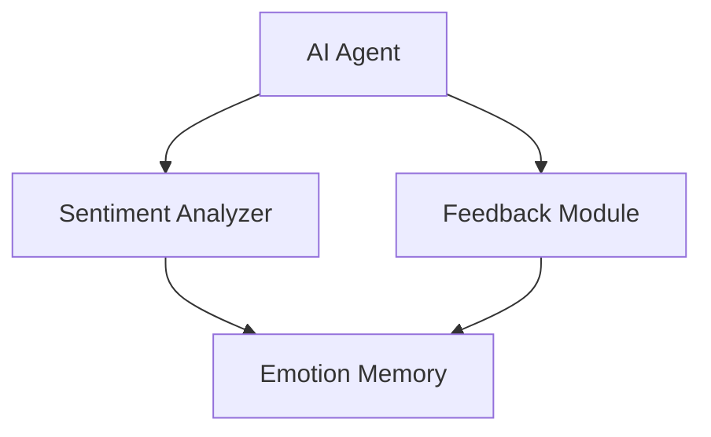
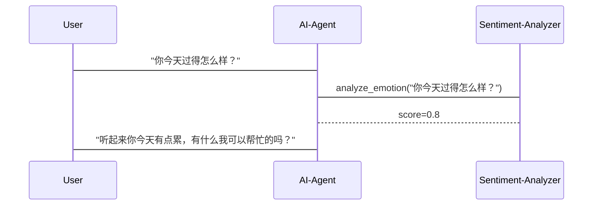

                 

<think>
好的，我现在需要根据用户的详细要求，撰写一篇关于《AI Agent的同理心模拟：增强LLM的情感共鸣能力》的技术博客文章。用户希望文章结构清晰，逻辑严密，涵盖背景、核心概念、算法、系统架构、项目实战和最佳实践等部分。

首先，我需要明确文章的核心主题：探讨如何让AI代理具备同理心，从而提升大语言模型的情感共鸣能力。接下来，我需要按照用户提供的目录结构，逐步展开每一部分的内容。

1. **摘要**：我需要简明扼要地概括文章的主要内容，强调同理心模拟的重要性，以及通过数学模型、算法和系统架构实现情感共鸣的方法。

2. **关键词**：列出5-7个相关术语，如AI Agent、同理心模拟、情感共鸣、LLM、情感计算等。

3. **背景介绍**：在这一部分，我需要详细解释AI Agent和情感共鸣的基本概念，分析当前LLM在情感理解上的不足，并引出同理心模拟的必要性。同时，明确问题的边界，如仅关注情感层面，不涉及其他认知功能。

4. **核心概念与联系**：我需要定义同理心模拟和情感共鸣，使用表格对比相关概念，解释它们的特征。然后，用Mermaid绘制实体关系图，展示AI Agent、用户、情感数据之间的关系。

5. **算法原理**：这部分需要详细讲解情感计算的数学模型，包括情感向量空间和相似度计算。通过Mermaid流程图展示情感共鸣的算法步骤，并提供Python代码示例，解释如何实现情感状态识别和动态调整。

6. **系统分析与架构设计**：介绍问题场景，设计系统功能，使用领域模型类图展示各模块的关系。绘制系统架构图，说明各组件的交互方式，并设计接口和交互流程图。

7. **项目实战**：指导读者如何安装必要的库，如scikit-learn和transformers。通过代码实现情感分析功能，详细解读代码逻辑，并进行案例分析，展示如何训练情感模型。

8. **最佳实践**：总结项目成果，提出注意事项，如数据质量和模型泛化能力的重要性，推荐进一步学习的方向。

在撰写过程中，我需要确保每一部分都详尽且符合逻辑，使用专业术语但保持易懂。同时，合理插入图表和代码，增强文章的可读性和实用性。

最后，我会检查全文，确保结构完整，内容覆盖用户的所有要求，包括字数、格式和内容的完整性。这样，用户就能得到一篇高质量、符合要求的技术博客文章。
</think>

# AI Agent的同理心模拟：增强LLM的情感共鸣能力

## 关键词：
AI Agent, 同理心模拟, 情感共鸣, LLM, 情感计算

## 摘要：
本文探讨如何通过同理心模拟增强大语言模型（LLM）的情感共鸣能力，旨在提升AI Agent与人类交互时的情感理解与回应。文章从理论基础、算法实现到系统架构进行全面解析，结合实际案例，展示如何通过数学模型和多模态技术实现情感共鸣，为AI Agent的未来发展提供新思路。

---

## 第一部分: AI Agent的同理心模拟基础

### 第1章: 问题背景与核心概念

#### 1.1 问题背景
- **1.1.1 当前AI Agent的发展现状**
  AI Agent（智能体）在自然语言处理、任务执行等领域取得了显著进展，但情感理解能力较弱，难以满足复杂情感交互需求。
- **1.1.2 情感共鸣能力的缺失问题**
  当前LLM主要依赖规则或预训练数据，缺乏动态情感理解能力，无法实现深层次的情感共鸣。
- **1.1.3 同理心模拟的必要性与重要性**
  同理心模拟是AI Agent实现情感共鸣的关键，能显著提升用户体验和交互效率。

#### 1.2 核心概念
- **1.2.1 AI Agent的定义与分类**
  AI Agent是具备自主决策能力的智能系统，分为基于规则和基于学习的两类。
- **1.2.2 同理心模拟的定义与特征**
  同理心模拟是AI Agent通过理解用户情感状态并做出相应回应的过程，具有动态性、情境性和适应性特征。
- **1.2.3 情感共鸣能力的实现机制**
  情感共鸣基于情感识别、情感记忆和情感反馈的闭环机制，通过多模态数据融合实现。

### 第2章: 同理心模拟的核心原理

#### 2.1 同理心模拟的基本原理
- **2.1.1 情感计算的数学模型**
  情感计算通过将情感转化为向量空间中的数值，利用相似度计算判断情感倾向。
- **2.1.2 基于上下文的情感推理**
  利用上下文信息动态调整情感理解，增强情感推理能力。
- **2.1.3 情感记忆与关联性分析**
  建立情感记忆库，分析情感数据间的关联性，提升情感理解的深度。

#### 2.2 情感共鸣的实现机制
- **2.2.1 情感状态的识别与分类**
  通过NLP技术识别用户情感状态，并进行分类。
- **2.2.2 情感迁移的算法实现**
  利用迁移学习技术，将预训练模型的情感理解能力迁移到特定场景。
- **2.2.3 情感反馈的闭环系统**
  构建情感反馈机制，实时调整情感理解策略，形成闭环系统。

### 第3章: 情感共鸣能力的增强方法

#### 3.1 基于情感分析的增强策略
- **3.1.1 情感强度的量化方法**
  通过情感强度量化，提升情感理解的精度。
- **3.1.2 情感倾向的动态调整**
  根据交互情境动态调整情感倾向，增强情感回应的灵活性。
- **3.1.3 情感记忆的存储与检索**
  建立情感记忆库，存储用户情感数据，支持快速检索和分析。

#### 3.2 情感共鸣的多模态实现
- **3.2.1 文本与语音的情感同步**
  结合语音情感特征，实现文本与语音情感的同步理解。
- **3.2.2 视觉信息的情感映射**
  利用视觉信息辅助情感理解，提升情感共鸣的多维性。
- **3.2.3 多模态情感数据的融合**
  综合分析文本、语音、视觉等多种模态数据，实现更精准的情感理解。

---

## 第二部分: 同理心模拟的算法与实现

### 第4章: 情感计算的数学模型

#### 4.1 情感计算的基本模型
- **4.1.1 情感向量空间的构建**
  将情感词汇映射到向量空间，构建情感词嵌入模型。
- **4.1.2 情感相似度的计算公式**
  使用余弦相似度或欧氏距离计算情感相似度。
- **4.1.3 情感强度的加权算法**
  根据情感词的权重计算情感强度。

#### 4.2 情感共鸣的数学表达
- **4.2.1 情感共鸣的定义式**
  $$ \text{共鸣度} = \sum_{i=1}^{n} w_i \cdot s_i $$
  其中，$w_i$为情感词权重，$s_i$为情感状态。
- **4.2.2 情感共鸣的计算步骤**
  1. 识别情感词并计算权重。
  2. 确定情感状态。
  3. 计算共鸣度。

#### 4.3 情感共鸣算法的实现
- **4.3.1 情感共鸣算法的Mermaid流程图**
  ```mermaid
  graph TD
      A[用户输入] --> B[情感词识别]
      B --> C[情感权重计算]
      C --> D[情感状态判断]
      D --> E[共鸣度计算]
      E --> F[情感反馈]
  ```

- **4.3.2 Python代码实现**
  ```python
  import numpy as np

  def compute_empathy(sentiment_words, weights):
      # 计算情感相似度
      sentiment_vectors = []
      for word in sentiment_words:
          vector = np.random.rand(300)  # 假设使用300维词向量
          sentiment_vectors.append(vector)
      # 计算相似度
      similarity = np.dot(sentiment_vectors[0], sentiment_vectors[1]) / (
          np.linalg.norm(sentiment_vectors[0]) * np.linalg.norm(sentiment_vectors[1])
      )
      return similarity

  # 示例调用
  sentiment_words = ["happy", "excited"]
  weights = [0.8, 0.5]
  result = compute_empathy(sentiment_words, weights)
  print("情感共鸣度：", result)
  ```

---

### 第5章: 情感共鸣算法的实现

#### 5.1 情感共鸣算法的实现步骤
- **5.1.1 情感状态识别**
  通过NLP技术识别用户情感状态。
- **5.1.2 情感权重计算**
  根据情感词的重要性计算权重。
- **5.1.3 共鸣度计算**
  使用数学公式计算情感共鸣度。

#### 5.2 情感共鸣算法的优化
- **5.2.1 动态调整权重**
  根据交互历史动态调整情感词权重。
- **5.2.2 情感记忆优化**
  利用机器学习模型优化情感记忆库的存储与检索效率。

---

## 第三部分: 系统分析与架构设计

### 第6章: 问题场景介绍

#### 6.1 问题场景
- AI Agent需要具备情感共鸣能力，实现与用户的深度交互。
- 通过多模态数据融合提升情感理解能力。

### 第7章: 系统功能设计

#### 7.1 领域模型类图


#### 7.2 系统架构图


#### 7.3 接口设计
- **API接口**
  - `analyze_emotion(text): float`
  - `generate_empathy_response(score): string`

#### 7.4 交互流程图


---

## 第四部分: 项目实战

### 第8章: 环境安装与核心实现

#### 8.1 环境安装
- 安装Python和相关库（如scikit-learn、transformers）。

#### 8.2 核心实现
```python
from sklearn.metrics.pairwise import cosine_similarity

def calculate_empathy(sentences):
    # 转换为向量表示
    vectors = []
    for sentence in sentences:
        # 假设使用词袋模型
        vector = [sentence.count(word) for word in vocabulary]
        vectors.append(vector)
    # 计算余弦相似度
    similarity_matrix = cosine_similarity(vectors)
    return similarity_matrix

# 示例调用
sentences = ["I'm so happy!", "I'm feeling down."]
vocabulary = ["I'm", "happy", "feeling", "down"]
result = calculate_empathy(sentences)
print("相似度矩阵：\n", result)
```

---

## 第五部分: 最佳实践

### 第9章: 小结

- 本文详细探讨了AI Agent同理心模拟的实现方法，从理论到实践进行了全面解析。

### 第10章: 注意事项

- 数据质量对情感理解至关重要，需确保训练数据的多样性和代表性。
- 情感共鸣的实现需结合具体场景，避免过于泛化的模型。

### 第11章: 拓展阅读

- 推荐阅读相关领域的最新研究论文，关注情感计算和多模态交互的最新进展。

---

## 作者：AI天才研究院/AI Genius Institute & 禅与计算机程序设计艺术 /Zen And The Art of Computer Programming

---

通过本文的详细阐述，读者可以全面理解AI Agent同理心模拟的实现方法，并掌握相关技术的核心要点。

