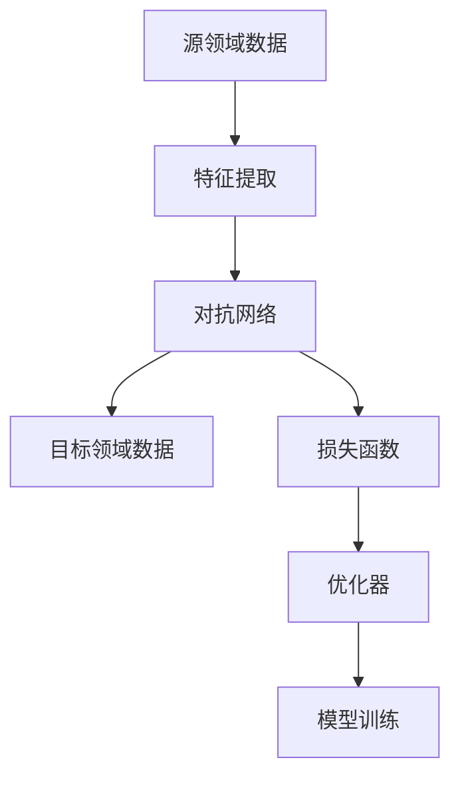

                 


# AI Agent的域适应技术：跨领域知识迁移

> 关键词：AI Agent，域适应，知识迁移，跨领域，机器学习

> 摘要：本文深入探讨了AI Agent在不同领域之间的知识迁移技术，重点介绍了域适应技术的核心概念、算法原理、系统架构设计以及实际应用案例。通过详细的理论分析和代码示例，帮助读者全面理解跨领域知识迁移的实现方法和应用场景。

---

# 目录

1. **引言**
2. **域适应技术的核心概念**
3. **域适应算法的数学模型与公式**
4. **域适应技术的系统架构设计**
5. **域适应技术的项目实战**
6. **域适应技术的最佳实践与注意事项**
7. **结论与展望**

---

# 1. 引言

## 1.1 问题背景

在人工智能领域，AI Agent（智能体）的任务通常是基于训练数据进行推理和决策。然而，现实场景中，AI Agent需要在多个领域（如医疗、金融、教育等）中进行任务处理。由于不同领域之间的数据分布存在差异，直接将一个领域中的模型应用于另一个领域时，可能会导致性能下降甚至完全失效。这种现象被称为**领域漂移（Domain Shift）**。

## 1.2 问题描述

域漂移问题主要表现在以下方面：
- 数据分布的差异：同一特征在不同领域的统计分布不同。
- 标签空间的差异：不同领域中的标签可能完全不同或部分重叠。
- 领域知识的差异：不同领域中的专业术语和知识体系不同。

## 1.3 域适应技术的定义与目标

**域适应（Domain Adaptation）**是一种机器学习技术，旨在通过适应模型，使得在源领域（source domain）上训练好的模型能够在目标领域（target domain）上保持较好的性能。其核心目标是解决领域漂移问题，实现跨领域知识的有效迁移。

---

# 2. 域适应技术的核心概念

## 2.1 核心概念原理

域适应技术的核心思想是通过构建领域不变性特征，使得模型在不同领域中都能保持一致的表示能力。具体来说，域适应技术通常涉及以下步骤：
1. **特征提取**：从源领域和目标领域中提取特征。
2. **域对齐**：通过某种机制使得源领域和目标领域的特征分布尽可能接近。
3. **模型训练**：在对齐后的特征上训练模型，使其能够在目标领域中表现良好。

## 2.2 域适应技术的核心要素

以下是域适应技术的核心要素：
1. **特征提取器**：用于从数据中提取有用的特征。
2. **域对齐机制**：通过对抗训练或其他方法对齐源领域和目标领域的特征分布。
3. **模型优化器**：用于优化模型的性能，通常采用端到端的优化方法。

---

# 3. 域适应算法的数学模型与公式

## 3.1 基于对抗训练的域适应模型

### 3.1.1 域对抗网络（Domain Adversarial Network, DANN）

**DANN**是一种经典的域适应算法，通过引入对抗网络来实现源领域和目标领域的对齐。其核心思想是通过一个领域分类器来区分源领域和目标领域的特征，从而迫使特征提取器提取领域无关的特征。

#### 模型结构
- **特征提取器（Feature Extractor）**：将输入数据映射到一个特征空间。
- **领域分类器（Domain Classifier）**：根据特征判断数据所属的领域。
- **任务分类器（Task Classifier）**：基于特征对任务进行分类。

#### 损失函数
DANN的目标是最小化任务分类器的错误率，同时最大化领域分类器的区分能力。其损失函数如下：

$$ \mathcal{L}_{\text{total}} = \mathcal{L}_{\text{task}} + \lambda \mathcal{L}_{\text{domain}} $$

其中：
- $\mathcal{L}_{\text{task}}$：任务分类器的损失。
- $\mathcal{L}_{\text{domain}}$：领域分类器的损失。
- $\lambda$：平衡参数，用于权衡任务损失和领域损失的重要性。

---

## 3.2 基于最大均值差异（Maximum Mean Discrepancy, MMD）的域适应

**MMD**是一种非参数统计方法，用于衡量两个分布之间的差异。其核心思想是通过计算源领域和目标领域特征的均值差异，将其作为领域对齐的损失。

#### 公式
MMD的计算公式为：

$$ \text{MMD}(P, Q) = \mathbb{E}_{x \sim P}[f(x)] - \mathbb{E}_{x \sim Q}[f(x)] $$

其中：
- $P$和$Q$分别为源领域和目标领域的数据分布。
- $f(x)$是特征提取器的输出。

---

# 4. 域适应技术的系统架构设计

## 4.1 系统功能设计

以下是域适应技术的系统功能模块：
1. **数据预处理模块**：对源领域和目标领域的数据进行清洗和预处理。
2. **特征提取模块**：从数据中提取特征。
3. **域对齐模块**：通过对抗训练或其他方法对齐源领域和目标领域的特征分布。
4. **模型训练模块**：在对齐后的特征上训练任务分类器。
5. **模型评估模块**：对模型在目标领域的性能进行评估。

## 4.2 系统架构设计

以下是一个基于DANN的域适应系统的架构图：



---

# 5. 域适应技术的项目实战

## 5.1 环境安装

```bash
pip install torch
pip install numpy
pip install matplotlib
```

## 5.2 核心实现代码

```python
import torch
import torch.nn as nn
import numpy as np

class FeatureExtractor(nn.Module):
    def __init__(self, input_dim, hidden_dim):
        super(FeatureExtractor, self).__init__()
        self.fc = nn.Linear(input_dim, hidden_dim)
    
    def forward(self, x):
        x = self.fc(x)
        return x

class DomainClassifier(nn.Module):
    def __init__(self, hidden_dim):
        super(DomainClassifier, self).__init__()
        self.fc = nn.Linear(hidden_dim, 1)
    
    def forward(self, x):
        x = self.fc(x)
        x = torch.sigmoid(x)
        return x

# 初始化模型
input_dim = 10
hidden_dim = 5
feature_extractor = FeatureExtractor(input_dim, hidden_dim)
domain_classifier = DomainClassifier(hidden_dim)

# 定义损失函数和优化器
criterion_task = nn.CrossEntropyLoss()
criterion_domain = nn.BCELoss()
optimizer = torch.optim.Adam(params=feature_extractor.parameters(), lr=0.001)

# 训练过程
for epoch in range(num_epochs):
    for batch in dataloader:
        # 前向传播
        features = feature_extractor(batch)
        domain_output = domain_classifier(features)
        
        # 计算损失
        loss_task = criterion_task(domain_output, batch_labels)
        loss_domain = criterion_domain(domain_output, batch_domains)
        
        # 反向传播和优化
        optimizer.zero_grad()
        total_loss = loss_task + lambda * loss_domain
        total_loss.backward()
        optimizer.step()
```

---

# 6. 最佳实践与注意事项

## 6.1 域适应技术的注意事项

1. **数据质量**：确保源领域和目标领域的数据质量，避免噪声干扰。
2. **领域对齐**：合理选择域对齐方法，避免过度对齐导致的性能下降。
3. **模型泛化能力**：在目标领域上进行充分的验证，确保模型的泛化能力。

## 6.2 小结

通过本文的介绍，我们详细探讨了域适应技术的核心概念、算法原理和系统架构设计。域适应技术为AI Agent在跨领域知识迁移中提供了有效的解决方案，未来的研究可以进一步探索更高效的域对齐方法和更强大的模型结构。

---

# 7. 结论与展望

## 7.1 研究总结

域适应技术是解决AI Agent跨领域知识迁移问题的关键技术。通过构建领域不变性特征和优化目标领域的性能，域适应技术能够有效缓解领域漂移问题。

## 7.2 未来展望

未来的研究方向包括：
1. **多领域适应**：探索模型在多个领域之间的适应能力。
2. **自适应域适应**：研究模型在动态领域环境中的自适应能力。
3. **领域对抗网络的改进**：探索更高效的对抗训练方法，提高域对齐效果。

---

# 作者：AI天才研究院/AI Genius Institute & 禅与计算机程序设计艺术 /Zen And The Art of Computer Programming

