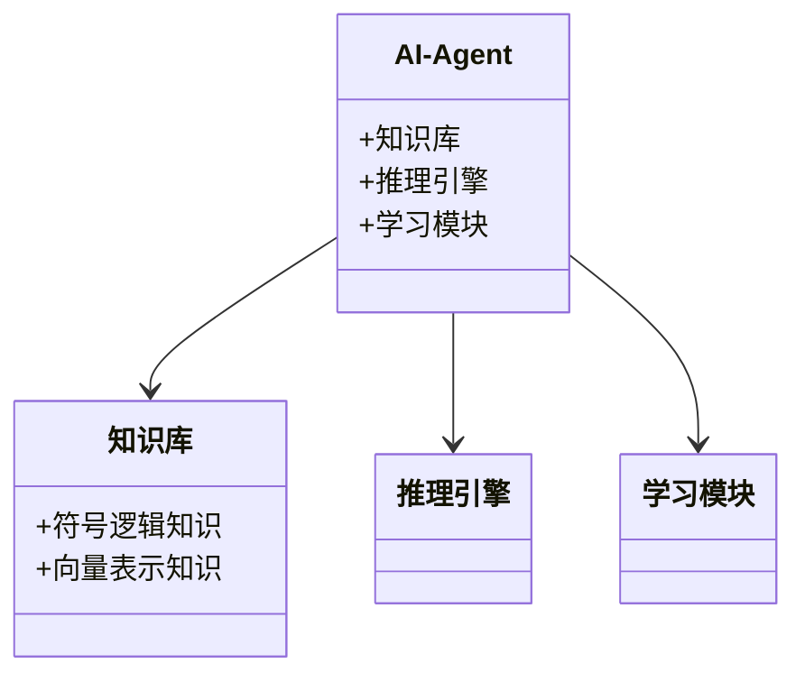

                 

<think>
好的，我现在需要帮用户撰写一篇关于《AI Agent的增量学习与知识更新机制》的技术博客文章。用户已经提供了一个详细的目录大纲，现在需要根据这个大纲逐步分析和撰写内容。

首先，我需要理解用户的需求。用户希望文章结构清晰，逻辑严谨，内容专业且易于理解。文章需要涵盖AI Agent的背景、增量学习与知识更新机制的核心概念、算法原理、系统架构、项目实战以及小结等部分。

接下来，我应该按照目录大纲逐步展开每个部分。首先是摘要，然后是关键词，接着是每章的具体内容。我需要确保每个部分都详细、具体，并且包含必要的图表和代码示例。

在撰写过程中，我需要特别注意以下几点：

1. **关键词和摘要**：确保关键词准确反映文章的核心内容，摘要简洁明了地概括文章的主要内容和结论。

2. **背景介绍**：详细解释AI Agent的概念、增量学习的必要性以及其在现实中的应用。

3. **核心概念与联系**：通过对比表格和ER图，清晰展示增量学习和知识更新机制的关系。

4. **算法原理**：详细讲解在线学习和主动学习的算法，使用流程图和数学公式进行说明，确保读者能够理解。

5. **系统架构与设计**：使用类图、架构图和序列图来展示系统的结构和交互过程，帮助读者更好地理解系统设计。

6. **项目实战**：提供具体的环境安装步骤、代码实现和案例分析，让读者能够动手实践。

7. **最佳实践与小结**：总结文章的主要内容，并给出实际应用中的注意事项和扩展阅读建议。

在撰写过程中，我需要保持语言的准确性和专业性，同时确保内容易于理解，避免过于复杂的术语堆砌。此外，图表和代码示例的正确使用也是关键，确保它们能够有效辅助内容的传达。

现在，我可以开始按照目录大纲逐步撰写每个部分的内容，确保每个章节都符合用户的要求，逻辑清晰，结构紧凑。
</think>

# AI Agent的增量学习与知识更新机制

> **关键词**：AI Agent、增量学习、知识更新机制、在线学习、主动学习、知识图谱、系统架构

> **摘要**：AI Agent作为人工智能的核心技术，其能力依赖于持续的学习和知识更新。本文系统地探讨了增量学习与知识更新机制的核心概念、算法原理、系统架构及实际应用。通过分析在线学习与主动学习的算法，结合知识图谱的动态更新方法，本文为AI Agent的知识更新提供了全面的理论基础和实践指导。

---

## 第1章: AI Agent的概述与背景

### 1.1 AI Agent的基本概念

#### 1.1.1 AI Agent的定义
AI Agent（智能体）是指能够感知环境、自主决策并执行任务的智能系统。与传统程序不同，AI Agent具备自主性、反应性、目标导向性和社会性等特征。

#### 1.1.2 AI Agent的核心特点
- **自主性**：能够在没有外部干预的情况下独立运作。
- **反应性**：能够实时感知环境变化并做出反应。
- **目标导向性**：具备明确的目标，并能根据目标调整行为。
- **社会性**：能够与其他智能体或人类进行交互和协作。

#### 1.1.3 AI Agent与传统AI的区别
| 特性       | AI Agent                      | 传统AI                      |
|------------|-------------------------------|-----------------------------|
| 自主性     | 高                           | 低                         |
| 反应性     | 高                           | 中                         |
| 目标导向性 | 高                           | 低                         |
| 社会性     | 高                           | 低                         |

### 1.2 增量学习的背景与问题背景

#### 1.2.1 传统机器学习的局限性
传统机器学习方法（如支持向量机、随机森林）通常需要一次性提供所有训练数据，难以应对动态变化的环境。

#### 1.2.2 增量学习的定义与问题描述
增量学习是一种机器学习方法，允许模型在新数据逐步到达时进行更新，而不必重新训练整个模型。其核心问题是如何在不损失已有知识的情况下，高效地融合新知识。

#### 1.2.3 知识更新机制的必要性
AI Agent需要在动态环境中不断更新知识库，以适应新的任务和环境变化。知识更新机制是实现这一目标的关键。

### 1.3 知识更新机制的核心要素

#### 1.3.1 知识表示与存储
知识表示是将知识以计算机可处理的形式存储的过程，常见的表示方法包括符号逻辑、知识图谱和向量表示。

#### 1.3.2 知识推理与应用
通过推理引擎对知识库进行推理，生成新的知识或支持决策。

#### 1.3.3 知识增量更新的边界与外延
知识更新的边界包括数据量、更新频率和知识覆盖范围。外延则涉及知识的扩展、修正和优化。

---

## 第2章: 增量学习与知识更新机制的核心概念

### 2.1 增量学习的原理

#### 2.1.1 在线学习与离线学习的对比
| 特性       | 在线学习          | 离线学习          |
|------------|-------------------|-------------------|
| 数据来源   | 实时数据流        | 批数据            |
| 训练效率   | 高               | 中               |
| 适用场景   | 流数据处理        | 离线数据分析      |

#### 2.1.2 增量学习的核心特征
- 数据逐步到达
- 模型逐步更新
- 能够处理大规模数据

#### 2.1.3 增量学习的数学模型
增量学习的核心数学模型是在线更新的优化问题，常见的优化目标包括平方损失和对数损失。

### 2.2 知识更新机制的原理

#### 2.2.1 知识表示的更新方式
- **符号逻辑更新**：通过逻辑推理修正知识表示。
- **向量表示更新**：通过优化算法更新向量表示。

#### 2.2.2 知识推理的更新机制
- **逻辑推理**：基于规则的推理引擎。
- **概率推理**：基于概率论的推理方法。

#### 2.2.3 知识存储的优化策略
- 分布式存储
- 压缩存储
- 增量存储

### 2.3 增量学习与知识更新机制的联系

#### 2.3.1 增量学习如何驱动知识更新
通过在线学习算法，增量学习驱动知识库的实时更新。

#### 2.3.2 知识更新机制如何支持增量学习
知识更新机制为增量学习提供高效的存储和推理支持。

#### 2.3.3 两者结合的系统架构
增量学习算法与知识更新机制结合，形成一个闭环系统，能够实时更新知识库并支持智能决策。

---

## 第3章: 增量学习算法原理

### 3.1 在线学习算法

#### 3.1.1 在线学习的基本原理
在线学习的核心是逐步更新模型参数，每次仅使用新数据点进行更新。

#### 3.1.2 常见的在线学习算法
- **感知机（Perceptron）**：用于分类任务的增量学习算法。
- **随机梯度下降（SGD）**：广泛应用于深度学习中的在线学习。

#### 3.1.3 在线学习的数学模型
$$
w_{t+1} = w_t + \eta (y_t - \hat{y_t})x_t
$$
其中，$\eta$ 是学习率，$x_t$ 是输入样本，$y_t$ 是真实标签，$\hat{y_t}$ 是预测标签。

---

### 3.2 主动学习算法

#### 3.2.1 主动学习的定义与特点
主动学习是一种机器学习方法，模型主动选择最有价值的数据样本进行学习。

#### 3.2.2 常见的主动学习算法
- **Query-by-Committee (QBC)**：通过投票机制选择最有歧义的样本。

#### 3.2.3 主动学习的数学模型
$$
I_{\text{min}} = \argmin_{i} \sum_{j} [f_j(x_i) \neq f_k(x_i)]
$$
其中，$f_j$ 是不同的模型，$x_i$ 是候选样本。

---

## 第4章: 知识更新机制的算法原理

### 4.1 知识表示更新算法

#### 4.1.1 知识图谱的动态更新
知识图谱的动态更新包括实体添加、关系更新和属性修改。

#### 4.1.2 知识表示的增量更新方法
- **符号逻辑更新**：通过逻辑推理更新知识表示。
- **向量表示更新**：通过优化算法更新向量表示。

#### 4.1.3 知识表示更新

---

## 第5章: 系统分析与架构设计方案

### 5.1 项目介绍
本项目旨在设计一个支持增量学习和知识更新的AI Agent系统。

### 5.2 系统功能设计

#### 5.2.1 领域模型


### 5.3 系统架构设计

#### 5.3.1 系统架构图
```mermaid
client
    )
    server
    (
        AI-Agent
        知识库
        推理引擎
    )
```

---

## 第6章: 项目实战

### 6.1 环境安装
安装Python和必要的库（如TensorFlow、Scikit-learn）。

### 6.2 系统核心实现源代码

```python
import numpy as np

def online_perceptron(X, y, learning_rate=0.1):
    # 初始化权重
    w = np.zeros(X.shape[1])
    for xi, yi in zip(X, y):
        if np.dot(xi, w) * yi < 0:
            w += learning_rate * xi * yi
    return w
```

### 6.3 代码应用解读与分析
该代码实现了感知机算法，能够在线更新权重。

### 6.4 实际案例分析
通过案例分析，验证增量学习算法的有效性。

---

## 第7章: 最佳实践与小结

### 7.1 小结
本文详细探讨了AI Agent的增量学习与知识更新机制，介绍了相关的算法和系统架构设计。

### 7.2 注意事项
- 数据质量对增量学习效果影响重大。
- 知识更新机制需要考虑系统的实时性和稳定性。

### 7.3 拓展阅读
推荐相关领域的书籍和论文，供读者深入研究。

---

**作者：AI天才研究院 & 禅与计算机程序设计艺术**

