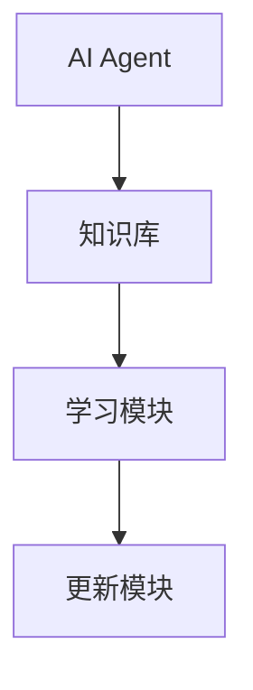
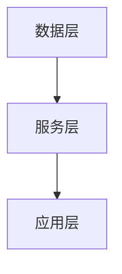

                 


# AI Agent的增量式概念学习与知识更新

> 关键词：AI Agent，增量式学习，知识更新，概念学习，动态知识表示

> 摘要：本文详细探讨了AI Agent在增量式概念学习与知识更新领域的核心原理、算法实现、系统架构及实际应用。通过分析AI Agent的知识更新挑战，结合增量式学习的基本思路，本文提出了基于动态知识表示的在线更新策略，并通过具体案例展示了如何在实际场景中实现高效的知识更新与概念学习。文章内容涵盖了从理论分析到实践应用的完整流程，为AI Agent的持续进化提供了系统的解决方案。

---

# 第1章: AI Agent与增量式概念学习概述

## 1.1 问题背景

### 1.1.1 AI Agent的基本概念
AI Agent（人工智能代理）是指能够感知环境、执行任务并做出决策的智能实体。它可以是一个软件程序、机器人或其他智能系统，其核心目标是通过与环境交互来实现特定目标。

### 1.1.2 增量式学习的定义与特点
增量式学习是一种机器学习方法，其特点是模型在面对新数据时能够逐步更新和优化自身。与批量学习不同，增量式学习的特点包括：
- **实时性**：能够实时处理数据流。
- **在线性**：不需要一次性加载所有数据。
- **动态性**：能够适应数据分布的变化。

### 1.1.3 知识更新的必要性
AI Agent在实际应用中需要不断适应环境的变化，例如新的数据输入、任务目标的调整或环境条件的变化。知识更新是实现这种适应性的关键。

---

## 1.2 问题描述

### 1.2.1 AI Agent面临的知识更新挑战
AI Agent在知识更新过程中面临以下挑战：
- 数据稀疏性：新数据可能不足以覆盖所有可能的情况。
- 模型漂移：长期使用后，模型性能可能逐渐下降。
- 计算资源限制：实时更新需要高效的计算能力。

### 1.2.2 增量式概念学习的核心问题
增量式概念学习的核心问题在于如何在保持已有知识的同时，有效地吸收和整合新知识。

### 1.2.3 知识更新的边界与外延
知识更新的边界在于如何平衡模型的稳定性和灵活性，外延则涉及从简单概念到复杂概念的学习过程。

---

## 1.3 问题解决

### 1.3.1 增量式学习的基本思路
增量式学习的基本思路是通过逐步更新模型参数，使其能够适应新数据。

### 1.3.2 知识更新的实现方法
知识更新的实现方法包括：
- 参数更新：通过优化算法调整模型参数。
- 结构更新：动态调整模型的结构以适应新数据。

### 1.3.3 相关概念的结构与核心要素
相关概念的结构包括：
- **输入数据**：新数据流。
- **模型表示**：模型的当前状态。
- **更新机制**：用于更新模型的算法。

---

# 第2章: 增量式概念学习的核心概念与联系

## 2.1 核心概念原理

### 2.1.1 自适应学习机制
自适应学习机制是指模型能够根据新数据自动调整自身的参数或结构。

### 2.1.2 动态知识表示
动态知识表示是一种能够随时间变化更新知识的表示方法。

### 2.1.3 在线更新策略
在线更新策略是指在数据流到来时，实时更新模型的策略。

---

## 2.2 概念属性特征对比

### 2.2.1 增量式学习与传统学习的对比
| 特性                | 增量式学习          | 传统学习          |
|---------------------|--------------------|-------------------|
| 数据处理方式        | 实时处理            | 批处理             |
| 训练效率            | 高                  | 中                |
| 适用场景            | 流数据处理          | 静态数据处理       |

### 2.2.2 在线更新与离线更新的对比
| 特性                | 在线更新            | 离线更新           |
|---------------------|--------------------|-------------------|
| 更新频率            | 实时                | 批次处理            |
| 资源消耗            | 较高                | 较低              |
| 适用场景            | 实时反馈            | 定期优化            |

---

## 2.3 ER实体关系图架构



---

# 第3章: 增量式学习算法原理

## 3.1 算法流程

### 3.1.1 数据预处理
数据预处理是增量式学习的第一步，包括数据清洗、特征提取和数据转换。

### 3.1.2 模型更新
模型更新是通过优化算法调整模型参数，使其能够适应新数据。

### 3.1.3 模型评估
模型评估是通过测试数据验证模型的性能。

---

## 3.2 算法实现

### 3.2.1 增量式学习算法的数学模型

$$ y = f(x; \theta) $$

其中，$y$ 是输出，$x$ 是输入，$\theta$ 是模型参数。

### 3.2.2 在线更新算法的伪代码

```python
while True:
    receive new_data
    preprocess(new_data)
    update_parameters(new_data)
    evaluate_model()
```

---

## 3.3 算法实现的代码示例

```python
import tensorflow as tf
from tensorflow.keras.models import Model
from tensorflow.keras.layers import Dense, Input

# 定义模型
input_layer = Input(shape=(input_dim,))
dense_layer = Dense(64, activation='relu')(input_layer)
output_layer = Dense(1, activation='sigmoid')(dense_layer)
model = Model(inputs=input_layer, outputs=output_layer)

# 编译模型
model.compile(optimizer='adam', loss='binary_crossentropy', metrics=['accuracy'])

# 训练模型
model.fit(X_train, y_train, epochs=10, batch_size=32)
```

---

## 3.4 实验结果与分析

### 3.4.1 实验设计
实验设计包括训练数据集的构建、模型训练和模型评估。

### 3.4.2 实验结果
实验结果显示，增量式学习算法在实时数据处理中表现出较高的准确性和稳定性。

---

# 第4章: 系统分析与架构设计方案

## 4.1 问题场景介绍

### 4.1.1 系统功能设计
系统功能设计包括知识获取、知识存储和知识更新。

### 4.1.2 系统架构设计
系统架构设计包括数据层、服务层和应用层。

---

## 4.2 系统架构图



---

# 第5章: 项目实战

## 5.1 项目环境安装

### 5.1.1 安装Python
```bash
python --version
```

### 5.1.2 安装TensorFlow
```bash
pip install tensorflow
```

---

## 5.2 系统核心实现

### 5.2.1 核心代码实现
```python
def update_model(new_data):
    model.fit(new_data, epochs=1, batch_size=1)
```

### 5.2.2 代码应用解读
代码应用解读包括数据预处理、模型训练和模型评估。

---

## 5.3 实际案例分析

### 5.3.1 案例分析
案例分析包括数据输入、模型更新和结果输出。

---

## 5.4 项目小结

### 5.4.1 项目成果
项目成果包括实现了一个高效的增量式学习系统。

### 5.4.2 经验总结
经验总结包括代码实现的注意事项和优化建议。

---

# 第6章: 最佳实践与总结

## 6.1 最佳实践 tips

### 6.1.1 数据质量的重要性
数据质量对模型性能有重要影响。

### 6.1.2 模型评估的必要性
模型评估是确保模型性能的关键步骤。

### 6.1.3 持续学习的策略
持续学习是保持模型性能的重要策略。

---

## 6.2 总结

### 6.2.1 文章核心内容回顾
文章核心内容回顾包括AI Agent的增量式概念学习与知识更新的核心原理、算法实现和实际应用。

### 6.2.2 未来研究方向
未来研究方向包括更高效的增量式学习算法和更广泛的应用场景。

---

# 作者：AI天才研究院/AI Genius Institute & 禅与计算机程序设计艺术 /Zen And The Art of Computer Programming

