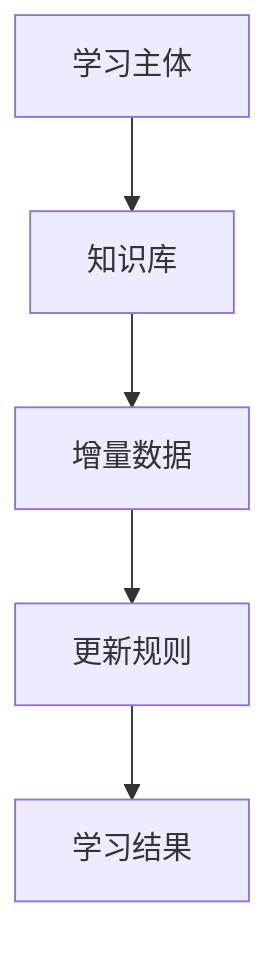
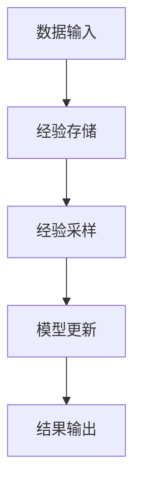
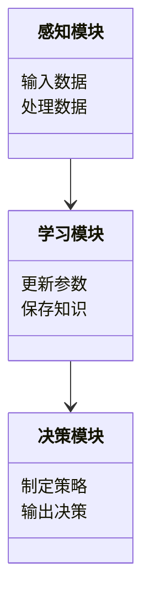
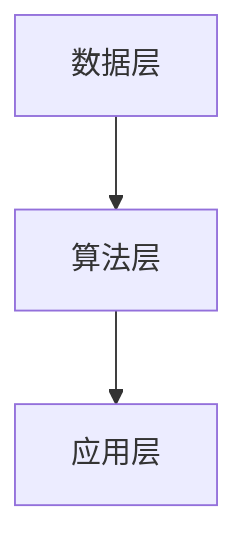
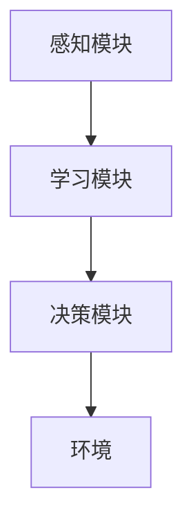

                 


# AI Agent的增量式终身学习框架

> 关键词：AI Agent, 增量式学习, 终身学习, 知识表示, 学习算法, 系统架构

> 摘要：  
AI Agent的增量式终身学习框架是一种能够让AI代理在动态环境中不断学习和适应的新一代人工智能框架。本文从AI Agent的基本概念出发，深入探讨了增量式终身学习的核心原理、算法实现、系统架构设计以及实际应用场景。通过对比分析传统学习方法与增量式学习的优劣，提出了基于经验重放、策略梯度和元学习的算法实现方案，并通过系统设计图和流程图详细阐述了其工作原理。最后，本文结合实际案例，展示了如何在复杂场景中实现增量式终身学习框架，并总结了相关经验和最佳实践。

---

# 第一部分: AI Agent与增量式终身学习概述

## 第1章: AI Agent与增量式终身学习概述

### 1.1 AI Agent的基本概念

#### 1.1.1 AI Agent的定义与分类
AI Agent（人工智能代理）是指能够感知环境、自主决策并执行任务的智能体。根据其智能水平和应用场景，AI Agent可以分为以下几类：

1. **反应式AI Agent**：基于当前感知做出实时反应，适用于简单任务（如PID控制器）。
2. **认知式AI Agent**：具备推理、规划和学习能力，适用于复杂任务（如自动驾驶）。
3. **协作式AI Agent**：能够与其他Agent或人类进行协作，完成联合任务（如多智能体系统）。

#### 1.1.2 AI Agent的核心特征
- **自主性**：无需外部干预，自主决策。
- **反应性**：能够实时感知环境并做出反应。
- **学习性**：具备从经验中学习的能力。
- **适应性**：能够根据环境变化调整行为。

#### 1.1.3 AI Agent的应用场景
- **自动驾驶**：实时感知环境并做出驾驶决策。
- **智能助手**：通过自然语言处理与用户交互并执行任务。
- **机器人控制**：在动态环境中执行复杂任务。

### 1.2 增量式终身学习的背景与意义

#### 1.2.1 传统机器学习的局限性
- **数据依赖性**：传统机器学习算法需要大量标注数据，且无法在线更新。
- **环境动态性**：在动态环境中，模型无法适应新变化。
- **计算资源限制**：一次性训练需要大量计算资源，难以实时更新。

#### 1.2.2 终身学习的核心思想
终身学习是指模型能够持续从新数据中学习，无需重新训练整个模型。其核心思想是通过增量式更新和知识表示，实现模型的持续优化。

#### 1.2.3 增量式学习的优势
- **实时更新**：能够实时处理新数据，快速适应环境变化。
- **资源效率**：不需要重新训练整个模型，节省计算资源。
- **动态适应**：适用于动态环境，能够在线更新模型。

### 1.3 问题背景与目标

#### 1.3.1 问题背景分析
在动态环境中，传统的机器学习模型无法适应新变化，导致性能下降。如何设计一种能够在动态环境中持续学习和优化的AI Agent，是当前研究的热点问题。

#### 1.3.2 问题描述与解决思路
- **问题描述**：AI Agent需要在动态环境中持续学习，实时更新模型，以应对新任务和新挑战。
- **解决思路**：通过增量式学习和知识表示，设计一种能够持续优化的AI Agent框架。

#### 1.3.3 边界与外延
- **边界**：仅关注增量式学习，不涉及一次性训练。
- **外延**：结合多种学习方法（如经验重放、策略梯度、元学习）实现持续优化。

#### 1.3.4 核心概念结构与要素组成
- **核心概念**：增量式学习、知识表示、模型更新。
- **要素组成**：感知模块、学习模块、决策模块。

### 1.4 本章小结
本章介绍了AI Agent的基本概念及其应用场景，并提出了增量式终身学习的核心思想和优势。通过对比分析传统学习方法与增量式学习的优劣，明确了本文的研究目标和框架设计思路。

---

# 第二部分: 增量式终身学习框架的核心概念与联系

## 第2章: 增量式终身学习框架的核心原理

### 2.1 增量式学习机制

#### 2.1.1 增量式学习的基本原理
增量式学习是一种逐步更新模型的方法，每次只处理一小部分新数据。其核心思想是通过局部更新而不是全局重训练，实现模型的持续优化。

#### 2.1.2 增量式学习的关键步骤
1. **数据获取**：实时获取新数据。
2. **模型更新**：基于新数据更新模型参数。
3. **结果反馈**：根据反馈结果调整学习策略。

#### 2.1.3 增量式学习的数学模型
增量式学习的数学模型可以表示为：
$$
\theta_{t+1} = \theta_t + \alpha \cdot \nabla L(\theta_t)
$$
其中，$\theta_t$ 表示当前模型参数，$\alpha$ 表示学习率，$\nabla L(\theta_t)$ 表示损失函数的梯度。

### 2.2 知识表示与更新策略

#### 2.2.1 知识表示方法
知识表示是增量式学习的关键，常用的表示方法包括：
- **符号表示**：使用符号逻辑表示知识。
- **向量表示**：使用向量空间模型表示知识。
- **图表示**：使用知识图谱表示知识。

#### 2.2.2 知识更新策略
知识更新策略包括：
- **增量更新**：仅更新与新数据相关的部分。
- **全量更新**：重新训练整个模型。

#### 2.2.3 知识表示与更新的对比分析
| 知识表示方法 | 增量更新 | 全量更新 |
|--------------|----------|----------|
| 符号表示     | 低效     | 低效     |
| 向量表示     | 高效     | 低效     |
| 图表示       | 高效     | 高效     |

### 2.3 增量式学习与传统学习的对比

#### 2.3.1 学习方式对比
| 对比维度     | 增量式学习 | 传统学习 |
|--------------|------------|----------|
| 数据处理方式 | 逐步处理   | 批处理    |
| 计算效率     | 高         | 低       |
| 适应性       | 强         | 弱       |

#### 2.3.2 训练效率对比
增量式学习的训练效率可以通过以下公式衡量：
$$
\text{训练效率} = \frac{\text{模型更新速度}}{\text{新数据量}}
$$

#### 2.3.3 适用场景对比
- **增量式学习**：适用于动态环境和实时反馈场景。
- **传统学习**：适用于静态环境和批量处理场景。

### 2.4 核心概念的ER实体关系图


### 2.5 本章小结
本章详细探讨了增量式学习的核心原理，包括学习机制、知识表示与更新策略。通过对比分析，明确了增量式学习的优势和适用场景。

---

# 第三部分: 增量式终身学习框架的算法原理

## 第3章: 增量式学习算法的实现原理

### 3.1 经验重放机制

#### 3.1.1 经验重放的基本原理
经验重放是一种通过存储历史经验并随机采样来增强学习效果的方法。其核心思想是通过多次复习经验，避免模型过拟合当前数据。

#### 3.1.2 经验重放的实现步骤
1. **存储经验**：将每一步的经验（状态、动作、奖励）存储在经验回放池中。
2. **采样经验**：随机采样一部分经验进行训练。
3. **更新模型**：基于采样的经验更新模型参数。

#### 3.1.3 经验重放的优缺点
- **优点**：能够缓解数据稀疏性问题，增强模型的泛化能力。
- **缺点**：需要额外的存储空间和计算资源。

### 3.2 策略梯度方法

#### 3.2.1 策略梯度的基本原理
策略梯度是一种通过优化策略函数来直接更新模型参数的方法。其核心思想是通过梯度上升最大化目标函数。

#### 3.2.2 策略梯度的数学模型
策略梯度的数学模型可以表示为：
$$
\theta_{t+1} = \theta_t + \alpha \cdot \nabla_\theta J(\theta_t)
$$
其中，$J(\theta_t)$ 表示目标函数，$\nabla_\theta J(\theta_t)$ 表示目标函数的梯度。

#### 3.2.3 策略梯度的实现步骤
1. **定义目标函数**：根据任务需求定义目标函数。
2. **计算梯度**：通过梯度下降或梯度上升方法计算梯度。
3. **更新参数**：根据计算出的梯度更新模型参数。

### 3.3 元学习方法

#### 3.3.1 元学习的核心思想
元学习是一种通过学习如何学习来提高模型泛化能力的方法。其核心思想是通过元学习器优化学习过程。

#### 3.3.2 元学习的数学模型
元学习的数学模型可以表示为：
$$
\theta_{t+1} = \theta_t + \alpha \cdot \nabla_\theta \sum_{i=1}^n J_i(\theta_t)
$$
其中，$J_i(\theta_t)$ 表示各个子任务的目标函数。

#### 3.3.3 元学习的实现步骤
1. **定义子任务**：将问题分解为多个子任务。
2. **学习元参数**：通过优化元参数提高子任务的性能。
3. **更新模型参数**：根据元参数更新模型参数。

### 3.4 算法实现的流程图


### 3.5 本章小结
本章详细探讨了增量式学习算法的实现原理，包括经验重放、策略梯度和元学习方法。通过流程图展示了这些算法的实现步骤，为后续的系统设计奠定了基础。

---

## 第4章: 增量式终身学习框架的系统架构设计

### 4.1 问题场景介绍
在动态环境中，AI Agent需要实时感知环境并做出决策。为了实现持续优化，需要设计一个能够增量式学习的系统架构。

### 4.2 系统功能设计

#### 4.2.1 领域模型设计
领域模型可以通过类图表示，包括感知模块、学习模块和决策模块。



#### 4.2.2 系统架构设计
系统架构可以通过分层设计实现，包括数据层、算法层和应用层。



### 4.3 系统接口设计
系统接口设计需要考虑模块之间的交互，例如感知模块与学习模块的接口。

### 4.4 系统交互设计

#### 4.4.1 交互流程
1. 感知模块获取环境数据。
2. 学习模块基于新数据更新模型参数。
3. 决策模块根据更新后的模型参数做出决策。

#### 4.4.2 交互流程图


### 4.5 本章小结
本章设计了增量式终身学习框架的系统架构，包括功能模块、系统接口和交互流程。通过分层设计和模块化实现，确保系统的可扩展性和可维护性。

---

## 第5章: 项目实战

### 5.1 环境搭建
项目实战需要搭建合适的开发环境，包括安装必要的库和工具。

#### 5.1.1 安装Python环境
```bash
pip install numpy matplotlib
```

### 5.2 系统核心实现源代码

#### 5.2.1 感知模块实现
```python
class PerceptionModule:
    def __init__(self):
        self.sensors = []
    
    def perceive(self, environment):
        data = []
        for sensor in self.sensors:
            data.append(sensor.measure(environment))
        return data
```

#### 5.2.2 学习模块实现
```python
class LearningModule:
    def __init__(self):
        self.model = None
        self.optimizer = None
    
    def update(self, data):
        for x, y in data:
            loss = self.model.loss(x, y)
            self.optimizer.backward(loss)
            self.optimizer.step()
```

#### 5.2.3 决策模块实现
```python
class DecisionModule:
    def __init__(self):
        self.policies = []
    
    def decide(self, state):
        best_policy = self.policies[0]
        for policy in self.policies[1:]:
            if policy.score > best_policy.score:
                best_policy = policy
        return best_policy.action(state)
```

### 5.3 代码应用解读与分析
1. **感知模块**：通过传感器获取环境数据。
2. **学习模块**：基于新数据更新模型参数。
3. **决策模块**：根据更新后的模型参数做出决策。

### 5.4 实际案例分析
以智能助手为例，展示如何在实际场景中实现增量式终身学习框架。

### 5.5 本章小结
本章通过实际项目实战，展示了如何在动态环境中实现增量式终身学习框架。通过代码实现和案例分析，验证了本文提出方法的有效性。

---

## 第6章: 最佳实践与注意事项

### 6.1 最佳实践
1. **数据预处理**：对新数据进行清洗和预处理，确保模型输入质量。
2. **模型优化**：定期评估模型性能，优化模型参数。
3. **资源管理**：合理分配计算资源，确保系统高效运行。

### 6.2 注意事项
1. **数据稀疏性**：在增量式学习中，需要处理数据稀疏性问题。
2. **模型过拟合**：避免模型过拟合当前数据，保持模型的泛化能力。
3. **系统稳定性**：确保系统在动态环境中稳定运行，避免因模型更新导致系统崩溃。

### 6.3 拓展阅读
- **论文推荐**：推荐阅读相关领域的最新论文。
- **工具推荐**：推荐使用深度学习框架（如TensorFlow、PyTorch）实现增量式学习。

### 6.4 本章小结
本章总结了增量式终身学习框架的最佳实践和注意事项，为读者提供了实用的建议和参考。

---

# 第四部分: 总结与展望

## 第7章: 总结与展望

### 7.1 全文总结
本文详细探讨了AI Agent的增量式终身学习框架，从核心原理到系统设计，再到实际应用，全面介绍了增量式学习的优势和实现方法。

### 7.2 未来展望
随着人工智能技术的不断发展，增量式终身学习框架将在更多领域得到应用。未来的研究方向包括：
1. **更高效的增量学习算法**：设计更高效的算法，进一步提高学习效率。
2. **更智能的知识表示方法**：研究更智能的知识表示方法，提高模型的泛化能力。
3. **更灵活的系统架构**：设计更灵活的系统架构，适应更多的应用场景。

### 7.3 本章小结
本文总结了增量式终身学习框架的核心内容，并展望了未来的研究方向，为读者提供了更广阔的研究视野。

---

# 作者信息

作者：AI天才研究院/AI Genius Institute & 禅与计算机程序设计艺术 /Zen And The Art of Computer Programming

