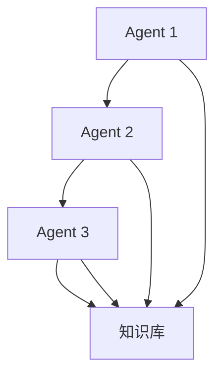

                 


# AI Agent的多Agent协作学习与知识共享

> 关键词：AI Agent, 多Agent协作, 知识共享, 分布式学习, 强化学习

> 摘要：本文深入探讨了AI Agent的多Agent协作学习与知识共享的核心原理、算法实现及系统架构。通过详细分析多Agent协作学习的背景、核心概念、算法模型及实际应用，本文为读者提供了全面的理解和实践指南。从基础理论到实际案例，本文系统地介绍了多Agent协作学习的实现方法，帮助读者掌握这一领域的最新技术与应用。

---

# 第一部分: AI Agent的多Agent协作学习与知识共享基础

---

## 第1章: AI Agent与多Agent协作学习概述

### 1.1 AI Agent的基本概念

#### 1.1.1 AI Agent的定义
AI Agent（人工智能代理）是指能够感知环境、做出决策并采取行动以实现特定目标的智能实体。Agent可以是软件程序、机器人或其他智能系统，其核心能力包括感知、推理、决策和执行。

#### 1.1.2 AI Agent的核心特征
- **自主性**：Agent能够在没有外部干预的情况下自主运行。
- **反应性**：能够实时感知环境并做出反应。
- **目标导向性**：所有行为都围绕实现特定目标展开。
- **社会性**：能够与其他Agent或人类进行交互和协作。

#### 1.1.3 AI Agent与传统AI的区别
传统的AI系统通常依赖于预定义的规则和数据，而AI Agent具备更强的自主性和适应性，能够动态调整策略以应对复杂环境。

---

### 1.2 多Agent协作学习的背景

#### 1.2.1 多Agent系统的发展历程
多Agent系统起源于分布式人工智能领域，随着计算能力的提升，多Agent系统逐渐应用于分布式计算、机器人协作、智能交通等领域。

#### 1.2.2 多Agent协作学习的必要性
单一Agent的学习能力有限，通过多Agent协作可以显著提升整体系统的智能性和任务完成能力。

#### 1.2.3 多Agent协作学习的应用场景
- **自动驾驶**：多个车辆协同完成交通任务。
- **智能家居**：家庭中的智能设备协同工作。
- **分布式计算**：多个计算节点协作完成复杂任务。

---

### 1.3 问题背景与目标

#### 1.3.1 单一Agent学习的局限性
单一Agent在面对复杂问题时，由于知识和计算能力的限制，难以完成复杂的任务。

#### 1.3.2 多Agent协作学习的问题背景
通过多Agent协作，可以实现知识共享、分布式计算和任务分工，从而提升整体系统的能力。

#### 1.3.3 知识共享的目标与意义
知识共享的目标是使多个Agent能够共享和利用彼此的知识，提升协作效率和系统智能性。

---

## 1.4 本章小结

本章介绍了AI Agent的基本概念、多Agent协作学习的背景及其必要性，明确了多Agent协作学习的目标与意义。通过这些内容，读者可以理解为什么多Agent协作学习是必要的，并为后续章节的学习打下基础。

---

# 第二部分: 多Agent协作学习的核心概念与联系

---

## 第2章: 多Agent协作学习的核心原理

### 2.1 多Agent协作学习的原理

#### 2.1.1 分布式学习与集中式学习的对比
- **分布式学习**：每个Agent独立学习并共享知识。
- **集中式学习**：所有Agent集中在一个中心节点进行学习。

#### 2.1.2 多Agent协作学习的基本机制
- **知识共享**：通过通信模块共享知识。
- **任务分工**：根据Agent的能力分配任务。
- **协作推理**：多个Agent协同推理解决问题。

#### 2.1.3 知识共享的实现方式
- **显式知识共享**：通过通信模块直接共享知识。
- **隐式知识共享**：通过行为间接传递知识。

---

### 2.2 多Agent协作学习的数学模型

#### 2.2.1 分布式学习的数学表达
假设多个Agent协作学习一个目标函数$f(x)$，每个Agent负责优化子问题$f_i(x)$，整体目标为$\sum_{i=1}^n f_i(x)$。

#### 2.2.2 知识共享的数学模型
知识共享可以通过知识图谱或向量表示进行，例如：
$$
K = \{k_1, k_2, ..., k_n\}
$$
其中，$K$表示共享的知识集，$k_i$表示单个知识单元。

#### 2.2.3 协作学习的优化算法
分布式优化算法，如分布式梯度下降：
$$
x_{t+1} = x_t - \eta \nabla f_i(x_t)
$$

---

### 2.3 多Agent协作学习的实体关系图



---

## 第3章: 多Agent协作学习的算法原理

### 3.1 分布式学习算法

#### 3.1.1 分布式学习的基本原理
分布式学习通过多个Agent并行学习，每个Agent负责一部分数据，最终将结果汇总。

#### 3.1.2 分布式强化学习算法
分布式强化学习中，每个Agent学习自己的策略，并通过通信模块共享策略参数。

---

### 3.2 知识表示与推理算法

#### 3.2.1 知识图谱构建
知识图谱通过实体和关系构建结构化的知识表示。

#### 3.2.2 知识推理
通过逻辑推理或概率推理，从已知知识中推导出新知识。

---

## 第4章: 多Agent协作学习的系统分析与架构设计

### 4.1 系统功能设计

#### 4.1.1 知识库模块
知识库用于存储和管理所有Agent共享的知识。

#### 4.1.2 通信模块
通信模块负责Agent之间的信息交换。

#### 4.1.3 协作模块
协作模块负责任务分配和协作推理。

---

### 4.2 系统架构设计


---

## 第5章: 项目实战——多Agent协作学习平台

### 5.1 环境安装

#### 5.1.1 安装Python和依赖库
```bash
pip install numpy matplotlib
```

#### 5.1.2 安装多Agent协作学习框架
```bash
pip install multi-agent-learning
```

---

### 5.2 核心代码实现

#### 5.2.1 Agent类实现
```python
class Agent:
    def __init__(self, id):
        self.id = id
        self.knowledge = {}
```

#### 5.2.2 知识共享实现
```python
def share_knowledge(agent1, agent2):
    agent2.knowledge.update(agent1.knowledge)
```

---

### 5.3 应用案例分析

#### 5.3.1 多Agent协作学习平台的功能展示
平台实现了多个Agent协作学习，知识共享等功能。

#### 5.3.2 实际应用中的问题分析
在实际应用中，需要考虑通信延迟和知识冲突问题。

---

## 第6章: 高级主题与未来展望

### 6.1 高级主题

#### 6.1.1 边缘计算中的多Agent协作
边缘计算环境下，多Agent协作可以提升系统的实时性和可靠性。

#### 6.1.2 多Agent协作学习的可扩展性
如何设计可扩展的多Agent协作学习系统是未来研究的重要方向。

---

### 6.2 未来展望

#### 6.2.1 人机协作
未来的多Agent协作学习将更加注重人机协作，提升用户体验。

#### 6.2.2 新兴技术的融合
如区块链、边缘计算等技术将与多Agent协作学习进一步融合。

---

# 第三部分: 结论与参考文献

## 结论

本文系统地介绍了AI Agent的多Agent协作学习与知识共享的核心原理、算法实现及系统架构。通过理论分析和实际案例，展示了多Agent协作学习的强大能力和广泛应用。未来，随着技术的进步，多Agent协作学习将在更多领域发挥重要作用。

---

## 参考文献

1. Russell, S., & Norvig, P. (2010). Artificial Intelligence: A Modern Approach.
2. 王伟, 李明. (2020). 多Agent系统与协作学习.

---

作者：AI天才研究院/AI Genius Institute & 禅与计算机程序设计艺术 /Zen And The Art of Computer Programming

