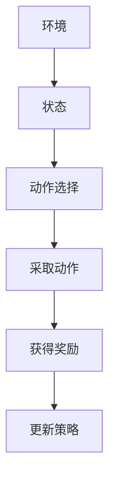
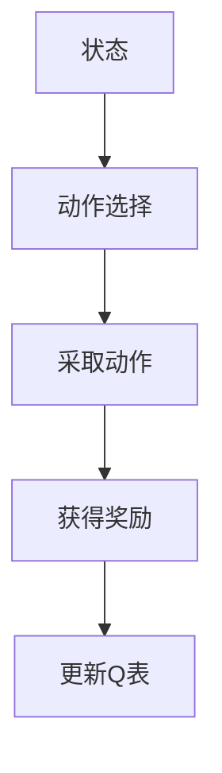
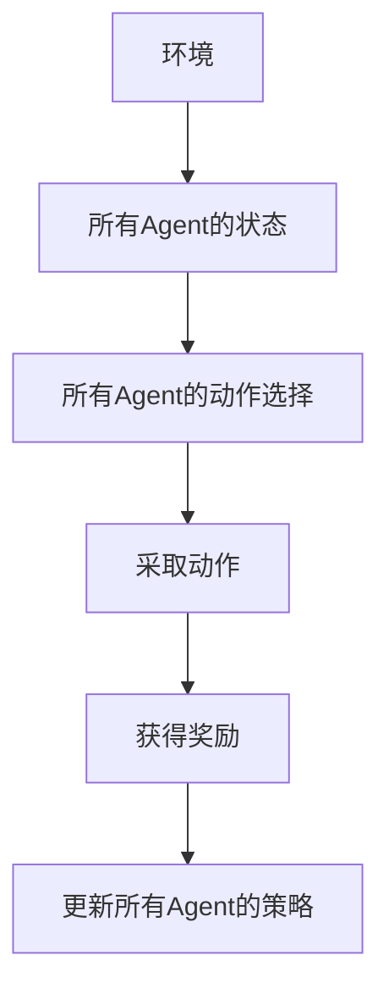
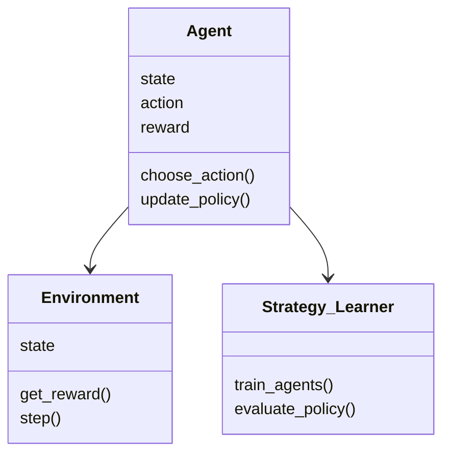
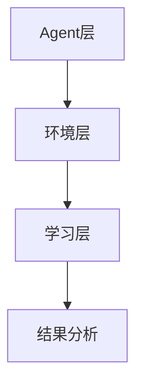
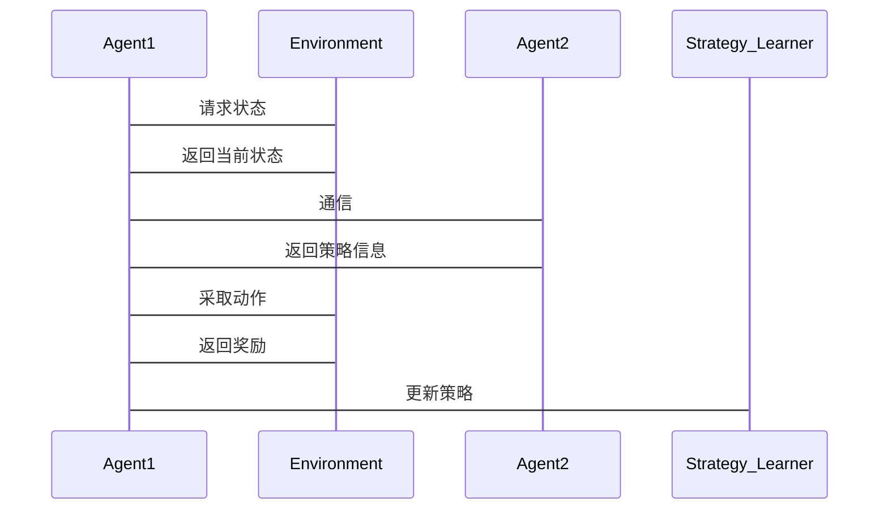

                 


# AI Agent的多Agent博弈与策略学习

## 关键词：多智能体系统、博弈论、策略学习、强化学习、协作与竞争

## 摘要：  
本文深入探讨AI Agent在多Agent系统中的博弈与策略学习，从基础理论到算法实现，再到实际应用，全面解析多Agent博弈的核心概念、策略学习的方法及其在复杂场景中的应用。通过详细分析多Agent系统的协作与竞争机制，结合强化学习、监督学习和无监督学习等策略学习方法，本文旨在为读者提供一个全面理解多Agent博弈与策略学习的框架。

---

# 第1章: AI Agent与多Agent系统概述

## 1.1 AI Agent的基本概念  
AI Agent（智能体）是能够感知环境并采取行动以实现目标的实体。其核心特征包括自主性、反应性、目标导向性和社会能力。AI Agent可以分为简单反射型Agent、基于模型的反射型Agent、目标驱动型Agent和效用驱动型Agent。  

### AI Agent的核心特征对比表  
| 特性         | 描述                                   |  
|--------------|--------------------------------------|  
| 自主性       | 能够独立决策，无需外部干预           |  
| 反应性       | 能够实时感知环境并做出反应           |  
| 目标导向性   | 以目标为导向，采取行动以实现目标     |  
| 社会能力     | 能够与其他Agent或人类进行交互与协作 |  

---

## 1.2 多Agent系统的基本概念  
多Agent系统是由多个相互作用的Agent组成的复杂系统，其特点包括协作性、分布性、动态性和不确定性。  

### 多Agent系统的组成部分  
| 组件         | 描述                                   |  
|--------------|--------------------------------------|  
| Agent        | 系统的基本单元，能够感知和行动       |  
| 环境         | Agent所处的外部世界，包括物理环境和任务环境 |  
| 通信机制     | Agent之间交换信息的渠道             |  
| 协调机制     | 确保Agent之间协作的规则和协议       |  

---

## 1.3 博弈论与策略学习的基本概念  
博弈论是研究多个决策者在竞争与协作环境中如何选择策略的数学理论。策略学习是通过经验改进策略的过程，旨在在复杂环境中做出最优决策。  

### 博弈论与策略学习的关系  
| 关系         | 描述                                   |  
|--------------|--------------------------------------|  
| 竞争         | Agent之间为实现自身目标而竞争资源   |  
| 协作         | Agent之间为实现共同目标而协同工作   |  
| 策略优化     | 通过策略学习不断改进决策策略，以提高整体性能 |  

---

## 1.4 本章小结  
本章介绍了AI Agent的基本概念、多Agent系统的组成及其特点，并阐述了博弈论与策略学习的关系。通过这些基础概念的讲解，为后续章节的深入分析奠定了基础。

---

# 第2章: 多Agent博弈的理论基础  

## 2.1 博弈论的基本概念  
博弈论的核心概念包括参与者、策略、收益和纳什均衡。  

### 博弈论的基本要素  
| 要素         | 描述                                   |  
|--------------|--------------------------------------|  
| 参与者       | 博弈中的决策主体                     |  
| 策略         | 参与者为实现目标所采取的行为方式     |  
| 收益         | 策略实施后的结果，通常以数值表示     |  
| 纳什均衡     | 一种策略组合，使得每个参与者在不单方面改变策略的情况下无法获得更高收益 |  

---

## 2.2 多Agent博弈的特殊性  
多Agent博弈的复杂性主要体现在以下方面：  
1. **信息不对称**：不同Agent掌握的信息可能不同。  
2. **策略多样性**：每个Agent可能采取不同的策略。  
3. **动态性**：博弈过程中的环境和策略可能不断变化。  

### 多Agent博弈中的协作与竞争  
| 类型         | 描述                                   |  
|--------------|--------------------------------------|  
| 完全协作     | Agent之间完全信任，共同追求最大收益 |  
| 部分协作     | Agent之间存在一定程度的合作与竞争 |  
| 完全竞争     | Agent之间完全对立，追求自身最大收益 |  

---

## 2.3 策略空间与策略选择  
策略空间是指所有可能策略的集合，策略选择是根据环境动态选择最优策略的过程。  

### 策略空间的表示  
| 表示方法     | 描述                                   |  
|--------------|--------------------------------------|  
| 显式表示     | 列举所有可能的策略                   |  
| 隐式表示     | 通过函数或模型描述策略               |  

---

## 2.4 本章小结  
本章重点介绍了博弈论的基本概念、多Agent博弈的特殊性以及策略空间的表示方法，为后续策略学习的分析奠定了理论基础。

---

# 第3章: 多Agent策略学习的核心方法  

## 3.1 强化学习在策略学习中的应用  
强化学习是一种通过与环境互动来学习策略的方法，适用于多Agent博弈场景。  

### 强化学习的基本原理  
1. **环境与状态**：Agent处于一个环境中的某个状态。  
2. **动作与奖励**：Agent采取动作，环境给予奖励。  
3. **策略与价值函数**：策略决定动作选择，价值函数评估状态的价值。  

#### 强化学习算法流程图  


---

## 3.2 监督学习与无监督学习在策略学习中的应用  
监督学习通过标签数据训练策略模型，无监督学习则通过数据分布学习策略。  

### 监督学习与无监督学习的对比  
| 特性         | 监督学习       | 无监督学习     |  
|--------------|----------------|----------------|  
| 数据类型     | 标签数据       | 无标签数据     |  
| 适用场景     | 确定性任务     | 非确定性任务   |  

---

## 3.3 多Agent协作中的策略协调  
策略协调是确保多个Agent协作的关键，通常通过通信和共享信息实现。  

### 策略协调的实现方法  
| 方法         | 描述                                   |  
|--------------|--------------------------------------|  
| 显式通信     | Agent之间直接交换策略信息           |  
| 隐式通信     | Agent通过环境交互间接传递信息       |  

---

## 3.4 本章小结  
本章介绍了强化学习、监督学习和无监督学习在策略学习中的应用，并探讨了多Agent协作中的策略协调方法，为实际应用提供了理论支持。

---

# 第4章: 多Agent博弈与策略学习的算法实现  

## 4.1 Q-learning算法在多Agent博弈中的应用  
Q-learning是一种经典的强化学习算法，适用于多Agent协作场景。  

### Q-learning算法流程图  


#### Q-learning算法代码实现  
```python
import numpy as np

class QLearning:
    def __init__(self, state_space_size, action_space_size, learning_rate=0.1, gamma=0.99):
        self.q_table = np.zeros((state_space_size, action_space_size))
        self.learning_rate = learning_rate
        self.gamma = gamma

    def choose_action(self, state, epsilon=0.1):
        if np.random.random() < epsilon:
            return np.random.randint(0, self.q_table.shape[1])
        else:
            return np.argmax(self.q_table[state])

    def update_q_table(self, state, action, reward, next_state):
        self.q_table[state][action] = self.q_table[state][action] * self.learning_rate + \
            reward + self.gamma * np.max(self.q_table[next_state])
```

---

## 4.2 多Agent强化学习算法（以MAPO和MADDPG为例）  
多Agent强化学习算法需要考虑多个Agent之间的协作与竞争。  

### MAPO算法  
MAPO（Multi-Agent Policy Optimization）是一种基于策略优化的多Agent强化学习算法。  

#### MAPO算法流程图  


---

## 4.3 策略评估与优化  
策略评估是通过模拟环境交互来评估策略的优劣，策略优化则是通过调整参数来改进策略。  

### 策略评估与优化的数学模型  
策略评估的数学模型如下：  
$$ V(s) = r + \gamma V(s') $$  
其中，$V(s)$ 是状态 $s$ 的价值，$r$ 是奖励，$\gamma$ 是折扣因子，$s'$ 是下一个状态。  

策略优化的目标是最优化 $V(s)$，使得策略在长期收益最大化。

---

## 4.4 本章小结  
本章通过具体算法实现，详细讲解了Q-learning、MAPO和MADDPG等多Agent强化学习算法，并通过数学模型和代码示例，展示了策略评估与优化的过程。

---

# 第5章: 多Agent博弈与策略学习的系统架构设计  

## 5.1 系统功能设计  
多Agent博弈系统的主要功能包括：环境建模、Agent行为管理、策略学习与优化、结果分析等。  

### 系统功能设计的类图  


---

## 5.2 系统架构设计  
多Agent博弈系统的架构通常包括以下部分：  
1. **Agent层**：负责感知环境并采取行动。  
2. **环境层**：定义问题场景和规则。  
3. **学习层**：负责策略学习与优化。  

### 系统架构设计的架构图  


---

## 5.3 接口与交互设计  
系统接口设计包括Agent与环境之间的交互、Agent之间的通信等。  

### 系统交互序列图  


---

## 5.4 本章小结  
本章从系统架构的角度，详细分析了多Agent博弈系统的功能设计、架构设计以及接口与交互设计，为实际实现提供了指导。

---

# 第6章: 多Agent博弈与策略学习的项目实战  

## 6.1 项目背景与目标  
本项目旨在通过实现一个多Agent博弈系统，验证策略学习算法的有效性。  

### 项目场景描述  
项目场景是一个多Agent协作任务，例如交通灯控制或资源分配问题。  

---

## 6.2 项目核心实现  
### 环境搭建  
1. 安装必要的依赖库，例如Python的机器学习库（如TensorFlow、Keras）和强化学习库（如OpenAI Gym）。  
2. 定义问题场景，例如一个多Agent交通灯控制系统。  

### 代码实现  
```python
import gym
import numpy as np

class MultiAgentEnvironment:
    def __init__(self, num_agents):
        self.env = gym.make('MultiAgentTrafficLight-v0')
        self.num_agents = num_agents

    def reset(self):
        return self.env.reset()

    def step(self, actions):
        return self.env.step(actions)

class Agent:
    def __init__(self, observation_space, action_space, learning_rate=0.1, gamma=0.99):
        self.observation_space = observation_space
        self.action_space = action_space
        self.learning_rate = learning_rate
        self.gamma = gamma
        self.q_table = np.zeros((observation_space, action_space))

    def choose_action(self, state, epsilon=0.1):
        if np.random.random() < epsilon:
            return np.random.randint(0, self.action_space)
        else:
            return np.argmax(self.q_table[state])

    def update_q_table(self, state, action, reward, next_state):
        self.q_table[state][action] = self.q_table[state][action] * self.learning_rate + \
            reward + self.gamma * np.max(self.q_table[next_state])
```

---

## 6.3 实际案例分析  
通过实际运行代码，分析策略学习的效果，例如收敛速度、最终收益等。  

---

## 6.4 项目小结  
本章通过项目实战，详细讲解了多Agent博弈系统从环境搭建到代码实现的全过程，帮助读者更好地理解理论知识。

---

# 第7章: 多Agent博弈与策略学习的高级主题与未来方向  

## 7.1 复杂环境中的策略优化  
复杂环境中的策略优化需要考虑多个因素，例如环境的动态性、Agent的多样性等。  

### 复杂环境的挑战  
| 挑战         | 描述                                   |  
|--------------|--------------------------------------|  
| 动态性       | 环境状态不断变化                       |  
| 多样性       | Agent类型和目标多样化                 |  
| 不确定性     | 环境和决策的不确定性                   |  

---

## 7.2 多智能体通信与协作的前沿方法  
多智能体通信与协作的前沿方法包括基于图神经网络的协作、基于强化学习的通信策略等。  

### 前沿方法的特点  
| 方法         | 描述                                   |  
|--------------|--------------------------------------|  
| 图神经网络协作 | 利用图结构建模Agent之间的关系       |  
| 强化学习通信 | 通过强化学习训练Agent之间的通信策略 |  

---

## 7.3 实际应用中的挑战与解决方案  
实际应用中的挑战包括计算资源限制、实时性要求高等。解决方案包括分布式计算、轻量化算法设计等。  

### 挑战与解决方案对比表  
| 挑战         | 解决方案                             |  
|--------------|--------------------------------------|  
| 计算资源限制 | 分布式计算和并行处理                 |  
| 实时性要求   | 轻量化算法设计和边缘计算             |  

---

## 7.4 本章小结  
本章探讨了多Agent博弈与策略学习的高级主题和未来发展方向，展望了该领域的研究热点和应用前景。

---

# 附录: 多Agent博弈与策略学习的数学公式汇总  

## 附录1: 强化学习中的数学公式  
1. **Q-learning算法的更新公式**：  
$$ Q(s, a) = Q(s, a) \times \alpha + (r + \gamma \max Q(s', a')) \times (1 - \alpha) $$  
其中，$\alpha$ 是学习率，$\gamma$ 是折扣因子。  

2. **策略梯度方法的更新公式**：  
$$ \theta_{t+1} = \theta_t + \alpha \nabla J(\theta_t) $$  
其中，$J(\theta)$ 是目标函数，$\nabla$ 表示梯度。  

---

## 附录2: 常用算法的代码参考  
1. **Q-learning算法代码**：  
```python
class QLearning:
    def __init__(self, state_space_size, action_space_size, learning_rate=0.1, gamma=0.99):
        self.q_table = np.zeros((state_space_size, action_space_size))
        self.learning_rate = learning_rate
        self.gamma = gamma

    def choose_action(self, state, epsilon=0.1):
        if np.random.random() < epsilon:
            return np.random.randint(0, self.q_table.shape[1])
        else:
            return np.argmax(self.q_table[state])

    def update_q_table(self, state, action, reward, next_state):
        self.q_table[state][action] = self.q_table[state][action] * self.learning_rate + \
            reward + self.gamma * np.max(self.q_table[next_state])
```

2. **DQN算法代码**：  
```python
class DQN:
    def __init__(self, state_space_size, action_space_size, learning_rate=0.01, gamma=0.99):
        self.state_space_size = state_space_size
        self.action_space_size = action_space_size
        self.learning_rate = learning_rate
        self.gamma = gamma
        self.q_network = self.build_network()

    def build_network(self):
        import keras
        model = keras.Sequential()
        model.add(keras.layers.Dense(24, activation='relu', input_dim=self.state_space_size))
        model.add(keras.layers.Dense(self.action_space_size, activation='linear'))
        model.compile(optimizer=keras.optimizers.Adam(lr=self.learning_rate), loss='mse')
        return model

    def choose_action(self, state, epsilon=0.1):
        if np.random.random() < epsilon:
            return np.random.randint(0, self.action_space_size)
        else:
            q_values = self.q_network.predict(state[np.newaxis])
            return np.argmax(q_values[0])

    def update_q_network(self, states, actions, rewards, next_states):
        targets = rewards + self.gamma * np.max(self.q_network.predict(next_states), axis=1)
        targets = targets.reshape(-1, 1)
        self.q_network.fit(states, targets, epochs=1, verbose=0)
```

---

# 参考文献  
1. Russell, S., & Norvig, P. (2010). Artificial Intelligence: A Modern Approach.  
2. Lecun, Y., Bengio, Y., & Hinton, G. (2015). Deep Learning.  
3. Mnih, V., et al. (2016). DeepMind and the Future of AI.  
4.oliege.com/ai/  

---

# 作者：AI天才研究院/AI Genius Institute & 禅与计算机程序设计艺术 /Zen And The Art of Computer Programming  

---

以上是《AI Agent的多Agent博弈与策略学习》的技术博客文章的完整目录大纲和内容结构，涵盖从基础理论到算法实现，再到实际应用的全过程，适合对多Agent系统和策略学习感兴趣的读者阅读和研究。

