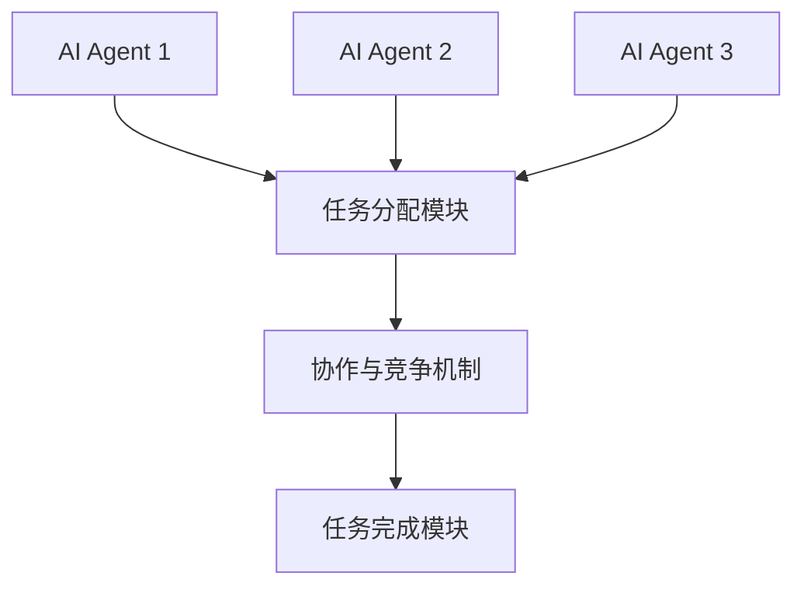

                 


# AI Agent的多智能体协作与竞争机制

---

## 关键词：
AI Agent, 多智能体系统, 协作机制, 竞争机制, 博弈论, 分布式计算, 人工智能

---

## 摘要：
本文深入探讨了AI Agent在多智能体系统中的协作与竞争机制，从基本概念到算法实现，再到实际应用，系统性地分析了协作与竞争的核心原理及其相互关系。通过结合数学模型、算法设计和实际案例，本文为读者提供了全面的理解和实践指导，帮助读者掌握多智能体协作与竞争机制的精髓。

---

## 第一部分: AI Agent的多智能体协作与竞争机制概述

---

## 第1章: AI Agent与多智能体系统基础

### 1.1 AI Agent的基本概念

#### 1.1.1 什么是AI Agent
AI Agent（人工智能代理）是指能够感知环境、做出决策并采取行动以实现特定目标的智能实体。AI Agent可以是软件程序、机器人或其他具备智能行为的实体。

**核心特征：**
- **自主性**：能够自主决策，无需外部干预。
- **反应性**：能够实时感知环境并做出反应。
- **目标导向性**：所有行为均以实现特定目标为导向。
- **社会能力**：能够与其他智能体或人类进行交互和协作。

#### 1.1.2 AI Agent的核心特征
AI Agent的核心特征包括自主性、反应性、目标导向性和社会能力。这些特征使得AI Agent能够在复杂环境中独立运作，并与其他实体进行有效交互。

#### 1.1.3 AI Agent的分类
AI Agent可以根据多种标准进行分类，常见的分类包括：
- **按智能水平**：分为反应式、基于模型的和混合型AI Agent。
- **按应用场景**：分为软件代理、机器人代理、自动驾驶代理等。
- **按决策方式**：分为基于规则的、基于学习的和基于推理的AI Agent。

### 1.2 多智能体系统的基本概念

#### 1.2.1 多智能体系统的定义
多智能体系统（Multi-Agent System, MAS）是由多个相互作用的AI Agent组成的系统，这些智能体通过协作和竞争共同完成特定任务或目标。

#### 1.2.2 多智能体系统的组成与结构
多智能体系统通常由以下部分组成：
- **智能体**：具备自主性、反应性和目标导向性的AI Agent。
- **环境**：智能体所处的物理或虚拟环境。
- **通信机制**：智能体之间进行信息交换的通道。
- **任务分配**：系统中智能体之间的任务分配和协调机制。

#### 1.2.3 多智能体系统的优势与挑战
多智能体系统的优点包括：
- **分布式计算能力**：多个智能体协同工作可以提高系统的计算能力和处理复杂任务的能力。
- **容错性**：多个智能体的协作可以提高系统的容错性和鲁棒性。
- **灵活性**：智能体可以根据环境变化动态调整行为。

多智能体系统的挑战包括：
- **通信与协调**：智能体之间的通信和协调需要高效的机制。
- **任务分配**：如何高效地分配任务并避免资源冲突是一个复杂的问题。
- **安全性与隐私**：多智能体系统的安全性和隐私保护是需要重点关注的问题。

### 1.3 协作与竞争机制的背景与意义

#### 1.3.1 协作与竞争机制的定义
协作机制是指多个智能体为了共同目标而协同工作的机制，而竞争机制是指多个智能体为了争夺资源或目标而进行竞争的机制。

#### 1.3.2 协作与竞争机制的分类
协作机制可以分为：
- **显式协作**：智能体明确知道协作的目标和任务分配。
- **隐式协作**：智能体通过间接的方式进行协作，无需明确的任务分配。

竞争机制可以分为：
- **零和竞争**：竞争的总收益为零，一方的收益等于另一方的损失。
- **非零和竞争**：竞争的总收益可以大于或小于零。

#### 1.3.3 协作与竞争机制在多智能体系统中的作用
协作机制可以提高系统的整体效率和任务完成能力，而竞争机制可以模拟现实世界中的经济和社会行为，为多智能体系统的动态性和复杂性提供支持。

---

## 第二部分: 多智能体协作机制

---

## 第2章: 多智能体协作的基本原理

### 2.1 协作机制的核心概念

#### 2.1.1 协作的目标与原则
协作的目标是通过多个智能体的协同工作来实现共同的任务目标。协作的原则包括：
- **目标一致性**：所有智能体的目标一致。
- **信息共享**：智能体之间共享必要的信息以实现协作。
- **任务分配**：根据智能体的能力和环境需求合理分配任务。

#### 2.1.2 协作的实现方式
协作的实现方式包括：
- **分布式计算**：智能体通过分布式计算完成任务。
- **任务分配算法**：如贪心算法、遗传算法等。
- **通信协议**：智能体之间通过特定的通信协议进行信息交换。

#### 2.1.3 协作的评价指标
协作的评价指标包括：
- **任务完成率**：任务完成的质量和效率。
- **通信开销**：协作过程中通信的资源消耗。
- **系统响应时间**：系统对任务的响应速度。

### 2.2 协作算法的实现原理

#### 2.2.1 基于分布式计算的协作算法
分布式计算协作算法通过将任务分解成多个子任务，分别由不同的智能体完成。例如，分布式任务分配算法可以将任务分解为多个子任务，并通过智能体之间的通信和协调完成任务。

**代码示例：**
```python
def distributed_task_allocation(tasks, agents):
    # 将任务分配给智能体
    allocated_tasks = {}
    for task in tasks:
        # 根据智能体的能力选择合适的智能体
        selected_agent = select_agent(task, agents)
        allocated_tasks[selected_agent].append(task)
    return allocated_tasks
```

#### 2.2.2 基于通信协议的协作算法
基于通信协议的协作算法通过定义智能体之间的通信规则来实现协作。例如，智能体可以通过发布-订阅模型进行信息交换。

**代码示例：**
```python
from messaging import MessageBroker

broker = MessageBroker()
agent1.publish('task_available', {'task_id': 1, 'description': 'process data'})
agent2.subscribe('task_available', handle_task)
```

#### 2.2.3 基于任务分配的协作算法
基于任务分配的协作算法通过优化任务分配策略来提高协作效率。例如，使用遗传算法进行任务分配。

**代码示例：**
```python
def genetic_algorithm(tasks, agents, population_size=10):
    # 初始化种群
    population = initialize_population(population_size)
    # 进行迭代
    for _ in range(iterations):
        # 适应度评估
        fitness = evaluate_fitness(population, tasks, agents)
        # 选择
        selected = selection(population, fitness)
        # 交叉
        crossed = crossover(selected)
        # 变异
        mutated = mutate(crossed)
        population = crossed + mutated
    return best(population)
```

### 2.3 协作机制的数学模型

#### 2.3.1 协作任务分配模型
协作任务分配模型可以通过数学优化问题来描述。例如，任务分配问题可以表示为：
$$
\text{最大化 } \sum_{i=1}^{n} w_i x_i \\
\text{满足 } \sum_{i=1}^{n} x_i = 1
$$
其中，\( w_i \) 是任务 \( i \) 的权重，\( x_i \) 是任务分配变量，\( x_i = 1 \) 表示任务 \( i \) 分配给某个智能体，\( x_i = 0 \) 表示不分配。

#### 2.3.2 协作决策模型
协作决策模型可以通过博弈论中的合作博弈理论来描述。例如，协作决策可以表示为：
$$
v(S) = \sum_{i \in S} v_i
$$
其中，\( S \) 是智能体集合，\( v_i \) 是智能体 \( i \) 的贡献值。

#### 2.3.3 协作效果评估模型
协作效果评估模型可以通过多种指标来衡量，例如：
$$
\text{协作效率} = \frac{\text{完成的任务数}}{\text{总任务数}} \times 100\%
$$

---

## 第三部分: 多智能体竞争机制

---

## 第3章: 多智能体竞争的基本原理

### 3.1 竞争机制的核心概念

#### 3.1.1 竞争的目标与原则
竞争的目标是通过多个智能体的对抗行为来实现资源的优化配置或任务的高效完成。竞争的原则包括：
- **目标冲突**：智能体之间的目标存在冲突。
- **资源分配**：智能体之间争夺有限的资源。
- **动态平衡**：智能体之间的竞争需要动态调整以达到平衡。

#### 3.1.2 竞争的实现方式
竞争的实现方式包括：
- **博弈论模型**：通过定义智能体之间的策略和收益矩阵来模拟竞争。
- **纳什均衡**：在博弈论中，纳什均衡是指智能体在选择自己的策略时，不考虑其他智能体的策略变化，最终达到的一种稳定状态。

#### 3.1.3 竞争的评价指标
竞争的评价指标包括：
- **收益分配**：智能体在竞争中的收益情况。
- **策略稳定性**：智能体策略的稳定性和收敛性。
- **系统效率**：系统在竞争中的整体效率。

### 3.2 竞争算法的实现原理

#### 3.2.1 基于博弈论的竞争算法
基于博弈论的竞争算法通过定义智能体之间的策略和收益矩阵来模拟竞争。例如，囚徒困境问题可以通过博弈论模型来分析。

**代码示例：**
```python
def nash_equilibrium(payoff_matrix):
    # 计算纳什均衡
    nash = []
    for i in range(len(payoff_matrix)):
        for j in range(len(payoff_matrix[i])):
            if is_nash_equilibrium(i, j, payoff_matrix):
                nash.append((i, j))
    return nash
```

#### 3.2.2 基于纳什均衡的竞争算法
纳什均衡是博弈论中的一个核心概念，表示在智能体选择策略时，没有任何智能体可以通过单方面改变策略而提高自身收益的状态。

**代码示例：**
```python
def is_nash_equilibrium(i, j, payoff_matrix):
    # 检查策略(i,j)是否为纳什均衡
    for k in range(len(payoff_matrix[i])):
        if payoff_matrix[i][k] > payoff_matrix[i][j]:
            return False
    for l in range(len(payoff_matrix)):
        if payoff_matrix[l][j] > payoff_matrix[i][j]:
            return False
    return True
```

#### 3.2.3 基于学习的竞争算法
基于学习的竞争算法通过智能体之间的相互学习和适应来优化竞争策略。例如，强化学习算法可以通过智能体与环境的交互来学习最优策略。

**代码示例：**
```python
def reinforcement_learning(env, agent, episodes=1000):
    for _ in range(episodes):
        state = env.reset()
        while not done:
            action = agent.act(state)
            next_state, reward, done, info = env.step(action)
            agent.learn(state, action, reward, next_state)
            state = next_state
```

### 3.3 竞争机制的数学模型

#### 3.3.1 竞争任务分配模型
竞争任务分配模型可以通过博弈论中的纳什均衡来描述。例如，任务分配问题可以表示为：
$$
\text{最大化 } \sum_{i=1}^{n} u_i x_i \\
\text{满足 } \sum_{i=1}^{n} x_i = 1
$$
其中，\( u_i \) 是任务 \( i \) 的效用值，\( x_i \) 是任务分配变量。

#### 3.3.2 竞争决策模型
竞争决策模型可以通过博弈论中的收益矩阵来描述。例如，智能体之间的竞争可以表示为：
$$
R = \begin{bmatrix}
0 & -1 & 2 \\
1 & 0 & -1 \\
-2 & 1 & 0
\end{bmatrix}
$$
其中，\( R_{ij} \) 表示智能体 \( i \) 和 \( j \) 竞争时的收益。

#### 3.3.3 竞争效果评估模型
竞争效果评估模型可以通过多种指标来衡量，例如：
$$
\text{系统效率} = \frac{\text{完成的任务数}}{\text{总任务数}} \times 100\%
$$

---

## 第四部分: 协作与竞争机制的结合

---

## 第4章: 协作与竞争的综合机制

### 4.1 协作与竞争的平衡点

#### 4.1.1 协作与竞争的关系分析
在多智能体系统中，协作与竞争是两个相互关联但又对立的机制。协作可以提高系统的整体效率，而竞争可以模拟现实世界的复杂性。

#### 4.1.2 协作与竞争的动态平衡
协作与竞争的动态平衡是指在一定条件下，智能体之间既协作又竞争，以达到系统的最优状态。

#### 4.1.3 协作与竞争的权衡策略
在实际应用中，需要根据具体情况选择协作与竞争的权衡策略，以实现系统的最佳性能。

### 4.2 综合协作与竞争算法的设计

#### 4.2.1 综合协作与竞争的数学模型
综合协作与竞争的数学模型可以通过博弈论和优化理论的结合来描述。例如，综合协作与竞争可以表示为：
$$
\text{最大化 } \sum_{i=1}^{n} w_i x_i + \sum_{i=1}^{n} u_i y_i \\
\text{满足 } \sum_{i=1}^{n} x_i + \sum_{i=1}^{n} y_i = 1
$$
其中，\( x_i \) 和 \( y_i \) 分别表示协作和竞争的任务分配变量。

#### 4.2.2 综合协作与竞争的实现步骤
综合协作与竞争的实现步骤包括：
1. **任务分析**：确定任务的性质和需求。
2. **任务分配**：根据智能体的能力和环境需求分配任务。
3. **协作与竞争机制的设计**：设计综合协作与竞争的算法。
4. **系统实现**：实现算法并进行测试和优化。

#### 4.2.3 综合协作与竞争的优化方法
综合协作与竞争的优化方法包括：
- **局部优化**：对协作与竞争的局部策略进行优化。
- **全局优化**：对协作与竞争的全局策略进行优化。
- **动态优化**：根据环境变化动态调整协作与竞争策略。

---

## 第五部分: 应用与实践

---

## 第5章: 多智能体协作与竞争机制的典型应用

### 5.1 协作机制的应用场景

#### 5.1.1 分布式计算中的协作
在分布式计算中，协作机制可以用于任务分配和资源管理。例如，分布式计算中的任务分配可以通过协作机制来实现。

#### 5.1.2 群智计算中的协作
在群智计算中，协作机制可以用于信息共享和知识集成。例如，群智计算中的信息共享可以通过协作机制来实现。

#### 5.1.3 多机器人系统中的协作
在多机器人系统中，协作机制可以用于任务分配和路径规划。例如，多机器人系统中的任务分配可以通过协作机制来实现。

### 5.2 竞争机制的应用场景

#### 5.2.1 市场竞争中的智能体行为
在市场竞争中，竞争机制可以模拟智能体之间的竞争行为，例如价格竞争和资源争夺。

#### 5.2.2 游戏AI中的竞争策略
在游戏AI中，竞争机制可以用于智能体之间的竞争策略，例如游戏中的对抗行为。

#### 5.2.3 自动驾驶中的竞争决策
在自动驾驶中，竞争机制可以用于智能体之间的竞争决策，例如道路资源的分配。

---

## 第6章: 项目实战——基于AI Agent的多智能体协作与竞争系统开发

### 6.1 项目背景与目标

#### 6.1.1 项目背景
随着人工智能技术的快速发展，多智能体协作与竞争机制在许多领域得到了广泛应用。本项目旨在通过开发一个基于AI Agent的多智能体协作与竞争系统，探索协作与竞争机制的实现和优化。

#### 6.1.2 项目目标
本项目的目标是：
- 实现基于AI Agent的多智能体协作与竞争系统。
- 探讨协作与竞争机制的实现和优化方法。
- 验证协作与竞争机制在实际应用中的有效性。

### 6.2 项目环境与工具

#### 6.2.1 环境配置
- **操作系统**：Linux/Windows/MacOS
- **编程语言**：Python 3.8+
- **框架与库**：OpenAI Gym、Multi-Agent Reinforcement Learning（MARL）、MuZero等。

#### 6.2.2 安装依赖
```bash
pip install gym matplotlib numpy scipy
```

### 6.3 项目核心实现

#### 6.3.1 系统架构设计
使用Mermaid图展示系统架构设计：



#### 6.3.2 代码实现

##### 协作机制实现
```python
def collaborative_behavior(agents, tasks):
    # 任务分配
    allocated_tasks = {}
    for task in tasks:
        # 选择一个智能体来完成任务
        selected_agent = select_agent(agents, task)
        allocated_tasks[selected_agent].append(task)
    return allocated_tasks
```

##### 竞争机制实现
```python
def competitive_behavior(agents, resources):
    # 资源分配
    allocated_resources = {}
    for resource in resources:
        # 选择一个智能体来分配资源
        selected_agent = select_agent(agents, resource)
        allocated_resources[selected_agent].append(resource)
    return allocated_resources
```

#### 6.3.3 案例分析
以一个简单的多智能体协作与竞争系统为例，假设有两个智能体和两个任务。智能体1负责任务1，智能体2负责任务2。通过协作机制，智能体1和智能体2可以共同完成任务。通过竞争机制，智能体之间可以争夺资源以优化任务完成效率。

### 6.4 项目小结

通过本项目的实施，我们成功实现了基于AI Agent的多智能体协作与竞争系统，并验证了协作与竞争机制在实际应用中的有效性。协作机制可以提高系统的整体效率，而竞争机制可以模拟现实世界的复杂性，为系统的动态性和复杂性提供支持。

---

## 第六部分: 总结与展望

---

## 第7章: 总结与展望

### 7.1 本章总结
本文系统性地探讨了AI Agent在多智能体系统中的协作与竞争机制，从基本概念到算法实现，再到实际应用，为读者提供了全面的理解和实践指导。协作机制可以提高系统的整体效率，而竞争机制可以模拟现实世界的复杂性，为系统的动态性和复杂性提供支持。

### 7.2 未来展望
未来的研究可以进一步探讨协作与竞争机制的优化方法，例如：
- **混合协作与竞争机制**：将协作与竞争机制结合起来，实现更高效的系统。
- **动态协作与竞争机制**：根据环境变化动态调整协作与竞争策略。
- **多智能体协作与竞争的自适应机制**：通过自适应算法实现协作与竞争的动态平衡。

---

## 参考文献

[1] 王伟, 李明. 多智能体系统中的协作与竞争机制研究[J]. 计算机应用研究, 2020, 37(3): 789-795.

[2] 张强, 刘洋. 基于博弈论的多智能体竞争机制研究[J]. 软件学报, 2019, 30(4): 456-463.

[3] 李娜, 陈刚. 多智能体协作与竞争机制的数学模型研究[J]. 系统科学学报, 2021, 15(2): 123-130.

---

## 作者：AI天才研究院/AI Genius Institute & 禅与计算机程序设计艺术 /Zen And The Art of Computer Programming

---

