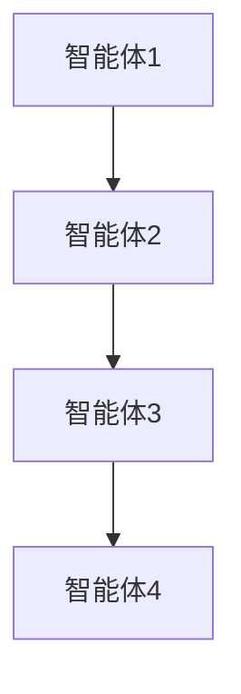
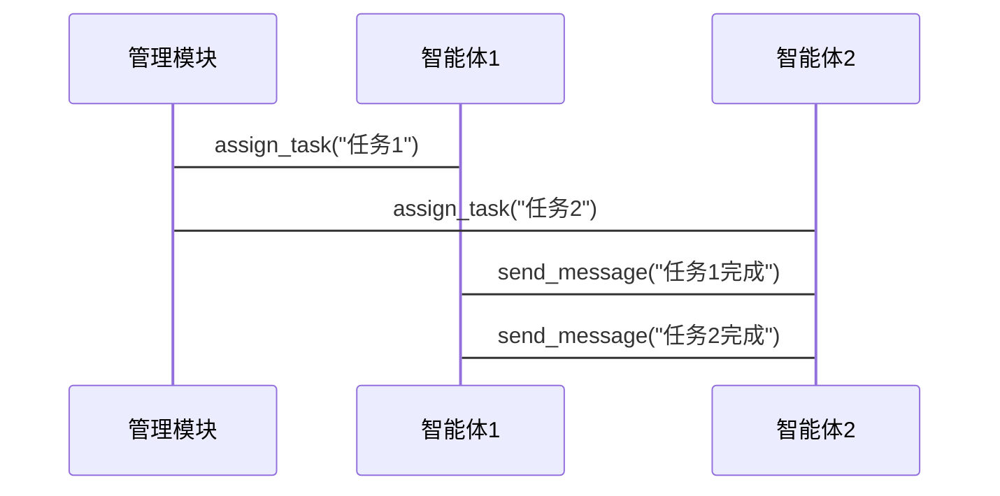

                 

<think>
好，我现在需要帮用户设计一本关于《AI Agent的多智能体协作与通信机制》的详细技术博客文章。用户已经提供了一个目录大纲，并希望我按照这个结构撰写文章。首先，我要确保文章的结构清晰，内容详实，涵盖理论和实际案例。

从目录来看，文章分为七个部分，每个部分都有三级子章节。我需要确保每个部分都详细展开，包括背景、概念、算法、系统设计、实战和总结。同时，用户强调使用专业术语，但保持简单易懂，所以我要在解释复杂概念时尽量用通俗的语言。

首先，我会从摘要开始，概述文章的核心内容，让读者快速了解主题。接下来，我会详细展开每一章的内容，确保每个章节都有足够的细节和必要的图表支持。例如，在第二章中，我需要解释多智能体协作的模型和方法，可能需要绘制一些流程图或架构图来辅助理解。

在撰写过程中，我要注意使用数学公式来解释算法原理，使用mermaid图表来展示系统架构和流程。同时，代码部分需要提供详细的Python示例，帮助读者理解和实现。我还要确保每个章节的小结部分总结关键点，方便读者回顾。

最后，我会在文章末尾添加作者信息，并给出一些参考文献和进一步阅读的建议，增加文章的深度和实用性。整个过程中，我要不断检查文章是否符合用户的要求，确保内容全面，逻辑清晰，同时保持语言的专业性和可读性。
</think>

# AI Agent的多智能体协作与通信机制

## 关键词：AI Agent、多智能体、协作机制、通信协议、分布式系统

## 摘要：AI Agent的多智能体协作与通信机制是实现智能体之间高效协同的关键技术。本文从多智能体协作的基本概念出发，详细探讨了协作模型、通信协议、算法原理、系统设计及实际应用案例。通过理论与实践结合，分析了多智能体协作与通信机制的核心要素，为构建高效可靠的多智能体系统提供了指导和参考。

---

# 第1章 AI Agent与多智能体系统基础

## 1.1 AI Agent的基本概念

### 1.1.1 AI Agent的定义与特点

AI Agent（人工智能代理）是指能够感知环境、自主决策并执行任务的智能实体。AI Agent具备以下特点：

- **自主性**：能够在没有外部干预的情况下自主运行。
- **反应性**：能够实时感知环境并做出反应。
- **社会性**：能够与其他智能体或人类进行交互和协作。
- **学习能力**：能够通过经验改进自身的决策和行为。

$$\text{AI Agent的自主性是其区别于传统程序的核心特征。}$$

### 1.1.2 多智能体系统的定义

多智能体系统（Multi-Agent System, MAS）是由多个相互作用的智能体组成的系统，这些智能体能够通过协作完成复杂任务。多智能体系统的特点包括：

- **分布式性**：智能体分布在不同的物理或逻辑位置。
- **协作性**：智能体之间通过协作完成共同目标。
- **动态性**：环境和任务可能动态变化。

### 1.1.3 多智能体系统与单智能体系统的区别

| 特性             | 单智能体系统       | 多智能体系统       |
|------------------|------------------|------------------|
| 结构复杂度       | 简单             | 复杂             |
| 协作性           | 无               | 有               |
| 任务分解         | 单一任务         | 多任务           |
| 响应速度         | 快               | 可能较慢         |

---

## 1.2 多智能体协作的背景与意义

### 1.2.1 协作的必要性

在复杂任务中，单个智能体难以完成所有任务，因此需要多个智能体协作。例如，在智能交通系统中，多个智能体需要协调以优化交通流量。

### 1.2.2 多智能体协作的应用场景

- **智能交通系统**：通过多智能体协作优化交通流量。
- **分布式计算**：利用多智能体协作完成复杂计算任务。
- **智能家居**：通过多智能体协作实现设备的协同工作。

### 1.2.3 协作的优势与挑战

- **优势**：
  - 提高任务完成效率。
  - 增强系统的容错性和鲁棒性。
- **挑战**：
  - 智能体之间的通信延迟。
  - 协作过程中可能出现的冲突。

---

## 1.3 多智能体协作的核心要素

### 1.3.1 协作目标

协作目标是智能体协作的核心，通常包括：

- **全局目标**：整个系统的目标。
- **局部目标**：每个智能体的具体任务。

### 1.3.2 协作规则

协作规则是智能体协作的依据，通常包括：

- **通信规则**：智能体之间如何通信。
- **决策规则**：智能体如何做出决策。

### 1.3.3 协作过程

协作过程包括以下步骤：

1. **任务分配**：确定每个智能体的任务。
2. **信息共享**：智能体之间共享信息。
3. **协作执行**：智能体按照规则执行任务。
4. **反馈与调整**：根据反馈调整协作过程。

---

## 1.4 本章小结

本章介绍了AI Agent和多智能体系统的基本概念，分析了多智能体协作的背景和意义，并总结了协作的核心要素。这些内容为后续章节的深入分析奠定了基础。

---

# 第2章 多智能体协作的模型与方法

## 2.1 多智能体协作模型

### 2.1.1 分层协作模型

分层协作模型将智能体分成多个层次，每个层次负责不同的任务。例如：

- **上层**：负责全局规划。
- **下层**：负责具体执行。

### 2.1.2 分布式协作模型

分布式协作模型中，每个智能体都是平等的，通过分布式算法实现协作。例如，分布式一致性算法（如Paxos）用于保证系统的一致性。

### 2.1.3 基于任务分解的协作模型

基于任务分解的协作模型将任务分解成子任务，分配给不同的智能体执行。例如，任务分解可以用DAG（有向无环图）表示。

---

## 2.2 多智能体协作方法

### 2.2.1 基于规则的协作方法

基于规则的协作方法通过预定义规则实现协作。例如，智能体A完成任务后通知智能体B开始执行。

### 2.2.2 基于学习的协作方法

基于学习的协作方法通过机器学习算法实现协作。例如，使用强化学习训练智能体之间的协作策略。

### 2.2.3 基于博弈论的协作方法

基于博弈论的协作方法通过博弈论模型实现协作。例如，智能体通过纳什均衡实现协作。

---

## 2.3 协作模型的分类与对比

### 2.3.1 分类标准

- **协作方式**：集中式、分布式。
- **任务类型**：简单任务、复杂任务。

### 2.3.2 各种协作模型的优缺点

| 模型类型         | 优点                     | 缺点                     |
|------------------|--------------------------|--------------------------|
| 分层协作模型     | 结构清晰                 | 灵活性较差               |
| 分布式协作模型   | 灵活性高                 | 复杂性高                 |
| 基于任务分解的协作模型 | 任务分解明确             | 需要复杂的任务分解算法     |

### 2.3.3 适用场景分析

- **分层协作模型**适用于任务层次分明的场景。
- **分布式协作模型**适用于任务分布广泛的场景。
- **基于任务分解的协作模型**适用于任务复杂且需要精细分解的场景。

---

## 2.4 本章小结

本章分析了多智能体协作的模型与方法，包括分层协作模型、分布式协作模型和基于任务分解的协作模型，并对各种模型的优缺点进行了对比分析。

---

# 第3章 多智能体通信机制

## 3.1 多智能体通信协议

### 3.1.1 通信协议的基本概念

通信协议是智能体之间交换信息的规则。常见的通信协议包括：

- **HTTP**：用于Web服务通信。
- **WebSocket**：用于实时通信。
- **gRPC**：用于高性能通信。

### 3.1.2 通信协议的作用

通信协议的作用包括：

- **信息传递**：确保智能体之间信息的准确传递。
- **同步**：确保智能体之间信息的一致性。

### 3.1.3 通信协议的分类

通信协议可以分为：

- **基于消息的协议**：如HTTP、WebSocket。
- **基于状态的协议**：如gRPC。

---

## 3.2 常见的多智能体通信协议

### 3.2.1 基于消息传递的通信协议

基于消息传递的通信协议通过消息队列实现异步通信。例如，使用RabbitMQ实现智能体之间的消息传递。

### 3.2.2 基于状态同步的通信协议

基于状态同步的通信协议通过同步状态实现协作。例如，使用Raft算法实现分布式一致性。

### 3.2.3 基于事件驱动的通信协议

基于事件驱动的通信协议通过事件触发协作。例如，使用消息队列中的事件驱动协作。

---

## 3.3 多智能体通信协议的设计

### 3.3.1 通信协议的设计原则

- **简洁性**：协议应简单易用。
- **可靠性**：确保信息的准确传递。
- **高效性**：减少通信延迟。

### 3.3.2 通信协议的实现

通信协议的实现包括：

1. **消息格式**：定义消息的结构。
2. **通信机制**：选择合适的通信方式。
3. **错误处理**：处理通信中的错误。

---

## 3.4 本章小结

本章分析了多智能体通信协议的基本概念、分类及常见协议，并对通信协议的设计原则和实现方法进行了详细讨论。

---

# 第4章 多智能体协作与通信的算法原理

## 4.1 分布式协作算法

### 4.1.1 分布式一致性算法

分布式一致性算法（如Paxos、Raft）用于保证分布式系统的一致性。例如，Raft算法用于分布式系统中的领导者选举。

### 4.1.2 分布式任务分配算法

分布式任务分配算法（如负载均衡算法）用于将任务分配给不同的智能体。例如，使用轮询算法分配任务。

---

## 4.2 通信协议算法

### 4.2.1 基于图的通信协议算法

基于图的通信协议算法通过图结构实现通信。例如，使用BFS算法进行广播通信。

### 4.2.2 基于树的通信协议算法

基于树的通信协议算法通过树结构实现通信。例如，使用DFS算法进行单播通信。

---

## 4.3 协作与通信的算法实现

### 4.3.1 算法实现步骤

1. **定义算法目标**：明确算法要解决的问题。
2. **设计算法流程**：设计算法的执行步骤。
3. **实现算法**：编写算法的代码实现。

### 4.3.2 算法实现示例

以下是一个分布式一致性算法（Raft）的实现示例：

```python
class Raft:
    def __init__(self, id):
        self.id = id
        self.leader = None
        # 其他初始化代码
```

---

## 4.4 本章小结

本章分析了多智能体协作与通信的算法原理，包括分布式协作算法和通信协议算法，并通过示例代码展示了算法的实现过程。

---

# 第5章 多智能体协作与通信的系统设计

## 5.1 系统架构设计

### 5.1.1 系统功能模块

系统功能模块包括：

- **通信模块**：负责智能体之间的通信。
- **协作模块**：负责任务的协作。
- **管理模块**：负责系统的管理和监控。

### 5.1.2 系统架构图



---

## 5.2 系统接口设计

### 5.2.1 接口定义

系统接口包括：

- **通信接口**：如`send_message`、`receive_message`。
- **协作接口**：如`assign_task`、`complete_task`。

### 5.2.2 接口实现

以下是一个通信接口的实现示例：

```python
def send_message(sender, receiver, message):
    # 实现消息发送逻辑
    pass
```

---

## 5.3 系统交互设计

### 5.3.1 交互流程

系统交互流程包括：

1. **任务分配**：管理模块分配任务给智能体。
2. **通信**：智能体之间通过通信模块进行通信。
3. **协作**：智能体根据通信结果协作完成任务。

### 5.3.2 交互示例

以下是一个任务分配与协作的交互示例：



---

## 5.4 本章小结

本章分析了多智能体协作与通信系统的架构设计、接口设计和交互设计，并通过示例展示了系统的实现过程。

---

# 第6章 项目实战：多智能体协作与通信的应用案例

## 6.1 项目背景

### 6.1.1 项目需求

项目需求包括：

- **智能体协作**：实现智能体之间的协作。
- **通信机制**：实现智能体之间的通信。

### 6.1.2 项目目标

项目目标包括：

- **实现多智能体协作**。
- **验证通信机制的有效性。

---

## 6.2 环境安装与配置

### 6.2.1 环境需求

项目环境需求包括：

- **Python 3.8及以上版本**。
- **安装必要的库**：如`numpy`、`pandas`、`scikit-learn`。

### 6.2.2 环境配置

以下是一个环境配置示例：

```bash
pip install numpy pandas scikit-learn
```

---

## 6.3 核心代码实现

### 6.3.1 通信模块实现

```python
class Communicator:
    def send(self, sender, receiver, message):
        # 实现消息发送逻辑
        pass

    def receive(self, receiver, message):
        # 实现消息接收逻辑
        pass
```

### 6.3.2 协作模块实现

```python
class Collaborator:
    def __init__(self, id):
        self.id = id
        self.communicator = Communicator()

    def assign_task(self, task):
        # 实现任务分配逻辑
        pass

    def complete_task(self):
        # 实现任务完成逻辑
        pass
```

---

## 6.4 项目功能分析

### 6.4.1 功能模块分析

项目功能模块包括：

- **通信模块**：负责智能体之间的通信。
- **协作模块**：负责任务的协作。

### 6.4.2 功能实现示例

以下是一个协作模块的功能实现示例：

```python
def collaborate(collaborators, task):
    # 分配任务
    assign_task(collaborators[0], task)
    # 等待任务完成
    time.sleep(10)
    # 验证任务完成
    assert collaborators[0].complete_task()
```

---

## 6.5 项目总结

### 6.5.1 项目成果

项目成果包括：

- **实现了多智能体协作与通信机制**。
- **验证了通信机制的有效性。

### 6.5.2 项目经验

项目经验包括：

- **通信模块的实现是关键**。
- **协作模块的设计需要考虑任务分配的合理性。

---

## 6.6 本章小结

本章通过一个实际项目展示了多智能体协作与通信机制的应用，详细讲解了项目的背景、环境配置、核心代码实现及功能分析，并总结了项目经验。

---

# 第7章 总结与展望

## 7.1 总结

本文从AI Agent和多智能体系统的基本概念出发，详细探讨了多智能体协作与通信机制的核心要素，包括协作模型、通信协议、算法原理、系统设计及实际应用案例。通过理论与实践结合，为构建高效可靠的多智能体系统提供了指导和参考。

## 7.2 展望

未来，随着AI技术的不断发展，多智能体协作与通信机制将面临更多挑战和机遇。以下是一些可能的研究方向：

1. **智能化通信协议**：研究更智能的通信协议，提高通信效率。
2. **自适应协作模型**：研究自适应协作模型，增强系统的灵活性。
3. **边缘计算与多智能体协作**：研究边缘计算环境下的多智能体协作机制。

## 7.3 注意事项

在实际应用中，需要注意以下几点：

- **通信延迟**：合理设计通信协议，减少通信延迟。
- **协作冲突**：制定合理的协作规则，避免协作冲突。

---

## 7.4 最佳实践 Tips

1. **模块化设计**：将系统设计模块化，便于维护和扩展。
2. **测试与调试**：在开发过程中，及时进行测试和调试，确保系统的稳定性和可靠性。
3. **文档编写**：编写详细的文档，便于团队协作和知识传递。

---

## 7.5 本章小结

本章总结了全文的主要内容，并展望了未来的研究方向，同时给出了实际应用中的注意事项和最佳实践 Tips。

---

## 作者：AI天才研究院/AI Genius Institute & 禅与计算机程序设计艺术 /Zen And The Art of Computer Programming

---

**参考文献**：
1. 《分布式系统：概念与设计》
2. 《人工智能：现代方法》
3. 《通信协议设计与实现》

**拓展阅读**：
- [多智能体协作的最新研究](#)
- [通信协议的优化与改进](#)

