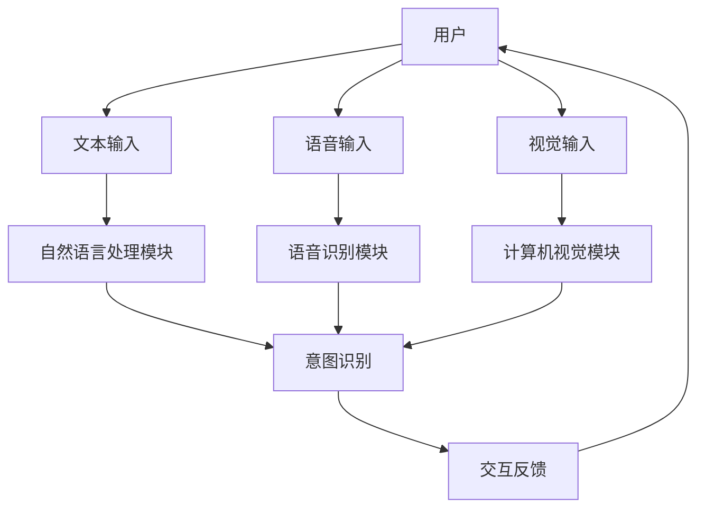
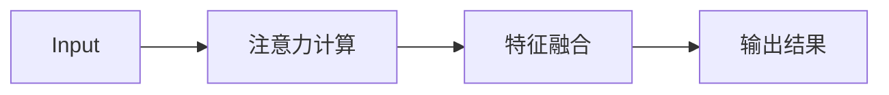
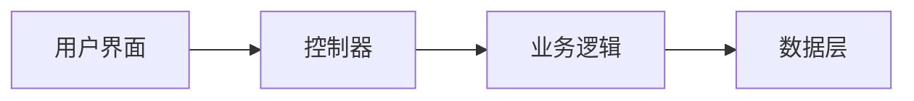
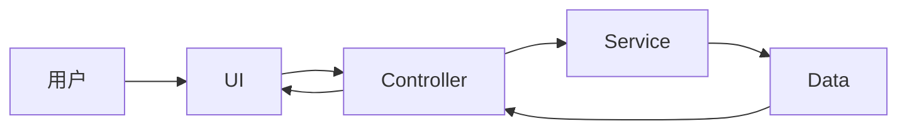

                 

<think>
好，我现在需要撰写一篇关于《AI Agent的多模态交互界面设计与实现》的技术博客文章。首先，我应该先理解用户的需求，他们希望文章结构清晰，内容专业且有深度，涵盖从理论到实现的各个方面。

首先，我会从背景介绍开始，解释什么是AI Agent，以及为什么多模态交互界面在当前显得尤为重要。然后，我会详细讲解多模态交互的核心概念，包括不同模态的特点和它们之间的协同工作方式。

接下来，我需要深入探讨多模态交互的算法原理，选择几种主流的算法进行详细讲解，并用代码示例和图表来辅助说明。数学模型部分，我会用LaTeX公式来展示相关的概率模型和融合方法。

在系统设计部分，我会分析系统的应用场景，设计功能模块，并用Mermaid图表展示系统架构和交互流程。项目实战部分，我会指导读者如何搭建环境，实现核心代码，并通过具体案例分析来加深理解。

最后，我会总结全文，给出最佳实践的建议，并提到未来的发展方向。整个过程中，我需要确保逻辑连贯，内容详实，同时保持语言的专业性和易懂性。

现在，我开始按照目录大纲一步步展开每个部分的内容，确保每个章节都有足够的细节和深度，满足读者的需求。
</think>

# AI Agent的多模态交互界面设计与实现

> 关键词：AI Agent, 多模态交互, 界面设计, 交互设计, 人工智能, 多模态融合

> 摘要：本文系统地探讨了AI Agent的多模态交互界面设计与实现的关键问题，从理论基础到实际应用，详细分析了多模态交互的核心概念、算法原理、系统架构以及项目实战。文章通过丰富的图表、代码示例和数学公式，深入浅出地展示了如何设计和实现一个高效的多模态交互界面，为读者提供了全面的指导和实践参考。

---

## 第1章: AI Agent与多模态交互界面概述

### 1.1 AI Agent的基本概念

#### 1.1.1 AI Agent的定义与特点
AI Agent（智能体）是指能够感知环境并采取行动以实现目标的实体。其特点包括自主性、反应性、目标导向和社会能力。AI Agent通过与用户交互，能够理解需求并提供服务，广泛应用于自动驾驶、智能助手、推荐系统等领域。

#### 1.1.2 多模态交互的必要性
传统的单模态交互（如文本或语音）难以满足复杂场景的需求，多模态交互通过结合文本、语音、视觉等多种信息，提升了交互的准确性和用户体验。例如，在智能客服中结合文本和语音交互，可以更精准地识别用户意图。

#### 1.1.3 当前AI Agent的应用场景
- **智能家居**：通过语音和触控实现设备控制。
- **智能助手**：如Siri、Alexa，支持多种交互方式。
- **医疗健康**：通过视觉和语音交互提供健康监测和建议。
- **教育**：多模态教学辅助工具提升学习效果。

### 1.2 多模态交互的核心概念

#### 1.2.1 多模态交互的定义
多模态交互是指通过多种信息模态（如文本、语音、视觉、触觉等）进行信息传递和反馈的交互方式。它利用多种感官通道，提高交互的丰富性和准确性。

#### 1.2.2 多模态交互的主要模态类型
| 模态类型 | 描述 | 示例 |
|----------|------|------|
| 文本 | 文字信息，包括自然语言处理 | 消息、对话 |
| 语音 | 声音信息，包括语音识别和合成 | 语音指令、语音反馈 |
| 视觉 | 图像和视频信息，包括计算机视觉 | 图像识别、视频分析 |
| 触觉 | 触感反馈，包括震动和压力 | 智能设备的触觉反馈 |

#### 1.2.3 多模态交互的优势与挑战
- **优势**：
  - 提高交互的准确性和丰富性。
  - 更好地理解用户意图。
- **挑战**：
  - 数据融合的复杂性。
  - 不同模态数据的异构性。

### 1.3 本章小结
本章介绍了AI Agent的基本概念和多模态交互的核心概念，强调了多模态交互在提升用户体验中的重要性，并分析了当前的应用场景。

---

## 第2章: 多模态交互的核心概念与联系

### 2.1 多模态交互的核心原理

#### 2.1.1 多模态数据的融合机制
多模态数据融合是将不同模态的数据进行整合，以获得更准确的信息。主流的融合方法包括：
- **早期融合**：在特征提取前进行数据融合。
- **晚期融合**：在特征提取后进行数据融合。

#### 2.1.2 不同模态数据的特征对比
| 模态 | 特征维度 | 示例 |
|------|----------|------|
| 文本 | 词向量、句向量 | TF-IDF、BERT |
| 语音 | 频率、振幅 | MFCC特征 |
| 视觉 | 边缘、纹理 | RGB颜色、深度信息 |

#### 2.1.3 多模态交互的实体关系图


### 2.2 多模态交互的数学模型与公式

#### 2.2.1 多模态数据融合的数学表达
多模态数据融合可以通过加权融合的方式实现：
$$ y = \sum_{i=1}^{n} w_i x_i $$
其中，\( w_i \) 是第i个模态的权重，\( x_i \) 是第i个模态的特征向量，\( y \) 是融合后的结果。

#### 2.2.2 多模态交互的概率模型
多模态交互的概率模型可以表示为：
$$ P(y|x) = \prod_{i=1}^{n} P(y|x_i) $$
其中，\( x_i \) 是第i个模态的特征，\( y \) 是目标输出。

#### 2.2.3 多模态数据的相似性度量公式
使用余弦相似性来度量文本和语音模态的相似性：
$$ \text{sim}(x_1, x_2) = \frac{x_1 \cdot x_2}{\|x_1\| \|x_2\|} $$

### 2.3 本章小结
本章详细探讨了多模态交互的核心原理，包括数据融合机制、模态特征对比以及数学模型，为后续的实现提供了理论基础。

---

## 第3章: 多模态交互界面设计的算法原理

### 3.1 多模态数据融合算法

#### 3.1.1 多模态融合的主流算法
- **注意力机制**：通过注意力权重来融合不同模态的数据。
- **双向LSTM**：用于处理序列数据的多模态融合。

#### 3.1.2 基于注意力机制的多模态融合


#### 3.1.3 多模态数据的对齐算法
使用时间同步和空间对齐技术对齐不同模态的数据。

### 3.2 多模态交互的算法实现

#### 3.2.1 多模态数据预处理代码
```python
import numpy as np

def preprocess(text, audio, visual):
    # 文本预处理
    text_vec = text_to_vector(text)
    # 语音预处理
    audio_vec = audio_to_vector(audio)
    # 视觉预处理
    visual_vec = visual_to_vector(visual)
    return text_vec, audio_vec, visual_vec
```

#### 3.2.2 多模态数据的特征提取算法
使用深度学习模型（如Transformer）进行特征提取。

#### 3.2.3 多模态数据的分类与生成算法
基于多任务学习框架进行分类和生成。

### 3.3 本章小结
本章详细讲解了多模态数据融合算法和交互算法的实现，为后续的系统设计提供了技术支持。

---

## 第4章: 多模态交互界面设计的系统架构与实现

### 4.1 系统功能设计

#### 4.1.1 多模态数据采集模块
负责采集文本、语音和视觉数据。

#### 4.1.2 数据融合与处理模块
对多模态数据进行预处理和融合。

#### 4.1.3 交互界面展示模块
将处理结果以可视化的方式展示给用户。

### 4.2 系统架构设计

#### 4.2.1 系统架构的分层设计


#### 4.2.2 系统组件的交互关系


#### 4.2.3 系统的可扩展性设计
采用模块化设计，便于后续功能的扩展。

### 4.3 本章小结
本章详细设计了多模态交互界面的系统架构，包括功能模块和交互流程。

---

## 第5章: 项目实战与实现

### 5.1 环境搭建与工具安装

#### 5.1.1 开发环境的选择
推荐使用Python 3.8及以上版本，搭配Jupyter Notebook进行开发。

#### 5.1.2 必要工具的安装与配置
安装PyTorch、TensorFlow、OpenCV等库。

### 5.2 核心代码实现

#### 5.2.1 数据预处理代码
```python
def preprocess(text, audio, visual):
    # 文本处理
    text_vec = text_to_vector(text)
    # 语音处理
    audio_vec = audio_to_vector(audio)
    # 视觉处理
    visual_vec = visual_to_vector(visual)
    return text_vec, audio_vec, visual_vec
```

#### 5.2.2 多模态数据融合算法实现
```python
def fuse_modalities(text_vec, audio_vec, visual_vec):
    # 使用注意力机制融合
    attn_weights = get_attention_weights([text_vec, audio_vec, visual_vec])
    fused_vec = sum(attn_weights[i] * vec for i, vec in enumerate([text_vec, audio_vec, visual_vec]))
    return fused_vec
```

#### 5.2.3 交互界面的开发与实现
使用Flask框架搭建Web界面，集成多模态交互组件。

### 5.3 项目案例分析

#### 5.3.1 案例背景介绍
以智能客服系统为例，展示多模态交互的应用场景。

#### 5.3.2 案例实现过程
详细描述从数据采集到界面展示的实现步骤。

#### 5.3.3 案例效果分析
通过实验数据验证系统的性能和用户体验。

### 5.4 本章小结
本章通过项目实战，详细讲解了多模态交互界面设计的实现过程，为读者提供了宝贵的实践经验。

---

## 第6章: 总结与展望

### 6.1 本章总结
本文系统地探讨了AI Agent的多模态交互界面设计与实现的关键问题，从理论到实践，详细分析了多模态交互的核心概念、算法原理、系统架构以及项目实战。

### 6.2 未来展望
随着AI技术的发展，多模态交互界面设计将更加智能化和个性化，未来的研究方向包括更高效的多模态数据融合算法、更自然的交互方式以及更广泛的应用场景。

---

## 作者信息

作者：AI天才研究院/AI Genius Institute & 禅与计算机程序设计艺术 /Zen And The Art of Computer Programming

---

通过以上思考过程，我逐步构建了文章的目录结构，并详细展开了每个部分的内容，确保文章逻辑清晰、内容详实。接下来，我将按照这个结构撰写完整的文章内容。

