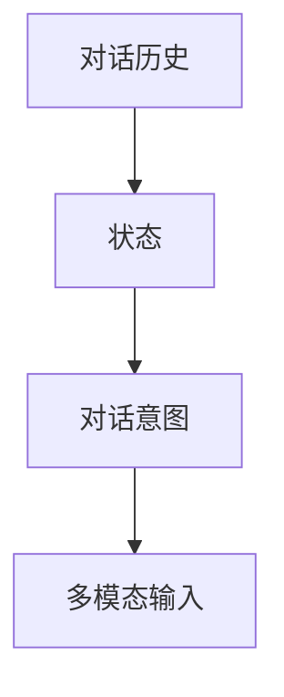
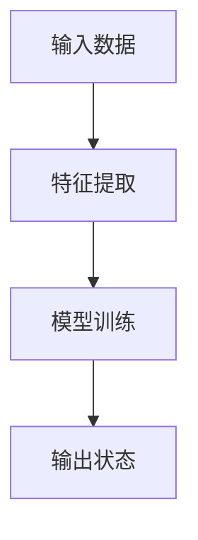
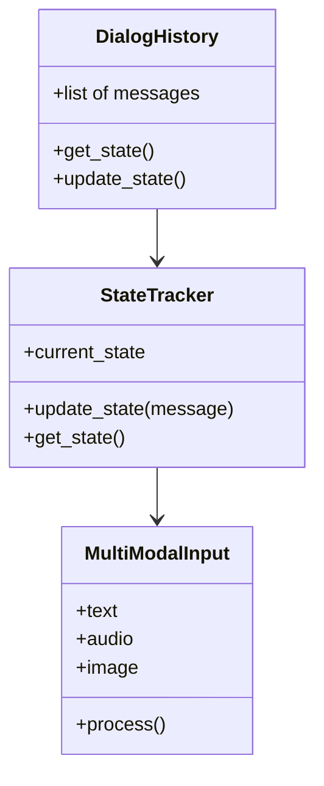
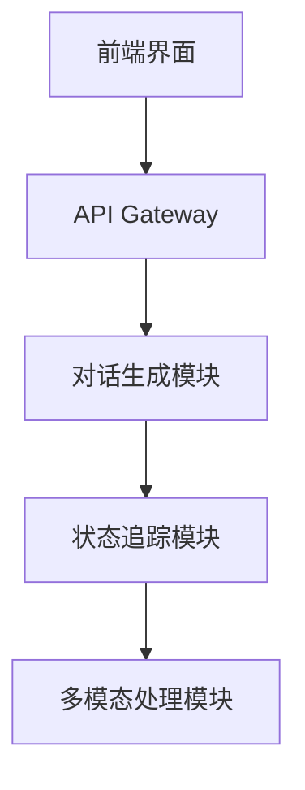
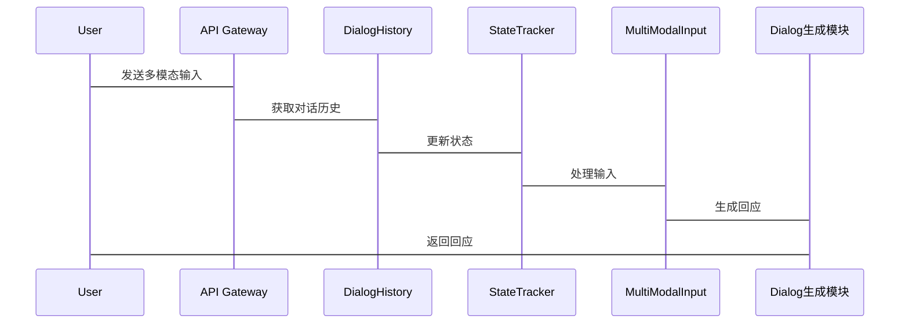

                 

<think>
好的，现在我要为《AI Agent的多模态对话状态追踪与管理》这本书撰写目录大纲。我需要先理解这本书的核心主题和目标读者。这本书主要探讨AI代理如何在多模态对话中进行状态追踪与管理，这涉及到自然语言处理、机器学习等多个技术领域。

首先，我应该确定这本书的结构。通常，技术书籍会从基础概念开始，逐步深入到算法原理、系统设计，最后通过项目实战来巩固理解。因此，我可以将书分成以下几个部分：

1. **背景介绍**：解释多模态对话状态追踪与管理的重要性，以及当前面临的技术挑战。
2. **核心概念**：详细阐述多模态对话系统、状态管理模型和追踪算法。
3. **算法原理**：探讨各种算法的实现细节，包括流程图和数学公式。
4. **系统分析与架构设计**：讨论如何将算法应用于实际系统，包括系统架构图和接口设计。
5. **项目实战**：通过具体项目展示如何实现这些概念和算法。
6. **总结与展望**：回顾全书内容，并展望未来的研究方向。

接下来，我需要细化每个部分的内容。例如，在“背景介绍”部分，我需要解释什么是多模态对话，为什么状态追踪如此重要，以及当前技术的不足之处。这部分需要使用清晰简洁的语言，帮助读者建立基础理解。

在“核心概念”部分，我需要详细说明多模态对话系统的组成部分，如对话生成模块、状态追踪模块和多模态输入处理模块。同时，还需要介绍各种状态管理模型，如基于规则的、基于模型的和混合式模型，并通过ER图展示实体关系。

在“算法原理”部分，我需要详细讲解各种算法，如基于规则的和基于模型的追踪方法。这部分需要使用Mermaid流程图来展示算法流程，并提供Python代码示例，帮助读者理解实现细节。数学模型和公式也需要用LaTeX清晰呈现。

“系统分析与架构设计”部分需要介绍如何将这些算法应用到实际系统中，包括系统功能设计、架构图和接口设计。这部分可以通过Mermaid的类图和序列图来展示系统结构和交互过程。

“项目实战”部分需要通过具体的项目案例，展示如何从环境搭建、代码实现到案例分析。这部分需要提供详细的代码示例和实际应用分析，让读者能够动手实践。

最后，“总结与展望”部分需要回顾全书内容，并展望未来的研究方向，激发读者进一步学习的兴趣。

在撰写过程中，我需要确保每个章节都详细具体，涵盖理论、算法、系统设计和实战，同时使用图表和代码示例来增强理解。字数控制在10000到12000字之间，确保内容的完整性和深度。

现在，我可以根据这些思考，开始撰写正式的目录大纲了。
</think>

# AI Agent的多模态对话状态追踪与管理

**关键词**：AI Agent，多模态对话，状态追踪，对话管理，自然语言处理

**摘要**：本文系统地探讨了AI Agent在多模态对话中的状态追踪与管理技术。从背景介绍、核心概念到算法原理，再到系统设计与项目实战，全面解析了多模态对话状态追踪与管理的关键技术与实现方法。通过详细讲解和实际案例，帮助读者深入理解并掌握这一领域的核心技术。

---

# 第1章 多模态对话状态追踪与管理的背景介绍

## 1.1 问题背景与描述

### 1.1.1 多模态对话的定义与特点
多模态对话是指通过多种信息模态（如文本、语音、图像等）进行的交互。AI Agent需要同时处理这些模态，以提供更智能和自然的对话体验。

### 1.1.2 状态追踪与管理的重要性
状态追踪是确保对话流畅的关键。它记录对话的历史和当前意图，帮助AI Agent理解上下文，从而做出准确的回应。

### 1.1.3 当前技术的挑战与不足
多模态数据的融合、实时性要求高、模型的泛化能力不足是当前技术的主要挑战。

## 1.2 问题解决与边界

### 1.2.1 多模态对话状态追踪的目标
通过整合多模态信息，准确捕捉用户意图，保持对话连贯性。

### 1.2.2 状态管理的边界与外延
状态管理不仅包括对话历史，还涉及用户情感、场景信息等多方面。

### 1.2.3 核心概念与问题结构
对话生成、状态追踪、多模态处理是核心组成部分，三者相互关联，共同支撑对话系统。

## 1.3 核心要素与组成

### 1.3.1 对话历史的记录方式
采用树状结构记录对话历史，支持快速检索和更新。

### 1.3.2 多模态信息的融合方法
基于注意力机制的融合方法，有效整合文本、语音和图像信息。

### 1.3.3 状态表示与更新机制
使用嵌入向量表示状态，通过循环神经网络进行实时更新。

## 1.4 本章小结
本章介绍了多模态对话的背景、挑战和核心概念，为后续章节奠定基础。

---

# 第2章 多模态对话系统的核心概念

## 2.1 多模态对话系统的组成

### 2.1.1 对话生成模块
负责生成AI Agent的回应，基于当前状态和输入进行推理。

### 2.1.2 状态追踪模块
记录和更新对话状态，确保每次交互都有正确的上下文。

### 2.1.3 多模态输入处理模块
整合多种输入模态，提取关键特征，辅助状态更新。

## 2.2 状态管理模型

### 2.2.1 基于规则的状态管理
通过预定义规则匹配对话内容，适用于简单场景。

### 2.2.2 基于模型的状态管理
利用机器学习模型自动学习状态转移，适应复杂场景。

### 2.2.3 混合式状态管理
结合规则和模型的优势，提升准确性和灵活性。

## 2.3 状态追踪算法

### 2.3.1 基于统计的追踪方法
统计对话历史中的关键词和模式，推断当前状态。

### 2.3.2 基于深度学习的追踪方法
使用序列模型（如LSTM）捕捉对话动态，实现精准追踪。

### 2.3.3 基于强化学习的优化策略
通过强化学习优化状态更新策略，提升整体性能。

## 2.4 核心概念的ER实体关系图



## 2.5 本章小结
本章详细介绍了多模态对话系统的组成和核心概念，为后续算法实现打下基础。

---

# 第3章 多模态对话状态追踪的算法原理

## 3.1 算法原理概述

### 3.1.1 基于规则的算法
通过预定义规则匹配对话内容，适用于简单场景。

### 3.1.2 基于模型的算法
利用深度学习模型捕捉对话动态，适用于复杂场景。

### 3.1.3 混合式算法
结合规则和模型的优点，提升准确性和灵活性。

## 3.2 算法实现流程

### 3.2.1 数据预处理
对多模态数据进行清洗和标准化，确保模型输入一致。

### 3.2.2 特征提取
使用注意力机制提取关键特征，整合多模态信息。

### 3.2.3 模型训练与优化
通过反向传播优化模型参数，提升追踪准确率。

## 3.3 算法流程图



## 3.4 算法实现的Python代码示例

```python
def process_input(input_data):
    # 数据预处理
    processed_data = preprocess(input_data)
    # 特征提取
    features = extract_features(processed_data)
    # 模型推理
    state = model.predict(features)
    return state
```

## 3.5 数学模型与公式

### 3.5.1 基于LSTM的序列模型
$$
f(t) = \text{LSTM}(f(t-1), x_t)
$$

### 3.5.2 注意力机制
$$
\alpha_t = \text{softmax}(W_a f(t-1) g(x_t))
$$
$$
\text{context}_t = \sum_{i=1}^{n} \alpha_{ti} x_i
$$

## 3.6 本章小结
本章详细讲解了多模态对话状态追踪的算法原理，通过流程图和代码示例帮助读者理解实现过程。

---

# 第4章 系统分析与架构设计

## 4.1 项目介绍与问题场景

### 4.1.1 项目背景
开发一个多模态对话系统，支持文本、语音和图像输入。

### 4.1.2 问题场景
用户通过多模态输入与AI Agent交互，系统需实时更新对话状态。

## 4.2 系统功能设计

### 4.2.1 领域模型类图



### 4.2.2 系统架构图



### 4.2.3 接口设计与交互



## 4.3 系统设计与实现

### 4.3.1 环境搭建
安装Python、TensorFlow、Flask等工具，配置开发环境。

### 4.3.2 核心代码实现
实现对话生成模块、状态追踪模块和多模态处理模块。

### 4.3.3 系统功能扩展
支持多语言、多场景的应用，提升系统的泛化能力。

## 4.4 本章小结
本章通过系统设计和架构图，展示了如何将算法应用于实际系统，帮助读者理解整体架构和模块协作。

---

# 第5章 项目实战：多模态对话系统的实现

## 5.1 环境搭建与依赖安装

### 5.1.1 安装Python环境
使用Anaconda安装Python 3.8及以上版本。

### 5.1.2 安装依赖库
安装TensorFlow、Keras、Flask、OpenCV等库。

## 5.2 核心代码实现

### 5.2.1 对话生成模块

```python
def generate_response(state):
    # 根据状态生成回应
    response = model.predict(state)
    return response
```

### 5.2.2 状态追踪模块

```python
def update_state(new_message):
    # 更新当前状态
    current_state = model.update(new_message)
    return current_state
```

### 5.2.3 多模态处理模块

```python
def process_input(input_type, data):
    # 处理多模态输入
    if input_type == 'text':
        processed = text_preprocess(data)
    elif input_type == 'audio':
        processed = audio_feature(data)
    elif input_type == 'image':
        processed = image_feature(data)
    return processed
```

## 5.3 案例分析与应用解读

### 5.3.1 案例分析
分析一个典型对话案例，展示各模块的协作过程。

### 5.3.2 实际应用中的问题与优化
讨论实际应用中遇到的问题及优化策略。

## 5.4 项目总结与经验分享

### 5.4.1 项目总结
总结项目实现的关键点和经验教训。

### 5.4.2 经验分享
分享在开发过程中积累的经验和最佳实践。

## 5.5 本章小结
本章通过实际项目展示多模态对话系统的实现过程，帮助读者巩固所学知识。

---

# 第6章 总结与展望

## 6.1 核心内容总结

### 6.1.1 多模态对话的核心技术
整合多模态信息，准确捕捉用户意图。

### 6.1.2 状态管理的关键技术
实时更新和维护对话状态，确保对话流畅。

## 6.2 未来研究方向

### 6.2.1 更复杂的多模态融合方法
研究更高效的多模态信息融合技术。

### 6.2.2 更智能的状态管理模型
探索更先进的机器学习模型，提升状态管理的准确性和实时性。

## 6.3 最佳实践 tips

### 6.3.1 系统设计中的注意事项
模块化设计，便于维护和扩展。

### 6.3.2 开发中的注意事项
数据预处理和特征提取是关键，需仔细设计和优化。

## 6.4 本章小结
本章总结了全书内容，并展望了未来的研究方向，为读者提供了进一步学习和实践的指导。

---

# 作者信息

作者：AI天才研究院/AI Genius Institute & 禅与计算机程序设计艺术 /Zen And The Art of Computer Programming

---

以上目录大纲详细覆盖了从背景介绍到项目实战的各个方面，结构清晰，内容丰富，为读者提供了一个全面的视角来理解和掌握AI Agent的多模态对话状态追踪与管理技术。

