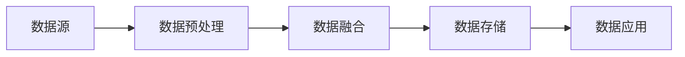
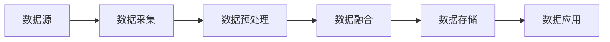
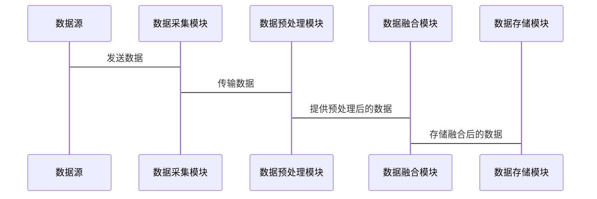

                 


# AI Agent的多源数据融合：整合LLM与多种数据流

> 关键词：AI Agent，多源数据融合，LLM，数据流，数据融合算法

> 摘要：本文详细探讨了AI Agent在多源数据融合中的应用，重点介绍了如何整合大型语言模型（LLM）与多种数据流，以提升AI Agent的性能和智能性。文章从数据融合的基本概念、算法原理、系统架构设计到项目实战，全面解析了多源数据融合的核心技术与实践方法。

---

## 第一部分: 多源数据融合的背景与问题

### 第1章: 多源数据融合的背景与问题

#### 1.1 数据融合的基本概念
数据融合是指将来自不同源的数据进行整合、处理和分析，以提取更准确、更全面的信息的过程。数据融合的核心目标是通过多种数据源的协同工作，弥补单一数据源的不足，提高系统的感知能力和决策能力。

#### 1.2 数据融合的分类与特点
数据融合可以分为以下几种类型：
- **特征级融合**：在数据预处理阶段，将不同数据源的特征进行融合。
- **决策级融合**：在数据处理阶段，将不同数据源的决策结果进行融合。
- **混合融合**：结合特征级和决策级的融合方法。

数据融合的特点包括：
- **多样性**：数据源类型多样，可能包括结构化数据、半结构化数据和非结构化数据。
- **实时性**：数据流可能是实时的，需要快速处理和融合。
- **异构性**：不同数据源之间可能存在格式、语义上的差异。

#### 1.3 数据融合的目标与意义
数据融合的目标是通过整合多源数据，提高系统的智能性和准确性。具体目标包括：
- 提高数据的全面性，弥补单一数据源的不足。
- 提高数据的准确性，通过多源数据的互补性降低错误率。
- 提高系统的实时性和响应速度。

数据融合的意义在于，通过多源数据的协同工作，增强AI Agent的感知和决策能力，使其能够更好地适应复杂多变的环境。

---

### 第2章: AI Agent与多源数据融合的关联

#### 2.1 AI Agent的基本概念
AI Agent（人工智能代理）是一种能够感知环境、自主决策并执行任务的智能体。AI Agent的核心能力包括感知、推理、规划和执行。

#### 2.2 多源数据在AI Agent中的作用
多源数据为AI Agent提供了更全面的信息支持，使其能够更准确地感知环境、推理状态和做出决策。

#### 2.3 数据融合对AI Agent性能的影响
数据融合直接影响AI Agent的性能，具体表现在：
- 提高决策的准确性。
- 提高系统的鲁棒性和适应性。
- 提高系统的实时性和响应速度。

---

## 第二部分: 多源数据融合的核心概念与联系

### 第3章: 数据源的分类与特征

#### 3.1 数据源的分类
数据源可以分为以下几类：
- **结构化数据**：例如数据库中的表格数据。
- **半结构化数据**：例如JSON、XML格式的数据。
- **非结构化数据**：例如文本、图像、视频等。

#### 3.2 数据流的特征
数据流具有以下特征：
- **实时性**：数据流可能是实时的，需要快速处理。
- **多样性**：数据流可能来自不同的源，具有不同的格式和语义。
- **异构性**：数据流之间可能存在格式、语义上的差异。

#### 3.3 数据融合的实体关系图


---

## 第三部分: 数据融合算法原理

### 第4章: 数据融合的主要算法

#### 4.1 基于加权融合的方法
加权融合是一种常见的数据融合方法，通过对不同数据源的权重进行调整，实现数据的融合。

#### 4.2 基于注意力机制的方法
注意力机制是一种基于深度学习的融合方法，通过计算不同数据源的重要性，动态调整融合权重。

#### 4.3 基于图模型的方法
图模型是一种基于图结构的融合方法，通过构建数据源之间的关联关系，实现数据的融合。

### 第5章: 数据融合的数学模型

#### 5.1 线性加权模型
$$ y = \sum_{i=1}^n w_i x_i $$
其中，$w_i$ 是数据源$i$的权重，$x_i$ 是数据源$i$的输入，$y$ 是融合后的输出。

#### 5.2 注意力机制模型
$$ \alpha_i = \frac{\exp(\text{score}(x_i))}{\sum_{j=1}^n \exp(\text{score}(x_j))} $$
其中，$\alpha_i$ 是数据源$i$的注意力权重，$\text{score}(x_i)$ 是数据源$i$的评分。

### 第6章: 数据融合的Python实现

#### 6.1 加权融合的实现
```python
def weighted_fusion(data_sources, weights):
    fused_data = 0
    for i in range(len(data_sources)):
        fused_data += data_sources[i] * weights[i]
    return fused_data
```

#### 6.2 注意力机制的实现
```python
import torch

def attention_fusion(data_sources):
    scores = []
    for data in data_sources:
        score = torch.matmul(data, weight)  # 假设weight是预训练的权重矩阵
        scores.append(score)
    # 计算注意力权重
    alpha = F.softmax(torch.cat(scores, dim=0), dim=0)
    # 加权融合
    fused_data = torch.sum(data_sources[i] * alpha[i] for i in range(len(data_sources)))
    return fused_data
```

---

## 第四部分: 系统分析与架构设计

### 第7章: 系统功能设计

#### 7.1 数据采集模块
数据采集模块负责从不同数据源采集数据，并将其传输到数据预处理模块。

#### 7.2 数据预处理模块
数据预处理模块负责对采集到的数据进行清洗、标准化等预处理操作，确保数据的格式和语义一致。

#### 7.3 数据融合模块
数据融合模块负责将预处理后的数据进行融合，生成融合后的数据。

#### 7.4 数据存储模块
数据存储模块负责将融合后的数据存储到数据库或其他存储系统中。

### 第8章: 系统架构设计

#### 8.1 系统架构图


#### 8.2 系统接口设计
- 数据采集接口：负责从不同数据源采集数据。
- 数据预处理接口：负责对数据进行清洗和标准化。
- 数据融合接口：负责将预处理后的数据进行融合。
- 数据存储接口：负责将融合后的数据存储到数据库中。

### 第9章: 系统交互设计

#### 9.1 系统交互流程


---

## 第五部分: 项目实战

### 第10章: 环境安装与配置

#### 10.1 安装依赖
```bash
pip install numpy pandas scikit-learn transformers torch
```

#### 10.2 配置环境变量
```bash
export PYTHONPATH=$PYTHONPATH:./
```

### 第11章: 核心代码实现

#### 11.1 数据采集模块
```python
import requests

def fetch_data(url):
    response = requests.get(url)
    return response.json()
```

#### 11.2 数据预处理模块
```python
import pandas as pd

def preprocess_data(data):
    df = pd.DataFrame(data)
    # 清洗数据
    df.dropna(inplace=True)
    return df
```

#### 11.3 数据融合模块
```python
def fuse_data(data_sources, weights):
    fused_data = 0
    for i in range(len(data_sources)):
        fused_data += data_sources[i] * weights[i]
    return fused_data
```

### 第12章: 项目案例分析

#### 12.1 实际案例
假设我们有三个数据源：传感器数据、图像数据和文本数据。我们需要将这些数据融合，以实现对物体的识别。

#### 12.2 代码实现
```python
data_sources = [sensor_data, image_data, text_data]
weights = [0.4, 0.3, 0.3]
fused_data = fuse_data(data_sources, weights)
print(fused_data)
```

---

## 第六部分: 总结与展望

### 第13章: 最佳实践与注意事项

#### 13.1 最佳实践
- 数据预处理是数据融合的关键步骤，需要仔细清洗和标准化数据。
- 数据融合算法的选择需要根据具体场景和数据特性进行调整。
- 数据存储和管理需要考虑数据的规模和性能需求。

#### 13.2 注意事项
- 数据融合可能会引入数据冗余和计算复杂度增加的问题。
- 数据隐私和安全问题需要高度重视。

### 第14章: 项目小结

通过本文的详细讲解，我们了解了AI Agent的多源数据融合的核心概念、算法原理和系统架构设计。通过实际案例的分析，我们掌握了数据融合的实现方法和应用技巧。

### 第15章: 拓展阅读

#### 15.1 推荐书籍
- 《数据融合与智能系统》
- 《人工智能与大数据技术》

#### 15.2 推荐博客
- [数据融合技术博客](https://example.com/data-fusion)

---

作者：AI天才研究院/AI Genius Institute & 禅与计算机程序设计艺术 /Zen And The Art of Computer Programming

