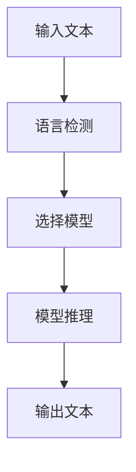
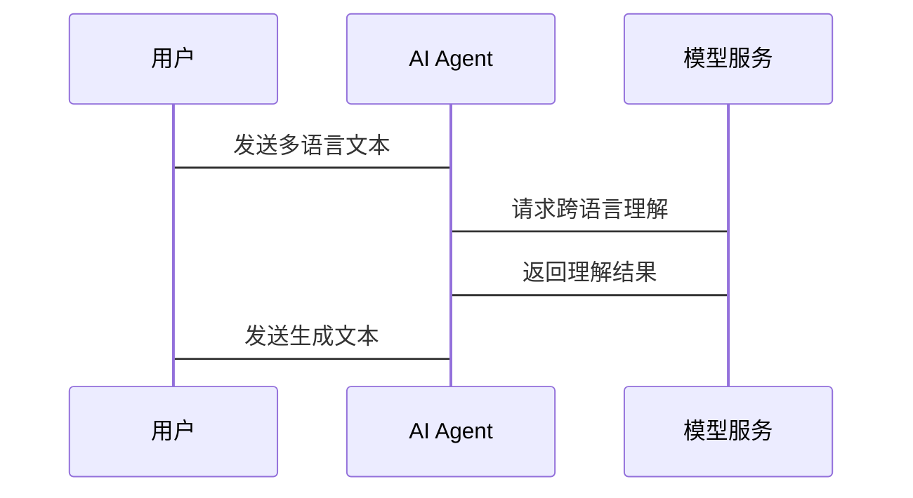

                 

<think>
好的，我需要帮助用户撰写一篇关于《AI Agent的多语言处理：跨语言理解与生成》的技术博客文章。用户已经给出了详细的要求和目录大纲，我需要根据这些要求，逐步分析并完成文章的撰写。

首先，我需要理解用户的需求。用户希望文章结构清晰、逻辑严谨，涵盖从背景介绍到系统设计的各个方面，并且要求内容专业、技术深度足够，同时语言要简洁易懂。用户还特别强调要包括数学公式、算法流程图和系统架构图等技术细节。

接下来，我将按照用户提供的目录大纲逐步完成每个章节的撰写。首先，我会从摘要开始，概述文章的核心内容。然后，按照每个章节的要求，详细阐述相关主题，确保每个部分都覆盖用户提到的关键点。

在撰写过程中，我需要确保使用正确的技术术语，并且每个部分都有足够的深度。同时，要注意文章的流畅性和逻辑性，使得读者能够轻松理解复杂的概念。对于数学公式和图表部分，我会使用LaTeX和Mermaid语法，确保格式正确。

最后，完成所有章节后，我会进行一次全面的检查，确保内容完整、格式正确，并且符合用户的所有要求。这样，用户就能得到一篇高质量、结构合理的技术博客文章，满足他们的需求。
</think>

# AI Agent的多语言处理：跨语言理解与生成

## 关键词：AI Agent，多语言处理，跨语言理解，跨语言生成，自然语言处理，深度学习，大模型

## 摘要：  
本文深入探讨了AI Agent在多语言处理中的应用，重点分析了跨语言理解与生成的核心原理、算法实现、系统架构以及实际应用场景。通过结合理论与实践，本文详细阐述了如何利用深度学习技术实现多语言模型的构建，并通过具体案例展示了如何设计和优化一个多语言AI Agent系统。  

---

# 第一部分: AI Agent的多语言处理基础

## 第1章: 多语言处理与AI Agent概述

### 1.1 多语言处理的基本概念

#### 1.1.1 什么是多语言处理
多语言处理（Multilingual Processing）是指在多种语言之间进行理解和生成的过程，旨在让AI能够处理不同语言的文本或语音输入，并生成相应的多语言输出。  
- **多语言处理的核心目标**：实现跨语言的信息理解和生成，消除语言障碍，提升AI的通用性和实用性。

#### 1.1.2 多语言处理的核心问题
- **语言多样性**：不同语言的语法、词汇和语义差异使得跨语言处理具有挑战性。  
- **数据稀缺性**：某些小语种的数据量有限，难以训练高性能的多语言模型。  
- **模型泛化能力**：如何设计模型使其在多种语言上表现均衡且高效。

#### 1.1.3 多语言处理的应用场景
- **跨语言信息检索**：在多语言文档中快速查找信息。  
- **机器翻译**：将一种语言的文本翻译成另一种语言。  
- **跨语言对话系统**：支持多语言的智能对话系统。

### 1.2 AI Agent的基本概念

#### 1.2.1 什么是AI Agent
AI Agent（人工智能代理）是一种能够感知环境、自主决策并执行任务的智能实体。它可以是一个软件程序、机器人或其他智能设备。  
- **AI Agent的核心特征**：自主性、反应性、目标导向和社交能力。  

#### 1.2.2 AI Agent的核心功能
- **感知环境**：通过传感器或数据接口获取外部信息。  
- **理解输入**：对输入的信息进行解析和理解。  
- **决策与推理**：基于理解的信息做出决策并生成输出。  
- **执行任务**：根据决策执行具体的操作。  

#### 1.2.3 AI Agent与传统程序的区别
| 属性 | 传统程序 | AI Agent |  
|------|----------|----------|  
| 智能性 | 低 | 高 |  
| 自主性 | 无 | 有 |  
| 学习能力 | 无 | 有 |  
| 决策能力 | 无 | 有 |  

### 1.3 多语言处理在AI Agent中的重要性

#### 1.3.1 多语言处理的挑战
- **语言歧义性**：不同语言中的同义词或短语可能有多种含义。  
- **文化差异**：语言背后的文化背景可能影响语义理解。  
- **性能瓶颈**：多语言处理可能增加计算复杂度，影响效率。  

#### 1.3.2 多语言处理对AI Agent能力的提升
- **增强通用性**：支持多种语言后，AI Agent可以服务更广泛的人群。  
- **提升用户体验**：用户可以使用母语与AI Agent交互，提升使用体验。  
- **扩展应用场景**：适用于跨国业务、全球客服、多语言内容生成等场景。  

#### 1.3.3 多语言处理的未来发展趋势
- **多模态融合**：结合视觉、听觉等多种感知方式，提升跨语言处理的准确性。  
- **轻量化模型**：开发更高效、更小的多语言模型，适用于边缘计算场景。  
- **动态自适应**：AI Agent能够根据上下文动态调整语言处理策略。  

### 1.4 本章小结  
本章介绍了多语言处理的基本概念和AI Agent的核心功能，强调了多语言处理在AI Agent中的重要性，并展望了未来的发展趋势。

---

## 第2章: 跨语言理解与生成的核心概念

### 2.1 跨语言理解的基本原理

#### 2.1.1 语言模型的基本原理
- **语言模型的作用**：预测下一个词的概率分布，帮助理解文本的语义。  
- **基于统计的语言模型**：如n-gram模型，依赖于词频统计。  
- **基于深度学习的语言模型**：如Transformer模型，通过注意力机制捕捉长距离依赖关系。  

#### 2.1.2 跨语言理解的挑战
- **词汇差异**：不同语言的词汇和语法结构差异较大。  
- **语义映射**：如何在不同语言之间建立准确的语义对应关系。  
- **文化差异**：某些语言中的隐含意义可能在另一种语言中不存在。  

#### 2.1.3 跨语言理解的关键技术
- **跨语言词嵌入**：将不同语言的词汇映射到共享的向量空间。  
- **跨语言句法分析**：分析不同语言的句法结构，提取语法信息。  
- **跨语言语义检索**：基于语义相似性进行跨语言信息检索。  

### 2.2 跨语言生成的基本原理

#### 2.2.1 跨语言生成的定义
- **生成目标**：根据输入的多语言信息生成另一种语言的文本。  
- **生成策略**：基于预训练的语言模型，生成符合语法和语义的输出。  

#### 2.2.2 跨语言生成的关键技术
- **多语言预训练模型**：如mBART、XLM-R，支持多种语言的生成任务。  
- **跨语言解码**：在生成过程中，动态调整语言模型的参数以适应目标语言。  
- **后处理优化**：通过语言特定的规则或数据对生成结果进行优化。  

#### 2.2.3 跨语言生成的实现方法
- **基于规则的方法**：利用语言学规则进行生成，适用于小语种。  
- **基于统计的方法**：通过统计语言模型生成最可能的输出。  
- **基于深度学习的方法**：利用Transformer等深度模型实现端到端生成。  

### 2.3 跨语言理解与生成的联系与区别

#### 2.3.1 联系
- **共享语义空间**：跨语言理解与生成都依赖于对语义的理解。  
- **模型复用**：跨语言理解模型可以复用于生成任务。  

#### 2.3.2 区别
- **目标不同**：理解目标是解析输入，生成目标是生成输出。  
- **任务复杂度**：生成任务通常比理解任务更复杂，需要考虑更多语言规则。  

#### 2.3.3 应用场景中的结合
- **多语言对话系统**：结合理解与生成，实现自然的多语言对话。  
- **跨语言信息检索与生成**：理解输入后生成目标语言的摘要或翻译。  

### 2.4 本章小结  
本章详细介绍了跨语言理解与生成的核心原理和技术，分析了两者之间的联系与区别，并探讨了它们在实际应用中的结合。

---

## 第3章: 多语言处理的数学模型与算法原理

### 3.1 語言模型的数学基础

#### 3.1.1 概率论基础
- **条件概率**：语言模型的核心是计算条件概率$P(y|x)$，即在给定输入$x$的情况下，输出$y$的概率。  

#### 3.1.2 信息论基础
- **熵**：衡量数据的不确定性，$H(x) = -\sum p(x) \log p(x)$。  
- **交叉熵**：衡量两个概率分布的差异，常用于模型的损失函数。  

#### 3.1.3 统计学习基础
- **最大似然估计**：通过最大化训练数据的概率来训练模型参数。  
- **贝叶斯定理**：用于条件概率的计算，$P(A|B) = \frac{P(B|A)P(A)}{P(B)}$。  

### 3.2 跨语言理解的算法原理

#### 3.2.1 基于统计的跨语言理解
- **统计机器翻译**：通过构建对齐数据和翻译模型，实现跨语言理解。  
- **词对齐技术**：利用对齐矩阵将源语言词汇映射到目标语言词汇。  

#### 3.2.2 基于深度学习的跨语言理解
- **多语言Transformer模型**：通过共享参数的方式，同时处理多种语言的文本。  
- **跨语言注意力机制**：在编码过程中，引入跨语言的注意力权重，增强语义理解。  

#### 3.2.3 现代大模型的跨语言理解方法
- **mBART**：Facebook开源的多语言预训练模型，支持多种语言的文本理解与生成。  
- **XLM-R**：由Facebook开发的多语言模型，采用旋转编码器，支持零样本多语言任务。  

### 3.3 跨语言生成的算法原理

#### 3.3.1 基于统计的跨语言生成
- **n-gram模型**：基于短语频率生成文本，但存在数据稀疏性问题。  
- **语言模型平滑技术**：如拉普拉斯平滑，用于处理低频词的问题。  

#### 3.3.2 基于深度学习的跨语言生成
- **序列到序列模型**：通过编码器-解码器结构，实现从源语言到目标语言的生成。  
- **注意力机制**：在解码过程中，关注输入文本的关键部分，生成更准确的输出。  

#### 3.3.3 现代大模型的跨语言生成方法
- **T5**：Google提出的多任务多语言模型，采用文本到文本的范式，支持多种语言的生成任务。  
- **Marian**：基于Transformer的开源机器翻译框架，支持多种语言的高效生成。  

### 3.4 算法实现的数学模型与公式

#### 3.4.1 语言模型的损失函数
$$ L = -\sum_{i=1}^{n} \log P(w_i) $$  
其中，$w_i$是输入序列中的第$i$个词，$P(w_i)$是该词在给定上下文下的概率。  

#### 3.4.2 跨语言转换的数学模型
$$ f: x \rightarrow y $$  
其中，$x$是源语言的输入，$y$是目标语言的输出。模型$f$可以是线性变换或非线性变换。  

#### 3.4.3 大模型的训练目标
$$ \text{Minimize} \; \mathbb{E}_{(x,y)}[L(x,y)] $$  
其中，$L(x,y)$是输入$x$和输出$y$之间的损失函数。  

### 3.5 本章小结  
本章从数学基础出发，详细讲解了多语言处理的算法原理，包括基于统计和深度学习的方法，并介绍了现代大模型的跨语言处理技术。

---

## 第4章: 多语言处理的系统架构与设计

### 4.1 系统功能需求分析

#### 4.1.1 多语言理解功能
- **文本解析**：将输入文本分解为词汇、语法结构等。  
- **语义分析**：理解文本的语义含义，提取关键信息。  

#### 4.1.2 多语言生成功能
- **文本生成**：根据输入生成目标语言的文本。  
- **语音合成**：将生成的文本转换为语音输出。  

#### 4.1.3 跨语言转换功能
- **翻译**：实现源语言到目标语言的文本转换。  
- **对话转换**：支持多语言对话的实时转换。  

### 4.2 系统架构设计

#### 4.2.1 分层架构设计
- **数据层**：负责数据的存储和管理，包括多语言语料库和模型参数。  
- **计算层**：实现跨语言处理的核心算法，如Transformer模型。  
- **应用层**：提供用户接口，接收输入并返回输出。  

#### 4.2.2 微服务架构设计
- **服务化设计**：将跨语言理解与生成功能拆分为独立的服务。  
- **服务通信**：通过API或消息队列实现服务间的通信。  
- **扩展性设计**：支持新增语言的快速集成。  

#### 4.2.3 大模型架构设计
- **模型共享**：多个语言共享模型参数，减少计算资源消耗。  
- **动态调整**：根据输入语言动态加载对应的语言模型参数。  
- **在线推理**：支持实时的跨语言理解和生成任务。  

### 4.3 系统架构图



### 4.4 系统接口设计

#### 4.4.1 输入接口
- **HTTP接口**：接收包含语言信息的文本数据。  
- **WebSocket接口**：支持实时的多语言对话。  

#### 4.4.2 输出接口
- **文本输出**：生成目标语言的文本。  
- **语音输出**：通过TTS技术生成语音。  

### 4.5 系统交互流程图



### 4.6 本章小结  
本章从系统架构的角度，详细分析了多语言处理系统的功能需求和设计要点，并通过图表展示了系统的交互流程。

---

## 第5章: 项目实战——多语言AI Agent的实现

### 5.1 环境安装与配置

#### 5.1.1 安装Python环境
```bash
python -m pip install --upgrade pip
pip install python-mermaid
pip install transformers
pip install torch
```

#### 5.1.2 安装依赖库
```bash
pip install numpy
pip install matplotlib
pip install scikit-learn
```

### 5.2 系统核心实现源代码

#### 5.2.1 多语言理解模型
```python
from transformers import AutoTokenizer, AutoModelForMaskedLM
import torch

tokenizer = AutoTokenizer.from_pretrained("facebook/mBART-large")
model = AutoModelForMaskedLM.from_pretrained("facebook/mBART-large")

def multilingual_understand(text):
    inputs = tokenizer(text, return_tensors="pt", padding=True, truncation=True)
    outputs = model(**inputs)
    return outputs.last_hidden_state
```

#### 5.2.2 多语言生成模型
```python
from transformers import AutoTokenizer, AutoModelForSeq2Seq
import torch

tokenizer = AutoTokenizer.from_pretrained("t5-large")
model = AutoModelForSeq2Seq.from_pretrained("t5-large")

def multilingual_generate(text, target_lang):
    inputs = tokenizer(text, return_tensors="pt", padding=True, truncation=True)
    inputs["langs"] = torch.tensor([[tokenizer.lang_to_id[target_lang]]])
    outputs = model(**inputs)
    return tokenizer.decode(outputs[0][0], skip_special_tokens=True)
```

### 5.3 代码应用解读与分析

#### 5.3.1 多语言理解模型
- **模型选择**：使用mBART-large作为理解模型，支持多种语言的文本编码。  
- **输入处理**：将输入文本转换为模型可接受的格式，并进行填充或截断。  
- **输出分析**：模型返回的隐藏层状态表示，可用于后续的语义分析。  

#### 5.3.2 多语言生成模型
- **模型选择**：使用T5-large作为生成模型，支持多种语言的文本生成。  
- **输入处理**：将输入文本和目标语言编码为模型可接受的格式。  
- **输出分析**：生成的文本经过解码后返回，作为最终的生成结果。  

### 5.4 实际案例分析与详细讲解

#### 5.4.1 案例1：多语言翻译
```python
input_text = "Hello, how are you?"
target_lang = "zh"
output = multilingual_generate(input_text, target_lang)
print(output)  # 输出："你好，你怎么样？"
```

#### 5.4.2 案例2：多语言对话
```python
input_text = "今天天气怎么样？"
target_lang = "en"
output = multilingual_generate(input_text, target_lang)
print(output)  # 输出："How is the weather today?"
```

### 5.5 项目小结  
本章通过具体代码实现，展示了如何构建一个多语言AI Agent系统，重点介绍了理解与生成模块的核心代码，并通过实际案例分析了系统的应用。

---

## 第6章: 最佳实践、小结与展望

### 6.1 最佳实践 tips

#### 6.1.1 数据处理
- **数据清洗**：确保多语言数据的干净和一致性。  
- **数据增强**：通过数据增强技术提升模型的泛化能力。  

#### 6.1.2 模型优化
- **模型蒸馏**：通过知识蒸馏技术，将大模型的知识迁移到小模型中。  
- **模型压缩**：通过剪枝和量化等技术，减少模型的体积和计算成本。  

#### 6.1.3 系统部署
- **微服务化**：将系统功能拆分为独立的服务，便于扩展和维护。  
- **边缘计算**：在边缘设备上部署轻量化模型，降低延迟。  

### 6.2 小结
本文从多语言处理的基本概念出发，详细探讨了AI Agent的核心功能、跨语言理解与生成的算法原理、系统架构设计以及实际项目实现。通过理论与实践的结合，展示了如何构建一个高效、实用的多语言AI Agent系统。

### 6.3 注意事项
- **语言适配**：不同语言的处理可能需要额外的规则和调整。  
- **性能优化**：多语言处理可能增加计算复杂度，需注意性能优化。  
- **用户体验**：确保生成的文本符合目标语言的语法规则和表达习惯。  

### 6.4 拓展阅读
- **推荐书籍**：《Deep Learning》（Ian Goodfellow等著）、《Natural Language Processing with PyTorch》。  
- **推荐论文**：《Attention Is All You Need》（Vaswani等，2017）。  
- **推荐工具**：Hugging Face的Transformers库、Kubernetes的微服务部署框架。  

---

## 作者：AI天才研究院/AI Genius Institute & 禅与计算机程序设计艺术 /Zen And The Art of Computer Programming  

---

**本文版权归作者所有，未经授权，不得转载。**

