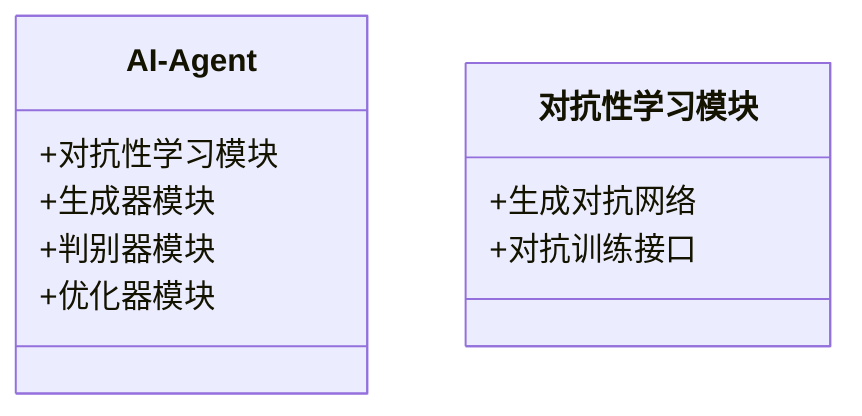
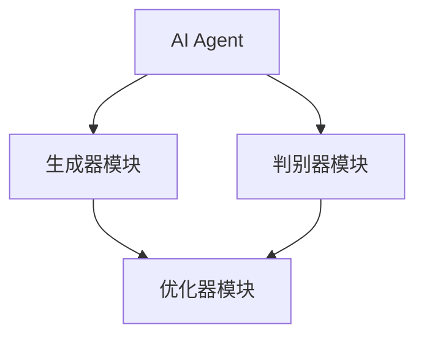

                 


# AI Agent的对抗性学习：提高LLM的鲁棒性

> 关键词：AI Agent, 对抗性学习, 大语言模型, 鲁棒性, 机器学习, 深度学习

> 摘要：本文探讨了AI Agent在对抗性学习中的应用，分析了对抗性学习如何提升大语言模型（LLM）的鲁棒性。通过背景介绍、核心概念、算法原理、系统架构设计和项目实战，全面阐述了对抗性学习在提高LLM鲁棒性中的重要性。

---

## 第一部分: 背景介绍

### 第1章: AI Agent与对抗性学习的背景

#### 1.1 AI Agent的基本概念

- **AI Agent的定义与分类**
  - AI Agent是一种智能主体，能够感知环境、自主决策并执行任务。
  - 分为简单反射型、基于模型的反应型、目标驱动型和效用驱动型。

- **AI Agent的核心功能与特点**
  - 感知环境、自主决策、学习与适应、与人协作。
  - 具有智能性、反应性、主动性、社会性。

- **AI Agent在现代技术中的应用领域**
  - 个性化推荐系统、智能客服、自动驾驶、智能助手。

#### 1.2 对抗性学习的背景与意义

- **对抗性学习的定义与特点**
  - 通过两个或多个学习模型相互竞争来提升性能。
  - 常见于生成对抗网络（GANs）和对抗训练。

- **对抗性学习的起源与发展**
  - 起源于博弈论，发展于深度学习领域。
  - GANs的提出推动了对抗性学习的广泛应用。

- **对抗性学习在AI Agent中的应用价值**
  - 提高模型的鲁棒性、增强模型的泛化能力、提升对抗环境中的适应性。

#### 1.3 提高LLM鲁棒性的必要性

- **LLM的定义与现状**
  - 大语言模型：基于大量数据训练的大型语言模型。
  - 代表模型：GPT、BERT、PaLM。

- **LLM面临的主要挑战**
  - 对抗攻击、数据偏见、模型漏洞。

- **对抗性学习在提升LLM鲁棒性中的作用**
  - 增强模型的抗干扰能力、减少错误预测、提高模型的稳健性。

### 1.4 本章小结

本章介绍了AI Agent和对抗性学习的基本概念，分析了对抗性学习在提升大语言模型鲁棒性中的重要性，为后续章节奠定了基础。

---

## 第二部分: 对抗性学习的核心概念与原理

### 第2章: 对抗性学习的核心概念

#### 2.1 对抗性学习的基本原理

- **对抗性学习的数学模型**
  - 基于博弈论的对抗框架。
  - 损失函数：最大化生成样本的判别难度。

- **对抗性学习的核心要素**
  - 生成器（Generator）：生成样本。
  - 判别器（Discriminator）：区分真实样本和生成样本。

- **对抗性学习的分类与特点**
  - 分类：生成对抗网络（GANs）、对抗训练、自对抗训练。
  - 特点：零样本学习、无监督学习。

#### 2.2 AI Agent与对抗性学习的关系

- **AI Agent作为对抗性学习的主体**
  - AI Agent作为生成器或判别器，提升模型性能。
  - 对抗性学习帮助AI Agent在复杂环境中做出决策。

- **对抗性学习如何增强AI Agent的能力**
  - 提高环境适应性、增强决策的鲁棒性、降低预测偏差。

---

## 第三部分: 算法原理讲解

### 第3章: 对抗性学习的算法原理

#### 3.1 对抗性学习的数学模型

- **生成器的损失函数**
  $$ \mathcal{L}_G = -\log(D(G(x))) $$
  
- **判别器的损失函数**
  $$ \mathcal{L}_D = -[\log(D(x)) + \log(1-D(G(x)))] $$

#### 3.2 对抗性学习的实现步骤

- **生成器的训练**
  1. 输入随机噪声，生成样本。
  2. 判别器判断样本的真实性。
  3. 生成器更新参数以欺骗判别器。

- **判别器的训练**
  1. 输入真实样本，判别器输出真实概率。
  2. 输入生成样本，判别器输出生成概率。
  3. 判别器更新参数以区分真实和生成样本。

#### 3.3 对抗性学习的代码实现

```python
import torch
import torch.nn as nn

class Generator(nn.Module):
    def __init__(self, latent_dim, hidden_size):
        super(Generator, self).__init__()
        self.net = nn.Sequential(
            nn.Linear(latent_dim, hidden_size),
            nn.ReLU(),
            nn.Linear(hidden_size, 1)
        )
    
    def forward(self, x):
        return self.net(x)
        
class Discriminator(nn.Module):
    def __init__(self, input_dim, hidden_size):
        super(Discriminator, self).__init__()
        self.net = nn.Sequential(
            nn.Linear(input_dim, hidden_size),
            nn.ReLU(),
            nn.Linear(hidden_size, 1),
            nn.Sigmoid()
        )
    
    def forward(self, x):
        return self.net(x)
```

---

## 第四部分: 系统分析与架构设计

### 第4章: 系统功能设计与架构

#### 4.1 系统功能需求

- **目标：** 提升LLM的鲁棒性。
- **核心功能：** 对抗训练、模型优化、结果分析。

#### 4.2 系统领域模型



#### 4.3 系统架构设计



---

## 第五部分: 项目实战

### 第5章: 项目实现与案例分析

#### 5.1 环境安装

```bash
pip install torch
pip install numpy
pip install matplotlib
```

#### 5.2 核心代码实现

```python
import torch
import torch.nn as nn
import torch.optim as optim

latent_dim = 1
hidden_size = 16

generator = Generator(latent_dim, hidden_size)
discriminator = Discriminator(1, 16)

optimizer_G = optim.Adam(generator.parameters(), lr=0.001)
optimizer_D = optim.Adam(discriminator.parameters(), lr=0.001)
criterion = nn.BCELoss()

for epoch in range(100):
    # 生成样本
    noise = torch.randn(1, latent_dim)
    gen_output = generator(noise)
    
    # 判别器训练
    real_labels = torch.ones(1, 1)
    fake_labels = torch.zeros(1, 1)
    d_loss_real = criterion(discriminator(real_labels), real_labels)
    d_loss_fake = criterion(discriminator(gen_output), fake_labels)
    d_loss = d_loss_real + d_loss_fake
    optimizer_D.zero_grad()
    d_loss.backward()
    optimizer_D.step()
    
    # 生成器训练
    g_loss = criterion(discriminator(gen_output), real_labels)
    optimizer_G.zero_grad()
    g_loss.backward()
    optimizer_G.step()
```

#### 5.3 案例分析

- **训练结果：** 生成器和判别器的损失值逐渐下降。
- **模型鲁棒性提升：** 对抗性学习使模型在面对干扰时表现更稳定。

---

## 第六部分: 最佳实践与总结

### 第6章: 最佳实践与注意事项

#### 6.1 对抗性学习的适用场景

- **数据增强：** 提高模型的泛化能力。
- **模型防御：** 防御对抗攻击。

#### 6.2 对抗性学习的潜在风险

- **模型过拟合：** 过度优化可能影响模型的泛化能力。
- **计算成本：** 对抗训练需要更多的计算资源。

#### 6.3 对抗性学习的未来趋势

- **多目标对抗性学习：** 提高模型的多任务处理能力。
- **自适应对抗性学习：** 动态调整对抗策略。

### 6.4 小结

本文详细介绍了AI Agent的对抗性学习，分析了其在提升LLM鲁棒性中的应用，通过理论和实践相结合，展示了对抗性学习的优势和挑战。

---

## 作者

作者：AI天才研究院 & 禅与计算机程序设计艺术

