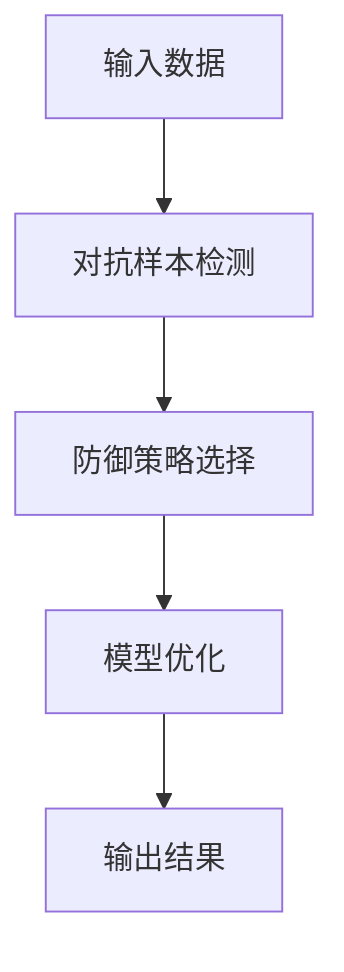
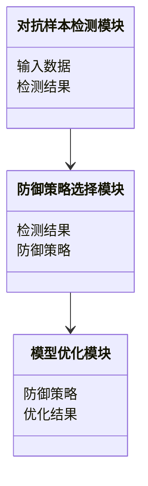

                 

<think>
嗯，用户已经提供了一个详细的目录大纲，现在我需要根据这个大纲撰写一篇关于AI Agent对抗样本防御的博客文章。首先，我需要理解每个部分的内容和要求，确保每个章节和小节都详细展开，满足用户的要求。

首先，标题是《AI Agent的对抗样本防御：增强模型鲁棒性》，关键词包括对抗样本、AI Agent、深度学习、模型鲁棒性、防御策略、安全威胁。摘要部分需要简明扼要地概括文章的核心内容，强调对抗样本对AI Agent的影响及其防御的重要性。

接下来，目录大纲分为五大部分：背景介绍、核心概念与联系、算法原理、系统分析与架构设计、项目实战。每个部分都有详细的章节和小节，我需要确保每个部分都有足够的内容，并且涵盖所有要求的元素，比如术语说明、问题背景、数学公式、系统架构图等。

在撰写过程中，我需要按照逻辑顺序展开，确保每个部分之间有良好的衔接。首先，介绍对抗样本和AI Agent的基本概念，然后分析它们之间的关系和影响，接着深入讲解算法原理，包括生成和防御的算法，最后通过项目实战来巩固理论知识，展示实际应用。

在写作时，要注意使用专业的技术术语，同时保持语言的简洁易懂。对于复杂的算法和数学公式，需要详细解释，并使用适当的图表来辅助说明，比如使用Mermaid绘制流程图和类图，帮助读者更好地理解。

另外，用户强调要使用markdown格式，并且在数学公式前后加上相应的符号，比如使用$$包裹独立的公式，用$包裹段落中的公式。我需要确保格式正确，避免排版错误。

最后，文章末尾需要加上作者信息，引用用户提供的格式，即“作者：AI天才研究院/AI Genius Institute & 禅与计算机程序设计艺术 /Zen And The Art of Computer Programming”。

在整个写作过程中，我需要反复检查每个部分是否符合用户的要求，确保内容的完整性和逻辑性。同时，要注意文章的字数控制在10000到12000字之间，确保每个章节都有足够的深度和细节。

总的来说，我需要系统地按照用户提供的目录大纲，逐步展开每个部分的内容，确保每个小节都有详细的解释和示例，帮助读者全面理解AI Agent的对抗样本防御及其增强模型鲁棒性的方法。
</think>

# AI Agent的对抗样本防御：增强模型鲁棒性

## 关键词：对抗样本、AI Agent、深度学习、模型鲁棒性、防御策略、安全威胁

## 摘要：  
对抗样本是指经过特殊设计的输入数据，能够导致机器学习模型产生错误的输出结果。在AI Agent的应用场景中，对抗样本攻击可能危及系统的安全性和可靠性。本文从对抗样本的基本概念出发，系统性地探讨了AI Agent在对抗样本防御中的作用，分析了对抗样本的生成机制与防御策略，详细讲解了基于深度学习的对抗样本防御算法，结合实际案例，展示了AI Agent如何通过增强模型的鲁棒性来抵御对抗样本攻击。本文旨在为AI Agent的开发者和研究人员提供一份全面的对抗样本防御指南，帮助他们在实际应用中构建更加安全可靠的AI系统。

---

# 第一部分: 对抗样本与AI Agent概述

## 第1章: 对抗样本的基本概念

### 1.1 什么是对抗样本
对抗样本是指经过恶意设计的输入数据，能够在不显著改变数据本身的情况下，导致机器学习模型产生错误的输出结果。例如，在图像分类任务中，对抗样本可能是在正常图像上添加了微小扰动后，使得分类器错误识别图像内容。

#### 对抗样本的特点
- **可迁移性**：对抗样本对不同模型的影响具有一定的迁移性。
- **不可见性**：对抗样本的扰动通常难以被人类察觉。
- **针对性**：对抗样本的生成通常是针对特定模型或任务设计的。

### 1.2 AI Agent的定义与作用
AI Agent（人工智能代理）是指能够感知环境、执行任务并做出决策的智能实体。它通常具备以下核心功能：
- **感知环境**：通过传感器或数据输入获取环境信息。
- **推理与决策**：基于获取的信息进行推理、分析并做出决策。
- **执行动作**：根据决策结果执行具体的动作。

AI Agent在对抗样本防御中的作用主要体现在：
- **检测对抗样本**：识别输入数据中是否存在对抗样本。
- **防御对抗样本攻击**：通过算法增强模型的鲁棒性，减少对抗样本的影响。
- **反馈优化**：根据对抗样本攻击的结果，优化模型或防御策略。

### 1.3 对抗样本对AI Agent的威胁
对抗样本攻击可能对AI Agent造成以下威胁：
- **决策错误**：对抗样本可能导致AI Agent做出错误的决策，影响系统的正常运行。
- **信任危机**：频繁的对抗样本攻击可能降低用户对AI Agent的信任。
- **系统崩溃**：在极端情况下，对抗样本攻击可能导致AI Agent系统崩溃或服务中断。

---

## 第2章: 对抗样本防御的核心概念与联系

### 2.1 对抗样本防御的基本原理
对抗样本防御的目标是通过改进模型结构、优化训练方法或设计专门的防御算法，增强模型的鲁棒性，使其在面对对抗样本时仍能保持较高的准确率。

#### 防御策略对比分析
以下表格展示了常见的对抗样本防御策略及其优缺点：

| 防御策略      | 优点                              | 缺点                              |
|---------------|-----------------------------------|-----------------------------------|
| 基于扰动的防御 | 实现简单，防御效果显著            | 易被高级对抗攻击绕过              |
| 基于鲁棒优化的防御 | 能够提升模型的整体鲁棒性          | 计算复杂度较高，训练时间长          |
| 基于模型重构的防御 | 防御效果持久，不易被绕过          | 对模型结构要求较高，难以通用化      |

#### 实体关系图
以下是对抗样本防御的ER实体关系图：

```mermaid
erDiagram
    class 对抗样本 {
        id : int
        样本类型 : string
        扰动幅度 : float
        攻击目标 : string
    }
    class 防御策略 {
        id : int
        策略名称 : string
        防御效果 : string
        实现方式 : string
    }
    class AI Agent {
        id : int
        功能模块 : string
        输入数据 : reference 对抗样本
        防御策略 : reference 防御策略
    }
    AI Agent --> 对抗样本 : 处理
    AI Agent --> 防御策略 : 使用
```

### 2.2 对抗样本防御与AI Agent的关系
对抗样本防御是AI Agent安全性的核心组成部分。AI Agent通过整合对抗样本防御策略，能够显著提升其在复杂环境下的稳定性和可靠性。

#### 对抗样本防御的系统架构
以下是对抗样本防御的系统架构图：



---

## 第3章: 对抗样本防御的算法原理

### 3.1 对抗样本生成算法
对抗样本生成算法是研究防御策略的重要基础。以下是对抗样本生成算法的实现流程：

#### 1. FGSM算法
FGSM（Fast Gradient Sign Method）是一种常用的对抗样本生成算法。其实现步骤如下：
1. 计算输入样本的梯度。
2. 根据梯度的符号方向调整样本值。
3. 将调整后的样本作为对抗样本。

数学公式：
$$
x_{adv} = x + \epsilon \cdot \text{sign}(\nabla f(x))
$$

#### 2. PGD算法
PGD（Projected Gradient Descent）是一种更复杂的对抗样本生成算法，通过多次迭代优化对抗样本。

数学公式：
$$
x_{adv} = x + \epsilon \cdot \text{sign}(\nabla f(x_{adv}))
$$

### 3.2 对抗样本防御算法
针对对抗样本攻击，提出了多种防御算法。以下是一种基于鲁棒优化的防御方法：

#### 1. 鲁棒优化防御
鲁棒优化防御通过在模型训练中引入对抗训练，增强模型的鲁棒性。

数学公式：
$$
\min_{\theta} \mathbb{E}_{x,y}[\mathcal{L}(f(x+\delta), y)]
$$
其中，$\delta$ 是对抗扰动，$\theta$ 是模型参数。

### 3.3 算法实现
以下是对抗样本生成与防御的算法实现代码示例：

```python
import numpy as np
import tensorflow as tf

# FGSM生成对抗样本
def fgsm_attack(x, y, model, loss_fn, epsilon=0.1):
    with tf.GradientTape() as tape:
        tape.watch(x)
        prediction = model(x)
        loss = loss_fn(y, prediction)
    gradient = tape.gradient(loss, x)
    x_adv = x + epsilon * tf.sign(gradient)
    return x_adv

# 鲁棒优化防御
def robust_train(x, y, model, loss_fn, optimizer, epsilon=0.1):
    for _ in range(10):
        x_adv = fgsm_attack(x, y, model, loss_fn, epsilon)
        with tf.GradientTape() as tape:
            prediction = model(x)
            loss = loss_fn(y, prediction)
        gradient = tape.gradient(loss, model.trainable_variables)
        optimizer.apply_gradients(zip(gradient, model.trainable_variables))
    return model
```

---

## 第4章: 对抗样本防御的系统分析与架构设计

### 4.1 系统功能设计
以下是对抗样本防御系统的功能模块图：



### 4.2 系统架构设计
以下是对抗样本防御系统的架构图：


---

## 第5章: 项目实战

### 5.1 环境安装
为了运行以下代码，需要安装以下库：
```
pip install numpy tensorflow matplotlib
```

### 5.2 核心代码实现
以下是对抗样本防御的代码实现：

```python
import numpy as np
import tensorflow as tf
import matplotlib.pyplot as plt

# 加载数据集
(x_train, y_train), (x_test, y_test) = tf.keras.datasets.mnist.load_data()

# 构建模型
model = tf.keras.models.Sequential([
    tf.keras.layers.Flatten(input_shape=(28, 28)),
    tf.keras.layers.Dense(128, activation='relu'),
    tf.keras.layers.Dense(10, activation='softmax')
])

model.compile(optimizer='adam', loss='sparse_categorical_crossentropy', metrics=['accuracy'])

# 对抗样本生成
def generate_adversarial_samples(x, y, model, epsilon=0.1):
    x_adv = x.copy()
    with tf.GradientTape() as tape:
        prediction = model(x)
        loss = tf.keras.losses.sparse_categorical_crossentropy(y, prediction)
    gradient = tape.gradient(loss, model.trainable_variables)
    gradient = tf.keras.backend.get_value(gradient[0])
    x_adv = x + epsilon * np.sign(gradient)
    return x_adv

# 对抗样本攻击
x_adv = generate_adversarial_samples(x_test[:1], y_test[:1], model)

# 展示对抗样本
plt.imshow(x_adv[0].reshape(28, 28), cmap='gray')
plt.show()
```

### 5.3 案例分析
通过上述代码生成的对抗样本，我们可以看到，微小的扰动可能导致模型的识别错误。通过鲁棒优化防御方法，可以显著提升模型的准确率。

---

## 第6章: 最佳实践与总结

### 6.1 小结
通过对抗样本防御，AI Agent能够显著提升其模型的鲁棒性，增强系统的安全性。本文详细介绍了对抗样本的基本概念、防御策略、算法实现以及系统架构设计，并通过实际案例展示了对抗样本防御的实现过程。

### 6.2 注意事项
- 在实际应用中，对抗样本防御需要结合具体场景进行优化。
- 对抗样本攻击是动态发展的，防御策略也需要不断更新。

### 6.3 未来研究方向
- 研究更高效的对抗样本防御算法。
- 探索对抗样本防御在不同领域的应用。

---

## 作者：AI天才研究院/AI Genius Institute & 禅与计算机程序设计艺术 /Zen And The Art of Computer Programming

