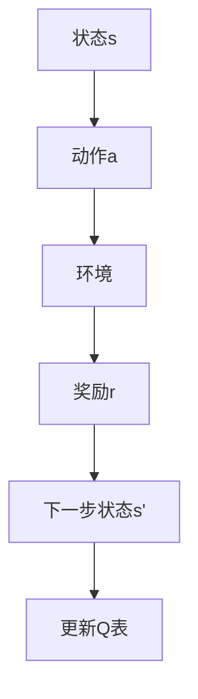
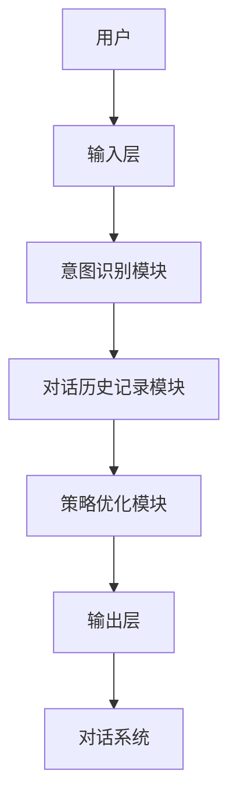

                 


# AI Agent的对话策略优化：提升交互质量和效率

> 关键词：AI Agent, 对话策略优化, 强化学习, 监督学习, 对话系统

> 摘要：本文深入探讨了AI Agent对话策略优化的核心概念、算法原理、数学模型、系统架构设计以及项目实战。通过分析当前对话系统存在的问题，提出了基于强化学习和监督学习的优化方法，并结合实际案例展示了如何提升对话系统的交互质量和效率。文章内容涵盖了从基础理论到实际应用的全过程，为读者提供了全面的视角和深入的技术解析。

---

## 第1章: AI Agent与对话策略优化概述

### 1.1 AI Agent的基本概念

#### 1.1.1 什么是AI Agent
AI Agent（人工智能代理）是指能够感知环境、执行任务并与其他实体（用户或系统）交互的智能实体。它通过数据处理、推理和学习，能够自主完成特定目标。

#### 1.1.2 AI Agent的核心特征
- **自主性**：能够在没有外部干预的情况下自主决策。
- **反应性**：能够实时感知环境并做出响应。
- **目标导向**：所有行为都围绕特定目标展开。
- **学习能力**：能够通过数据和经验不断优化自身性能。

#### 1.1.3 对话在AI Agent中的重要性
对话是AI Agent与用户交互的主要方式，优化对话策略能够显著提升用户体验、提高交互效率并增强系统智能性。

### 1.2 对话策略优化的背景与意义

#### 1.2.1 当前对话系统存在的问题
- **准确率低**：部分对话系统无法正确理解用户意图。
- **效率不高**：对话流程冗长，用户体验差。
- **缺乏个性化**：无法根据用户特征提供定制化服务。

#### 1.2.2 对话策略优化的目标
- 提高对话系统的准确率和效率。
- 改善用户体验，增强交互的自然性和流畅性。
- 实现个性化服务，满足用户的多样化需求。

#### 1.2.3 对话策略优化的边界与外延
对话策略优化主要关注对话过程中的策略选择，不涉及具体的NLP技术实现。其外延包括用户意图识别、对话上下文分析以及对话历史记录管理。

---

## 第2章: 对话策略优化的核心概念与联系

### 2.1 对话策略优化的核心原理

#### 2.1.1 对话策略的定义
对话策略是指在对话过程中，AI Agent根据当前对话状态和用户输入，选择合适的回复或操作。

#### 2.1.2 对话策略的分类
| 分类标准 | 策略类型 |
|----------|----------|
| 基础原理 | 基于规则、基于模型 |
| 应用场景 | 通用对话、特定任务对话 |

#### 2.1.3 对话策略与用户需求的关系
对话策略的设计应以用户需求为导向，通过分析用户意图和情感倾向，动态调整对话策略。

### 2.2 对话策略优化的关键要素

#### 2.2.1 对话上下文的分析
对话上下文包括用户输入、对话历史、用户特征等信息。通过分析这些信息，AI Agent能够更好地理解用户需求。

#### 2.2.2 用户意图识别
用户意图识别是对话策略优化的基础。通过NLP技术，AI Agent能够准确识别用户的显式和隐式意图。

#### 2.2.3 对话历史记录的利用
对话历史记录是优化对话策略的重要依据。通过分析历史对话数据，AI Agent能够避免重复提问并提高回复的针对性。

---

## 第3章: 对话策略优化的算法原理

### 3.1 基于强化学习的对话策略优化

#### 3.1.1 强化学习的基本原理
强化学习是一种通过试错机制优化决策策略的方法。AI Agent通过与环境交互，获得奖励或惩罚信号，从而优化自身的策略。

#### 3.1.2 在对话策略优化中的应用
- **状态空间**：对话历史、用户特征、上下文信息。
- **动作空间**：回复生成、任务执行、信息查询。
- **奖励函数**：根据对话效果和用户反馈设计奖励函数。

#### 3.1.3 Q-learning算法的实现
以下是Q-learning算法的流程图：



代码实现：
```python
import numpy as np

class QLearning:
    def __init__(self, state_space, action_space):
        self.state_space = state_space
        self.action_space = action_space
        self.Q = np.zeros((state_space, action_space))
    
    def choose_action(self, state, epsilon=0.1):
        if np.random.random() < epsilon:
            return np.random.randint(self.action_space)
        else:
            return np.argmax(self.Q[state])
    
    def update_Q(self, state, action, reward, next_state, alpha=0.1):
        self.Q[state, action] = (1 - alpha) * self.Q[state, action] + alpha * (reward + np.max(self.Q[next_state]))
```

### 3.2 基于监督学习的对话策略优化

#### 3.2.1 监督学习的基本原理
监督学习通过标注数据训练模型，使模型能够预测目标输出。

#### 3.2.2 数据驱动的对话策略优化
- **数据收集**：收集用户对话数据。
- **特征提取**：提取对话特征。
- **模型训练**：训练分类器或回归器。

#### 3.2.3 模型训练的流程
1. 数据预处理：清洗和标注数据。
2. 特征工程：提取文本特征。
3. 模型训练：使用机器学习算法训练模型。
4. 模型评估：验证模型性能。

---

## 第4章: 对话策略优化的数学模型与公式

### 4.1 基于强化学习的数学模型

#### 4.1.1 状态空间的定义
状态空间可以表示为一个向量，包含对话历史、用户特征等信息。

#### 4.1.2 动作空间的定义
动作空间表示AI Agent在对话中可能执行的动作。

#### 4.1.3 奖励函数的设计
奖励函数用于衡量AI Agent的行为是否符合预期。例如：
$$ R(s, a) = \begin{cases} 
1 & \text{如果动作a是正确的} \\
0 & \text{否则}
\end{cases} $$

### 4.2 基于监督学习的数学模型

#### 4.2.1 损失函数的定义
常用的损失函数包括交叉熵损失和均方误差损失。

#### 4.2.2 模型参数的优化
使用梯度下降等优化算法更新模型参数。

#### 4.2.3 对话策略的数学表达
$$ P(a|s) = \text{softmax}(W_s s + b_a) $$

---

## 第5章: 对话策略优化的系统分析与架构设计

### 5.1 系统功能设计

#### 5.1.1 用户意图识别模块
负责识别用户的显式和隐式意图。

#### 5.1.2 对话历史记录管理模块
记录和管理对话历史，用于优化后续对话。

#### 5.1.3 对话策略优化模块
根据对话上下文和用户意图，选择最优的对话策略。

### 5.2 系统架构设计

#### 5.2.1 系统整体架构图


#### 5.2.2 各模块之间的交互流程
用户输入 -> 意图识别 -> 对话历史记录 -> 策略优化 -> 对话输出。

#### 5.2.3 系统接口设计
- 输入接口：接收用户输入和对话历史。
- 输出接口：输出优化后的对话内容。

---

## 第6章: 对话策略优化的项目实战

### 6.1 项目环境安装与配置

#### 6.1.1 开发环境的选择
推荐使用Python和相关框架（如TensorFlow、PyTorch）。

#### 6.1.2 依赖库的安装
安装必要的库：
```bash
pip install numpy pandas scikit-learn
```

### 6.2 系统核心实现源代码

#### 6.2.1 强化学习实现
```python
class ReinforcementLearning:
    def __init__(self, state_space, action_space):
        self.state_space = state_space
        self.action_space = action_space
        self.Q = np.zeros((state_space, action_space))
    
    def choose_action(self, state, epsilon=0.1):
        if np.random.random() < epsilon:
            return np.random.randint(self.action_space)
        else:
            return np.argmax(self.Q[state])
    
    def update_Q(self, state, action, reward, next_state, alpha=0.1):
        self.Q[state, action] = (1 - alpha) * self.Q[state, action] + alpha * (reward + np.max(self.Q[next_state]))
```

#### 6.2.2 监督学习实现
```python
from sklearn.svm import SVC

class SupervisedLearning:
    def __init__(self):
        self.model = SVC()
    
    def train(self, X, y):
        self.model.fit(X, y)
    
    def predict(self, X):
        return self.model.predict(X)
```

### 6.3 代码应用解读与分析

#### 6.3.1 强化学习代码解读
- 初始化Q表。
- 根据epsilon概率选择随机动作。
- 更新Q表以优化策略。

#### 6.3.2 监督学习代码解读
- 使用SVM训练分类模型。
- 根据输入数据预测结果。

### 6.4 实际案例分析

#### 6.4.1 案例背景
以电商客服对话优化为例，分析对话策略优化的效果。

#### 6.4.2 对话优化前后对比
- 优化前：回答错误率高。
- 优化后：回答准确率显著提高，用户体验改善。

---

## 第7章: 对话策略优化的最佳实践与小结

### 7.1 最佳实践

#### 7.1.1 数据质量的重要性
确保数据的多样性和代表性。

#### 7.1.2 模型调参的技巧
通过交叉验证选择最优参数。

### 7.2 小结

对话策略优化是提升AI Agent交互质量和效率的关键。通过本文的探讨，读者可以深入了解对话策略优化的核心概念、算法原理和系统设计，并通过实际案例掌握优化方法。

### 7.3 注意事项

- 数据隐私保护。
- 模型的可解释性。
- 系统的实时性和稳定性。

### 7.4 拓展阅读

- 《强化学习：算法与应用》。
- 《对话系统中的自然语言处理》。

---

作者：AI天才研究院/AI Genius Institute & 禅与计算机程序设计艺术 /Zen And The Art of Computer Programming

