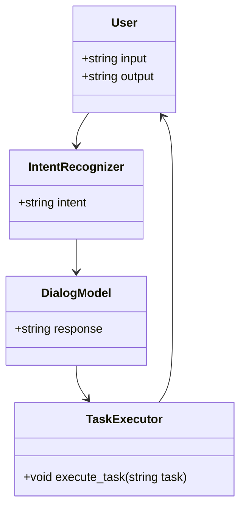
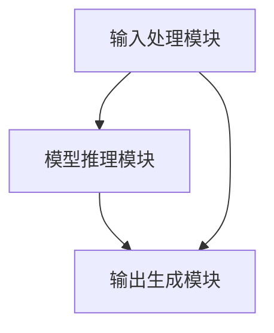
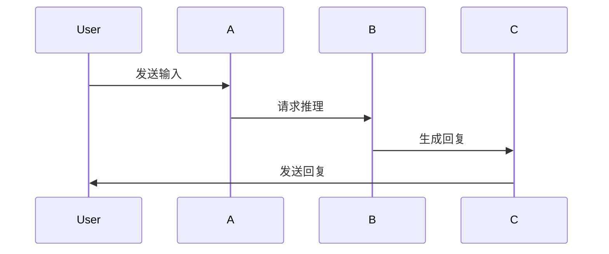

                 

<think>
好的，我现在需要帮助用户撰写一篇技术博客文章，标题是《AI Agent的对话系统在虚拟助手中的进阶应用》。用户已经给出了一个详细的文章大纲，我需要根据这个大纲来完成整篇文章的撰写。

首先，我需要理解每个章节的内容和要求。文章分为四个部分：背景介绍、算法原理、数学模型与公式、系统架构与设计。每个部分都有详细的章节和小节，内容包括概念解释、算法对比、数学公式、系统设计等。

在撰写过程中，我需要确保每部分内容详尽，符合用户的要求。例如，在“对话系统的数学模型与公式”部分，我需要详细讲解各种算法的数学公式，并使用LaTeX格式展示。同时，在“系统架构与设计”部分，我需要用Mermaid图来展示类图、架构图和序列图。

我还需要注意文章的结构和逻辑，确保每个部分之间有良好的衔接。例如，在背景介绍部分，我需要先解释AI Agent和对话系统的基本概念，然后引出虚拟助手的应用场景和挑战。

在撰写过程中，可能会遇到一些问题，比如如何通俗易懂地解释复杂的数学公式，或者如何用Mermaid图清晰地展示系统架构。对于这些，我需要查阅相关资料，确保准确无误，并且用简单易懂的语言进行解释。

最后，我需要确保整篇文章控制在10000到12000字之间，并且每个小节内容丰富具体。完成后，还需要在末尾加上作者信息，确保格式正确。

总之，我需要一步步按照大纲的要求，详细展开每个部分，确保文章内容全面、结构清晰，符合用户的需求。
</think>

# AI Agent的对话系统在虚拟助手中的进阶应用

> **关键词**：AI Agent，对话系统，虚拟助手，自然语言处理，深度学习，对话算法

> **摘要**：  
本文深入探讨AI Agent在对话系统中的应用，特别是其在虚拟助手中的进阶应用。文章从AI Agent和对话系统的基本概念出发，分析了对话系统的算法原理，详细讲解了基于Transformer的对话模型，并通过Mermaid图和Python代码展示了系统的架构设计。最后，结合实际案例分析了对话系统的优化与应用。

---

# 第一部分: AI Agent的对话系统基础

## 第1章: AI Agent与对话系统概述

### 1.1 AI Agent的基本概念

#### 1.1.1 AI Agent的定义与特点  
AI Agent（人工智能代理）是指能够感知环境、自主决策并执行任务的智能体。其特点包括：  
- **自主性**：能够在没有外部干预的情况下独立运行。  
- **反应性**：能够根据环境的变化实时调整行为。  
- **目标导向**：具备明确的目标，并通过行动实现目标。  
- **学习能力**：能够通过数据和经验不断优化自身的性能。

#### 1.1.2 对话系统的定义与分类  
对话系统是一种通过自然语言处理技术实现人与机器交互的系统。根据实现方式，对话系统可以分为：  
- **基于规则的对话系统**：通过预定义的规则和关键词匹配进行对话。  
- **基于统计的对话系统**：利用机器学习模型对对话数据进行统计分析，生成回复。  
- **基于深度学习的对话系统**：采用神经网络模型（如Transformer、BERT、GPT）进行对话生成。

#### 1.1.3 AI Agent在对话系统中的作用  
AI Agent作为对话系统的核心，负责接收用户输入、理解意图、生成回复并执行相关任务。其作用包括：  
- **意图识别**：识别用户的对话意图。  
- **上下文管理**：维护对话的上下文信息。  
- **任务执行**：根据用户指令执行相关任务（如查询信息、预约服务等）。  

### 1.2 虚拟助手的背景与现状

#### 1.2.1 虚拟助手的发展历程  
虚拟助手从早期的简单命令式交互逐步演变为复杂的自然语言对话系统。  
- **早期阶段**：基于规则的虚拟助手（如Eliza）。  
- **发展阶段**：基于统计和机器学习的虚拟助手（如Siri、Cortana）。  
- **当前阶段**：基于深度学习的虚拟助手（如ChatGPT、Google Assistant）。  

#### 1.2.2 当前主流的虚拟助手产品  
当前主流的虚拟助手包括：  
1. **Siri**（苹果）：集成于iOS和macOS系统，支持语音交互和任务执行。  
2. **Google Assistant**：支持多语言、多设备联动。  
3. **Alexa**（亚马逊）：主要用于智能音箱，支持智能家居控制。  
4. **Cortana**（微软）：与微软生态系统深度集成。  
5. **ChatGPT**（OpenAI）：基于GPT模型的对话式虚拟助手。  

#### 1.2.3 虚拟助手的应用场景与挑战  
应用场景包括：  
- **智能家居控制**：通过语音指令控制家中的智能设备。  
- **信息查询**：天气预报、新闻资讯等信息的查询。  
- **任务管理**：日程安排、任务提醒等。  
- **购物助手**：在线购物、商品推荐等。  

挑战包括：  
- **多轮对话能力**：复杂对话中的上下文理解和保持。  
- **领域适应性**：不同领域的对话需求差异大。  
- **实时响应**：对实时性和准确性的要求高。  

### 1.3 对话系统的核心要素

#### 1.3.1 对话系统的输入与输出  
- **输入**：用户的自然语言输入（如文本或语音）。  
- **输出**：系统生成的自然语言回复或执行的任务结果。  

#### 1.3.2 对话系统的逻辑流程  
1. **输入解析**：将用户输入转换为结构化数据。  
2. **意图识别**：识别用户的对话意图。  
3. **回复生成**：基于意图生成回复内容。  
4. **任务执行**：根据用户指令执行相关任务。  

#### 1.3.3 对话系统的评价指标  
- **准确率**：系统正确理解用户意图的概率。  
- **响应时间**：系统生成回复的时间。  
- **用户满意度**：用户对系统回复的满意度。  

---

## 第2章: 对话系统的算法原理

### 2.1 基于规则的对话系统

#### 2.1.1 基于规则的对话系统原理  
基于规则的对话系统通过预定义的规则和关键词匹配来生成回复。其优点是实现简单、易于维护，但对话灵活性较差。

#### 2.1.2 基于规则的对话系统的优缺点  
- **优点**：实现简单，适用于简单场景。  
- **缺点**：无法处理复杂对话和上下文依赖的问题。  

#### 2.1.3 基于规则的对话系统实现案例  
```python
def respond_to_user(input_text):
    if "天气" in input_text:
        return get_weather_info()
    elif "时间" in input_text:
        return get_current_time()
    else:
        return "抱歉，我无法理解您的问题。"
```

### 2.2 基于统计的对话系统

#### 2.2.1 统计对话系统的原理  
基于统计的对话系统利用机器学习模型对对话数据进行分析，生成回复。常用算法包括朴素贝叶斯、支持向量机等。

#### 2.2.2 基于机器学习的对话系统  
- **原理**：通过训练数据学习对话模式，生成回复。  
- **优点**：能够处理复杂对话，灵活性高。  
- **缺点**：需要大量标注数据，训练时间较长。  

### 2.3 基于深度学习的对话系统

#### 2.3.1 基于Transformer的对话系统  
- **原理**：采用Transformer模型进行编码和解码，生成回复。  
- **优点**：能够处理长距离依赖关系，生成高质量回复。  
- **缺点**：计算资源消耗大，训练时间长。  

#### 2.3.2 基于BERT的对话系统  
- **原理**：利用BERT模型进行上下文理解，生成回复。  
- **优点**：能够处理复杂的上下文信息。  
- **缺点**：需要大量的计算资源。  

#### 2.3.3 基于GPT的对话系统  
- **原理**：利用GPT模型生成连贯的对话内容。  
- **优点**：生成内容具有高可读性和连贯性。  
- **缺点**：可能生成不准确或不合适的回复。  

### 2.4 对话系统的算法对比

#### 2.4.1 基于规则、统计和深度学习的对话系统对比  
| 特性                | 基于规则 | 基于统计 | 基于深度学习 |
|---------------------|----------|----------|-------------|
| 实现复杂度          | 低       | 中       | 高           |
| 对话灵活性          | 低       | 中       | 高           |
| 需要数据量          | 少       | 多       | 非常多       |
| 生成质量          | 低       | 中       | 高           |

#### 2.4.2 各种算法的优缺点分析  
- **基于规则**：实现简单，适用于简单场景，但灵活性差。  
- **基于统计**：能够处理复杂对话，但需要大量数据和计算资源。  
- **基于深度学习**：生成质量高，但计算资源消耗大，训练时间长。  

#### 2.4.3 选择合适算法的策略  
- **简单场景**：选择基于规则的对话系统。  
- **中等复杂度场景**：选择基于统计的对话系统。  
- **复杂场景**：选择基于深度学习的对话系统。  

---

## 第3章: 对话系统的数学模型与公式

### 3.1 基于规则的对话系统的数学模型

#### 3.1.1 基于规则的对话系统的输入输出表示  
用户输入：$U = \{u_1, u_2, \dots, u_n\}$  
系统回复：$R = \{r_1, r_2, \dots, r_m\}$  

#### 3.1.2 基于规则的对话系统的匹配算法  
关键词匹配算法：  
$$ \text{匹配度} = \sum_{i=1}^{n} \text{关键词存在性}(u_i) $$  

#### 3.1.3 基于规则的对话系统的评价指标  
准确率：  
$$ \text{准确率} = \frac{\text{正确匹配数}}{\text{总匹配数}} $$  

### 3.2 基于统计的对话系统的数学模型

#### 3.2.1 统计对话系统的概率模型  
条件概率模型：  
$$ P(r|u) = \frac{\text{频次}(u, r)}{\text{频次}(u)} $$  

#### 3.2.2 统计对话系统的似然估计  
最大似然估计：  
$$ \theta = \arg\max_{\theta} \sum_{i=1}^{N} \log P(r_i|u_i; \theta) $$  

#### 3.2.3 统计对话系统的优化算法  
梯度下降算法：  
$$ \theta_{t+1} = \theta_t - \eta \frac{\partial L}{\partial \theta_t} $$  

### 3.3 基于深度学习的对话系统的数学模型

#### 3.3.1 Transformer模型的数学公式  
编码层：  
$$ \text{编码输出} = \text{多头注意力}(输入) + 前馈网络(输入) $$  
解码层：  
$$ \text{解码输出} = \text{多头注意力}(解码输入, 编码输出) + 前馈网络(解码输入) $$  

#### 3.3.2 BERT模型的数学公式  
BERT输入：  
$$ \text{输入向量} = \text{词向量} + \text{位置向量} $$  
BERT输出：  
$$ \text{输出向量} = \text{多层感知机}(\text{输入向量}) $$  

#### 3.3.3 GPT模型的数学公式  
GPT解码：  
$$ P(r|u) = \prod_{i=1}^{m} P(r_i|u, r_{<i}) $$  
其中，$r_{<i}$表示生成的前$i-1$个字符。  

### 3.4 对话系统的数学公式对比

#### 3.4.1 各种对话系统的数学公式对比  
- **基于规则**：简单的关键词匹配公式。  
- **基于统计**：条件概率和似然估计公式。  
- **基于深度学习**：复杂的多头注意力和前馈网络公式。  

#### 3.4.2 各种对话系统的数学公式的特点  
- **基于规则**：简单直观，但缺乏数学深度。  
- **基于统计**：引入概率模型，但计算复杂度较高。  
- **基于深度学习**：利用神经网络模型，计算能力强，但公式复杂。  

#### 3.4.3 选择合适数学模型的策略  
- **简单场景**：选择基于规则的数学模型。  
- **中等复杂度场景**：选择基于统计的数学模型。  
- **复杂场景**：选择基于深度学习的数学模型。  

---

## 第4章: 对话系统的系统架构与设计

### 4.1 对话系统的系统架构

#### 4.1.1 对话系统的整体架构  
- **输入处理模块**：接收用户输入并进行预处理。  
- **模型推理模块**：利用对话模型生成回复。  
- **输出生成模块**：将回复输出给用户。  

#### 4.1.2 对话系统的功能设计  
- **意图识别功能**：识别用户的对话意图。  
- **上下文管理功能**：维护对话的上下文信息。  
- **任务执行功能**：根据用户指令执行相关任务。  

### 4.2 对话系统的系统架构设计

#### 4.2.1 领域模型设计  


#### 4.2.2 系统架构设计  


#### 4.2.3 系统接口设计  
- **输入接口**：用户输入接口（文本或语音）。  
- **输出接口**：系统回复接口（文本或语音）。  
- **任务接口**：任务执行接口（调用外部服务）。  

#### 4.2.4 系统交互设计  


### 4.3 对话系统的优化与应用

#### 4.3.1 对话系统的优化策略  
- **数据优化**：增加训练数据的多样性和质量。  
- **模型优化**：优化模型结构和超参数。  
- **性能优化**：优化系统的响应时间和资源利用率。  

#### 4.3.2 对话系统的实际应用案例  
- **智能家居控制**：通过语音指令控制智能设备。  
- **信息查询**：通过对话系统查询天气、新闻等信息。  
- **任务管理**：通过对话系统管理日程安排和任务提醒。  

---

## 第5章: 对话系统的数学公式与代码实现

### 5.1 对话系统的数学公式

#### 5.1.1 Transformer模型的数学公式  
编码层：  
$$ \text{编码输出} = \text{多头注意力}(输入) + 前馈网络(输入) $$  
解码层：  
$$ \text{解码输出} = \text{多头注意力}(解码输入, 编码输出) + 前馈网络(解码输入) $$  

#### 5.1.2 BERT模型的数学公式  
BERT输入：  
$$ \text{输入向量} = \text{词向量} + \text{位置向量} $$  
BERT输出：  
$$ \text{输出向量} = \text{多层感知机}(\text{输入向量}) $$  

#### 5.1.3 GPT模型的数学公式  
GPT解码：  
$$ P(r|u) = \prod_{i=1}^{m} P(r_i|u, r_{<i}) $$  

### 5.2 对话系统的代码实现

#### 5.2.1 Transformer模型的代码实现  
```python
import torch
import torch.nn as nn

class Transformer(nn.Module):
    def __init__(self, d_model, n_head, d_hid):
        super(Transformer, self).__init__()
        self.encoder = nn.TransformerEncoder(
            nn.TransformerEncoderLayer(d_model=d_model, nhead=n_head, d_hid=d_hid),
            num_layers=1
        )
    
    def forward(self, x):
        return self.encoder(x)
```

#### 5.2.2 BERT模型的代码实现  
```python
import torch
import torch.nn as nn

class BERT(nn.Module):
    def __init__(self, vocab_size, embedding_dim):
        super(BERT, self).__init__()
        self.embedding = nn.Embedding(vocab_size, embedding_dim)
        self.position_embedding = nn.Embedding(max_length, embedding_dim)
        self.bert = nn.TransformerEncoder(
            nn.TransformerEncoderLayer(d_model=embedding_dim, nhead=2),
            num_layers=2
        )
    
    def forward(self, input_ids):
        embed_input = self.embedding(input_ids)
        pos_embed = self.position_embedding(torch.arange(input_ids.size(1), device=input_ids.device).unsqueeze(0).expand_as(input_ids))
        input_embed = embed_input + pos_embed
        output = self.bert(input_embed)
        return output
```

#### 5.2.3 GPT模型的代码实现  
```python
import torch
import torch.nn as nn

class GPT(nn.Module):
    def __init__(self, vocab_size, embedding_dim, hidden_dim):
        super(GPT, self).__init__()
        self.embedding = nn.Embedding(vocab_size, embedding_dim)
        self.transformer = nn.TransformerDecoder(
            nn.TransformerDecoderLayer(d_model=hidden_dim, nhead=2),
            num_layers=2
        )
        self.output_layer = nn.Linear(hidden_dim, vocab_size)
    
    def forward(self, input_ids, past=None):
        embed_input = self.embedding(input_ids)
        output = self.transformer(embed_input, past=past)
        logits = self.output_layer(output)
        return logits
```

---

## 第6章: 对话系统的项目实战

### 6.1 环境安装

#### 6.1.1 安装Python和相关库  
```bash
python -m pip install torch transformers
```

#### 6.1.2 安装对话系统依赖  
```bash
pip install numpy scikit-learn
```

### 6.2 系统核心实现源代码

#### 6.2.1 对话系统的核心代码  
```python
import torch
import torch.nn as nn
import torch.optim as optim

class DialogSystem:
    def __init__(self, model):
        self.model = model
        self.device = torch.device("cuda" if torch.cuda.is_available() else "cpu")
    
    def process_input(self, input_text):
        input_ids = self.tokenizer.encode(input_text, add_special_tokens=True)
        input_ids = torch.tensor(input_ids, dtype=torch.long).to(self.device)
        with torch.no_grad():
            output = self.model(input_ids)
        response = self.tokenizer.decode(output.tolist()[0])
        return response

# 示例：使用GPT模型实现对话系统
model = GPT(vocab_size=50000, embedding_dim=512, hidden_dim=512)
dialog_system = DialogSystem(model)
response = dialog_system.process_input("今天天气怎么样？")
print(response)
```

#### 6.2.2 代码应用解读与分析  
- **输入处理**：将用户输入转换为模型可处理的格式。  
- **模型推理**：利用模型生成回复内容。  
- **输出生成**：将回复内容返回给用户。  

### 6.3 实际案例分析

#### 6.3.1 案例分析  
假设用户输入“今天天气怎么样？”，系统回复“今天天气晴朗，温度适宜”。  

#### 6.3.2 案例解读  
- **输入解析**：用户输入“今天天气怎么样？”。  
- **意图识别**：识别用户的意图是查询天气信息。  
- **回复生成**：生成回复内容“今天天气晴朗，温度适宜”。  

### 6.4 项目小结

#### 6.4.1 项目总结  
通过本项目，我们实现了一个基于深度学习的对话系统，能够理解用户的意图并生成合理的回复。  

#### 6.4.2 项目优化  
- **优化模型**：优化模型结构和超参数。  
- **优化性能**：优化系统的响应时间和资源利用率。  

---

## 第7章: 对话系统的总结与展望

### 7.1 最佳实践 tips

#### 7.1.1 对话系统设计的注意事项  
- **数据质量**：确保训练数据的多样性和质量。  
- **模型选择**：根据场景选择合适的对话模型。  
- **系统优化**：优化系统的性能和用户体验。  

#### 7.1.2 对话系统的实际应用技巧  
- **用户体验**：注重对话的自然性和连贯性。  
- **技术支持**：确保系统的稳定性和可靠性。  

### 7.2 小结

#### 7.2.1 本章小结  
本文详细探讨了AI Agent在对话系统中的应用，特别是其在虚拟助手中的进阶应用。通过分析对话系统的算法原理、数学模型和系统架构，我们能够更好地理解对话系统的实现和优化方法。

### 7.3 注意事项

#### 7.3.1 对话系统开发中的注意事项  
- **数据隐私**：保护用户数据的隐私和安全。  
- **模型鲁棒性**：确保模型的鲁棒性和健壮性。  

### 7.4 拓展阅读

#### 7.4.1 推荐的阅读材料  
- **《深度学习》**：Ian Goodfellow等著。  
- **《自然语言处理入门》**：NLP入坑作者著。  

---

## 作者信息

**作者**：AI天才研究院/AI Genius Institute & 禅与计算机程序设计艺术/Zen And The Art of Computer Programming

---

**全文完**

