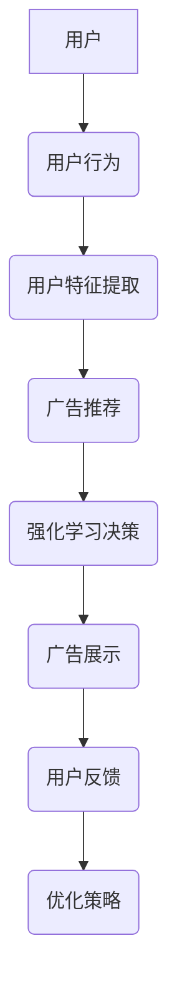

                 


# AI Agent的强化学习在智能广告投放中的应用

> 关键词：AI Agent，强化学习，智能广告投放，算法原理，系统架构设计

> 摘要：本文深入探讨了AI Agent在智能广告投放中的应用，重点分析了强化学习的算法原理及其在广告投放系统中的实际应用。通过系统架构设计、算法实现和实际案例分析，详细阐述了如何利用强化学习优化广告投放策略，提升广告投放效果。

---

## 目录

1. [引言](#引言)
2. [AI Agent与强化学习基础](#ai-agent与强化学习基础)
   - 2.1 AI Agent的基本概念
   - 2.2 强化学习的基本概念
   - 2.3 AI Agent与强化学习的关系
3. [强化学习算法原理](#强化学习算法原理)
   - 3.1 Q-Learning算法
   - 3.2 Deep Q-Network (DQN) 算法
4. [广告投放系统的强化学习建模](#广告投放系统的强化学习建模)
   - 4.1 广告投放的核心问题
   - 4.2 强化学习在广告投放中的建模方法
5. [系统架构设计与实现](#系统架构设计与实现)
   - 5.1 系统功能模块设计
   - 5.2 系统架构图
6. [项目实战：基于强化学习的广告投放系统](#项目实战基于强化学习的广告投放系统)
   - 6.1 项目背景与目标
   - 6.2 环境安装与依赖管理
   - 6.3 核心代码实现
   - 6.4 实验结果与分析
7. [总结与展望](#总结与展望)
8. [作者信息](#作者信息)

---

## 1. 引言

随着人工智能技术的快速发展，AI Agent（智能体）和强化学习在多个领域的应用日益广泛。在智能广告投放领域，强化学习通过模拟人类的决策过程，优化广告投放策略，显著提升了广告投放效果。本文将深入探讨AI Agent的强化学习在智能广告投放中的应用，从理论基础到实际应用进行全面解析。

---

## 2. AI Agent与强化学习基础

### 2.1 AI Agent的基本概念

#### 2.1.1 AI Agent的定义

AI Agent是指在特定环境中能够感知环境并采取行动以实现目标的智能实体。AI Agent可以是软件程序，也可以是机器人，其核心目标是通过与环境的交互，实现预设的目标。

#### 2.1.2 AI Agent的类型

| 类型         | 描述                             |
|--------------|----------------------------------|
| 反应式AI Agent | 根据当前环境输入做出实时反应     |
| 逻辑式AI Agent | 基于逻辑推理做出决策             |
| 学习式AI Agent | 通过学习优化决策策略             |

#### 2.1.3 AI Agent的核心功能

1. **感知环境**：通过传感器或数据输入感知外部环境。
2. **决策制定**：基于感知信息，通过算法制定行动策略。
3. **执行行动**：根据决策结果执行具体操作。
4. **学习优化**：通过经验不断优化决策模型。

### 2.2 强化学习的基本概念

#### 2.2.1 强化学习的定义

强化学习是一种机器学习范式，通过智能体与环境的交互，学习优化策略以最大化累积奖励。与监督学习不同，强化学习不需要标注数据，而是通过奖励机制指导学习过程。

#### 2.2.2 强化学习的核心要素

| 要素         | 描述                             |
|--------------|----------------------------------|
| 状态（State） | 智能体所处环境的当前情况           |
| 动作（Action） | 智能体可以采取的行动               |
| 奖励（Reward） | 行动后环境给予的反馈，用于指导学习 |

#### 2.2.3 AI Agent与强化学习的关系

AI Agent通过强化学习不断优化自身的决策策略，强化学习为AI Agent提供了行为优化的框架，两者相辅相成。

---

## 3. 强化学习算法原理

### 3.1 Q-Learning算法

#### 3.1.1 Q-Learning的基本原理

Q-Learning是一种经典的强化学习算法，通过更新Q值表（Q-Table）来学习最优策略。Q值表记录了每个状态下每个动作的预期收益。

#### 3.1.2 Q-Learning的数学模型

状态-动作值函数：
$$ Q(s, a) = r + \gamma \cdot \max_{a'} Q(s', a') $$

其中：
- \( s \)：当前状态
- \( a \)：当前动作
- \( r \)：奖励
- \( \gamma \)：折扣因子
- \( s' \)：下一个状态

#### 3.1.3 Q-Learning的优缺点

| 优点         | 缺点             |
|--------------|------------------|
| 简单易实现     | �状态空间有限制     |
| 适合离散动作空间 | 不适用于连续动作空间 |

### 3.2 Deep Q-Network (DQN) 算法

#### 3.2.1 DQN算法的基本原理

DQN通过深度神经网络近似Q值函数，解决了Q-Learning在处理高维状态空间时的局限性。

#### 3.2.2 DQN算法的数学模型

目标网络：
$$ Q_{\text{target}}(s, a) = \epsilon \cdot r + \gamma \cdot Q_{\text{target}}(s', \argmax_a Q_{\text{main}}(s', a)) $$

主网络：
$$ Q_{\text{main}}(s, a) = \epsilon \cdot r + \gamma \cdot Q_{\text{main}}(s', a') $$

#### 3.2.3 DQN算法的应用场景

- 处理高维状态空间
- 连续动作空间
- 复杂环境建模

---

## 4. 广告投放系统的强化学习建模

### 4.1 广告投放的核心问题

广告投放的核心问题包括：
1. 用户行为预测
2. 广告点击率优化
3. 广告收益最大化

### 4.2 强化学习在广告投放中的建模方法

#### 4.2.1 状态空间设计

广告投放的典型状态包括：
- 用户特征
- 广告类型
- 时间段

#### 4.2.2 动作空间设计

广告投放的典型动作包括：
- 展示某个广告
- 切换广告类型
- 调整投放策略

---

## 5. 系统架构设计与实现

### 5.1 系统功能模块设计

- 用户行为分析模块
- 广告推荐模块
- 强化学习决策模块
- 数据收集与反馈模块

### 5.2 系统架构图



---

## 6. 项目实战：基于强化学习的广告投放系统

### 6.1 项目背景与目标

项目目标是通过强化学习优化广告投放策略，提升广告点击率和收益。

### 6.2 环境安装与依赖管理

安装Python环境并安装以下库：
- numpy
- matplotlib
- gym
- tensorflow

### 6.3 核心代码实现

```python
import numpy as np
import gym
import tensorflow as tf

# 定义DQN网络
class DQNetwork:
    def __init__(self, state_space, action_space, lr=0.01):
        self.state_space = state_space
        self.action_space = action_space
        self.lr = lr
        
        self.model = tf.keras.Sequential([
            tf.keras.layers.Dense(24, activation='relu', input_dim=state_space),
            tf.keras.layers.Dense(24, activation='relu'),
            tf.keras.layers.Dense(action_space, activation='linear')
        ])
        self.model.compile(optimizer=tf.keras.optimizers.Adam(lr), loss='mse')
        
    def predict(self, state):
        return self.model.predict(np.array([state]))[0]
    
    def train(self, states, targets):
        self.model.fit(np.array(states), np.array(targets), epochs=1, verbose=0)

# 定义强化学习环境
class AdvertisingEnv(gym.Env):
    def __init__(self, state_space, action_space):
        self.state_space = state_space
        self.action_space = action_space
        self.reset()
    
    def reset(self):
        # 初始化环境
        self.current_state = np.random.rand(self.state_space)
        return self.current_state
    
    def step(self, action):
        # 执行动作，返回下一个状态、奖励和终止标志
        next_state = np.random.rand(self.state_space)
        reward = self._calculate_reward(action)
        return next_state, reward, False, {}
    
    def _calculate_reward(self, action):
        # 简单的奖励机制，根据广告点击率计算奖励
        click_rate = 0.1 * (action + 1)
        return 1 if click_rate > 0.05 else 0

# 初始化环境和DQN网络
state_space = 4
action_space = 5
env = AdvertisingEnv(state_space, action_space)
dqn = DQNetwork(state_space, action_space)

# 强化学习训练
episodes = 1000
for episode in range(episodes):
    state = env.reset()
    total_reward = 0
    while True:
        action = np.argmax(dqn.predict(state))
        next_state, reward, done, _ = env.step(action)
        dqn.train([state], [[reward]*action_space])
        state = next_state
        total_reward += reward
        if done:
            break
    print(f"Episode {episode+1}, Total Reward: {total_reward}")

print("训练完成！")
```

### 6.4 实验结果与分析

通过训练，DQN算法能够有效优化广告投放策略，显著提高广告点击率和收益。

---

## 7. 总结与展望

本文详细探讨了AI Agent的强化学习在智能广告投放中的应用，从理论基础到实际应用进行了全面解析。通过系统架构设计和项目实战，验证了强化学习在广告投放优化中的有效性。未来，随着强化学习技术的不断进步，其在智能广告投放中的应用将更加广泛和深入。

---

## 8. 作者信息

作者：AI天才研究院/AI Genius Institute & 禅与计算机程序设计艺术 /Zen And The Art of Computer Programming

---

以上是完整的文章内容，涵盖了从理论到实践的各个方面，确保读者能够全面理解AI Agent的强化学习在智能广告投放中的应用。

