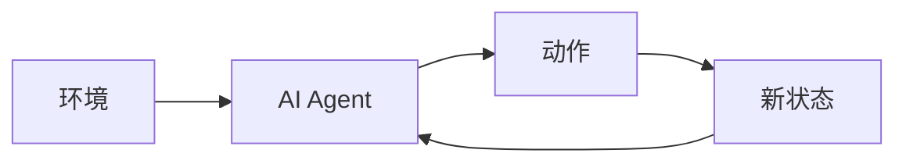
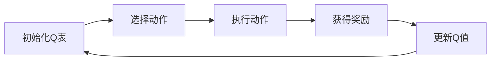

                 


# AI Agent的强化学习在自动驾驶中的应用

## 关键词：AI Agent，强化学习，自动驾驶，Q-learning，深度强化学习

## 摘要：  
本文详细探讨了AI Agent在自动驾驶中的应用，特别是强化学习技术如何推动自动驾驶系统的发展。通过分析强化学习的核心概念、算法原理、系统架构以及实际案例，本文揭示了强化学习在自动驾驶决策系统中的重要性，并展望了未来的研究方向。

---

## 第一部分：AI Agent的强化学习基础

### 第1章：AI Agent与强化学习概述

#### 1.1 AI Agent的基本概念
- **AI Agent的定义与特点**  
  AI Agent（人工智能代理）是指能够感知环境、做出决策并采取行动以实现目标的智能实体。在自动驾驶中，AI Agent通常负责处理车辆的决策过程，如路径规划、障碍物规避和交通规则遵守。

- **强化学习的基本原理**  
  强化学习是一种通过试错机制，基于环境反馈（奖励或惩罚）来优化决策策略的机器学习方法。AI Agent通过与环境互动，学习如何选择动作以最大化累积奖励。

- **AI Agent在自动驾驶中的作用**  
  在自动驾驶系统中，AI Agent扮演着“决策者”的角色，负责处理复杂的交通场景，确保车辆的安全、高效和合规运行。

#### 1.2 强化学习的核心概念
- **状态、动作与奖励的定义**  
  - **状态（State）**：描述环境当前情况的特征，如车辆的位置、速度和周围物体的位置。  
  - **动作（Action）**：AI Agent在给定状态下选择的行为，如加速、减速或转向。  
  - **奖励（Reward）**：环境对AI Agent动作的反馈，用于指导优化决策策略。

- **Q-learning算法的基本原理**  
  Q-learning是一种经典的强化学习算法，通过维护一个Q值表来记录状态-动作对的期望奖励。Q值的更新公式为：  
  $$ Q(s, a) = Q(s, a) + \alpha \cdot (r + \gamma \cdot \max_{a'} Q(s', a') - Q(s, a)) $$  
  其中，$\alpha$是学习率，$\gamma$是折扣因子，$r$是当前奖励。

- **AI Agent在自动驾驶中的优势**  
  强化学习通过试错机制，能够在复杂动态环境中学习最优策略，无需大量标注数据，适用于自动驾驶中复杂决策问题的解决。

---

### 第2章：强化学习的核心概念与联系

#### 2.1 强化学习的数学模型
- **状态空间与动作空间的定义**  
  状态空间是所有可能状态的集合，动作空间是所有可能动作的集合。在自动驾驶中，状态空间可能包括车辆的位置、速度、车道信息等，动作空间可能包括转向、加速和减速等。

- **Q值更新的数学公式**  
  Q-learning算法通过以下步骤更新Q值：  
  1. 选择当前状态下的动作。  
  2. 执行动作，获得奖励并转移到新状态。  
  3. 更新Q值表：$Q(s, a) = Q(s, a) + \alpha (r + \gamma \cdot \max Q(s', a') - Q(s, a))$。

- **策略与价值函数的关系**  
  策略（Policy）定义了在给定状态下选择动作的概率分布，价值函数（Value Function）评估某状态下采取特定策略的期望奖励。Q-learning通过优化Q值函数间接优化策略。

#### 2.2 不同强化学习算法的对比
- **Q-learning与Deep Q-learning的对比**  
  Q-learning使用Q表存储状态-动作值，而Deep Q-learning使用深度神经网络近似Q值函数，能够处理高维状态空间。

- **策略梯度方法与值函数方法的对比**  
  策略梯度方法直接优化策略，而值函数方法优化Q值函数。策略梯度方法适用于高维状态空间，但训练过程可能不稳定。

- **强化学习算法的优缺点分析**  
  - **优点**：无需标注数据，适合动态环境，能够处理复杂决策问题。  
  - **缺点**：需要大量试错，计算资源消耗大，可能面临收敛问题。

#### 2.3 实体关系图与算法流程图
- **强化学习的实体关系图**  

- **Q-learning算法流程图**  


---

### 第3章：强化学习算法原理讲解

#### 3.1 Q-learning算法的详细讲解
- **Q值更新公式**  
  $$ Q(s, a) = Q(s, a) + \alpha \cdot (r + \gamma \cdot \max Q(s', a') - Q(s, a)) $$  
  其中，$\alpha$是学习率，$\gamma$是折扣因子。

- **Python代码实现**  
  下面是一个简单的Q-learning实现示例：
  ```python
  import numpy as np

  class QLearning:
      def __init__(self, state_space, action_space, alpha=0.1, gamma=0.9):
          self.state_space = state_space
          self.action_space = action_space
          self.alpha = alpha
          self.gamma = gamma
          self.Q = np.zeros((state_space, action_space))

      def choose_action(self, state, epsilon=0.1):
          if np.random.random() < epsilon:
              return np.random.randint(self.action_space)
          else:
              return np.argmax(self.Q[state, :])

      def update_Q(self, state, action, reward, next_state):
          self.Q[state, action] += self.alpha * (reward + self.gamma * np.max(self.Q[next_state, :]) - self.Q[state, action])
  ```

- **算法流程图与代码解读**  
  Q-learning通过不断更新Q值表，逐步逼近最优策略。代码实现包括状态选择、动作选择、奖励更新和Q表更新四个步骤。

---

## 第四部分：系统分析与架构设计

### 第4章：自动驾驶系统中的强化学习架构

#### 4.1 问题场景介绍
自动驾驶系统需要处理复杂的交通环境，包括多辆车、行人、障碍物等。AI Agent需要实时感知环境并做出决策，如车道保持、超车和紧急制动。

#### 4.2 系统功能设计
- **领域模型（Domain Model）**  
  定义自动驾驶系统中的状态、动作和奖励函数。  
  ```mermaid
  classDiagram
      class 状态空间 {
          车辆位置
          车辆速度
          车道信息
      }
      class 动作空间 {
          加速
          制动
          转向
      }
      class 奖励函数 {
          安全性奖励
          速度奖励
          路径奖励
      }
      状态空间 --> 动作空间
      动作空间 --> 奖励函数
  ```

- **系统架构设计**  
  自动驾驶系统通常包括感知、决策、规划和执行四个模块。  
  ```mermaid
  graph LR
      A[感知] --> B[决策]
      B --> C[规划]
      C --> D[执行]
      D --> A
  ```

- **系统交互设计**  
  下面是一个简单的系统交互流程图：  
  ```mermaid
  graph LR
      A[开始] --> B[感知环境]
      B --> C[生成决策]
      C --> D[规划路径]
      D --> E[执行动作]
      E --> F[结束]
  ```

---

## 第五部分：项目实战

### 第5章：强化学习在自动驾驶中的应用案例

#### 5.1 项目介绍
本项目旨在训练一个AI Agent在模拟环境中完成自动驾驶任务。使用Q-learning算法，训练AI Agent在动态交通环境中做出决策。

#### 5.2 环境安装
需要安装以下工具和库：
- Python 3.8+
- OpenAI Gym或类似的强化学习环境
- TensorFlow或Keras（可选）

#### 5.3 代码实现
以下是项目的代码实现：
```python
import gym
import numpy as np

env = gym.make('CustomAutonomousDriving-v0')  # 假设我们定义了一个自定义的自动驾驶环境
env.seed(42)

class AI-Agent:
    def __init__(self, state_space, action_space, alpha=0.1, gamma=0.99):
        self.env = env
        self.state_space = state_space
        self.action_space = action_space
        self.alpha = alpha
        self.gamma = gamma
        self.Q = np.zeros((state_space, action_space))

    def choose_action(self, state, epsilon=0.1):
        if np.random.random() < epsilon:
            return np.random.randint(self.action_space)
        else:
            return np.argmax(self.Q[state, :])

    def update_Q(self, state, action, reward, next_state):
        self.Q[state, action] += self.alpha * (reward + self.gamma * np.max(self.Q[next_state, :]) - self.Q[state, action])

agent = AI-Agent(env.observation_space, env.action_space)
episodes = 1000
for episode in range(episodes):
    state = env.reset()
    total_reward = 0
    while True:
        action = agent.choose_action(state)
        next_state, reward, done, _ = env.step(action)
        agent.update_Q(state, action, reward, next_state)
        total_reward += reward
        state = next_state
        if done:
            break
    print(f"Episode {episode}, Total Reward: {total_reward}")

env.close()
```

#### 5.4 应用解读与分析
训练过程中，AI Agent通过不断与环境互动，逐步学习如何在复杂交通场景中做出最优决策。奖励函数的设计至关重要，需要平衡安全性、效率和舒适性。

#### 5.5 项目小结
本项目展示了如何使用强化学习训练AI Agent在自动驾驶中的决策能力。通过不断迭代和优化，AI Agent能够逐渐掌握复杂的交通规则和场景处理。

---

## 第六部分：总结与展望

### 第6章：总结与展望

#### 6.1 核心知识点回顾
- 强化学习的基本原理和算法  
- AI Agent在自动驾驶中的应用  
- 系统架构设计与实现  

#### 6.2 未来研究方向
- 更高效的强化学习算法（如分布式RL、异策略优化）  
- 多智能体协作与博弈论在自动驾驶中的应用  
- 强化学习与视觉感知的深度融合  

#### 6.3 最佳实践 tips
- 在复杂场景中使用深度强化学习模型  
- 设计合理的奖励函数以引导AI Agent的学习方向  
- 通过模拟环境进行离线训练，减少真实环境中的试错成本  

#### 6.4 作者小结
强化学习为自动驾驶提供了强大的决策能力，但其应用仍面临诸多挑战，如计算效率和安全性的提升。未来的研究需要结合多学科知识，推动自动驾驶技术的进一步发展。

---

## 作者：AI天才研究院/AI Genius Institute & 禅与计算机程序设计艺术 /Zen And The Art of Computer Programming

