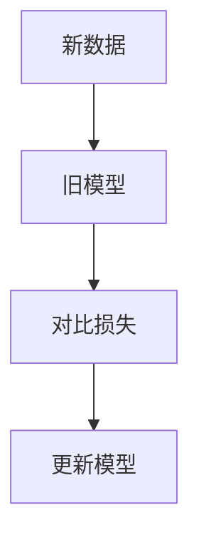
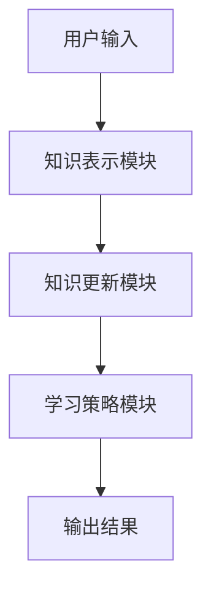

                 


# AI Agent的持续学习与知识更新策略

---

## 关键词
AI Agent, 持续学习, 知识更新, 知识图谱, 机器学习

---

## 摘要
AI Agent的持续学习与知识更新策略是当前人工智能领域的重要研究方向。随着数据量的爆炸式增长和应用场景的不断扩展，AI Agent需要具备动态更新知识的能力，以适应快速变化的环境。本文从AI Agent的知识表示、学习机制、更新策略等方面展开分析，结合具体算法和系统架构设计，探讨如何实现高效、可靠的持续学习与知识更新。通过案例分析和项目实战，本文为读者提供了一套完整的AI Agent持续学习解决方案。

---

## 第1章: AI Agent的背景与概念

### 1.1 AI Agent的基本概念
AI Agent（人工智能代理）是一种能够感知环境、自主决策并执行任务的智能体。它具备以下核心特点：
- **自主性**：能够在没有外部干预的情况下独立运行。
- **反应性**：能够实时感知环境并做出响应。
- **目标导向性**：通过设定目标来驱动行为。

AI Agent与传统AI的区别在于，传统AI通常是基于规则的静态系统，而AI Agent具备动态适应环境的能力。

### 1.2 持续学习的背景与意义
持续学习（Lifelong Learning）是一种机器学习范式，旨在让模型在不断变化的任务中持续学习和更新知识。随着数据的增加和环境的变化，AI Agent需要通过持续学习来保持其性能。

### 1.3 问题背景与描述
AI Agent在实际应用中面临以下挑战：
- **数据稀疏性**：新数据可能稀疏，导致模型难以直接学习。
- **任务多样性**：需要处理多种不同任务。
- **知识更新的实时性**：需要快速响应环境变化。

---

## 第2章: AI Agent的核心概念与联系

### 2.1 知识表示与知识图谱
知识表示是AI Agent理解世界的基础。知识图谱是一种结构化的知识表示方式，通过实体和关系描述世界。例如，实体可以表示为节点，关系可以表示为边。

#### ER实体关系图
以下是一个简单的ER实体关系图：
```mermaid
er
actor:
    id
    name
    role
    -- 关联关系
    project
project:
    id
    name
    description
```

### 2.2 学习机制与知识更新
AI Agent的知识更新可以通过以下机制实现：
- **监督学习**：基于标注数据进行学习。
- **无监督学习**：基于未标注数据进行学习。
- **强化学习**：通过与环境互动获得奖励，调整策略。

### 2.3 知识更新策略
知识更新策略包括：
- **增量学习**：逐步更新已有知识。
- **对比学习**：通过对比新旧知识进行更新。
- **迁移学习**：将已有知识迁移到新任务。

---

## 第3章: AI Agent的知识表示与更新

### 3.1 知识表示的数学模型
知识表示可以通过向量空间模型或图结构模型实现。

#### 向量空间模型
向量空间模型将实体表示为向量，例如：
$$
v_i = [v_{i1}, v_{i2}, \dots, v_{in}]
$$

#### 图结构模型
图结构模型将实体和关系表示为图，例如：
$$
E = (e_1, e_2, \dots, e_n)
$$

### 3.2 知识更新的算法原理
对比学习是一种常用的知识更新算法，其流程如下：


---

## 第4章: AI Agent的持续学习算法

### 4.1 对比学习算法
对比学习通过对比新旧数据来更新模型。例如，在图像分类任务中，对比学习可以通过以下步骤实现：
1. 输入新数据。
2. 计算新旧数据的相似性。
3. 更新模型参数以最小化对比损失。

### 4.2 增量学习算法
增量学习逐步更新模型，例如：
```python
# 初始化模型
model = MyModel()

# 增量学习
for batch in batches:
    model.update(batch)
```

### 4.3 迁移学习算法
迁移学习将已有知识迁移到新任务，例如：
```python
# 迁移学习
source_model = SourceModel()
target_model = TargetModel()

# 迁移特征
source_features = source_model.extract_features(data)
target_model.update(source_features)
```

---

## 第5章: AI Agent的知识更新系统架构

### 5.1 系统功能设计
知识更新系统包括以下模块：
- **知识表示模块**：负责知识的结构化表示。
- **知识更新模块**：负责知识的持续更新。
- **学习策略模块**：负责选择合适的学习策略。

### 5.2 系统架构设计
系统架构可以采用分层架构，例如：


### 5.3 系统接口设计
系统接口包括：
- **知识表示接口**：提供知识的结构化表示。
- **知识更新接口**：提供知识更新的功能。
- **学习策略接口**：提供学习策略的选择和执行。

---

## 第6章: 项目实战与案例分析

### 6.1 项目环境安装
安装必要的依赖：
```bash
pip install numpy
pip install tensorflow
pip install networkx
```

### 6.2 核心代码实现
实现对比学习的代码示例：
```python
import numpy as np

# 初始化模型参数
theta = np.random.randn(2, 2)

# 对比学习
def contrastive_learning(new_data, old_data):
    # 计算相似性
    similarity = np.dot(new_data, old_data.T)
    # 计算损失
    loss = np.mean(np.abs(similarity - np.eye(len(new_data))))
    # 更新参数
    theta -= 0.1 * loss * theta
    return theta

# 更新模型
new_theta = contrastive_learning(new_data, old_data)
```

### 6.3 案例分析
以医疗领域为例，AI Agent可以通过持续学习更新疾病诊断的知识。例如，当新的医疗数据出现时，AI Agent可以实时更新其知识库，从而提高诊断的准确性。

---

## 第7章: 最佳实践与小结

### 7.1 最佳实践
- 定期更新知识库。
- 使用高效的对比学习算法。
- 结合迁移学习提高性能。

### 7.2 小结
本文系统地探讨了AI Agent的持续学习与知识更新策略，从理论到实践，详细介绍了相关算法和系统架构设计。通过案例分析和项目实战，为读者提供了一套完整的解决方案。

---

## 注意事项
- 确保数据质量和多样性。
- 定期评估模型性能。
- 处理好模型的实时性和资源消耗的平衡。

---

## 拓展阅读
- [书籍]《Deep Learning》
- [论文]《A Survey on Lifelong Learning》
- [博客]《AI Agent的实践应用》

---

## 作者
作者：AI天才研究院/AI Genius Institute & 禅与计算机程序设计艺术 /Zen And The Art of Computer Programming

