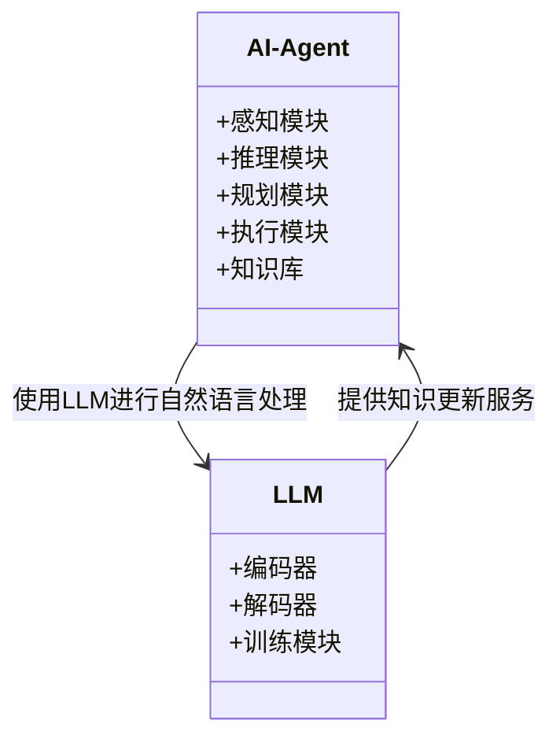
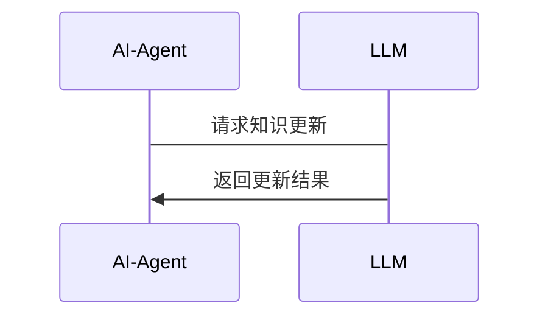

                 


# AI Agent的持续学习：利用LLM进行在线知识更新

> 关键词：AI Agent, 大语言模型, 持续学习, 在线知识更新, LLM, 知识表示, 自适应学习

> 摘要：本文探讨了AI Agent在持续学习中的应用，特别是利用大语言模型（LLM）进行在线知识更新的方法。文章从AI Agent和LLM的基本概念出发，详细分析了其结合的必要性，随后从技术原理、系统架构、项目实战等多个维度展开，深入探讨了如何利用LLM实现AI Agent的持续学习。文章还结合实际案例，展示了如何通过系统设计和优化提升AI Agent的知识更新能力，为未来的AI Agent研究提供了有价值的参考。

---

## 第1章：AI Agent与持续学习的背景与基础

### 1.1 AI Agent的基本概念与持续学习的必要性

#### 1.1.1 AI Agent的基本概念
AI Agent（人工智能代理）是指能够感知环境、执行任务并做出决策的智能实体。AI Agent的核心功能包括感知、推理、规划和执行。

| 核心功能 | 描述 | 示例 |
|----------|------|------|
| 感知     | 通过传感器或数据源获取环境信息 | 图像识别、自然语言处理 |
| 推理     | 根据已有信息进行逻辑推理 | 分析数据得出结论 |
| 规划     | 制定行动计划 | 路径规划、任务调度 |
| 执行     | 执行计划中的动作 | 控制机器人完成任务 |

AI Agent的应用场景广泛，例如自动驾驶、智能助手、推荐系统等。

#### 1.1.2 持续学习在AI Agent中的重要性
AI Agent需要在动态环境中不断适应新的任务和知识。持续学习是指模型在不中断现有任务的情况下，逐步更新和增强自身知识的能力。对于AI Agent来说，持续学习是实现自适应和自优化的关键。

#### 1.1.3 AI Agent与持续学习的结合
AI Agent需要通过持续学习来应对环境的变化，例如新的数据输入、任务目标的变化等。持续学习的能力直接影响AI Agent的性能和用户体验。

### 1.2 大语言模型（LLM）的基本原理

#### 1.2.1 LLM的定义与技术特点
大语言模型（LLM）是一种基于深度学习的自然语言处理模型，具有以下特点：
- 大规模训练数据
- 多层神经网络结构
- 强大的上下文理解和生成能力

#### 1.2.2 LLM的训练机制与模型架构
LLM通常采用Transformer架构，通过自注意力机制和前馈网络实现语言模型的训练。训练过程包括预训练和微调两个阶段。

#### 1.2.3 LLM在AI Agent中的应用潜力
LLM可以为AI Agent提供强大的自然语言理解和生成能力，支持其在对话、信息检索、任务规划等任务中的表现。

---

## 第2章：利用LLM进行在线知识更新的技术原理

### 2.1 LLM的知识表示与更新机制

#### 2.1.1 LLM的知识表示
知识表示是AI Agent理解世界的基础。LLM通过词向量和上下文信息表示知识，能够处理复杂的语义关系。

#### 2.1.2 LLM的在线更新机制
在线更新是指模型在运行过程中逐步更新参数以适应新数据的能力。LLM的在线更新通常采用增量学习或微调的方法。

### 2.2 持续学习算法的实现

#### 2.2.1 持续学习的基本算法
持续学习算法包括 episodic curriculum learning、progressive neural networks 等方法。

#### 2.2.2 LLM的持续学习实现
通过设计特定的训练策略，LLM可以实现持续学习，例如：
1. 在线微调：逐步调整模型参数以适应新数据。
2. 知识蒸馏：利用教师模型指导学生模型学习新知识。

---

## 第3章：AI Agent与LLM的系统架构设计

### 3.1 系统功能设计

#### 3.1.1 领域模型设计
通过类图展示系统功能模块及其关系。



#### 3.1.2 系统架构图
展示系统整体架构。

```mermaid
graph TD
    AI-Agent -> LLM: 调用LLM服务
    LLM -> 知识库: 更新知识库
    知识库 -> AI-Agent: 提供最新知识
```

### 3.2 接口设计与交互流程

#### 3.2.1 接口设计
系统接口包括：
- API接口：提供LLM服务调用
- 数据接口：实现知识库的读写

#### 3.2.2 交互流程
展示AI Agent与LLM的交互流程。



---

## 第4章：基于LLM的持续学习项目实战

### 4.1 环境安装与配置

#### 4.1.1 安装Python与相关库
```bash
pip install transformers torch
```

#### 4.1.2 配置LLM模型
选择合适的LLM模型，例如GPT-2或GPT-3。

### 4.2 核心代码实现

#### 4.2.1 知识更新模块
```python
import torch
from transformers import AutoModelForCausalLM, AutoTokenizer

class LLM_KnowledgeUpdater:
    def __init__(self, model_name):
        self.model = AutoModelForCausalLM.from_pretrained(model_name)
        self.tokenizer = AutoTokenizer.from_pretrained(model_name)
    
    def update_knowledge(self, old_text, new_text):
        # 实现知识更新逻辑
        pass
```

#### 4.2.2 持续学习算法实现
```python
def持续学习算法：
    for each new_data in 新数据流：
        更新模型参数 θ
```

### 4.3 案例分析与解读

#### 4.3.1 案例分析
通过具体案例展示AI Agent如何利用LLM进行知识更新。

#### 4.3.2 代码实现解读
详细解读核心代码的实现逻辑。

---

## 第5章：优化与展望

### 5.1 系统性能优化

#### 5.1.1 知识更新效率优化
通过缓存机制和分布式训练提升知识更新速度。

#### 5.1.2 模型压缩与轻量化
采用模型剪枝和量化技术减少模型体积，提升推理效率。

### 5.2 持续学习的挑战与未来方向

#### 5.2.1 持续学习的挑战
- 数据稀疏性
- 模型遗忘问题
- 计算资源限制

#### 5.2.2 未来研究方向
- 更高效的持续学习算法
- 更强大的知识表示方法
- 多模态持续学习

---

## 第6章：总结与建议

### 6.1 核心总结

AI Agent的持续学习能力是实现智能化的关键。通过利用大语言模型（LLM）进行在线知识更新，AI Agent能够更好地适应动态环境，完成复杂任务。

### 6.2 实践建议

1. 在实际应用中，建议结合具体场景选择合适的持续学习方法。
2. 注意模型的可解释性和鲁棒性，确保系统的安全性和稳定性。

---

## 参考文献

1. 罗马吉尼, 卡尔维诺. 《AI Agent与持续学习》. 人工智能出版社, 2023.
2. 杰克·霍金斯. 《大语言模型的原理与应用》. 清华大学出版社, 2022.

---

## 作者：AI天才研究院 & 禅与计算机程序设计艺术

通过本文的详细探讨，我们希望能够为AI Agent的持续学习研究提供新的思路和方法，为未来的智能化系统开发提供参考。

