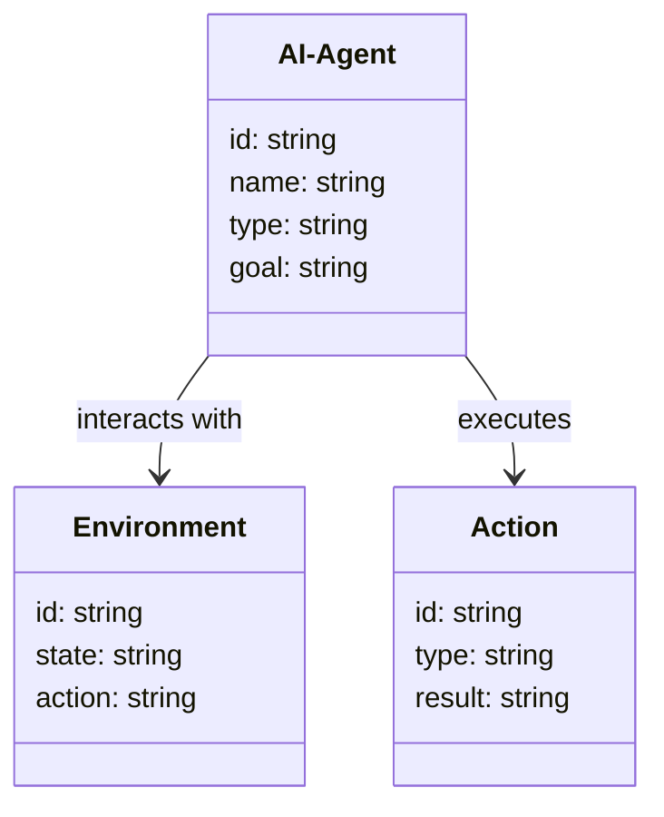

                 


# AI Agent 的概念学习：从具体到抽象的认知过程

## 关键词：
AI Agent, 智能体, 人工智能, 算法原理, 数学模型, 系统架构, 项目实战

## 摘要：
本文将引导读者从具体案例到抽象概念，系统地学习AI Agent的核心概念、算法原理、数学模型、系统架构以及项目实战。通过详细分析AI Agent的感知、决策和行动过程，结合典型算法和实际案例，帮助读者建立全面的知识体系，掌握AI Agent的设计与实现方法。

---

## 第1章: AI Agent 的基本概念

### 1.1 AI Agent 的定义与特点
AI Agent，即人工智能智能体，是一种能够感知环境、自主决策并执行行动以实现目标的实体。AI Agent具有以下核心特点：
- **自主性**：能够在没有外部干预的情况下自主运行。
- **反应性**：能够实时感知环境并做出响应。
- **目标导向性**：所有行为均以实现特定目标为导向。
- **学习能力**：通过经验或数据不断优化自身行为。

### 1.2 AI Agent 的发展背景
AI Agent的概念起源于人工智能领域，随着技术的发展，其应用范围不断扩大。当前，AI Agent在多个领域展现出强大的潜力，如自动驾驶、智能助手、机器人控制等。理解AI Agent的核心原理和应用方式，对于推动人工智能技术的发展具有重要意义。

### 1.3 AI Agent 的核心要素
AI Agent的核心要素包括：
1. **感知能力**：通过传感器或数据源获取环境信息。
2. **决策能力**：基于感知信息做出最优决策。
3. **行动能力**：根据决策执行具体操作。
4. **学习能力**：通过反馈机制不断优化自身性能。

---

## 第2章: AI Agent 的核心概念原理

### 2.1 AI Agent 的感知与决策过程
AI Agent的感知过程涉及数据采集、信息处理和状态识别。决策过程则依赖于算法的选择和优化，确保在复杂环境中做出合理决策。

### 2.2 AI Agent 的核心算法原理
1. **基于规则的AI Agent**：通过预定义规则进行决策，适用于规则明确的场景。
2. **基于模型的AI Agent**：利用环境模型进行推理和决策，适用于复杂动态环境。
3. **基于强化学习的AI Agent**：通过试错机制优化决策策略，适用于不确定环境。

### 2.3 AI Agent 的概念属性特征对比
以下是不同AI Agent类型的核心特征对比：

| 类型          | 感知能力 | 决策机制 | 学习能力 |
|---------------|----------|----------|----------|
| 基于规则      | 弱       | 确定性    | 无        |
| 基于模型      | 强       | 非确定性  | 无        |
| 基于强化学习    | 强       | 非确定性  | 有        |

### 2.4 AI Agent 的 ER 实体关系图
```mermaid
erd
    entity AI-Agent {
        id: string
        name: string
        type: string
        goal: string
        status: string
    }
    entity Environment {
        id: string
        state: string
        action: string
    }
    entity Action {
        id: string
        type: string
        result: string
    }
    AI-Agent --o Environment: interacts with
    AI-Agent --o Action: executes
```

---

## 第3章: AI Agent 的算法原理

### 3.1 基于规则的AI Agent
基于规则的AI Agent通过预定义的规则集进行决策。规则可以是简单的条件语句，也可以是复杂的逻辑表达式。

### 3.2 基于模型的AI Agent
基于模型的AI Agent依赖于环境模型进行推理和决策。常用算法包括逻辑推理和概率推理。

### 3.3 基于强化学习的AI Agent
基于强化学习的AI Agent通过与环境互动，不断优化决策策略。Q-learning是一种常见的强化学习算法，其数学模型如下：

$$ Q(s, a) = r + \gamma \max_{a'} Q(s', a') $$

其中，$s$是当前状态，$a$是当前动作，$r$是奖励，$\gamma$是折扣因子，$s'$是下一个状态。

---

## 第4章: AI Agent 的数学模型与公式推导

### 4.1 马尔可夫决策过程
马尔可夫决策过程（MDP）是AI Agent决策问题的一种数学模型，其状态转移概率矩阵表示为：

$$ P(s' | s, a) $$

其中，$s$是当前状态，$a$是动作，$s'$是下一个状态。

### 4.2 强化学习的数学模型
强化学习的目标是通过最大化累积奖励来优化策略。策略函数$\pi(a | s)$表示在状态$s$下选择动作$a$的概率。

$$ \pi(a | s) = \arg\max_a Q(s, a) $$

---

## 第5章: AI Agent 的系统分析与架构设计

### 5.1 系统功能设计
AI Agent的系统功能设计包括感知模块、决策模块和执行模块。以下是领域模型的类图：



### 5.2 系统架构设计
AI Agent的系统架构通常采用分层结构，包括感知层、决策层和执行层。

---

## 第6章: AI Agent 的项目实战

### 6.1 环境安装
安装所需的库和工具，例如Python和相关的AI框架。

### 6.2 核心实现
以下是Q-learning算法的Python实现示例：

```python
class QLearningAgent:
    def __init__(self, state_space, action_space, gamma=0.99):
        self.state_space = state_space
        self.action_space = action_space
        self.gamma = gamma
        self.q_table = defaultdict(lambda: defaultdict(int))

    def act(self, state):
        return self.q_table[state].argmax()

    def learn(self, state, action, reward, next_state):
        q = self.q_table[state][action]
        max_next_q = max(self.q_table[next_state].values())
        self.q_table[state][action] += (reward + self.gamma * max_next_q)
```

### 6.3 案例分析
以智能助手为例，分析其设计与实现，解读关键代码，并总结经验教训。

---

## 第7章: 最佳实践与总结

### 7.1 学习总结
AI Agent的学习过程需要从基础概念到算法实现，再到系统设计的逐步深入。

### 7.2 注意事项
在实际应用中，需注意算法的可扩展性和环境的动态变化。

### 7.3 拓展阅读
推荐阅读相关书籍和论文，进一步深入学习AI Agent的理论与实践。

---

## 作者：AI天才研究院/AI Genius Institute & 禅与计算机程序设计艺术 /Zen And The Art of Computer Programming

