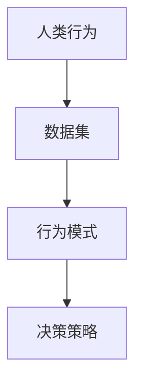
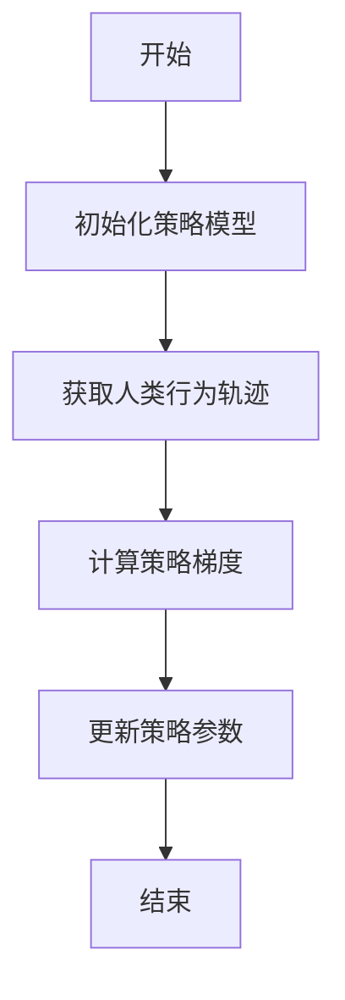
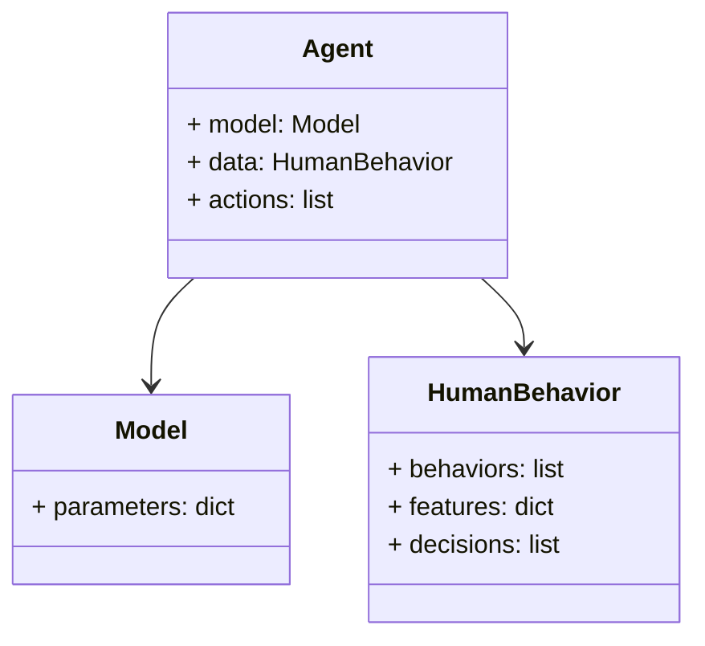

                 


# AI Agent的模仿学习：从人类行为数据中提取知识

> 关键词：AI Agent, 模仿学习, 人类行为数据, 机器学习, 人工智能

> 摘要：本文探讨了AI Agent通过模仿学习从人类行为数据中提取知识的方法，详细介绍了模仿学习的基本概念、算法原理、系统架构设计以及实际项目应用，旨在为读者提供全面的理解和实践经验。

---

## 第一部分: AI Agent的模仿学习基础

### 第1章: 模仿学习的基本概念

#### 1.1 什么是模仿学习
模仿学习是一种机器学习方法，通过观察和模仿人类或其他智能体的行为，使AI系统能够执行类似的任务。它结合了监督学习和强化学习的特点，能够从人类提供的行为数据中学习。

#### 1.2 AI Agent的基本概念
AI Agent是具有感知和行动能力的智能体，能够根据环境信息做出决策并执行动作。AI Agent的核心特征包括自主性、反应性、目标导向性和社会能力。

#### 1.3 模仿学习在AI Agent中的作用
模仿学习通过分析人类行为数据，帮助AI Agent理解人类的决策过程，从而在复杂环境中做出更符合人类期望的决策。模仿学习的优势在于能够直接从人类经验中学习，但其局限性在于对数据质量和多样性的依赖。

### 第2章: 模仿学习的核心概念与联系

#### 2.1 核心概念原理
模仿学习通过观察人类行为数据，提取其决策模式，并将其转化为AI Agent的决策策略。核心原理包括数据驱动、行为建模和策略优化。

#### 2.2 概念属性特征对比表格
以下是模仿学习与其他学习方法的对比：

| 特性          | 监督学习          | 强化学习          | 模仿学习          |
|---------------|-------------------|-------------------|-------------------|
| 数据类型      | 标签数据          | 奖励信号          | 行为轨迹          |
| 学习目标      | 预测目标值        | 最大化累积奖励    | 复制人类行为策略   |
| 优势          | 简单易用          | 高效探索          | 直接从经验学习    |

#### 2.3 ER实体关系图架构
以下是模仿学习的实体关系图：



---

## 第二部分: 模仿学习的算法原理

### 第3章: 算法原理讲解

#### 3.1 基于最大似然估计的模仿学习
基于最大似然估计的模仿学习通过最大化目标函数来逼近人类决策策略。数学模型如下：

$$ P(y|x) = \frac{e^{y^T x}}{\sum_{k} e^{k^T x}} $$

其中，$x$ 是输入特征，$y$ 是输出类别。

#### 3.2 基于强化学习的模仿学习
基于强化学习的模仿学习通过模仿人类动作策略，学习最优行为序列。算法流程如下：



#### 3.3 算法实现代码
以下是基于最大似然估计的模仿学习代码示例：

```python
import numpy as np

def mimic_learning(X, y):
    # 数据预处理
    X = np.array(X)
    y = np.array(y)
    
    # 模型训练
    model = Model()
    model.fit(X, y)
    
    return model
```

---

## 第三部分: 系统分析与架构设计

### 第4章: 系统分析与架构设计

#### 4.1 问题场景介绍
在本章中，我们将设计一个AI Agent，用于模拟人类在特定任务中的行为，例如客服对话系统。

#### 4.2 系统功能设计

##### 4.2.1 领域模型（mermaid类图）
以下是系统功能的类图：



#### 4.3 系统架构设计（mermaid架构图）
以下是系统架构的架构图：


---

## 第四部分: 项目实战

### 第5章: 项目实战

#### 5.1 环境安装
需要安装以下库：

```bash
pip install numpy matplotlib scikit-learn
```

#### 5.2 核心实现代码
以下是项目核心代码：

```python
import numpy as np
from sklearn import linear_model

def train_model(X, y):
    model = linear_model.LogisticRegression()
    model.fit(X, y)
    return model

def evaluate_model(model, X_test, y_test):
    accuracy = model.score(X_test, y_test)
    return accuracy
```

#### 5.3 案例分析
通过实际案例分析，展示如何使用上述代码进行模型训练和评估，并解释结果的意义。

---

## 第五部分: 高级主题

### 第6章: 高级主题

#### 6.1 模仿学习与强化学习的结合
通过结合强化学习，可以进一步优化模仿学习的性能。

#### 6.2 模仿学习的元学习
元学习可以提升模仿学习的泛化能力。

---

## 第六部分: 总结与展望

### 第7章: 总结与展望

#### 7.1 总结
本文详细介绍了模仿学习的基本概念、算法原理、系统架构设计以及实际项目应用，帮助读者全面理解模仿学习的核心思想。

#### 7.2 展望
未来，模仿学习将在更多领域得到应用，同时需要解决数据多样性和模型泛化能力等问题。

---

## 作者：AI天才研究院/AI Genius Institute & 禅与计算机程序设计艺术 /Zen And The Art of Computer Programming

---

通过以上目录结构和内容安排，您可以开始撰写完整的技术博客文章。每个章节都详细展开了相关的内容，结合理论、代码和图表，确保读者能够系统地理解AI Agent的模仿学习。

