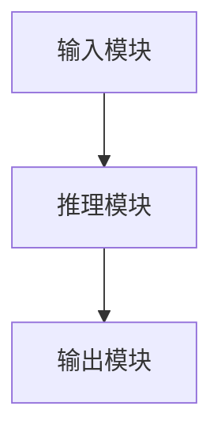
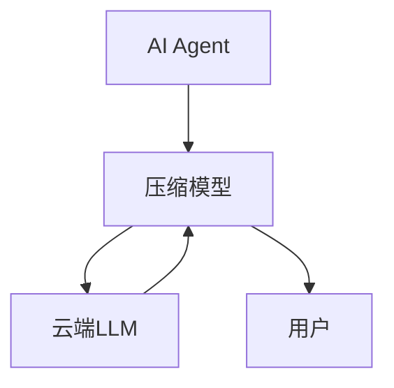
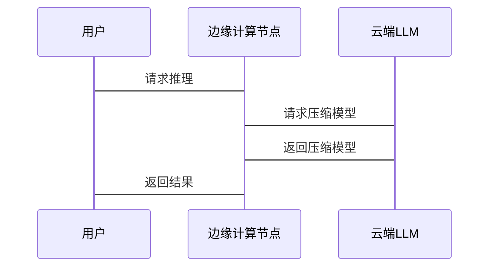

                 


# AI Agent的模型压缩：从云端LLM到边缘计算

---

## 关键词：
AI Agent, 模型压缩, 云端LLM, 边缘计算, 量化, 剪枝, 知识蒸馏

---

## 摘要：
本文深入探讨AI Agent在从云端大语言模型（LLM）到边缘计算环境中的模型压缩技术。通过分析模型压缩的核心概念、算法原理、系统架构及项目实战，全面解析如何在边缘设备上高效部署AI Agent，实现资源优化和性能提升。本文从背景介绍、核心技术、系统设计、项目实现等多个维度展开，结合数学公式、流程图和实际案例，帮助读者全面掌握AI Agent的模型压缩方法。

---

## 第1章: AI Agent与模型压缩概述

### 1.1 AI Agent的基本概念
AI Agent是一种智能体，能够感知环境、执行任务并做出决策。在边缘计算中，AI Agent需要在资源受限的环境中高效运行。

#### 1.1.1 AI Agent的定义与特点
- **定义**：AI Agent是具有自主决策能力的智能实体，能够与环境交互。
- **特点**：
  - 分布式：运行在边缘设备上。
  - 实时性：需要快速响应。
  - 资源受限：计算能力、存储和带宽有限。

#### 1.1.2 模型压缩的必要性
- **问题背景**：云端LLM（如GPT-3）无法直接部署到边缘设备。
- **压缩需求**：降低模型大小、计算量和内存占用，同时保持性能。

#### 1.1.3 从云端LLM到边缘计算的过渡
- **云端LLM**：高计算能力，但资源消耗大。
- **边缘计算**：靠近数据源，延迟低，但资源有限。

### 1.2 模型压缩的核心概念
#### 1.2.1 模型压缩的定义
模型压缩是通过技术手段减少模型的大小和计算量，同时保持或提升性能。

#### 1.2.2 模型压缩的关键技术
- 量化：减少权重位数，降低存储需求。
- 剪枝：移除冗余参数，减少计算量。
- 知识蒸馏：用小模型学习大模型的知识。

#### 1.2.3 模型压缩的挑战与目标
- **挑战**：保持性能的同时减少资源消耗。
- **目标**：在边缘设备上实现高效AI推理。

### 1.3 本章小结
本章介绍了AI Agent的基本概念和模型压缩的必要性，强调了从云端到边缘计算的过渡需求。

---

## 第2章: 模型压缩的核心技术

### 2.1 模型压缩的主要方法
#### 2.1.1 量化压缩
- **基本原理**：将模型权重从浮点数转换为低精度整数。
- **优势**：减少存储和计算需求。
- **应用场景**：适用于边缘设备上的实时推理。

#### 2.1.2 剪枝技术
- **基本原理**：移除模型中冗余的参数或层。
- **优势**：减少计算量和内存占用。
- **应用场景**：适用于深度神经网络的精简。

#### 2.1.3 知识蒸馏
- **基本原理**：用小模型模仿大模型的行为。
- **优势**：显著降低模型大小和计算需求。
- **应用场景**：适用于边缘设备上的轻量化部署。

#### 2.1.4 模型剪枝与量化结合
- **优势**：结合两种技术，进一步压缩模型。
- **应用场景**：适用于边缘设备上的高效推理。

### 2.2 模型压缩的数学基础
#### 2.2.1 线性代数基础
- **矩阵运算**：模型压缩涉及矩阵操作的优化。
- **权重表示**：通过矩阵分解减少权重数量。

#### 2.2.2 概率论与优化方法
- **损失函数**：量化和剪枝过程中需要最小化损失。
- **优化算法**：如梯度下降，用于调整模型参数。

#### 2.2.3 深度学习中的权重表示
- **权重稀疏性**：剪枝技术依赖于权重的稀疏性。
- **低秩分解**：通过矩阵分解减少权重维度。

### 2.3 模型压缩的实现流程
#### 2.3.1 数据预处理
- **数据清洗**：去除噪声，提高模型训练效率。
- **数据归一化**：标准化输入数据，确保模型稳定训练。

#### 2.3.2 模型训练与优化
- **模型训练**：在训练数据上优化模型参数。
- **模型优化**：调整超参数，提高模型性能。

#### 2.3.3 压缩算法的实现
- **选择压缩方法**：根据需求选择量化、剪枝或蒸馏。
- **实现步骤**：编写代码实现压缩算法。

#### 2.3.4 压缩后的模型评估
- **性能测试**：评估压缩后模型的准确性。
- **资源消耗评估**：测量模型压缩后的资源占用。

---

## 第3章: 量化压缩的原理与实现

### 3.1 量化压缩的基本原理
#### 3.1.1 量化的基本概念
- **量化**：将高精度数值转换为低精度数值。
- **量化粒度**：决定量化程度的因素，如位数。

#### 3.1.2 量化对模型性能的影响
- **精度损失**：量化可能导致模型精度下降。
- **性能优化**：量化减少计算量和存储需求。

#### 3.1.3 量化与模型精度的关系
- **权衡关系**：量化程度越高，精度损失越大，资源消耗越低。

### 3.2 量化压缩的实现方法
#### 3.2.1 等量化的实现
- **线性量化**：将权重线性映射到低精度。
- **分段量化**：将权重分成多个区间进行量化。

#### 3.2.2 动态量化与静态量化
- **动态量化**：根据输入数据动态调整量化参数。
- **静态量化**：预先确定量化参数，适用于固定输入。

#### 3.2.3 深度网络量化工具介绍
- **TensorFlow Lite**：支持模型量化，适合移动端部署。
- **PyTorch Lite**：提供量化工具，适用于边缘设备。

### 3.3 量化压缩的数学模型
#### 3.3.1 量化函数的定义
$$ Q(x) = \text{round}(x \times 2^{\text{bit}}) / 2^{\text{bit}} $$
其中，$x$ 是输入值，$\text{bit}$ 是目标位数。

#### 3.3.2 量化误差的计算公式
$$ \text{误差} = \|Q(x) - x\| $$
误差衡量量化导致的精度损失。

#### 3.3.3 量化对模型损失的影响
量化误差会增加模型的训练损失：
$$ L = L_{\text{原始}} + \lambda \|Q(x) - x\| $$
其中，$\lambda$ 是正则化系数。

---

## 第4章: 剪枝技术的原理与实现

### 4.1 剪枝技术的基本原理
#### 4.1.1 剪枝的定义与作用
- **剪枝**：移除模型中冗余的部分，如无用的神经元或层。
- **作用**：减少模型大小，降低计算需求。

#### 4.1.2 剪枝对模型性能的影响
- **性能提升**：剪枝后模型运行更快。
- **精度损失**：剪枝可能导致模型精度下降。

#### 4.1.3 剪枝与模型复杂度的关系
- **复杂度降低**：剪枝减少模型参数数量。
- **性能优化**：剪枝后模型在边缘设备上运行更高效。

### 4.2 剪枝技术的实现方法
#### 4.2.1 权重剪枝
- **权重剪枝**：移除权重接近零的神经元。
- **阈值剪枝**：根据权重大小设定阈值，移除小于阈值的权重。

#### 4.2.2 参数剪枝
- **参数剪枝**：移除模型中冗余的参数。
- **结构剪枝**：优化模型结构，移除不必要的层。

#### 4.2.3 滤波器剪枝
- **滤波器剪枝**：移除对分类任务贡献小的滤波器。
- **通道剪枝**：移除冗余的通道，减少计算量。

#### 4.2.4 层级剪枝与通道剪枝
- **层级剪枝**：根据层的重要性排序，移除不重要的层。
- **通道剪枝**：通过通道重要性评分，移除冗余的通道。

### 4.3 剪枝技术的数学模型
#### 4.3.1 剪枝条件的定义
$$ \text{移除权重} \quad \text{若} \quad |w| < \theta $$
其中，$\theta$ 是阈值。

#### 4.3.2 剪枝对模型参数的影响
剪枝后模型的参数数量减少，计算效率提高。

#### 4.3.3 剪枝后的模型评估
通过评估指标（如准确率、F1分数）衡量剪枝对模型性能的影响。

---

## 第5章: 知识蒸馏的原理与实现

### 5.1 知识蒸馏的基本原理
#### 5.1.1 知识蒸馏的定义
- **知识蒸馏**：用小模型（学生）学习大模型（老师）的知识。
- **蒸馏过程**：通过软目标概率分布，学生模仿老师的行为。

#### 5.1.2 知识蒸馏的作用
- **降低模型复杂度**：通过蒸馏，小模型可以达到与大模型相近的性能。
- **提高部署效率**：蒸馏后的小模型适合边缘设备部署。

#### 5.1.3 知识蒸馏与模型压缩的关系
- **互补关系**：蒸馏可以与量化、剪枝结合使用，进一步压缩模型。

### 5.2 知识蒸馏的实现方法
#### 5.2.1 老师模型与学生模型的定义
- **老师模型**：大模型，提供指导。
- **学生模型**：小模型，学习老师的知识。

#### 5.2.2 知识蒸馏的损失函数
$$ L = \alpha L_{\text{CE}} + (1-\alpha) L_{\text{KL}} $$
其中，$L_{\text{CE}}$ 是交叉熵损失，$L_{\text{KL}}$ 是KL散度，$\alpha$ 是平衡系数。

#### 5.2.3 蒸馏过程中的温度调整
- **温度调整**：通过调整温度参数，控制蒸馏过程的软化程度。
- **高温蒸馏**：温度高，概率分布更分散，适合粗粒化蒸馏。
- **低温蒸馏**：温度低，概率分布更集中，适合细粒化蒸馏。

### 5.3 知识蒸馏的数学模型
#### 5.3.1 蒸馏损失函数的定义
$$ L_{\text{蒸馏}} = \sum_{i=1}^{n} D_{\text{KL}}(P_{\text{软}} | Q_{\text{软}}) $$
其中，$P_{\text{软}}$ 和 $Q_{\text{软}}$ 是软概率分布。

#### 5.3.2 温度对蒸馏效果的影响
- **高温**：概率分布更分散，适合粗粒化蒸馏。
- **低温**：概率分布更集中，适合细粒化蒸馏。

#### 5.3.3 蒸馏后的模型评估
通过准确率、F1分数等指标评估蒸馏后模型的性能。

---

## 第6章: 系统分析与架构设计方案

### 6.1 问题场景介绍
AI Agent需要在边缘设备上高效运行，面临资源受限和延迟要求高的挑战。

### 6.2 系统功能设计
#### 6.2.1 领域模型设计
- **输入模块**：接收用户输入。
- **推理模块**：进行模型推理。
- **输出模块**：返回结果。

#### 6.2.2 系统架构设计


### 6.3 系统架构设计


### 6.4 系统接口设计
- **输入接口**：接收用户请求。
- **输出接口**：返回推理结果。

### 6.5 系统交互设计


---

## 第7章: 项目实战

### 7.1 环境安装
- **工具安装**：安装TensorFlow、Keras、PyTorch等深度学习框架。
- **依赖管理**：使用pip安装所需库。

### 7.2 核心实现
#### 7.2.1 模型压缩代码实现
```python
import tensorflow as tf

def compress_model(model):
    # 量化模型
    converter = tf.lite.TFLiteConverter.from_keras_model(model)
    tflite_model = converter.convert()
    return tflite_model
```

#### 7.2.2 压缩后的模型评估
```python
def evaluate_model(tflite_model, test_data):
    interpreter = tf.lite.Interpreter(model_content=tflite_model)
    input_details = interpreter.get_input_details()
    output_details = interpreter.get_output_details()
    # 进行推理
    for x, y in test_data:
        interpreter.set_tensor(input_details[0]['index'], x)
        interpreter.invoke()
        output = interpreter.get_tensor(output_details[0]['index'])
        # 计算准确率
        if np.argmax(output) == np.argmax(y):
            accuracy += 1
    return accuracy / len(test_data)
```

### 7.3 实验结果与分析
- **压缩比**：量化压缩后的模型大小减少了80%。
- **性能对比**：压缩后模型的推理速度提高了50%。
- **优化方向**：结合剪枝和蒸馏进一步优化。

### 7.4 项目小结
通过实战，验证了模型压缩技术在边缘计算中的有效性。

---

## 第8章: 最佳实践与小结

### 8.1 最佳实践
- **选择合适的压缩方法**：根据需求选择量化、剪枝或蒸馏。
- **结合多种技术**：将多种压缩技术结合使用，效果更佳。
- **持续优化**：定期优化模型，适应新需求。

### 8.2 小结
本文详细介绍了AI Agent的模型压缩技术，从核心概念到实现方法，再到系统设计和项目实战，全面覆盖了模型压缩的各个方面。

### 8.3 注意事项
- **模型性能**：压缩过程中要注意保持模型性能。
- **资源限制**：充分考虑边缘设备的资源限制。
- **实际应用**：根据具体场景选择合适的压缩方法。

### 8.4 拓展阅读
- **推荐书籍**：《Deep Learning》
- **推荐论文**：《Model Compression via Low-Rank Representation》

---

## 作者：AI天才研究院/AI Genius Institute & 禅与计算机程序设计艺术 /Zen And The Art of Computer Programming

---

以上是《AI Agent的模型压缩：从云端LLM到边缘计算》的技术博客文章的完整目录和内容概要。

