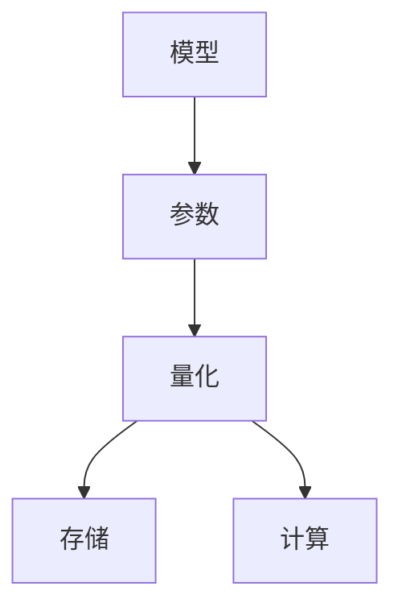

                 

<think>
好，我现在需要根据用户的详细需求，撰写一篇关于AI Agent模型量化的技术博客文章。首先，我需要明确文章的结构和各个部分的内容，确保逻辑清晰，内容详尽。

首先，用户已经给出了一个详细的目录大纲，包括摘要和关键词。我需要按照这个大纲逐步展开每个部分。首先是摘要部分，要简洁明了地概括文章的核心内容。

接下来是关键词部分，确保列出5到7个相关的关键词，便于读者快速了解文章主题。

然后是文章正文部分。首先是背景介绍，包括模型量化的基本概念、问题背景、现状和意义。这部分需要帮助读者理解为什么模型量化是必要的，尤其是在AI Agent和大语言模型（LLM）的应用中。

接下来是核心概念与原理，需要详细讲解模型量化的核心技术，如知识蒸馏、剪枝、量化，并通过对比表格和实体关系图来帮助读者理解这些概念之间的联系。

然后是算法原理，这部分需要深入讲解每个量化算法的原理，如剪枝、量化、知识蒸馏，并用流程图和数学公式来说明。同时，提供Python代码示例，帮助读者更好地理解实现过程。

系统分析与架构设计部分，我需要介绍优化方案的设计，包括系统功能设计、架构设计和接口设计，并用类图、架构图和序列图来展示系统的结构和交互过程。

项目实战部分，提供一个具体的案例，如量化一个Transformer模型，详细描述环境安装、代码实现、案例分析和结果解读，让读者能够实际操作并理解模型量化的效果。

最后是最佳实践和总结，总结书中的主要内容，给出注意事项和未来展望，帮助读者巩固所学知识，并指导他们在实际应用中的注意事项。

在撰写过程中，我需要确保每个部分都覆盖到位，同时保持文章的逻辑性和连贯性。使用正确的Markdown格式，包括标题、子标题、代码块、数学公式等。数学公式需要用LaTeX表示，确保准确无误。

可能遇到的挑战是如何在有限的字数内详细涵盖所有必要的部分，同时保持结构的清晰。我需要合理分配各章节的内容，确保每个部分都足够详细，但又不显得冗长。

总的来说，我需要按照用户的要求，一步步构建文章内容，确保每个核心部分都被覆盖，并且格式和内容都符合要求。这样，用户才能得到一篇完整且实用的技术博客文章。
</think>

# AI Agent的模型量化：优化LLM的计算效率与存储

> 关键词：模型量化，AI Agent，大语言模型，LLM，计算效率，存储优化，知识蒸馏

> 摘要：本文详细探讨了AI Agent中模型量化技术的优化方法，特别是针对大语言模型（LLM）的计算效率与存储优化。通过分析模型量化的核心概念、算法原理、系统架构设计和项目实战，本文为读者提供了从理论到实践的全面指导。文章深入讲解了模型量化的基本原理，包括知识蒸馏、剪枝、量化等技术，并通过实际案例展示了如何在AI Agent中实现模型量化，以提高计算效率和减少存储需求。

---

## 第一部分: AI Agent的模型量化基础

### 第1章: 模型量化概述

#### 1.1 模型量化的基本概念

- **模型量化的定义**：模型量化是指通过降低模型参数的精度（例如从32位浮点数降到8位整数）来减少模型的存储空间和计算复杂度。
- **模型量化的必要性**：随着模型规模的增大，计算资源和存储空间的需求急剧增加，模型量化成为优化计算效率和存储需求的关键技术。
- **模型量化的应用场景**：在AI Agent中，模型量化可以显著降低计算成本，提升推理速度，适用于边缘计算、移动端应用等场景。

#### 1.2 大语言模型（LLM）的背景与挑战

- **LLM的定义与发展**：大语言模型是指具有大量参数（通常数十亿甚至更多）的深度学习模型，如GPT系列、BERT系列等。这些模型在自然语言处理任务中表现出色，但计算资源消耗巨大。
- **LLM在AI Agent中的作用**：AI Agent需要处理复杂的语言任务，如对话生成、文本理解等，LLM为其提供了强大的能力。
- **LLM计算效率与存储的挑战**：模型参数量大，计算资源需求高，存储空间占用大，限制了其在资源受限环境中的应用。

#### 1.3 模型量化的意义与目标

- **提高计算效率**：通过降低模型参数的精度，减少计算复杂度，提升推理速度。
- **减少存储需求**：降低模型的存储空间，使其能够运行在资源受限的设备上。
- **降低通信成本**：在分布式计算中，减少数据传输量，降低网络带宽需求。

---

### 第2章: 模型量化的核心概念与原理

#### 2.1 模型量化的基本原理

- **知识蒸馏**：通过将大型模型的知识迁移到小型模型中，提升小型模型的性能。知识蒸馏的关键在于设计合适的蒸馏损失函数，确保小模型能够捕获大模型的特征。
- **模型剪枝**：通过去除模型中冗余的参数或神经元，降低模型的复杂度。剪枝可以根据参数的重要性进行选择性剪枝，如基于梯度的剪枝方法。
- **模型量化**：通过将浮点数参数量化为低精度整数（如8位或4位），减少存储空间和计算量。量化过程中需要处理量化误差，确保模型性能不受显著影响。

#### 2.2 模型量化的核心概念对比

- **量化精度对比**：
  | 量化精度 | 优势 | 劣势 |
  |----------|------|------|
  | 32位浮点 | 高精度 | 占用空间大 |
  | 16位整数 | 适合推理 | 精度下降 |
  | 8位整数  | 占用空间小 | 精度进一步下降 |
  | 4位整数  | 空间占用低 | 精度损失较大 |

- **实体关系图**：Mermaid图展示模型量化的核心要素及其关系。



---

### 第3章: 模型量化的核心算法原理

#### 3.1 模型剪枝算法

- **剪枝的定义**：通过去除模型中冗余的参数或神经元，降低模型的复杂度。
- **基于权重重要性的剪枝方法**：计算每个参数的重要性，选择重要性较低的参数进行剪枝。
- **基于结构优化的剪枝方法**：优化模型的结构，去除冗余的神经元或层。

#### 3.2 模型量化算法

- **量化的基本原理**：将高精度浮点数参数映射到低精度整数，通过量化矩阵或量化函数实现。
- **量化精度的选择与优化**：根据任务需求选择合适的量化精度，通过训练调整量化参数，减少量化误差。
- **量化误差的分析与补偿**：分析量化误差对模型性能的影响，设计补偿机制，如使用量化校正网络。

#### 3.3 知识蒸馏算法

- **知识蒸馏的定义**：将大型模型的知识迁移到小型模型中，提升小模型的性能。
- **知识蒸馏的关键技术**：设计合适的蒸馏损失函数，选择合适的教师模型和学生模型，调整蒸馏温度等参数。
- **知识蒸馏的实现步骤**：1) 定义蒸馏损失函数；2) 训练学生模型；3) 调整蒸馏参数，优化模型性能。

---

### 第4章: 模型量化与AI Agent的系统架构设计

#### 4.1 系统功能设计

- **模型量化模块**：负责模型的量化过程，包括参数量化、模型剪枝等。
- **AI Agent功能模块**：实现AI Agent的核心功能，如自然语言处理、决策推理等。
- **性能优化模块**：监控和优化系统的性能，确保量化后的模型在计算效率和存储需求上达到最优。

#### 4.2 系统架构设计

- **分层架构设计**：将系统划分为数据层、模型层、计算层和应用层，各层之间通过接口进行交互。
- **模块化设计**：将系统功能模块化，便于维护和扩展，如量化模块、推理模块、优化模块等。
- **可扩展性设计**：设计模块化的接口，支持多种量化方法和模型结构的扩展。

#### 4.3 系统接口设计

- **量化接口**：定义量化模块与模型层的交互接口，如参数量化接口、模型剪枝接口等。
- **推理接口**：定义推理模块与计算层的交互接口，如模型输入接口、结果输出接口等。
- **优化接口**：定义性能优化模块与数据层的交互接口，如性能监控接口、参数调整接口等。

---

## 第二部分: 项目实战与优化

### 第5章: 项目实战

#### 5.1 环境安装

- **安装Python环境**：推荐使用Anaconda或virtualenv管理环境。
- **安装相关库**：如TensorFlow、Keras、PyTorch等深度学习框架，以及量化工具库如Quantize-Keras。

#### 5.2 系统核心实现

- **量化实现**：编写量化函数，实现参数的低精度量化。
- **剪枝实现**：设计剪枝算法，优化模型结构。
- **知识蒸馏实现**：实现蒸馏损失函数，训练学生模型。

#### 5.3 代码实现

```python
import tensorflow as tf
from tensorflow.keras import layers

def quantize_model(model, bits=8):
    # 创建量化函数
    def quantize_func(x):
        scale = tf.pow(2, bits)
        return tf.quantize(x, min_val=-2**(bits-1), max_val=2**(bits-1)-1, num_bits=bits)
    # 应用量化到所有层
    for layer in model.layers:
        if hasattr(layer, 'kernel'):
            layer.kernel = quantize_func(layer.kernel)
    return model

# 示例代码：量化一个简单的神经网络模型
model = tf.keras.Sequential([
    layers.Dense(64, activation='relu'),
    layers.Dense(10, activation='softmax')
])
quantized_model = quantize_model(model, bits=8)
```

#### 5.4 案例分析与结果解读

- **案例分析**：通过量化模型，分析模型性能的变化，如准确率、计算速度等。
- **结果解读**：量化对模型性能的影响，如量化误差对模型预测结果的影响。

---

## 第三部分: 最佳实践与总结

### 第6章: 最佳实践

#### 6.1 小结

- 模型量化是优化AI Agent计算效率和存储需求的关键技术。
- 通过知识蒸馏、剪枝和量化等方法，可以显著降低模型的复杂度和资源消耗。

#### 6.2 注意事项

- **量化精度的选择**：根据任务需求选择合适的量化精度，避免过度量化导致性能下降。
- **模型选择与优化**：选择适合量化的目标模型，优化模型结构和参数，降低量化误差。
- **性能监控与调整**：在实际应用中，持续监控模型性能，根据需求调整量化参数，优化系统性能。

#### 6.3 未来展望

- **量化技术的进一步发展**：研究更高效的量化方法，如自适应量化、混合精度量化等。
- **AI Agent的智能化优化**：结合AI Agent的智能决策能力，动态调整量化参数，实现自适应优化。
- **多模态模型的量化研究**：探索多模态模型的量化方法，降低多模态模型的资源消耗。

---

## 作者信息

作者：AI天才研究院/AI Genius Institute & 禅与计算机程序设计艺术 /Zen And The Art of Computer Programming

