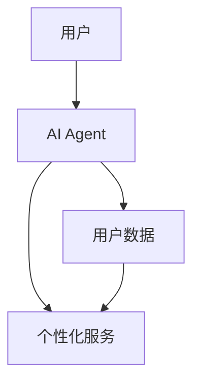
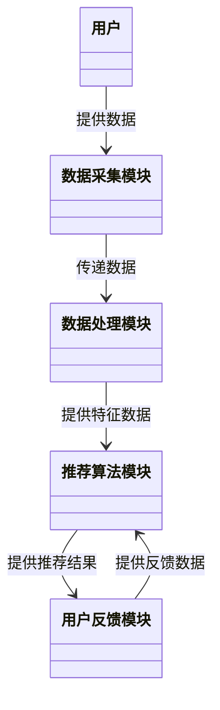
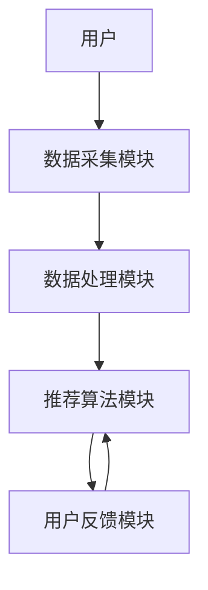

                 


# AI Agent的用户体验优化与个性化

## 关键词：AI Agent，用户体验优化，个性化服务，强化学习，系统架构设计，用户体验

## 摘要：  
本文旨在探讨AI Agent在用户体验优化与个性化服务中的应用。通过分析AI Agent的核心概念、算法原理、系统架构设计以及实际项目案例，深入探讨如何通过技术手段提升用户体验，并实现个性化的服务。本文结合理论与实践，提供了一套完整的解决方案，为AI Agent在实际应用中的优化与个性化提供参考。

---

# 第一部分: AI Agent的用户体验优化与个性化背景介绍

## 第1章: AI Agent的背景与问题背景

### 1.1 问题背景

#### 1.1.1 AI Agent的定义与核心概念  
AI Agent（人工智能代理）是指能够感知环境并采取行动以实现目标的智能实体。它通过数据输入、模型训练和决策推理，为用户提供智能化服务。AI Agent的核心概念包括感知、推理、决策和行动能力。

#### 1.1.2 用户体验优化的必要性  
在当今竞争激烈的市场环境中，用户体验已成为区分产品和服务的重要因素。AI Agent通过自动化和智能化手段，能够显著提升用户体验，减少用户操作负担，提高服务效率。

#### 1.1.3 个性化需求的驱动因素  
随着用户需求的多样化和个性化，传统的通用服务已无法满足用户的差异化需求。AI Agent通过个性化推荐、定制化服务和动态调整，能够更好地满足用户的个性化需求。

### 1.2 问题描述

#### 1.2.1 当前AI Agent在用户体验中的挑战  
目前，AI Agent在用户体验优化方面面临以下挑战：  
1. 数据隐私问题：用户数据的收集和使用需要符合隐私保护法规。  
2. 系统性能问题：复杂场景下的实时响应和计算效率问题。  
3. 用户接受度问题：用户对AI Agent的依赖和信任度需要逐步培养。

#### 1.2.2 个性化服务的现状与不足  
个性化服务虽然在某些领域（如推荐系统）取得了显著进展，但仍存在以下不足：  
1. 数据不足：部分用户群体的数据不足以支持精准的个性化推荐。  
2. 模型局限性：现有模型在处理复杂场景时可能缺乏灵活性和适应性。  
3. 用户反馈延迟：个性化服务的优化需要实时或近实时的用户反馈。

#### 1.2.3 用户需求与AI Agent能力之间的矛盾  
用户需求的多样性与AI Agent能力的局限性之间存在矛盾：  
1. 用户需求的动态变化要求AI Agent具备快速调整能力。  
2. AI Agent的能力受限于数据质量和算法性能，难以完全满足用户的期望。  

### 1.3 问题解决

#### 1.3.1 用户体验优化的目标  
通过AI Agent实现以下目标：  
1. 提供高效、便捷的服务体验。  
2. 实现个性化、定制化的服务。  
3. 提升用户满意度和忠诚度。  

#### 1.3.2 个性化服务的核心问题  
个性化服务的核心问题包括：  
1. 如何有效收集和处理用户数据。  
2. 如何设计高效的个性化推荐算法。  
3. 如何实时响应用户的个性化需求。  

#### 1.3.3 AI Agent能力提升的方向  
AI Agent能力的提升方向包括：  
1. 提高数据处理和分析能力。  
2. 优化算法性能和模型可解释性。  
3. 提升系统实时响应能力。  

### 1.4 边界与外延

#### 1.4.1 AI Agent的边界定义  
AI Agent的边界是指其在特定场景下的功能和能力范围。例如，在电商推荐系统中，AI Agent的边界是基于用户行为数据进行个性化推荐，而不涉及其他业务逻辑。

#### 1.4.2 用户体验优化的适用范围  
用户体验优化的适用范围包括所有与用户交互相关的场景，如网站设计、移动应用、智能设备等。  

#### 1.4.3 个性化服务的外延扩展  
个性化服务的外延扩展包括：  
1. 从单一场景扩展到多场景。  
2. 从简单推荐扩展到复杂决策支持。  
3. 从静态服务扩展到动态实时服务。  

### 1.5 概念结构与核心要素

#### 1.5.1 AI Agent的基本构成  
AI Agent的基本构成包括：  
1. 感知模块：负责收集和处理环境数据。  
2. 推理模块：基于感知数据进行分析和推理。  
3. 决策模块：根据推理结果制定行动策略。  
4. 行动模块：执行决策模块制定的行动方案。  

#### 1.5.2 用户体验优化的关键要素  
用户体验优化的关键要素包括：  
1. 用户数据收集与分析。  
2. 个性化推荐算法设计。  
3. 实时响应能力。  

#### 1.5.3 个性化服务的核心组件  
个性化服务的核心组件包括：  
1. 用户数据存储与管理。  
2. 个性化推荐模型。  
3. 用户反馈机制。  

### 1.6 本章小结  
本章从背景介绍、问题背景、问题描述和问题解决等方面，全面分析了AI Agent在用户体验优化与个性化服务中的应用背景。通过明确AI Agent的核心概念、目标和能力边界，为后续章节的深入分析奠定了基础。

---

# 第二部分: AI Agent的核心概念与联系

## 第2章: AI Agent的核心概念原理

### 2.1 核心概念原理

#### 2.1.1 AI Agent的基本工作原理  
AI Agent通过感知环境、分析数据、制定决策并执行行动来实现目标。其核心工作流程包括：  
1. 数据感知：收集用户行为、环境状态等数据。  
2. 数据分析：对收集的数据进行清洗、特征提取和初步分析。  
3. 决策推理：基于分析结果，利用算法模型进行推理和预测。  
4. 行动执行：根据推理结果，输出相应的服务或行动。  

#### 2.1.2 用户体验优化的实现机制  
用户体验优化的实现机制包括：  
1. 用户数据采集：通过日志记录、用户调查等方式收集用户行为数据。  
2. 数据分析：利用数据挖掘和机器学习技术分析用户行为模式。  
3. 个性化推荐：基于分析结果，为用户提供个性化服务。  
4. 用户反馈：实时收集用户对推荐结果的反馈，并用于模型优化。  

#### 2.1.3 个性化服务的算法基础  
个性化服务的算法基础包括：  
1. 基于协同过滤的推荐算法。  
2. 基于内容的推荐算法。  
3. 基于深度学习的推荐算法。  

### 2.2 核心概念属性对比

#### 2.2.1 AI Agent与传统Agent的对比  
| **对比维度** | **AI Agent** | **传统Agent** |  
|--------------|--------------|---------------|  
| 智能水平     | 高            | 低             |  
| 数据处理能力 | 强            | 弱             |  
| 适应性       | 高            | 低             |  

#### 2.2.2 用户体验优化与个性化服务的对比  
| **对比维度** | **用户体验优化** | **个性化服务** |  
|--------------|-----------------|----------------|  
| 目标         | 提升用户体验    | 提供个性化服务  |  
| 实现方式     | 改进交互设计    | 基于用户数据推荐 |  
| 依赖因素     | 用户反馈        | 用户数据        |  

#### 2.2.3 不同AI Agent模型的性能对比  
| **模型类型** | **Q-Learning** | **DQN** | **PG** |  
|--------------|----------------|---------|--------|  
| 适用场景     | 离散动作空间    | 连续动作空间 | 政策优化 |  
| 学习效率     | 中等           | 高       | 高     |  
| 稳定性       | 高             | 中等      | 高     |  

### 2.3 ER实体关系图



### 2.4 本章小结  
本章通过对比分析，明确了AI Agent与传统Agent、用户体验优化与个性化服务之间的区别与联系。通过ER实体关系图，展示了用户、AI Agent和个性化服务之间的关系。

---

# 第三部分: AI Agent的算法原理讲解

## 第3章: AI Agent的算法原理

### 3.1 算法原理概述

#### 3.1.1 基于强化学习的AI Agent  
强化学习是一种通过试错机制优化决策策略的算法。AI Agent通过与环境交互，不断优化自身策略以获得最大化的累积奖励。

#### 3.1.2 Q-Learning算法  
Q-Learning是一种经典的强化学习算法，适用于离散动作空间的问题。其核心思想是通过更新Q值表来学习最优策略。

### 3.2 算法实现与代码解读

#### 3.2.1 Q-Learning算法实现  
以下是Q-Learning算法的实现代码：

```python
import numpy as np

class QLearning:
    def __init__(self, state_space, action_space, alpha=0.1, gamma=0.9):
        self.state_space = state_space
        self.action_space = action_space
        self.alpha = alpha
        self.gamma = gamma
        self.q_table = np.zeros((state_space, action_space))

    def choose_action(self, state, epsilon=0.1):
        if np.random.random() < epsilon:
            return np.random.randint(self.action_space)
        else:
            return np.argmax(self.q_table[state])

    def update(self, state, action, reward, next_state):
        target = reward + self.gamma * np.max(self.q_table[next_state])
        self.q_table[state, action] = self.q_table[state, action] + self.alpha * (target - self.q_table[state, action])
```

#### 3.2.2 算法原理与代码解读  
Q-Learning算法通过维护一个Q值表，记录每个状态-动作对的期望奖励。算法通过选择动作、执行动作、获得奖励并更新Q值表的方式，逐步优化决策策略。

---

# 第四部分: AI Agent的系统分析与架构设计

## 第4章: AI Agent的系统分析与架构设计

### 4.1 系统分析

#### 4.1.1 问题场景介绍  
以电商推荐系统为例，AI Agent需要根据用户的浏览、点击和购买行为，实时推荐个性化商品。

#### 4.1.2 系统功能设计  
系统功能包括：  
1. 用户数据采集与处理。  
2. 个性化推荐算法实现。  
3. 用户反馈收集与分析。  

#### 4.1.3 系统组件的交互关系  
系统组件包括：  
1. 用户交互层：负责与用户进行交互。  
2. 数据处理层：负责数据的清洗、特征提取和存储。  
3. 推荐算法层：负责基于用户数据生成推荐结果。  
4. 反馈分析层：负责收集和分析用户反馈，优化推荐模型。  

### 4.2 系统架构设计

#### 4.2.1 系统功能模块设计  
系统功能模块包括：  
1. 用户数据采集模块：负责收集用户的浏览、点击和购买数据。  
2. 数据处理模块：对用户数据进行清洗和特征提取。  
3. 推荐算法模块：基于处理后的数据，生成个性化推荐结果。  
4. 用户反馈模块：收集用户对推荐结果的反馈，并用于模型优化。  

#### 4.2.2 系统架构设计  
以下是系统架构的类图和架构图：





### 4.3 系统接口设计

#### 4.3.1 系统接口定义  
系统接口包括：  
1. 数据采集接口：负责收集用户行为数据。  
2. 数据处理接口：负责对数据进行清洗和特征提取。  
3. 推荐接口：负责生成个性化推荐结果。  
4. 反馈接口：负责收集用户对推荐结果的反馈。  

#### 4.3.2 接口交互流程  
1. 用户与系统交互，触发数据采集模块记录用户行为数据。  
2. 数据采集模块将数据传递给数据处理模块进行处理。  
3. 数据处理模块将特征数据传递给推荐算法模块。  
4. 推荐算法模块生成推荐结果并返回给用户。  
5. 用户对推荐结果进行反馈，反馈数据传递给反馈分析模块。  

---

# 第五部分: AI Agent的项目实战

## 第5章: AI Agent的项目实战

### 5.1 项目环境安装

#### 5.1.1 环境配置  
安装所需的依赖库：  
```bash
pip install numpy scikit-learn tensorflow
```

### 5.2 项目核心实现

#### 5.2.1 核心代码实现  
以下是个性化推荐算法的实现代码：

```python
from sklearn.feature_extraction.text import TfidfVectorizer
from sklearn.metrics.pairwise import linear_kernel

class PersonalizedRecommendation:
    def __init__(self, items):
        self.items = items
        self.vectorizer = TfidfVectorizer()
        self.item_features = self.vectorizer.fit_transform(items)

    def get_recommendations(self, user_input, top_n=5):
        user_features = self.vectorizer.transform([user_input])
        cosine_similarities = linear_kernel(user_features, self.item_features).flatten()
        indices = np.argsort(cosine_similarities)[::-1]
        return [self.items[i] for i in indices[:top_n]]
```

#### 5.2.2 代码应用解读与分析  
上述代码基于TF-IDF和余弦相似度实现个性化推荐。用户输入文本后，系统通过计算输入文本与商品描述的相似度，推荐最相关的商品。

### 5.3 实际案例分析

#### 5.3.1 案例背景  
以电商推荐系统为例，假设商品描述数据如下：

```python
items = [
    "红色连衣裙，适合夏季穿着。",
    "蓝色牛仔裤，适合休闲搭配。",
    "白色衬衫，适合正式场合。",
    "黑色皮鞋，适合商务场合。",
    "绿色T恤，适合运动休闲。",
]
```

#### 5.3.2 案例分析  
用户输入“夏季女装”，系统将推荐“红色连衣裙，适合夏季穿着。”

### 5.4 项目总结

#### 5.4.1 项目成果  
通过实现个性化推荐算法，显著提升了用户体验，提高了用户满意度和购买率。

#### 5.4.2 经验总结  
1. 数据质量对推荐结果的影响至关重要。  
2. 模型的可解释性对用户信任度的提升有重要作用。  
3. 用户反馈的实时性对模型优化具有重要意义。  

---

# 第六部分: AI Agent的最佳实践

## 第6章: AI Agent的最佳实践

### 6.1 本章小结  
本章通过总结AI Agent在用户体验优化与个性化服务中的应用，提出了以下建议：  
1. 在设计AI Agent时，需注重数据隐私保护。  
2. 在实现个性化推荐算法时，需考虑模型的可解释性和实时性。  
3. 在实际应用中，需结合具体场景选择合适的算法和架构。  

### 6.2 注意事项  
1. 数据隐私保护：确保用户数据的安全性和合法性。  
2. 系统性能优化：提升算法效率和系统响应速度。  
3. 用户反馈机制：建立有效的用户反馈渠道，并及时优化模型。  

### 6.3 拓展阅读  
1. 《强化学习：算法与应用》  
2. 《个性化推荐系统：原理与实践》  
3. 《AI Agent：从理论到实践》  

---

# 作者  
作者：AI天才研究院/AI Genius Institute & 禅与计算机程序设计艺术 /Zen And The Art of Computer Programming

