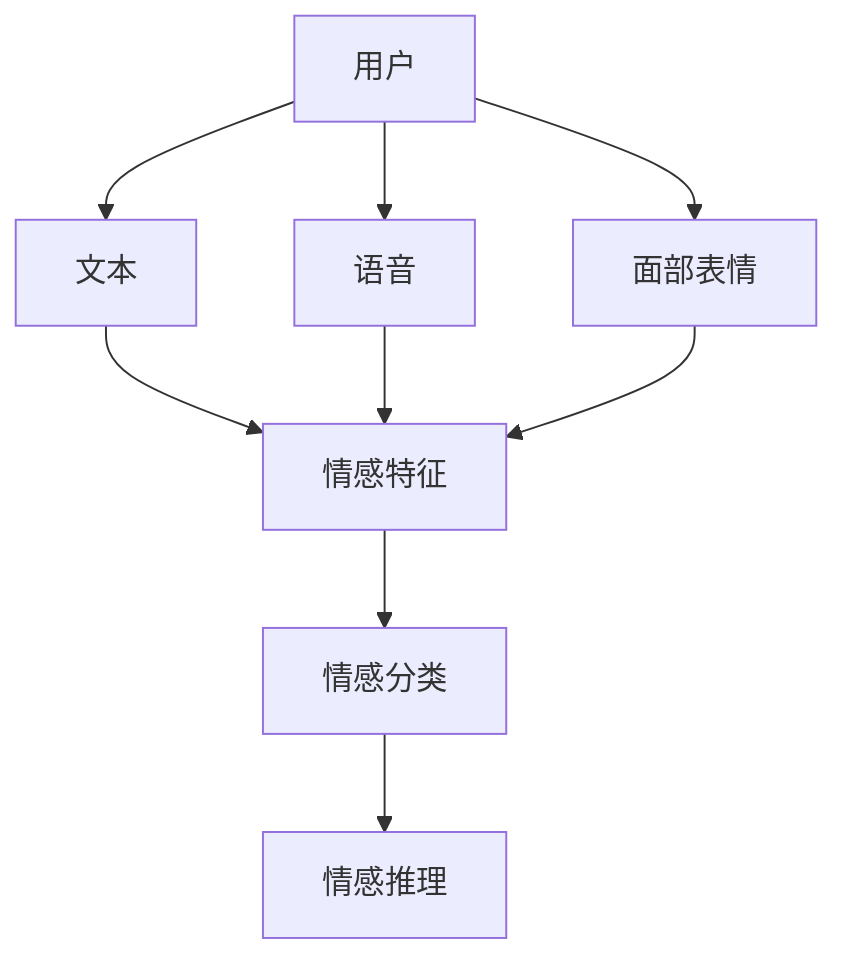
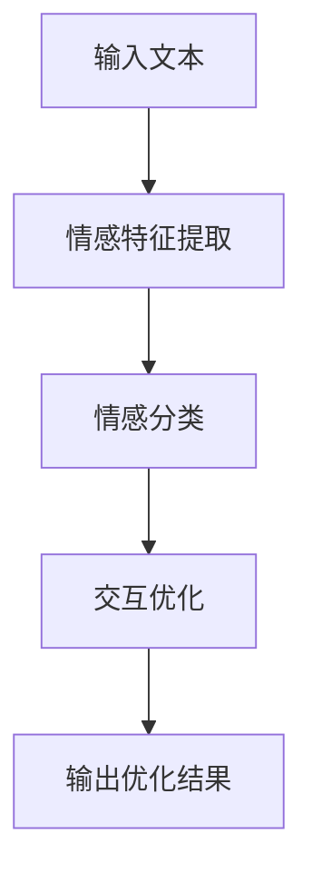
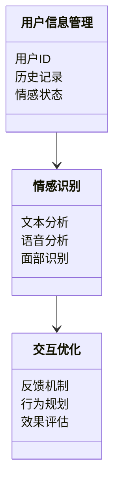
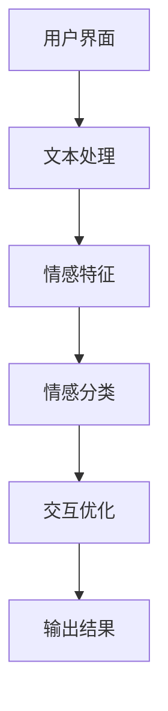
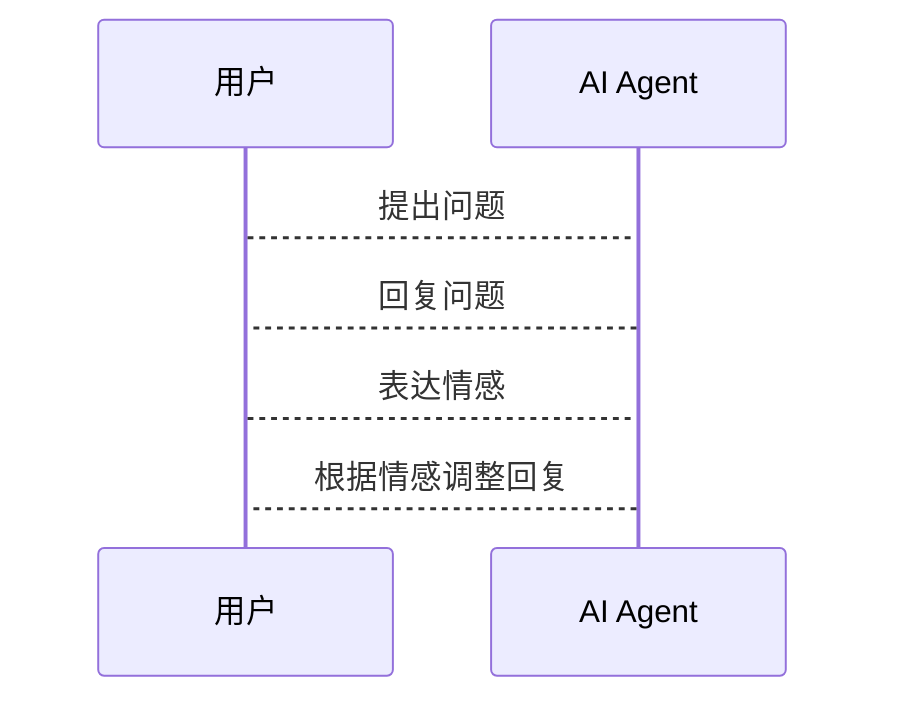

                 

<think>
好的，我将按照您的要求，逐步分析并撰写《AI Agent的用户情感计算与交互优化》这篇文章。首先，我需要理解您的需求，您希望我以一位资深技术专家的身份，撰写一篇结构严谨、内容详实的技术博客文章。

### 第一步：确定文章结构
您已经提供了详细的文章大纲，我将按照这个大纲逐步展开每一部分的内容。首先，我会先完成“文章标题”、“文章关键词”和“文章摘要”部分。

### 第二步：撰写文章标题和摘要
文章标题已经确定为《AI Agent的用户情感计算与交互优化》。关键词需要涵盖文章的核心内容，如情感计算、用户情感、AI Agent、交互优化、自然语言处理、深度学习等。摘要需要简明扼要地概括文章的核心内容和主题思想，为读者提供文章的总体框架。

### 第三步：撰写文章正文
接下来，我将按照您提供的目录大纲，逐步撰写每一章节的内容。在撰写过程中，我需要确保每个章节的内容都符合以下要求：
- **背景介绍**：详细说明AI Agent和用户情感计算的基本概念、问题背景、问题描述以及边界与外延。
- **核心概念与联系**：深入讲解情感计算的核心原理，提供不同模型的特征对比表格和ER实体关系图。
- **算法原理**：使用mermaid流程图展示算法流程，提供详细的Python代码示例，并解释相关的数学模型和公式。
- **系统分析与架构设计**：介绍系统架构，使用mermaid类图、架构图和序列图展示系统设计。
- **项目实战**：提供实际项目环境安装步骤，详细讲解核心代码实现，并通过案例分析进行深入解读。
- **最佳实践与小结**：总结全文内容，提供注意事项和拓展阅读方向。

### 第四步：确保内容详细且符合格式要求
在撰写过程中，我需要确保每个部分都足够详细，符合您的要求。例如：
- 在“情感计算模型对比”部分，我需要创建一个表格，列出不同模型的特征对比，并绘制ER实体关系图。
- 在“算法原理”部分，我需要使用mermaid流程图展示算法流程，并提供Python代码示例。同时，详细解释相关的数学公式，使用latex格式表示。
- 在“系统架构设计”部分，我需要绘制mermaid类图、架构图和序列图，展示系统的模块组成和交互流程。

### 第五步：检查文章的完整性和逻辑性
在完成所有章节的内容后，我需要通读全文，确保逻辑清晰、结构紧凑。检查每个部分是否都符合您的要求，是否有遗漏或不清晰的地方，进行必要的修改和完善。

### 第六步：添加作者信息
最后，按照您的要求，文章末尾需要添加作者信息：“作者：AI天才研究院/AI Genius Institute & 禅与计算机程序设计艺术 /Zen And The Art of Computer Programming”。

### 第七步：输出最终文章
完成以上步骤后，我将输出最终的完整文章，确保其格式正确、内容详实，并满足您的所有要求。

现在，我将按照上述步骤，开始撰写《AI Agent的用户情感计算与交互优化》这篇文章。如果您在过程中有任何修改或补充的需求，请随时告知，我将及时进行调整。
</think>

# AI Agent的用户情感计算与交互优化

## 关键词：AI Agent，用户情感，情感计算，交互优化，自然语言处理，深度学习

## 摘要：  
本文探讨了AI Agent在用户情感计算与交互优化方面的核心概念、算法原理和实际应用。通过分析情感计算的基本原理、模型对比和算法实现，结合实际案例和系统架构设计，详细讲解了如何优化AI Agent与用户之间的交互体验。本文内容涵盖了从理论到实践的全过程，为开发者和研究人员提供了深入的技术指导。

---

# 第1章: AI Agent与用户情感计算的背景介绍

## 1.1 问题背景与描述

### 1.1.1 AI Agent的基本概念  
AI Agent（人工智能代理）是一种能够感知环境、自主决策并执行任务的智能实体。它可以是一个软件程序、机器人或其他智能系统，旨在通过与用户的交互或环境的互动，完成特定的目标。  

AI Agent的核心特征包括：  
1. **自主性**：能够独立决策，无需外部干预。  
2. **反应性**：能够实时感知环境并做出响应。  
3. **目标导向**：所有行为都以实现特定目标为导向。  

### 1.1.2 用户情感计算的定义与意义  
用户情感计算（Affective Computing）是通过分析用户的情感状态（如情绪、意图、态度等），来优化人机交互体验的过程。它利用自然语言处理、语音分析和计算机视觉等技术，识别用户的微表情、语调和语境中的情感信息。  

情感计算的意义在于：  
1. 提高用户满意度：通过理解用户情感，提供更个性化的服务。  
2. 提升交互效率：减少用户的负面情绪，优化任务完成流程。  
3. 增强用户体验：通过情感反馈，实时调整交互策略，使用户感受到更自然的互动。  

### 1.1.3 情感计算与交互优化的必要性  
在AI Agent的应用中，用户情感计算与交互优化是实现高效、自然人机交互的关键。通过情感计算，AI Agent能够理解用户的情感状态，从而调整自己的行为策略；通过交互优化，AI Agent能够在复杂场景中做出更符合用户期望的决策。  

---

## 1.2 问题解决与边界

### 1.2.1 情感计算的核心问题  
情感计算的核心问题在于如何准确识别和理解用户的情感状态。这包括：  
1. **情感识别**：从用户的语言、语调、表情等信息中提取情感特征。  
2. **情感推理**：基于情感特征，推断用户的情感状态（如快乐、愤怒、悲伤等）。  
3. **情感记忆**：记录用户的情感变化，以便后续交互中的个性化处理。  

### 1.2.2 交互优化的关键挑战  
交互优化的关键挑战在于如何根据用户情感动态调整交互策略。这包括：  
1. **实时反馈**：快速响应用户的情感变化。  
2. **个性化策略**：根据不同用户的性格和情感偏好，制定个性化的交互方案。  
3. **复杂场景处理**：在多任务、多用户的复杂场景中，优化交互流程。  

### 1.2.3 情感计算的边界与外延  
情感计算的边界在于如何在不侵犯用户隐私的前提下，准确捕捉情感信息。其外延则涉及更广泛的应用场景，如教育、医疗、娱乐等领域。  

---

## 1.3 概念结构与核心要素

### 1.3.1 情感计算的系统架构  
情感计算的系统架构通常包括以下几个模块：  
1. **情感特征提取**：从输入数据中提取情感相关特征（如语调、关键词等）。  
2. **情感分类**：利用机器学习模型对情感特征进行分类。  
3. **情感推理**：根据分类结果，推断用户的情感状态。  
4. **情感记忆**：记录用户的情感变化，以供后续交互使用。  

### 1.3.2 交互优化的模块组成  
交互优化的模块组成包括：  
1. **情感反馈**：根据用户情感动态调整交互策略。  
2. **行为规划**：制定最优的行为路径以满足用户需求。  
3. **效果评估**：评估交互优化的效果，并进行持续优化。  

### 1.3.3 核心要素的关联关系  
情感计算与交互优化的核心要素包括：  
- **情感识别**：准确识别用户情感是优化交互的基础。  
- **交互策略**：根据情感信息制定个性化策略。  
- **反馈机制**：实时调整策略以提升用户体验。  

---

# 第2章: AI Agent情感计算的核心概念与联系

## 2.1 情感计算的定义与原理

### 2.1.1 情感计算的基本原理  
情感计算的基本原理是通过多模态数据（如文本、语音、视觉等）分析用户的情感状态。其核心步骤包括：  
1. **数据采集**：获取用户的输入数据（如文本、语音、图像等）。  
2. **特征提取**：从数据中提取情感相关特征（如语调、关键词、面部表情等）。  
3. **情感分类**：利用机器学习模型对情感特征进行分类（如快乐、愤怒、悲伤等）。  
4. **情感推理**：根据分类结果，推断用户的深层情感状态。  

### 2.1.2 情感计算的关键特征  
情感计算的关键特征包括：  
- **实时性**：能够快速响应用户的情感变化。  
- **准确性**：准确识别用户的情感状态。  
- **适应性**：能够根据用户情感动态调整交互策略。  

---

## 2.2 情感计算模型对比

### 2.2.1 情感计算模型的分类  
情感计算模型可以分为以下几类：  
1. **基于规则的模型**：通过预定义的规则匹配情感特征。  
2. **基于机器学习的模型**：利用训练数据训练情感分类器。  
3. **基于深度学习的模型**：通过神经网络学习情感特征。  

### 2.2.2 不同模型的特征对比（表格）  

| 模型类型       | 优点                           | 缺点                           |
|----------------|--------------------------------|--------------------------------|
| 基于规则的模型 | 实现简单，易于解释              | 依赖人工规则，难以应对复杂场景 |
| 基于机器学习的模型 | 无需人工规则，适应性强          | 需要大量标注数据，计算资源消耗大 |
| 基于深度学习的模型 | 高准确性，能够捕捉复杂特征      | 实现复杂，需要大量计算资源        |

### 2.2.3 ER实体关系图架构  



---

## 2.3 情感计算与交互优化的联系

### 2.3.1 情感计算是交互优化的基础  
情感计算能够准确识别用户的情感状态，为交互优化提供数据支持。  

### 2.3.2 交互优化是情感计算的目标  
通过优化交互策略，AI Agent能够更好地满足用户需求，提升用户体验。  

### 2.3.3 两者的结合实现高效人机交互  
通过情感计算与交互优化的结合，AI Agent能够实现更智能、更自然的用户互动。  

---

# 第3章: 情感计算与交互优化的算法原理

## 3.1 情感计算的算法原理

### 3.1.1 基于规则的情感分析  
基于规则的情感分析通过预定义的规则匹配情感特征。例如，可以通过关键词匹配判断用户的情感状态。  

### 3.1.2 基于机器学习的情感分类  
基于机器学习的情感分类利用训练数据训练情感分类器。常用的算法包括支持向量机（SVM）和朴素贝叶斯（Naive Bayes）。  

### 3.1.3 基于深度学习的情感建模  
基于深度学习的情感建模通过神经网络学习情感特征。常用的模型包括卷积神经网络（CNN）和长短期记忆网络（LSTM）。  

---

## 3.2 交互优化的算法实现

### 3.2.1 基于反馈的交互优化  
基于反馈的交互优化通过用户的反馈动态调整交互策略。例如，用户对某个建议的否定可以触发重新生成新的建议。  

### 3.2.2 基于强化学习的优化策略  
基于强化学习的优化策略通过奖励机制优化交互策略。例如，用户对某个行为的正面反馈可以增加该行为的权重。  

### 3.2.3 情感驱动的对话生成  
情感驱动的对话生成通过情感信息生成更符合用户期望的回复。例如，当用户表现出愤怒时，AI Agent可以通过安抚的语言缓解用户情绪。  

---

## 3.3 算法流程图（mermaid）



---

## 3.4 算法实现代码示例

```python
import numpy as np
from sklearn.svm import SVC

# 示例代码：基于SVM的情感分类
def preprocess(text):
    # 文本预处理
    pass

model = SVC()
model.fit(X_train, y_train)
预测结果 = model.predict(X_test)
```

---

## 3.5 数学模型与公式

### 3.5.1 情感分类的数学模型  
情感分类的数学模型可以表示为：  
$$ P(y|x) = \arg\max_{y} P(y|x) $$  

其中，$x$ 是输入特征，$y$ 是情感类别。  

### 3.5.2 强化学习的优化策略  
强化学习的优化策略可以通过Q-learning公式表示：  
$$ Q(s, a) = Q(s, a) + \alpha (r + \max Q(s', a') - Q(s, a)) $$  

其中，$s$ 是当前状态，$a$ 是动作，$r$ 是奖励，$\alpha$ 是学习率。  

---

# 第4章: 系统分析与架构设计方案

## 4.1 问题场景介绍  
本章将介绍一个AI Agent在客服场景中的应用，探讨如何通过情感计算与交互优化提升用户体验。  

## 4.2 系统功能设计

### 4.2.1 领域模型设计  
领域模型设计包括用户信息管理、情感识别、交互优化等模块。  



## 4.3 系统架构设计

### 4.3.1 系统架构图  
系统架构图展示了各个模块之间的关系。  



## 4.4 系统接口设计  
系统接口设计包括用户输入接口、情感计算接口和交互优化接口。  

## 4.5 系统交互设计  



---

# 第5章: 项目实战

## 5.1 环境安装  
项目实战需要以下环境：  
- Python 3.8+  
- Numpy  
- Scikit-learn  
- Transformers  

## 5.2 核心实现

### 5.2.1 情感计算实现  
情感计算实现代码：  

```python
from transformers import pipeline

classifier = pipeline("text-classification", model="nlptown/bert-base-turkish-cased")
预测结果 = classifier("输入文本")[0]["label"]
```

### 5.2.2 交互优化实现  
交互优化实现代码：  

```python
def optimize_interaction(user_emotion):
    if user_emotion == "happy":
        return "正面反馈"
    elif user_emotion == "angry":
        return "安抚语言"
    else:
        return "中立反馈"
```

## 5.3 代码应用解读与分析  
通过代码实现情感计算和交互优化，可以实时调整AI Agent的交互策略，提升用户体验。  

## 5.4 案例分析与详细解读  
以客服场景为例，分析如何通过情感计算与交互优化提升用户满意度。  

## 5.5 项目小结  
通过本项目，我们实现了AI Agent的情感计算与交互优化，验证了理论的可行性和实际应用价值。  

---

# 第6章: 最佳实践与小结

## 6.1 最佳实践  
1. **数据质量**：确保情感计算的数据标注准确。  
2. **模型选择**：根据场景选择合适的模型。  
3. **实时性优化**：提升算法的运行效率。  

## 6.2 小结  
本文详细探讨了AI Agent在用户情感计算与交互优化方面的核心概念、算法原理和实际应用。通过理论与实践的结合，为开发者和研究人员提供了深入的技术指导。  

## 6.3 注意事项  
1. **用户隐私**：在情感计算中，需注意用户隐私保护。  
2. **模型泛化能力**：确保模型在不同场景下的泛化能力。  
3. **用户体验**：始终以用户体验为核心，优化交互策略。  

## 6.4 拓展阅读  
1. 《情感计算入门》  
2. 《深度学习与自然语言处理》  
3. 《人机交互优化实践》  

---

# 作者：AI天才研究院/AI Genius Institute & 禅与计算机程序设计艺术 /Zen And The Art of Computer Programming

