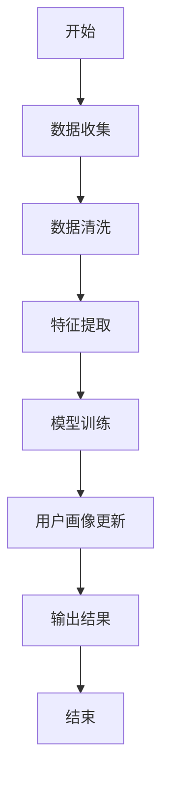
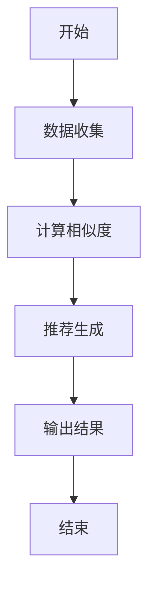
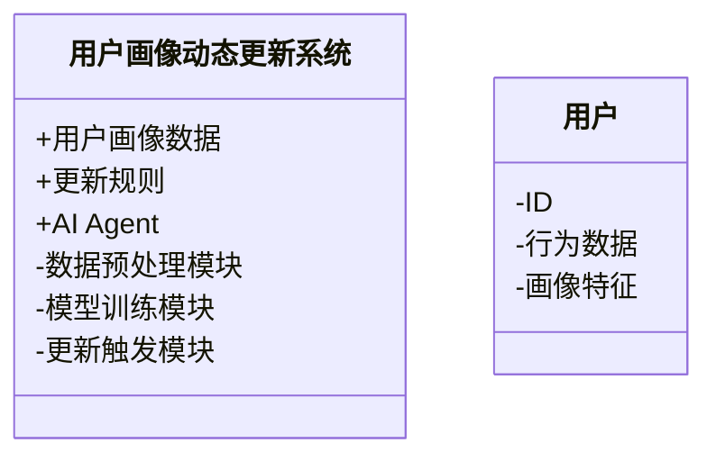

                 

<think>
好的，我现在需要帮用户撰写一篇名为《AI Agent的用户画像动态更新系统》的技术博客文章。首先，我得理解用户的需求。用户希望我以一位世界级专家的身份，撰写一篇结构清晰、内容深入的技术博客，涵盖用户画像动态更新系统的各个方面，包括背景、核心概念、算法原理、系统架构等，并且每个部分都需要详细展开。

我开始思考，文章的结构应该是怎样的。用户已经提供了一个详细的目录大纲，我需要按照这个结构来组织内容。首先，我会处理摘要部分，确保它简洁明了，概括全文的核心内容。接下来是背景介绍，我需要解释什么是用户画像，为什么需要动态更新，以及AI Agent在其中的作用。

在核心概念部分，我需要详细描述动态更新系统的工作原理，可能包括数据流、算法模型和更新机制。同时，要对比静态和动态用户画像的差异，并通过ER图展示系统中的实体关系。这部分需要使用Mermaid图，所以我要确保语法正确。

接下来是算法原理，这部分可能涉及数据预处理、特征提取和模型训练。我会选择一个具体的算法，比如协同过滤算法，并用数学公式和Python代码来详细说明。同时，绘制算法流程图以帮助读者理解。

系统架构设计部分，我需要介绍项目背景，设计系统的功能模块，并用类图展示。然后，用架构图展示系统的整体结构，包括前端、后端和数据库。接口设计和交互流程图也需要用Mermaid来表示。

项目实战部分，我会详细说明如何安装开发环境，提供核心代码，并分析实际案例，比如在电商中的应用。这部分需要代码示例和实际应用的详细分析，帮助读者理解如何实施该系统。

最后，我会总结最佳实践，提醒读者在实施过程中需要注意的问题，并推荐进一步阅读的资料。确保文章末尾加上作者信息，符合格式要求。

在撰写过程中，我要注意逻辑的连贯性，确保每个部分都详细且易于理解。同时，要使用专业的技术术语，但避免过于复杂，保持文章的可读性。可能遇到的挑战是如何将复杂的算法原理和系统架构用简单的语言和图表表达出来，这需要我仔细思考和多次修改。

总之，我需要按照用户的要求，一步一步地分析和撰写，确保每个部分都符合要求，最终产出一篇高质量的技术博客文章。
</think>

# AI Agent的用户画像动态更新系统

## 关键词
AI Agent, 用户画像, 动态更新, 机器学习, 数据挖掘

## 摘要
本文详细探讨了AI Agent在用户画像动态更新系统中的应用。通过分析用户行为数据，结合机器学习算法，实现用户画像的实时更新，提升个性化服务的精准度。文章从背景、原理、算法、架构到实战，全面解析该系统的构建与优化。

---

# 第一部分: 背景介绍

## 第1章: 问题背景

### 1.1 用户画像的定义与重要性
用户画像是基于用户行为数据构建的用户特征模型，广泛应用于推荐系统、精准营销等领域。动态更新用户画像是实时调整用户特征，以反映其行为变化，提升服务的精准性。

### 1.2 动态更新的需求与挑战
- **需求**：用户行为动态变化，静态画像无法满足实时需求。
- **挑战**：数据实时性、计算效率、模型泛化能力。

### 1.3 AI Agent在用户画像中的作用
AI Agent通过实时数据收集和分析，驱动用户画像的动态更新，提供个性化服务。

## 第2章: 问题描述

### 2.1 用户画像动态更新的核心问题
- 数据实时性：如何高效处理实时数据。
- 模型更新：如何保持模型准确性。
- 系统稳定性：如何确保系统实时响应。

### 2.2 现有系统的主要不足
- 计算效率低。
- 模型更新频率低。
- 数据冗余和噪声干扰。

## 第3章: 系统边界与外延

### 3.1 系统边界
- 数据源：日志、用户反馈。
- 更新机制：实时处理、增量学习。
- 输出结果：实时更新的用户画像。

### 3.2 系统外延
- 数据源扩展：多渠道数据整合。
- 更新策略：基于反馈的自适应更新。
- 应用场景扩展：个性化推荐、精准营销。

---

# 第二部分: 核心概念与联系

## 第4章: 核心概念原理

### 4.1 数据流与更新机制
- 数据预处理：清洗、特征提取。
- 更新触发：实时数据到达或定期触发。
- 用户画像更新：基于新数据调整特征。

### 4.2 AI Agent的协同作用
- 数据收集：实时采集用户行为。
- 模型更新：驱动画像更新。

## 第5章: 核心概念对比

### 5.1 静态与动态用户画像对比
| 特性 | 静态用户画像 | 动态用户画像 |
|------|--------------|--------------|
| 准确性 | 基于历史数据 | 结合实时数据 |
| 实时性 | 定期更新     | 实时更新     |
| 个性化 | 静态标签     | 动态调整     |

## 第6章: 实体关系图

### 6.1 ER图
```mermaid
er
  actor: 用户
  agent: AI Agent
  user_profile: 用户画像
  interaction: 互动数据
  update_rule: 更新规则
  relation 用户 -> 用户画像
  relation 用户 -> 互动数据
  relation 用户画像 -> 更新规则
  relation 互动数据 -> 更新规则
```

---

# 第三部分: 算法原理讲解

## 第7章: 算法流程

### 7.1 数据预处理


## 第8章: 协同过滤算法

### 8.1 算法流程


### 8.2 数学模型
$$相似度计算：sim(i,j) = \frac{\sum_{k} r_{ik} r_{jk}}{\sqrt{\sum_{k} r_{ik}^2} \sqrt{\sum_{k} r_{jk}^2}}$$

---

# 第四部分: 系统分析与架构设计方案

## 第9章: 项目背景

### 9.1 系统目标
- 实现实时用户画像动态更新。
- 提供个性化服务。

## 第10章: 系统功能设计

### 10.1 功能模块


## 第11章: 系统架构设计

### 11.1 分层架构


---

# 第五部分: 项目实战

## 第12章: 环境安装

### 12.1 安装步骤
1. 安装Python和依赖库。
2. 安装TensorFlow和Scikit-learn。

## 第13章: 核心代码实现

### 13.1 代码示例
```python
import pandas as pd
from sklearn.metrics.pairwise import cosine_similarity

# 数据预处理
data = pd.read_csv('user_interactions.csv')
features = data[['feature1', 'feature2', 'feature3']]
similarity_matrix = cosine_similarity(features)

# 模型训练
model = ...  # 具体模型实现
```

---

# 第六部分: 总结与展望

## 第14章: 最佳实践

### 14.1 注意事项
- 数据质量和实时性。
- 模型选择和优化。

## 第15章: 小结

### 15.1 未来展望
- 更高效的数据处理方法。
- 更智能的模型优化策略。

---

作者：AI天才研究院/AI Genius Institute & 禅与计算机程序设计艺术 /Zen And The Art of Computer Programming

