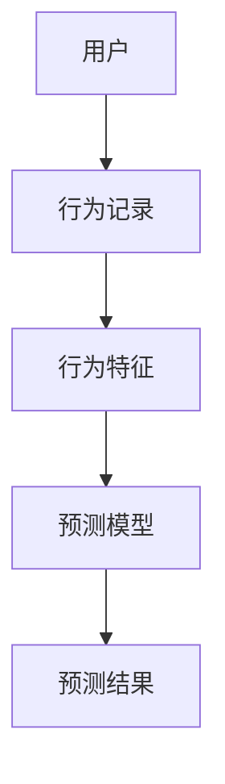
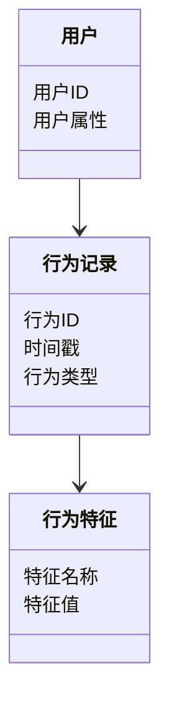
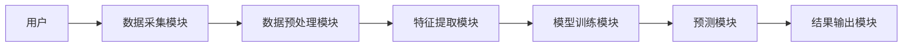
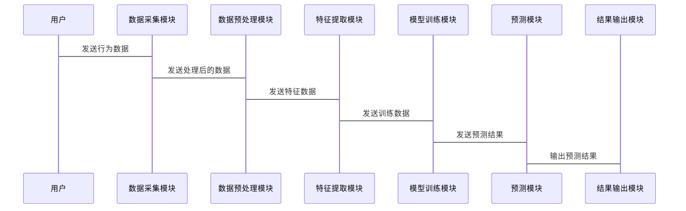

                 


# AI Agent的用户行为分析与预测系统

## 关键词：AI Agent, 用户行为分析, 预测系统, 协同过滤, 深度学习, 系统架构

## 摘要：  
本文深入探讨了AI Agent在用户行为分析与预测系统中的应用，从背景介绍、核心概念到算法原理、系统架构设计，再到项目实战，全面分析了AI Agent如何通过协同过滤、基于内容的推荐和深度学习模型实现用户行为预测。文章通过详细的数学公式、代码示例和系统架构图，帮助读者理解AI Agent在用户行为分析中的工作原理和实际应用，为构建高效的用户行为预测系统提供了理论和实践指导。

---

# 第一部分: AI Agent的用户行为分析与预测系统概述

# 第1章: 问题背景与概念介绍

## 1.1 问题背景

### 1.1.1 用户行为分析的重要性  
在当今数据驱动的时代，用户行为分析是理解用户需求、优化产品体验和提升商业决策的关键。通过分析用户的行为数据，企业可以更好地理解用户偏好，从而提供个性化服务，提高用户满意度和忠诚度。

### 1.1.2 AI Agent在用户行为分析中的作用  
AI Agent（智能代理）通过自动化地收集、分析和预测用户行为数据，能够实时响应用户需求，提供个性化的服务。AI Agent不仅能够处理大量数据，还能通过机器学习算法不断优化预测模型，提升预测的准确性。

### 1.1.3 当前用户行为分析的挑战  
随着用户数据量的爆炸式增长，传统的基于规则的分析方法已经难以满足需求。如何从海量数据中提取有价值的信息，如何实时预测用户行为，以及如何确保预测的准确性是当前用户行为分析的主要挑战。

## 1.2 问题描述

### 1.2.1 用户行为分析的核心问题  
用户行为分析的核心问题是如何从用户行为数据中提取模式，预测用户的下一步行为，并根据预测结果提供相应的服务。这涉及到数据的采集、处理、建模和预测等多个环节。

### 1.2.2 AI Agent如何解决这些问题  
AI Agent通过自动化地处理数据，利用机器学习算法进行建模和预测，能够实时响应用户行为的变化，提供个性化的服务。AI Agent的优势在于其智能化和自动化，能够处理复杂的数据和模型。

### 1.2.3 系统边界与外延  
AI Agent用户行为分析与预测系统的边界包括数据输入、模型训练和预测输出。系统外延包括数据存储、模型优化和结果反馈。

## 1.3 核心概念与系统结构

### 1.3.1 AI Agent的基本概念  
AI Agent是一种能够感知环境、执行任务并做出决策的智能实体。在用户行为分析中，AI Agent通过收集和分析用户数据，预测用户的下一步行为。

### 1.3.2 用户行为分析的流程  
用户行为分析的流程包括数据采集、数据预处理、特征提取、模型训练、预测和结果分析。

### 1.3.3 系统核心要素与组成  
系统核心要素包括数据源、数据处理模块、特征提取模块、模型训练模块和预测模块。这些模块共同构成了AI Agent用户行为分析与预测系统的核心结构。

---

# 第二部分: AI Agent的核心概念与原理

# 第2章: AI Agent的核心原理

## 2.1 AI Agent的工作原理

### 2.1.1 信息收集与处理  
AI Agent通过传感器、日志记录等方式收集用户行为数据，并进行预处理和特征提取。

### 2.1.2 行为建模与预测  
AI Agent利用机器学习算法对用户行为进行建模，并基于模型预测用户的下一步行为。

### 2.1.3 结果反馈与优化  
AI Agent根据预测结果提供反馈，并根据用户实际行为优化预测模型，提升预测准确性。

## 2.2 核心概念对比表

| 模型类型       | 基于用户的协同过滤 | 基于物品的协同过滤 | 基于深度学习的模型 |
|----------------|------------------|------------------|------------------|
| 数据输入       | 用户-物品交互矩阵 | 用户-物品交互矩阵 | 用户行为序列       |
| 建模方法       | 用户相似度计算   | 物品相似度计算   | 神经网络结构       |
| 优点           | 高度个性化       | 高度个性化       | 高精度           |
| 缺点           | 计算复杂度高     | 计算复杂度高     | 需要大量数据       |

## 2.3 ER实体关系图



---

# 第三部分: 用户行为分析与预测的算法原理

# 第3章: 基于协同过滤的推荐算法

## 3.1 算法原理

### 3.1.1 协同过滤的基本概念  
协同过滤是一种基于用户相似度或物品相似度的推荐算法。通过计算用户之间的相似度，或者物品之间的相似度，推荐用户可能感兴趣的内容。

### 3.1.2 基于用户的协同过滤  
基于用户的协同过滤算法通过计算用户之间的相似度，推荐用户可能感兴趣的内容。例如，如果用户A和用户B的相似度很高，那么用户A可能喜欢的内容也会推荐给用户B。

### 3.1.3 基于物品的协同过滤  
基于物品的协同过滤算法通过计算物品之间的相似度，推荐用户可能感兴趣的内容。例如，如果用户A喜欢物品X，那么可能会推荐与物品X相似的物品Y给用户A。

## 3.2 算法实现

### 3.2.1 基于用户的协同过滤算法实现

```python
def user_based_recommendation(users, items, ratings, k=5):
    # 计算用户相似度
    user_similarity = compute_user_similarity(users, items, ratings)
    # 找到与当前用户的最相似的k个用户
    similar_users = get_top_k_users(user_similarity, k)
    # 推荐用户喜欢的物品
    recommendations = []
    for user in similar_users:
        recommendations.extend(items[user])
    return recommendations
```

### 3.2.2 基于物品的协同过滤算法实现

```python
def item_based_recommendation(users, items, ratings, k=5):
    # 计算物品相似度
    item_similarity = compute_item_similarity(users, items, ratings)
    # 找到与当前物品最相似的k个物品
    similar_items = get_top_k_items(item_similarity, k)
    # 推荐用户喜欢的物品
    recommendations = []
    for item in similar_items:
        recommendations.append(item)
    return recommendations
```

## 3.3 算法数学模型

### 3.3.1 基于用户的协同过滤数学模型

$$ \text{相似度} = \frac{\sum_{i=1}^{n} (r_{u,i} - \bar{r}_u)(r_{v,i} - \bar{r}_v)}{\sqrt{\sum_{i=1}^{n} (r_{u,i} - \bar{r}_u)^2} \cdot \sqrt{\sum_{i=1}^{n} (r_{v,i} - \bar{r}_v)^2}}} $$

### 3.3.2 基于物品的协同过滤数学模型

$$ \text{相似度} = \frac{\sum_{u=1}^{m} (r_{u,i} - \bar{r}_i)(r_{u,j} - \bar{r}_j)}{\sqrt{\sum_{u=1}^{m} (r_{u,i} - \bar{r}_i)^2} \cdot \sqrt{\sum_{u=1}^{m} (r_{u,j} - \bar{r}_j)^2}}} $$

---

# 第四部分: 系统分析与架构设计

# 第4章: 系统分析与架构设计

## 4.1 系统功能设计

### 4.1.1 领域模型



### 4.1.2 系统架构设计



## 4.2 系统接口设计

### 4.2.1 数据输入接口  
API接口：`POST /api/v1/data`

### 4.2.2 数据输出接口  
API接口：`GET /api/v1/predictions`

## 4.3 系统交互流程



---

# 第五部分: 项目实战

# 第5章: 项目实战

## 5.1 环境安装

### 5.1.1 安装Python环境  
```bash
python --version
pip install numpy scikit-learn
```

## 5.2 系统核心实现

### 5.2.1 数据预处理代码

```python
import pandas as pd
import numpy as np

# 数据预处理
def preprocess_data(data):
    # 删除缺失值
    data.dropna(inplace=True)
    # 标准化处理
    from sklearn.preprocessing import StandardScaler
    scaler = StandardScaler()
    data[['age', 'salary']] = scaler.fit_transform(data[['age', 'salary']])
    return data
```

### 5.2.2 模型训练代码

```python
from sklearn.neighbors import NearestNeighbors

# 基于用户的协同过滤模型
def train_user_based_model(data, n_neighbors=5):
    model = NearestNeighbors(n_neighbors=n_neighbors)
    model.fit(data)
    return model
```

## 5.3 实际案例分析

### 5.3.1 案例背景  
假设我们有一个电商网站，需要根据用户的购买历史推荐商品。

### 5.3.2 数据分析  
通过分析用户的购买记录，提取用户的购买行为特征。

### 5.3.3 模型训练与预测  
使用基于用户的协同过滤模型，预测用户可能购买的商品。

## 5.4 项目小结  
通过项目实战，我们掌握了AI Agent用户行为分析与预测系统的实现方法，能够根据实际需求选择合适的算法和模型，实现高效的用户行为预测。

---

# 第六部分: 总结与展望

# 第6章: 总结与展望

## 6.1 最佳实践 tips

### 6.1.1 数据预处理的重要性  
确保数据的准确性和完整性，是模型训练的基础。

### 6.1.2 模型优化技巧  
通过交叉验证和超参数调优，可以提升模型的预测精度。

## 6.2 小结  
本文详细介绍了AI Agent用户行为分析与预测系统的实现过程，从背景介绍到算法实现，再到系统设计和项目实战，为读者提供了全面的指导。

## 6.3 注意事项

### 6.3.1 数据隐私问题  
在处理用户数据时，必须遵守相关法律法规，保护用户隐私。

### 6.3.2 模型泛化能力  
在实际应用中，需要注意模型的泛化能力，避免过拟合。

## 6.4 拓展阅读  
推荐读者阅读《机器学习实战》和《深度学习入门》等相关书籍，进一步深入学习AI Agent的相关知识。

---

# 作者：AI天才研究院/AI Genius Institute & 禅与计算机程序设计艺术 /Zen And The Art of Computer Programming

