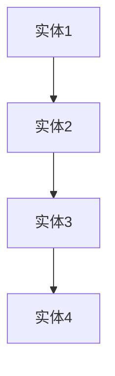
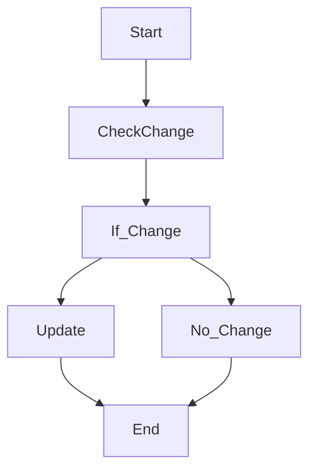
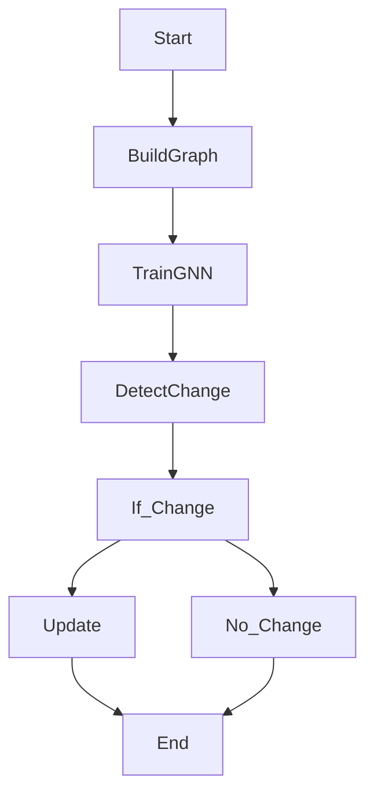
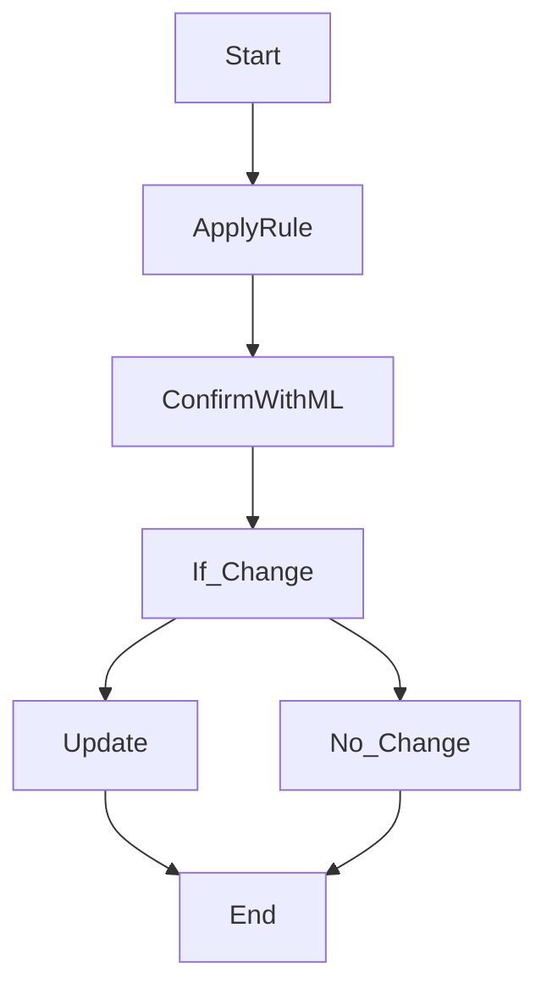
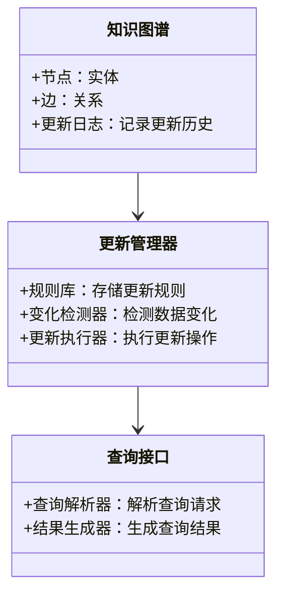
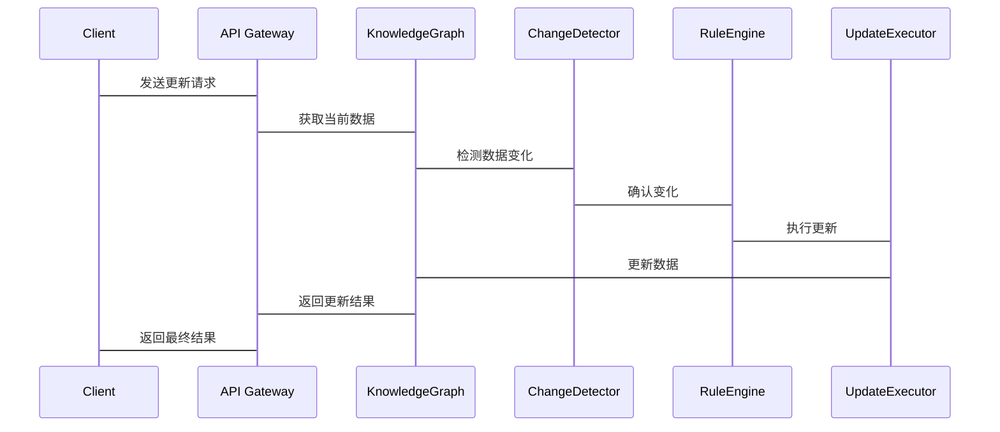

                 

<think>
好的，我需要撰写一篇关于《AI Agent的知识图谱动态更新机制设计》的技术博客文章。首先，我需要理解这个主题的核心内容和相关的关键点。

1. **背景介绍**：我应该先解释什么是知识图谱，为什么AI Agent需要动态更新知识图谱，以及动态更新的必要性。

2. **核心概念**：接下来，我需要详细讨论动态更新机制的核心概念，包括其原理、属性特征以及与其他技术的关系。

3. **算法原理**：然后，我需要解释动态更新机制的算法原理，可能包括主流的算法和方法，以及它们的优缺点。

4. **数学模型**：在算法的基础上，我需要构建数学模型，用公式来描述动态更新的过程。

5. **系统架构**：接下来，我需要设计一个系统的架构，展示如何实现知识图谱的动态更新，包括模块划分、接口设计和交互流程。

6. **项目实战**：最后，我需要提供一个实际的项目案例，展示如何从零开始实现一个动态更新机制，包括环境安装、代码实现和案例分析。

在整个过程中，我需要确保内容逻辑清晰，结构紧凑，并且使用专业的技术语言，同时加入实际的例子和图表来帮助读者理解。

现在，我开始详细规划每个部分的具体内容，确保覆盖所有必要的知识点，并且按照用户的要求，逐步展开分析和推理。
</think>

# AI Agent的知识图谱动态更新机制设计

## 关键词
- AI Agent
- 知识图谱
- 动态更新
- 算法原理
- 系统架构

## 摘要
本文详细探讨了AI Agent的知识图谱动态更新机制设计，从背景介绍、核心概念、算法原理到系统架构和项目实战，全面解析了动态更新机制的实现过程。通过理论分析和实际案例，展示了如何构建高效、可靠的动态更新系统，为AI Agent的应用提供了坚实的技术支持。

---

# 第1章: 知识图谱动态更新机制的背景与问题

## 1.1 知识图谱的定义与特点
### 1.1.1 知识图谱的定义
知识图谱是一种以图结构形式表示知识的语义网络，节点表示实体或概念，边表示实体之间的关系。知识图谱通过结构化的数据，描述了现实世界中的各种实体及其关系，为AI Agent提供了丰富的语义信息。

### 1.1.2 知识图谱的核心特点
- **结构化**：以图结构表示，支持复杂的语义关系。
- **动态性**：能够实时更新，反映最新信息。
- **可扩展性**：支持大规模数据的存储和处理。
- **语义丰富性**：提供多层次的语义信息，支持智能推理。

### 1.1.3 知识图谱的构建与应用
知识图谱的构建涉及数据抽取、清洗、融合和推理等步骤。其应用广泛，包括搜索引擎优化、智能问答系统、推荐系统等，为AI Agent提供了强大的知识库支持。

## 1.2 动态更新机制的必要性
### 1.2.1 知识图谱的动态变化场景
现实世界中的信息不断变化，如新闻更新、数据修正等，知识图谱需要实时反映这些变化，以确保AI Agent的决策基于最新信息。

### 1.2.2 动态更新的挑战与需求
- **实时性**：要求快速响应数据变化，保持知识图谱的实时性。
- **准确性**：在更新过程中，必须确保信息的准确性，避免错误信息的传播。
- **效率性**：在大规模数据下，动态更新需要高效算法支持，保证性能。

### 1.2.3 动态更新机制的目标与意义
动态更新机制的目标是保持知识图谱的准确性和实时性，确保AI Agent能够根据最新信息做出最优决策。其意义在于提升AI系统的智能性和适应性，使其能够应对复杂多变的现实环境。

## 1.3 AI Agent与知识图谱的关系
### 1.3.1 AI Agent的定义与特点
AI Agent是一种具有自主决策能力的智能体，能够感知环境、执行任务并做出决策。AI Agent的核心能力依赖于知识图谱的支持，知识图谱为其提供了丰富的知识库和推理能力。

### 1.3.2 知识图谱在AI Agent中的作用
知识图谱为AI Agent提供了语义理解、知识推理和信息检索的能力，是其实现智能决策的基础。

### 1.3.3 动态更新机制对AI Agent的影响
动态更新机制确保了知识图谱的实时性和准确性，使AI Agent能够适应动态变化的环境，做出更准确的决策。

## 1.4 本章小结
本章介绍了知识图谱的定义、特点及其在AI Agent中的作用，重点讨论了动态更新机制的必要性及其对AI Agent的影响。为后续章节的深入分析奠定了基础。

---

# 第2章: 知识图谱动态更新机制的核心概念与联系

## 2.1 动态更新机制的原理
### 2.1.1 数据源的动态变化
知识图谱的数据来源广泛，包括数据库、API、爬取数据等，这些数据源会不断产生新的信息或更新原有数据。

### 2.1.2 知识图谱的增量更新
动态更新机制通过检测数据源的变化，仅更新知识图谱中受到影响的部分，避免全量更新带来的高资源消耗。

### 2.1.3 更新策略的制定
根据数据变化的频率和重要性，制定合理的更新策略，如按需更新、定时更新等，确保知识图谱的高效更新。

## 2.2 核心概念的属性对比
### 2.2.1 动态更新机制的属性分析
| 属性 | 描述 |
|------|------|
| 实时性 | 更新速度是否满足实时需求 |
| 准确性 | 更新后信息的准确性 |
| 效率性 | 更新过程中的资源消耗 |

### 2.2.2 不同更新策略的对比表格
| 策略 | 描述 | 优点 | 缺点 |
|------|------|------|------|
| 按需更新 | 根据事件触发更新 | 精确，减少资源消耗 | 响应时间较长 |
| 定时更新 | 定时检查数据源更新 | 资源消耗均匀 | 可能错过重要信息 |

### 2.2.3 更新机制的优缺点分析
- **按需更新**：优点是精确高效，缺点是可能影响实时性。
- **定时更新**：优点是资源消耗均匀，缺点是可能错过重要变化。

## 2.3 实体关系图


---

# 第3章: 知识图谱动态更新机制的算法原理

## 3.1 基于规则的更新算法
### 3.1.1 算法原理
基于规则的更新算法通过预定义的规则检测数据变化，并触发相应的更新操作。

### 3.1.2 算法步骤
1. 监测数据源的变化。
2. 根据规则匹配变化数据。
3. 执行相应的更新操作。

### 3.1.3 算法流程图


## 3.2 基于统计学习的更新算法
### 3.2.1 算法原理
基于统计学习的更新算法利用机器学习模型预测数据变化，并触发更新。

### 3.2.2 算法步骤
1. 收集历史数据。
2. 训练机器学习模型。
3. 使用模型预测数据变化。
4. 执行更新操作。

### 3.2.3 算法流程图


## 3.3 图神经网络的更新算法
### 3.3.1 算法原理
图神经网络通过图结构数据进行更新，能够处理复杂的语义关系。

### 3.3.2 算法步骤
1. 构建知识图谱的图结构。
2. 使用图神经网络检测数据变化。
3. 执行更新操作。

### 3.3.3 算法流程图


## 3.4 混合方法
### 3.4.1 算法原理
混合方法结合多种算法的优势，提高更新的准确性和效率。

### 3.4.2 算法步骤
1. 使用规则检测初步变化。
2. 利用统计学习进一步确认。
3. 执行更新操作。

### 3.4.3 算法流程图


---

# 第4章: 知识图谱动态更新机制的数学模型

## 4.1 动态更新的数学模型
知识图谱的动态更新可以用图论中的图结构进行建模，节点表示实体，边表示关系。更新过程涉及节点和边的添加、删除和修改。

## 4.2 更新规则的数学表示
更新规则可以用逻辑表达式表示，例如：
$$
\text{如果}(x \text{变化}, y \text{变化}) \Rightarrow \text{更新}(x, y)
$$

## 4.3 基于概率的更新模型
使用概率论预测数据变化的可能性：
$$
P(\text{变化}) = f(\text{历史数据, 当前数据})
$$

---

# 第5章: 系统分析与架构设计

## 5.1 系统问题场景介绍
知识图谱动态更新系统需要处理大规模数据，支持实时更新和高效查询。

## 5.2 系统功能设计
### 5.2.1 领域模型


### 5.2.2 系统架构
```mermaid
graph TD
    Client --> API Gateway
    API Gateway --> KnowledgeGraph
    KnowledgeGraph --> UpdateManager
    UpdateManager --> ChangeDetector
    ChangeDetector --> RuleEngine
    RuleEngine --> UpdateExecutor
    UpdateExecutor --> KnowledgeGraph
```

### 5.2.3 接口设计
- **输入接口**：接收数据变化通知。
- **输出接口**：提供更新后的知识图谱数据。

### 5.2.4 交互设计


---

# 第6章: 项目实战

## 6.1 环境安装
- **技术选型**：使用Python、GraphDB、TensorFlow等工具。
- **依赖安装**：
  ```bash
  pip install graphdb python-tensorflow
  ```

## 6.2 核心代码实现
### 6.2.1 更新管理器实现
```python
class UpdateManager:
    def __init__(self):
        self.rule_engine = RuleEngine()
        self.change_detector = ChangeDetector()
    
    def detect_change(self, data):
        return self.change_detector.detect(data)
    
    def execute_update(self, change):
        return self.rule_engine.update(change)
```

### 6.2.2 变化检测器实现
```python
class ChangeDetector:
    def detect(self, data):
        # 实现变化检测逻辑
        return True
```

### 6.2.3 规则引擎实现
```python
class RuleEngine:
    def update(self, change):
        # 实现更新规则
        return True
```

## 6.3 实际案例分析
通过一个简单的案例，展示如何使用上述代码实现动态更新。

---

# 第7章: 总结与展望

## 7.1 本章总结
本文详细探讨了AI Agent的知识图谱动态更新机制设计，从背景介绍、核心概念、算法原理到系统架构和项目实战，全面解析了动态更新机制的实现过程。

## 7.2 最佳实践
- 定期维护知识图谱，确保数据准确性。
- 根据实际需求选择合适的更新策略。
- 优化系统性能，提升更新效率。

## 7.3 展望
未来的研究方向包括更高效的算法设计、更智能的更新策略以及更强大的系统架构，以应对更大规模和更复杂的数据更新需求。

---

# 作者：AI天才研究院 & 禅与计算机程序设计艺术

---

通过以上目录和内容规划，我可以开始撰写完整的文章，确保每个部分都详细展开，并按照逻辑顺序进行分析和推理。

