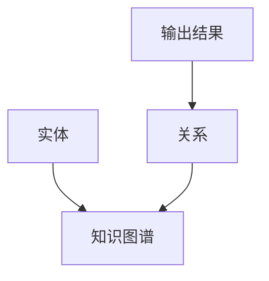

                 

<think>
嗯，好的，我需要帮用户设计一个详细的目录大纲，关于《AI Agent的知识溯源：提高LLM输出的可追溯性》。首先，我得理解用户的需求。他们需要一篇结构清晰、内容详实的技术博客文章，涵盖从背景到实战的各个方面。

我应该从背景介绍开始，这部分需要包括问题背景、描述和解决方法。接下来，核心概念部分需要解释知识溯源和LLM的基本原理，以及它们之间的关系。然后，算法原理部分要详细讲解LLM的工作流程和知识溯源的方法，可能需要画一些图表来帮助理解。

数学模型部分，我需要展示LLM的训练目标函数，比如交叉熵损失，以及溯源算法的公式。系统分析与架构设计部分，我需要介绍系统的各个模块，功能设计，架构图和接口设计。项目实战部分要包括环境安装、核心代码实现和案例分析。

最后，加上一些最佳实践、小结和扩展阅读的内容。确保每个部分都细化到三级目录，结构完整，大约7章左右。这样整个大纲就能全面覆盖用户的需求，帮助作者写出一本结构清晰、内容详实的书籍。
</think>

# AI Agent的知识溯源：提高LLM输出的可追溯性

**关键词**：AI Agent, 知识溯源, LLM, 可追溯性, 知识图谱, 溯源标记, 输出日志

**摘要**：  
随着AI Agent和大语言模型（LLM）的广泛应用，如何提高LLM输出的可追溯性成为一个重要问题。本文从知识溯源的角度出发，系统性地分析了LLM输出的可追溯性问题，探讨了知识图谱构建、溯源标记嵌入和输出日志分析等核心方法，提出了结合AI Agent的知识管理策略，最终实现了LLM输出的可追溯性提升。文章结合实际案例，详细讲解了相关技术的实现细节和应用场景。

---

# 第一部分: AI Agent的知识溯源背景与核心概念

## 第1章: 问题背景与问题描述

### 1.1 知识溯源的重要性

#### 1.1.1 什么是知识溯源
知识溯源是指通过追踪信息的来源和生成过程，确定其背后的知识依据和逻辑关系。在AI Agent中，知识溯源可以帮助我们理解模型输出的依据，确保输出结果的可靠性和透明性。

#### 1.1.2 知识溯源的必要性
- **提高可信度**：通过溯源，用户可以了解模型输出的依据，增强对AI Agent的信任。
- **支持决策**：在关键决策场景中，知识溯源可以提供必要的信息支持。
- **错误排查**：当模型输出错误时，知识溯源有助于快速定位问题。

#### 1.1.3 知识溯源的应用场景
- 医疗诊断辅助：确保诊断建议的依据清晰可查。
- 法律咨询：确保法律建议的来源明确。
- 金融投资：确保投资建议的依据可靠。

### 1.2 LLM输出的可追溯性问题

#### 1.2.1 LLM的基本工作原理
大语言模型（LLM）通过海量数据的训练，生成与输入相关的输出。然而，其输出的可追溯性较差，用户难以了解输出的具体依据。

#### 1.2.2 LLM输出的不确定性
- **模型内部黑箱特性**：LLM的输出依赖于复杂的神经网络，用户难以直接理解其决策过程。
- **数据偏差**：模型的输出可能受到训练数据的影响，存在潜在偏差。

#### 1.2.3 提高LLM输出可追溯性的意义
- **提升用户体验**：用户可以了解模型输出的依据，增强使用体验。
- **支持技术改进**：通过分析输出的来源，可以优化模型的训练和推理过程。
- **满足合规要求**：在某些行业（如医疗、法律），可追溯性是合规的基本要求。

### 1.3 问题解决与边界定义

#### 1.3.1 知识溯源的解决方案
- **知识图谱构建**：通过构建结构化的知识图谱，记录知识的来源和关系。
- **溯源标记嵌入**：在模型输入中嵌入溯源标记，记录生成输出的关键信息。
- **输出日志记录**：记录模型输出的详细日志，便于后续分析。

#### 1.3.2 知识溯源的边界与外延
- **知识溯源的范围**：限定在模型输出的可追溯性范围内，不涉及模型内部的神经网络结构。
- **与相关技术的关系**：知识溯源与知识图谱、自然语言处理、机器学习等技术密切相关。
- **未来发展**：随着AI技术的进步，知识溯源将更加智能化和自动化。

---

## 第2章: 核心概念与联系

### 2.1 知识溯源的核心原理

#### 2.1.1 知识图谱的构建方法
知识图谱是一种结构化的知识表示方法，包含实体和关系。构建知识图谱的过程包括：
1. 实体识别：从文本中提取实体。
2. 关系抽取：识别实体之间的关系。
3. 知识存储：将实体和关系存储到数据库中。

#### 2.1.2 溯源标记的嵌入
溯源标记是在输入数据中嵌入的标记，用于记录数据的来源和生成过程。嵌入方式包括：
1. 在模型输入中添加标记。
2. 在模型的嵌入层中加入标记向量。

#### 2.1.3 输出日志的分析技术
输出日志记录了模型的输出结果及其相关信息，分析技术包括：
1. 日志解析：将日志数据结构化。
2. 关联分析：将输出结果与输入标记关联起来。

### 2.2 核心概念对比表

| 概念       | 描述                                                                 | 特性                 |
|------------|----------------------------------------------------------------------|----------------------|
| 知识图谱    | 结构化的知识表示，包含实体和关系。                                   | 可视化、可查询、可扩展 |
| 溯源标记    | 输入数据中嵌入的标记，用于记录生成过程的依据。                      | 可追踪、可关联       |
| 输出日志    | 记录模型输出结果及其相关信息。                                       | 可追溯、可分析       |

### 2.3 实体关系图



---

# 第三部分: 算法原理与数学模型

## 第3章: 算法原理与数学模型

### 3.1 LLM的知识溯源算法

#### 3.1.1 知识图谱构建算法
知识图谱构建算法包括实体识别和关系抽取。常用算法有：
1. 实体识别：使用命名实体识别（NER）技术。
2. 关系抽取：使用基于规则或深度学习的方法。

#### 3.1.2 溯源标记嵌入算法
溯源标记嵌入算法包括：
1. 在输入中嵌入标记向量。
2. 在模型训练中，将标记向量与输入数据一起传递给模型。

#### 3.1.3 输出日志分析算法
输出日志分析算法包括：
1. 日志解析：将日志数据结构化。
2. 关联分析：将输出结果与输入标记关联起来。

### 3.2 数学模型与公式

#### 3.2.1 LLM的训练目标
大语言模型的训练目标是通过最小化交叉熵损失来优化模型参数：

$$ \text{损失函数} = -\sum_{i=1}^{n} \log p(x_i | x_{<i}) $$

其中，$x_i$ 是第i个词，$x_{<i}$ 是前i-1个词。

#### 3.2.2 溯源算法的数学模型
溯源算法的目标是通过输入标记和输出结果，确定输出的依据。假设输入标记为$t$，输出结果为$o$，则有：

$$ \text{溯源概率} = \frac{\text{标记频率}(t)}{\text{总标记数}} \times \text{输出结果相关性}(o) $$

---

## 第4章: 系统分析与架构设计

### 4.1 系统功能设计

#### 4.1.1 系统模块划分
1. 知识图谱构建模块：负责构建和管理知识图谱。
2. 溯源标记嵌入模块：负责在输入数据中嵌入溯源标记。
3. 输出日志分析模块：负责记录和分析模型的输出结果。

#### 4.1.2 系统功能流程
1. 输入数据经过知识图谱构建模块，生成结构化的知识表示。
2. 在输入数据中嵌入溯源标记，传递给模型。
3. 模型生成输出结果，并记录到输出日志中。
4. 输出日志分析模块对日志进行解析和关联分析。

### 4.2 系统架构设计


### 4.3 系统接口设计

#### 4.3.1 知识图谱查询接口
```python
def get_entity_relations(entity):
    # 返回与指定实体相关的所有关系
    pass
```

#### 4.3.2 溯源标记嵌入接口
```python
def embed_trace_mark(input_data, mark):
    # 在输入数据中嵌入溯源标记
    pass
```

---

## 第5章: 项目实战

### 5.1 环境安装

#### 5.1.1 环境需求
- Python 3.8+
- PyTorch 1.9+
- Transformers 4.10+
- Mermaid CLI

#### 5.1.2 安装命令
```bash
pip install torch transformers mermaid
```

### 5.2 核心代码实现

#### 5.2.1 知识图谱构建

```python
from transformers import AutoTokenizer, AutoModelForMaskedLM
import torch

tokenizer = AutoTokenizer.from_pretrained('bert-base-uncased')
model = AutoModelForMaskedLM.from_pretrained('bert-base-uncased')

def build_knowledge_graph(text):
    # 实体识别
    entities = extract_entities(text)
    # 关系抽取
    relations = extract_relations(text)
    return entities, relations
```

#### 5.2.2 溯源标记嵌入

```python
def embed_trace_mark(input_data, mark):
    input_ids = tokenizer.encode(input_data + mark, add_special_tokens=True)
    outputs = model(torch.tensor([input_ids]))
    return outputs.last_hidden_state
```

#### 5.2.3 输出日志分析

```python
def analyze_output_logs(logs):
    # 日志解析
    parsed_logs = parse_logs(logs)
    # 关联分析
    result = associate_analysis(parsed_logs)
    return result
```

### 5.3 案例分析

#### 5.3.1 案例背景
假设我们有一个医疗诊断场景，模型需要生成诊断建议。我们希望确保诊断建议的可追溯性。

#### 5.3.2 实施步骤
1. 构建医疗知识图谱，包括疾病、症状、治疗方法等。
2. 在输入数据中嵌入溯源标记，记录诊断依据。
3. 记录模型输出的诊断建议，并进行关联分析。

#### 5.3.3 结果展示
通过知识图谱，用户可以看到诊断建议的依据；通过溯源标记，可以追踪到具体的数据来源；通过输出日志，可以分析诊断建议的相关性。

---

## 第6章: 最佳实践与总结

### 6.1 最佳实践

#### 6.1.1 知识图谱的构建
- 使用高质量的数据源。
- 定期更新知识图谱。

#### 6.1.2 溯源标记的嵌入
- 标记的设计要简洁明了。
- 标记的嵌入要尽可能早地融入模型训练。

#### 6.1.3 输出日志的管理
- 日志的存储要安全可靠。
- 日志的分析要结合具体场景。

### 6.2 小结

通过本文的探讨，我们了解了AI Agent的知识溯源的重要性和实现方法。知识图谱、溯源标记和输出日志是实现LLM输出可追溯性的三大核心要素。通过合理设计和优化这些要素，我们可以显著提升模型输出的可追溯性。

### 6.3 注意事项

- 知识图谱的构建需要大量的人力和时间。
- 溯源标记的嵌入可能会影响模型的性能。
- 输出日志的分析需要专业的技术支撑。

### 6.4 拓展阅读

- 《Large Language Models: A Survey》
- 《Knowledge Graph Construction for NLP》
- 《Traceability in AI Systems》

---

**作者：AI天才研究院/AI Genius Institute & 禅与计算机程序设计艺术 /Zen And The Art of Computer Programming**

