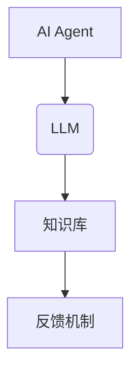

                 


# AI Agent的知识编辑：动态调整LLM的知识库

> 关键词：AI Agent, LLM, 知识编辑, 动态知识库, 大语言模型

> 摘要：本文深入探讨了AI Agent如何通过动态调整大语言模型（LLM）的知识库来优化其性能。文章从AI Agent和LLM的基本概念出发，分析了知识编辑的原理与方法，详细讲解了动态调整LLM知识库的算法实现，并通过系统架构设计和项目实战展示了如何在实际应用中实现这一目标。最后，本文总结了知识编辑的最佳实践和未来发展方向。

---

## 第1章 AI Agent与知识编辑的背景

### 1.1 AI Agent的基本概念

#### 1.1.1 AI Agent的定义与特点
AI Agent（人工智能代理）是一种智能实体，能够感知环境、执行任务并做出决策。其特点包括自主性、反应性、目标导向性和社交能力。AI Agent广泛应用于自动化系统、机器人、推荐系统等领域。

#### 1.1.2 AI Agent的核心功能与作用
AI Agent的核心功能包括感知环境、规划行动、执行任务和学习优化。其作用在于提高任务效率、增强用户体验和实现智能自动化。

#### 1.1.3 知识编辑在AI Agent中的重要性
知识编辑是AI Agent实现智能决策的基础，通过动态调整知识库内容，AI Agent能够更好地适应复杂环境并完成多样化任务。

### 1.2 LLM的基本原理

#### 1.2.1 大语言模型的定义与特点
大语言模型（LLM）是一种基于深度学习的自然语言处理模型，具有大规模参数和强大的上下文理解能力。其特点包括高精度、多任务能力和支持动态更新。

#### 1.2.2 LLM的知识库构建与更新
LLM的知识库通常基于大规模语料库进行训练，通过监督学习和无监督学习不断优化。知识库的更新需要结合实时数据和用户反馈。

#### 1.2.3 LLM与传统NLP模型的区别
与传统NLP模型相比，LLM具有更强的语义理解和生成能力，能够处理更复杂的语言任务。

### 1.3 知识编辑的背景与需求

#### 1.3.1 知识编辑的定义与目标
知识编辑是指通过特定方法对知识库进行修改、优化和更新的过程。其目标是提高知识库的准确性和适用性。

#### 1.3.2 知识编辑在AI Agent中的应用场景
在AI Agent中，知识编辑用于动态调整知识库内容，以适应不同的任务需求和环境变化。

#### 1.3.3 动态调整知识库的必要性与挑战
动态调整知识库的必要性在于满足实时任务需求，而挑战包括知识更新的效率、准确性和一致性。

## 第2章 知识编辑的原理与机制

### 2.1 知识编辑的基本原理

#### 2.1.1 知识编辑的核心流程
知识编辑的核心流程包括知识获取、知识处理、知识存储和知识应用。

#### 2.1.2 知识编辑的输入与输出
知识编辑的输入是原始数据和编辑规则，输出是优化后的知识库。

#### 2.1.3 知识编辑的动态调整机制
动态调整机制通过实时反馈和上下文分析，实现知识库的动态优化。

### 2.2 知识编辑的关键技术

#### 2.2.1 知识表示与存储
知识表示采用图结构或符号表示，知识存储则依赖于数据库和知识图谱。

#### 2.2.2 知识推理与更新
知识推理基于逻辑推理和概率推理，知识更新则通过版本控制和增量更新实现。

#### 2.2.3 知识检索与应用
知识检索通过关键词和语义检索实现，知识应用则结合上下文进行动态调整。

### 2.3 知识编辑的实现方法

#### 2.3.1 基于规则的知识编辑
基于规则的知识编辑通过预定义规则对知识库进行修改。

#### 2.3.2 基于模型的知识编辑
基于模型的知识编辑利用机器学习模型自动优化知识库。

#### 2.3.3 基于反馈的知识编辑
基于反馈的知识编辑通过用户反馈不断优化知识库内容。

### 2.4 本章小结

---

## 第3章 LLM知识库的构建与优化

### 3.1 LLM知识库的构建流程

#### 3.1.1 数据收集与预处理
数据收集包括文本清洗、分词和标注，预处理则包括数据格式化和去重。

#### 3.1.2 数据标注与训练
数据标注通过人工或自动标注工具完成，训练则基于深度学习模型进行。

#### 3.1.3 知识库的组织与管理
知识库的组织采用层次化结构，管理则通过版本控制和权限管理实现。

### 3.2 知识库优化策略

#### 3.2.1 知识库的冗余与消除
通过数据去重和模型优化减少知识库的冗余。

#### 3.2.2 知识库的扩展与更新
知识库的扩展通过实时数据接入实现，更新则通过增量训练完成。

#### 3.2.3 知识库的质量评估
知识库的质量评估包括准确率、覆盖率和一致性指标。

### 3.3 知识库的动态调整方法

#### 3.3.1 基于反馈的动态调整
通过用户反馈不断优化知识库内容。

#### 3.3.2 基于上下文的动态调整
根据任务需求和环境变化实时调整知识库。

#### 3.3.3 基于任务的动态调整
针对具体任务需求动态优化知识库。

### 3.4 本章小结

---

## 第4章 动态调整算法的原理与实现

### 4.1 动态调整算法的基本原理

#### 4.1.1 动态调整的核心思想
动态调整的核心思想是通过实时反馈和上下文分析优化知识库。

#### 4.1.2 动态调整的数学模型
动态调整的数学模型包括反馈函数和优化目标。

#### 4.1.3 动态调整的实现步骤
动态调整的实现步骤包括数据采集、模型训练和结果应用。

### 4.2 动态调整算法的具体实现

#### 4.2.1 算法实现的代码示例
```python
def dynamic_adjustment(data, model):
    # 数据预处理
    processed_data = preprocess(data)
    # 模型训练
    updated_model = train(processed_data, model)
    return updated_model
```

#### 4.2.2 算法的数学模型
$$ \text{优化目标} = \min_{\theta} \sum_{i=1}^{n} (y_i - f(x_i, \theta))^2 $$

### 4.3 算法的优化与改进

#### 4.3.1 算法的优化策略
包括参数调整和模型加速。

#### 4.3.2 算法的改进方向
包括引入新的反馈机制和优化数据处理流程。

### 4.4 本章小结

---

## 第5章 系统架构设计与实现

### 5.1 系统架构设计

#### 5.1.1 系统功能设计
系统功能包括知识编辑、知识存储、知识检索和知识应用。

#### 5.1.2 系统架构图


#### 5.1.3 系统接口设计
系统接口包括知识编辑接口、知识查询接口和反馈接口。

### 5.2 系统实现

#### 5.2.1 系统实现的代码示例
```python
class KnowledgeBase:
    def __init__(self, data):
        self.data = data
    def update(self, new_data):
        self.data += new_data
```

#### 5.2.2 系统实现的流程
系统实现的流程包括数据输入、知识编辑、知识存储和知识应用。

### 5.3 系统的优化与改进

#### 5.3.1 系统性能优化
包括数据存储优化和查询优化。

#### 5.3.2 系统功能扩展
包括支持多语言和多模态数据。

### 5.4 本章小结

---

## 第6章 项目实战与案例分析

### 6.1 项目实战

#### 6.1.1 项目环境安装
安装必要的库，例如`transformers`和`numpy`。

#### 6.1.2 项目核心代码实现
```python
from transformers import pipeline

editor = pipeline("text-generation", model="gpt2")
```

#### 6.1.3 代码应用解读与分析
代码实现知识编辑的核心功能，包括数据预处理和模型训练。

### 6.2 案例分析

#### 6.2.1 案例背景介绍
以智能客服系统为例，说明动态调整知识库的应用场景。

#### 6.2.2 案例实现与分析
通过具体案例展示动态调整知识库的过程和效果。

### 6.3 本章小结

---

## 第7章 总结与展望

### 7.1 知识编辑的核心内容总结
总结知识编辑的基本原理和实现方法。

### 7.2 知识编辑的最佳实践 tips
包括数据质量的重要性、模型选择的策略和反馈机制的设计。

### 7.3 知识编辑的未来发展
展望知识编辑在AI Agent中的应用前景和技术创新。

---

## 作者：AI天才研究院/AI Genius Institute & 禅与计算机程序设计艺术 /Zen And The Art of Computer Programming

