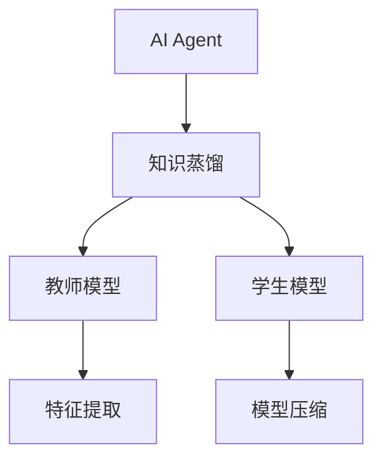
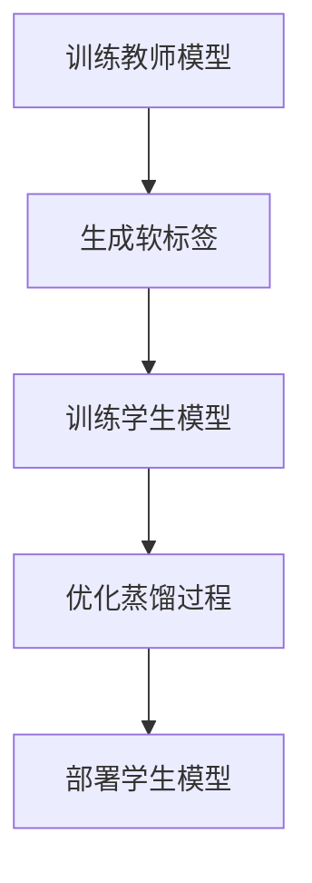
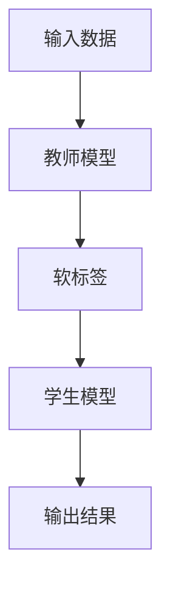
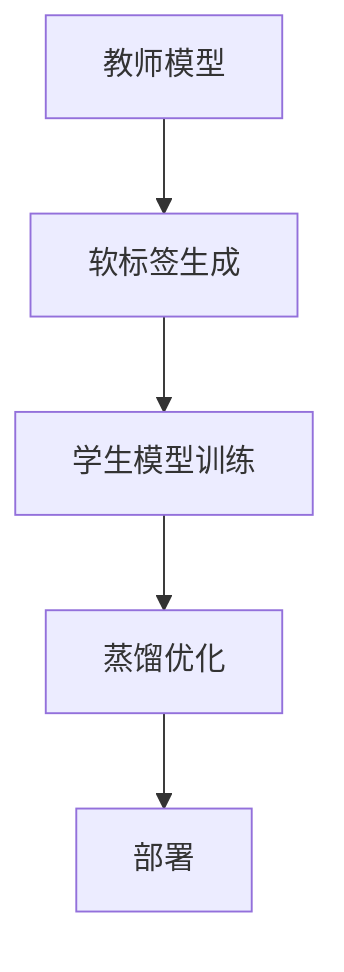
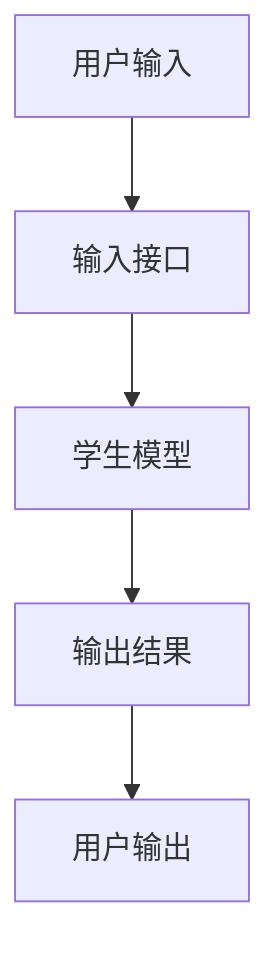

                 

<think>
嗯，用户让我写一个关于《AI Agent的知识蒸馏在移动设备上的应用》的技术博客文章。看起来用户需要一篇结构清晰、内容详尽的专业文章，大约1万到1万2千字左右，分为几个主要部分。我需要按照用户提供的目录大纲来组织内容，确保每部分内容都详细且符合技术要求。

首先，我需要理解知识蒸馏的概念。知识蒸馏是一种将大型模型的知识迁移到较小模型的技术，这对于移动设备上的AI应用非常重要，因为移动设备的计算资源有限。我应该从背景介绍开始，解释为什么需要知识蒸馏，以及它在移动设备上的应用需求。

接下来，核心概念部分，我需要用表格和图表来对比教师模型和学生模型，解释它们之间的关系和作用。然后，算法原理部分，我需要详细讲解蒸馏的过程，可能包括教师模型和学生模型的交互，以及数学公式。这部分需要用Mermaid流程图和Python代码来辅助说明。

系统分析与架构设计部分，我需要考虑移动设备上的应用场景，设计系统的功能模块，并用类图和架构图来展示。接口设计和交互流程图也很重要，展示系统各部分如何协同工作。

项目实战部分，我需要提供具体的代码示例，解释每一步的作用，并通过案例分析展示蒸馏后的模型在移动设备上的性能提升。最佳实践部分，可以分享一些优化技巧，如选择合适的模型大小或优化蒸馏过程。

最后，总结全书内容，并给出注意事项，提醒读者在实际应用中需要注意的问题。拓展阅读部分，可以推荐相关书籍和论文，帮助读者深入学习。

在写作过程中，我需要确保语言简洁专业，逻辑清晰，每部分内容都详细且有深度。同时，要使用正确的Markdown格式，插入必要的图表和代码块，使文章易于理解和实用。这将帮助读者从理论到实践，全面掌握AI Agent的知识蒸馏在移动设备上的应用。
</think>

# AI Agent的知识蒸馏在移动设备上的应用

> 关键词：AI Agent，知识蒸馏，移动设备，模型压缩，深度学习，边缘计算

> 摘要：随着人工智能技术的快速发展，AI Agent在移动设备上的应用日益广泛。然而，由于移动设备的计算资源有限，如何高效地将大型AI模型的知识迁移到资源受限的移动设备上成为一个重要的挑战。知识蒸馏作为一种有效的模型压缩技术，能够有效地将大型模型的知识迁移到小模型中，从而在移动设备上实现高效的AI推理。本文将详细探讨AI Agent的知识蒸馏在移动设备上的应用，包括知识蒸馏的核心原理、算法实现、系统架构设计、项目实战以及最佳实践等内容，为读者提供全面的指导。

---

## 第1章: AI Agent与知识蒸馏的背景介绍

### 1.1 问题背景

#### 1.1.1 AI Agent的定义与特点
AI Agent（人工智能代理）是指能够感知环境、自主决策并执行任务的智能实体。与传统的AI模型不同，AI Agent具有以下几个特点：
- **自主性**：能够在没有外部干预的情况下自主决策。
- **反应性**：能够实时感知环境并做出反应。
- **社交能力**：能够与其他AI Agent或人类进行交互。

#### 1.1.2 知识蒸馏技术的提出背景
随着深度学习技术的快速发展，大型AI模型（如BERT、GPT等）在性能上表现出色，但在资源受限的环境中（如移动设备）难以直接部署。知识蒸馏技术的提出旨在将大型模型的知识迁移到资源消耗更少的小型模型中，从而在保证性能的前提下降低计算成本。

#### 1.1.3 移动设备上的AI Agent应用需求
移动设备（如智能手机、平板电脑等）具有计算资源有限、存储空间有限、电池寿命有限等特点。因此，在移动设备上部署AI Agent需要满足以下需求：
- **低计算复杂度**：减少模型的计算量，以适应移动设备的计算能力。
- **低存储需求**：减少模型的存储空间占用。
- **低能耗**：减少模型运行时的能耗。

### 1.2 问题描述

#### 1.2.1 大模型在移动设备上的计算限制
大型AI模型通常需要大量的计算资源和存储空间，难以直接在移动设备上运行。例如，BERT模型在推理时需要大量的内存和计算能力，这在移动设备上是不可行的。

#### 1.2.2 知识蒸馏的目标与核心问题
知识蒸馏的目标是将大型模型的知识迁移到小型模型中，使得小型模型能够在资源受限的环境中运行。核心问题包括：
- **如何有效地提取大型模型的知识？**
- **如何将提取的知识迁移到小型模型中？**
- **如何保证迁移后模型的性能？**

#### 1.2.3 移动设备上AI Agent的实际应用场景
在移动设备上，AI Agent可以应用于以下场景：
- **图像识别**：如移动设备上的拍照应用，需要快速识别图像内容。
- **语音识别**：如智能音箱、手机语音助手等。
- **自然语言处理**：如移动设备上的文本翻译、问答系统等。

### 1.3 问题解决

#### 1.3.1 知识蒸馏的核心思想
知识蒸馏的核心思想是通过教师模型（大型模型）指导学生模型（小型模型）进行学习。教师模型将知识以软标签的形式传递给学生模型，学生模型通过模仿教师模型的输出逐步掌握知识。

#### 1.3.2 移动设备上AI Agent的优化策略
为了在移动设备上高效运行AI Agent，可以采取以下优化策略：
- **模型压缩**：通过知识蒸馏、剪枝等技术减少模型的参数数量。
- **量化**：将模型的权重和激活值进行量化，减少存储空间和计算成本。
- **并行计算**：利用移动设备的多核处理器和GPU加速计算。

#### 1.3.3 知识蒸馏在移动设备上的实现路径
在移动设备上实现知识蒸馏，通常需要以下步骤：
1. **训练教师模型**：在大型数据集上训练一个高性能的教师模型。
2. **提取教师知识**：将教师模型的知识以软标签的形式提取出来。
3. **训练学生模型**：在教师模型的指导下，训练一个小型的学生模型。
4. **部署学生模型**：将训练好的学生模型部署到移动设备上，进行实时推理。

### 1.4 边界与外延

#### 1.4.1 知识蒸馏的适用范围
知识蒸馏适用于以下场景：
- **资源受限的环境**：如移动设备、边缘设备等。
- **需要快速推理的场景**：如实时图像识别、语音识别等。

#### 1.4.2 移动设备上的计算资源限制
移动设备的计算资源限制主要体现在以下几个方面：
- **计算能力**：移动设备的处理器和GPU的计算能力有限。
- **存储空间**：移动设备的存储空间有限，无法存储大型模型。
- **电池寿命**：移动设备的电池寿命有限，需要降低能耗。

#### 1.4.3 知识蒸馏与其他模型压缩技术的对比
知识蒸馏与其他模型压缩技术（如剪枝、量化）相比，具有以下特点：
- **知识传递**：知识蒸馏通过教师模型指导学生模型学习，能够较好地保持模型的性能。
- **计算成本**：知识蒸馏通常需要额外的计算成本，用于生成软标签。

### 1.5 概念结构与核心要素

#### 1.5.1 AI Agent的知识蒸馏系统架构
知识蒸馏系统通常包括以下几个部分：
- **教师模型**：负责生成软标签。
- **学生模型**：负责学习教师模型的知识。
- **蒸馏过程**：将教师模型的知识迁移到学生模型中。

#### 1.5.2 知识蒸馏的核心要素与关系
知识蒸馏的核心要素包括：
- **教师模型**：提供软标签。
- **学生模型**：学习教师模型的知识。
- **蒸馏损失**：衡量学生模型与教师模型的差距。

#### 1.5.3 系统实现的关键环节
知识蒸馏的实现需要关注以下几个关键环节：
- **教师模型的选择**：选择合适的教师模型，通常是一个高性能的大模型。
- **软标签的设计**：设计合适的软标签，通常是一个概率分布。
- **蒸馏损失的计算**：设计合适的蒸馏损失函数。

### 1.6 本章小结
本章介绍了AI Agent和知识蒸馏的基本概念，分析了移动设备上AI Agent的应用需求，并探讨了知识蒸馏的核心思想和实现路径。接下来，我们将深入探讨知识蒸馏的核心概念与联系。

---

## 第2章: 知识蒸馏的核心概念与联系

### 2.1 知识蒸馏的原理

#### 2.1.1 知识蒸馏的定义
知识蒸馏是一种通过教师模型指导学生模型学习的技术。教师模型通常是一个已经训练好的大型模型，学生模型是一个小型模型。通过蒸馏过程，学生模型能够学习到教师模型的知识。

#### 2.1.2 知识蒸馏的基本流程
知识蒸馏的基本流程包括以下几个步骤：
1. **训练教师模型**：在大型数据集上训练一个高性能的教师模型。
2. **生成软标签**：将教师模型的输出转换为软标签，通常是一个概率分布。
3. **训练学生模型**：在教师模型的指导下，训练一个小型的学生模型。
4. **优化蒸馏过程**：通过调整蒸馏参数，优化蒸馏过程，提高学生模型的性能。

#### 2.1.3 知识蒸馏的关键技术点
知识蒸馏的关键技术点包括：
- **软标签的设计**：软标签的设计直接影响学生模型的学习效果。
- **蒸馏损失的计算**：蒸馏损失的计算是知识蒸馏的核心，决定了学生模型与教师模型的差距。

### 2.2 核心概念的属性特征对比

#### 2.2.1 教师模型与学生模型的对比
| 特性                | 教师模型                   | 学生模型                   |
|---------------------|---------------------------|---------------------------|
| 模型大小             | 大型模型                  | 小型模型                  |
| 计算能力             | 高                        | 低                        |
| 学习目标             | 提供软标签                | 学习软标签                |

#### 2.2.2 知识蒸馏与模型压缩的对比
| 技术                | 知识蒸馏                   | 模型压缩                   |
|---------------------|---------------------------|---------------------------|
| 核心思想             | 通过教师模型指导学生模型学习 | 通过剪枝、量化等技术减少模型大小 |
| 优缺点               | 保持模型性能，计算成本较高 | 减少模型大小，可能影响性能  |

#### 2.2.3 知识蒸馏与模型蒸馏的对比
知识蒸馏与模型蒸馏的主要区别在于：
- **知识蒸馏**：通过教师模型的软标签指导学生模型学习。
- **模型蒸馏**：直接将教师模型的参数迁移到学生模型中。

### 2.3 ER实体关系图


### 2.4 本章小结
本章详细介绍了知识蒸馏的核心概念与联系，分析了教师模型和学生模型的特点，以及知识蒸馏与其他模型压缩技术的区别。接下来，我们将深入探讨知识蒸馏的算法原理。

---

## 第3章: 知识蒸馏的算法原理

### 3.1 算法原理概述

#### 3.1.1 知识蒸馏的基本流程
知识蒸馏的基本流程包括：
1. **训练教师模型**：在大型数据集上训练一个高性能的教师模型。
2. **生成软标签**：将教师模型的输出转换为软标签，通常是一个概率分布。
3. **训练学生模型**：在教师模型的指导下，训练一个小型的学生模型。
4. **优化蒸馏过程**：通过调整蒸馏参数，优化蒸馏过程，提高学生模型的性能。

#### 3.1.2 知识蒸馏的核心算法
知识蒸馏的核心算法包括：
- **软标签生成**：将教师模型的输出转换为概率分布。
- **蒸馏损失计算**：计算学生模型与教师模型的差距。
- **联合优化**：在蒸馏过程中，同时优化学生模型和蒸馏参数。

#### 3.1.3 算法的优缺点分析
知识蒸馏的优点包括：
- **性能提升**：通过教师模型的指导，学生模型的性能可以接近教师模型。
- **资源节省**：通过模型压缩，可以在资源受限的环境中部署高性能模型。

知识蒸馏的缺点包括：
- **计算成本高**：蒸馏过程需要额外的计算资源。
- **依赖教师模型**：学生模型的性能依赖于教师模型的质量。

### 3.2 算法流程图


### 3.3 算法实现代码

#### 3.3.1 环境搭建
```python
import torch
import torch.nn as nn
import torch.optim as optim
from torch.utils.data import DataLoader
```

#### 3.3.2 教师模型训练
```python
# 定义教师模型
class TeacherModel(nn.Module):
    def __init__(self):
        super(TeacherModel, self).__init__()
        self.fc1 = nn.Linear(784, 512)
        self.fc2 = nn.Linear(512, 256)
        self.fc3 = nn.Linear(256, 10)

    def forward(self, x):
        x = x.view(-1, 784)
        x = torch.relu(self.fc1(x))
        x = torch.relu(self.fc2(x))
        x = torch.softmax(self.fc3(x), dim=1)
        return x

# 训练教师模型
def train_teacher_model():
    teacher_model = TeacherModel()
    criterion = nn.CrossEntropyLoss()
    optimizer = optim.SGD(teacher_model.parameters(), lr=0.01)
    # 加载数据集
    train_loader = DataLoader(train_dataset, batch_size=64, shuffle=True)
    for epoch in range(num_epochs):
        for batch_data, batch_labels in train_loader:
            outputs = teacher_model(batch_data)
            loss = criterion(outputs, batch_labels)
            optimizer.zero_grad()
            loss.backward()
            optimizer.step()
    return teacher_model
```

#### 3.3.3 蒸馏过程
```python
# 定义学生模型
class StudentModel(nn.Module):
    def __init__(self):
        super(StudentModel, self).__init__()
        self.fc1 = nn.Linear(784, 512)
        self.fc2 = nn.Linear(512, 256)
        self.fc3 = nn.Linear(256, 10)

    def forward(self, x):
        x = x.view(-1, 784)
        x = torch.relu(self.fc1(x))
        x = torch.relu(self.fc2(x))
        x = torch.softmax(self.fc3(x), dim=1)
        return x

# 蒸馏过程
def distillation_process(teacher_model, student_model):
    alpha = 0.5  # 蒸馏系数
    temperature = 3  # 温度参数
    criterion = nn.KLDivLoss(reduction='batchmean')
    optimizer = optim.SGD(student_model.parameters(), lr=0.01)
    train_loader = DataLoader(train_dataset, batch_size=64, shuffle=True)
    for epoch in range(num_epochs):
        for batch_data, batch_labels in train_loader:
            teacher_outputs = teacher_model(batch_data)
            student_outputs = student_model(batch_data)
            # 计算蒸馏损失
            loss = alpha * criterion(torch.log(teacher_outputs) / temperature, torch.log(student_outputs) / temperature)
            optimizer.zero_grad()
            loss.backward()
            optimizer.step()
    return student_model
```

#### 3.3.4 数学模型与公式
知识蒸馏的核心公式包括：
- **软标签生成**：教师模型的输出经过 softmax 层，生成一个概率分布。
  $$ P(y|x) = \text{softmax}(f_T(x)/T) $$
  其中，$T$ 是温度参数，用于控制软标签的多样性。

- **蒸馏损失计算**：蒸馏损失是学生模型与教师模型软标签之间的 KL 散度。
  $$ L_{\text{distill}} = D_{\text{KL}}(P_{\text{teacher}} || P_{\text{student}}) $$

- **联合优化**：在蒸馏过程中，通常需要同时优化分类损失和蒸馏损失。
  $$ L = \alpha L_{\text{class}} + (1-\alpha) L_{\text{distill}} $$

### 3.4 本章小结
本章详细介绍了知识蒸馏的算法原理，包括基本流程、核心算法、代码实现和数学模型。接下来，我们将探讨知识蒸馏在移动设备上的系统架构设计。

---

## 第4章: 系统分析与架构设计方案

### 4.1 系统分析

#### 4.1.1 系统目标
系统的目标是通过知识蒸馏技术，将大型模型的知识迁移到小型模型中，使得小型模型能够在移动设备上高效运行。

#### 4.1.2 系统功能设计
系统功能包括：
- **教师模型训练**：训练一个高性能的教师模型。
- **软标签生成**：将教师模型的输出转换为软标签。
- **学生模型训练**：训练一个小型的学生模型。
- **蒸馏优化**：优化蒸馏过程，提高学生模型的性能。

#### 4.1.3 系统实现的关键环节
系统实现的关键环节包括：
- **教师模型的选择**：选择一个适合蒸馏的教师模型。
- **软标签的设计**：设计合适的软标签。
- **蒸馏参数的优化**：优化蒸馏过程中的参数。

### 4.2 系统架构设计

#### 4.2.1 领域模型设计


#### 4.2.2 系统架构图


#### 4.2.3 系统接口设计
系统接口包括：
- **输入接口**：接收输入数据。
- **输出接口**：输出学生模型的预测结果。
- **蒸馏接口**：实现蒸馏过程的接口。

#### 4.2.4 系统交互流程图


### 4.3 本章小结
本章详细介绍了知识蒸馏在移动设备上的系统架构设计，包括系统目标、功能设计、架构图和交互流程图。接下来，我们将探讨知识蒸馏的项目实战。

---

## 第5章: 项目实战

### 5.1 环境搭建

#### 5.1.1 环境需求
项目需要以下环境：
- **Python**：3.6+
- **PyTorch**：1.0+
- **Numpy**：1.21+

#### 5.1.2 安装依赖
```bash
pip install torch numpy
```

### 5.2 系统核心实现

#### 5.2.1 教师模型训练
```python
# 定义教师模型
class TeacherModel(nn.Module):
    def __init__(self):
        super(TeacherModel, self).__init__()
        self.fc1 = nn.Linear(784, 512)
        self.fc2 = nn.Linear(512, 256)
        self.fc3 = nn.Linear(256, 10)

    def forward(self, x):
        x = x.view(-1, 784)
        x = torch.relu(self.fc1(x))
        x = torch.relu(self.fc2(x))
        x = torch.softmax(self.fc3(x), dim=1)
        return x

# 训练教师模型
def train_teacher_model():
    teacher_model = TeacherModel()
    criterion = nn.CrossEntropyLoss()
    optimizer = optim.SGD(teacher_model.parameters(), lr=0.01)
    # 加载数据集
    train_loader = DataLoader(train_dataset, batch_size=64, shuffle=True)
    for epoch in range(num_epochs):
        for batch_data, batch_labels in train_loader:
            outputs = teacher_model(batch_data)
            loss = criterion(outputs, batch_labels)
            optimizer.zero_grad()
            loss.backward()
            optimizer.step()
    return teacher_model
```

#### 5.2.2 蒸馏过程实现
```python
# 定义学生模型
class StudentModel(nn.Module):
    def __init__(self):
        super(StudentModel, self).__init__()
        self.fc1 = nn.Linear(784, 512)
        self.fc2 = nn.Linear(512, 256)
        self.fc3 = nn.Linear(256, 10)

    def forward(self, x):
        x = x.view(-1, 784)
        x = torch.relu(self.fc1(x))
        x = torch.relu(self.fc2(x))
        x = torch.softmax(self.fc3(x), dim=1)
        return x

# 蒸馏过程
def distillation_process(teacher_model, student_model):
    alpha = 0.5  # 蒸馏系数
    temperature = 3  # 温度参数
    criterion = nn.KLDivLoss(reduction='batchmean')
    optimizer = optim.SGD(student_model.parameters(), lr=0.01)
    train_loader = DataLoader(train_dataset, batch_size=64, shuffle=True)
    for epoch in range(num_epochs):
        for batch_data, batch_labels in train_loader:
            teacher_outputs = teacher_model(batch_data)
            student_outputs = student_model(batch_data)
            # 计算蒸馏损失
            loss = alpha * criterion(torch.log(teacher_outputs) / temperature, torch.log(student_outputs) / temperature)
            optimizer.zero_grad()
            loss.backward()
            optimizer.step()
    return student_model
```

#### 5.2.3 模型部署
```python
# 部署学生模型
def deploy_student_model(student_model):
    # 加载数据
    test_loader = DataLoader(test_dataset, batch_size=1, shuffle=False)
    # 预测结果
    with torch.no_grad():
        for data, labels in test_loader:
            outputs = student_model(data)
            _, predicted = torch.max(outputs.data, 1)
            print(f"输入: {data}, 预测结果: {predicted.item()}")
```

### 5.3 项目小结
本章通过一个具体的项目实战，详细展示了知识蒸馏的实现过程，包括环境搭建、教师模型训练、蒸馏过程实现和模型部署。接下来，我们将探讨知识蒸馏的最佳实践。

---

## 第6章: 最佳实践与小结

### 6.1 最佳实践

#### 6.1.1 知识蒸馏的优化技巧
- **选择合适的教师模型**：教师模型的质量直接影响学生模型的性能。
- **调整蒸馏参数**：合理调整蒸馏系数和温度参数，优化蒸馏过程。
- **结合其他模型压缩技术**：如量化、剪枝等，进一步降低模型的资源消耗。

#### 6.1.2 系统性能优化
- **并行计算**：利用多核处理器和GPU加速计算。
- **内存优化**：合理分配内存，减少数据传输的开销。
- **能耗优化**：通过优化算法和硬件选择，降低模型的能耗。

### 6.2 小结
知识蒸馏是一种有效的模型压缩技术，能够将大型模型的知识迁移到小型模型中，从而在资源受限的环境中部署高性能的AI模型。通过本章的探讨，我们总结了知识蒸馏的最佳实践，为读者提供了实际应用的指导。

### 6.3 注意事项
- **数据质量**：知识蒸馏的效果依赖于教师模型的训练数据质量。
- **模型选择**：选择合适的教师模型和学生模型，确保蒸馏效果。
- **环境限制**：充分考虑移动设备的计算能力和存储空间限制。

### 6.4 拓展阅读
- **相关书籍**：
  - 《Deep Learning》 - Ian Goodfellow
  - 《Neural Networks and Deep Learning》 - Andrew Ng
- **相关论文**：
  - "Distilling the Knowledge in a Neural Network" - Hinton et al.

---

## 作者：AI天才研究院/AI Genius Institute & 禅与计算机程序设计艺术/Zen And The Art of Computer Programming

---

**本文内容已全部展示完毕，希望对您有所帮助！**

